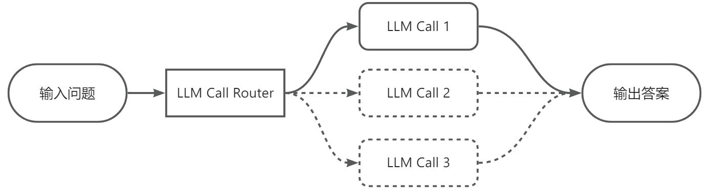

# Agent智能体

> 分类: AIOPS > LangChain
> 更新时间: 2026-01-10T23:34:38.455188+08:00

---

# Agent 介绍
Langchain 中的 Tool 和 Agent 是两个不同层次的概念，各自承担不同的职责

## <font style="color:rgba(0, 0, 0, 0.9);">Tool：工具 = 能力的封装  </font>
Tool 是一个可调用的函数，它封装了一个具体的能力，比如：

+ 调用搜索引擎
+ 查询数据库
+ 运行 Python 代码
+ 调用 API

Tool 本身没有决策能力，它只是被动地等待被调用。

## Agent：决策者 = 如何使用这些能力  
Agent 是一个决策引擎，它的作用是：

+ 决定什么时候调用哪个 Tool
+ 根据上下文决定下一步做什么
+ 处理 Tool 返回的结果并决定是否需要继续调用其他 Tool

Agent 的核心是 推理 + 行动（Reason + Act），也就是 ReAct 模式。

## <font style="color:rgba(0, 0, 0, 0.9);">为什么有了 Tool 还需要 Agent</font>
| 场景 | Tool 能否解决？ | Agent 的作用 |
| --- | --- | --- |
| 用户问：“北京现在的天气怎么样？” | ✅ 直接调用天气 Tool 就行 | ❌ 不需要 Agent |
| 用户问：“帮我订一张明天从北京到上海的机票，并且查一下上海的天气” | ❌ Tool 无法决定先订票还是先查天气 | ✅ Agent 会推理：先订票 → 再查天气 → 组合结果 |
| 用户问：“我有一份 PDF，帮我总结一下，然后把总结发到我的邮箱” | ❌ 需要多个 Tool（PDF读取、总结、发邮件） | ✅ Agent 会按顺序调用多个 Tool |


## Tool 与 Agent 关系
| 对象 | 角色 | 示例 |
| --- | --- | --- |
| Tool | 能力组件 | 数据查询、Python计算、API调用等 |
| Agent | 大脑/决策者 | 判断使用哪个 tool、如何组合使用 |


+ Tool 就像“工具箱里的螺丝刀、锤子”
+ Agent 就像“一个有判断力的工匠”，他知道什么时候用螺丝刀，什么时候用锤子，甚至知道先用螺丝刀再用锤子。

## Agent 工作原理


代理的工作流程可以分为以下步骤：

1. 输入解析：语言模型分析用户输入，理解任务目标。
2. 推理规划：
+ 使用推理框架（如 ReAct）生成操作计划。
+ 决定是否调用工具、调用哪些工具以及调用顺序。
3. 工具调用：
+ 根据推理计划调用工具，传递输入并获取结果。
+ 工具结果反馈给语言模型。
4. 迭代推理：
+ 语言模型根据工具结果更新推理，可能触发更多工具调用。
+ 循环直到任务完成或达到终止条件。
5. 输出生成：
+ 语言模型综合所有信息，生成最终答案。

代理通常基于以下推理框架：

+ ReAct（Reasoning + Acting）：结合推理和行动，模型在每次迭代中思考（生成推理）并执行（调用工具）。
+ OpenAI Functions：利用 OpenAI 的函数调用能力，结构化工具调用。
+ Plan-and-Execute：先规划完整步骤，再逐一执行。

在LangChain的Agents实际架构中，Agent的角色是接收输入并决定采取的操作，但它本身并不直接执行这些操作。这一任务是由AgentExecutor来完成的。将Agent（决策大脑）与AgentExecutor（执行操作的Runtime）结合使用，才构成了完整的Agents（智能体），其中AgentExecutor负责调用代理并执行指定的工具，以此来实现整个智能体的功能。这也就是为什么create_tool_calling_agent需要通过AgentExecutor才能够实际运行的原因。当然，在这种模式下，AgentExecutor的内部已经自动处理好了关于我们工具调用的所有逻辑，其中包含串行和并行工具调用的两种常用模式。


# 实践使用
## 多工具并行调用
在大模型中，并行工具调用指的是在大模型调用外部工具时，可以在单次交互过程中可以同时调用多个工具，并行执行以解决用户的问题。如下图所示：


而在create_tool_calling_agent中，已经自动处理了并行工具调用的处理逻辑，并不需要我们在手动处理，比如接下来测试一些复杂的问题：

```python
import json
import os
import dotenv
import httpx
from langchain.agents import create_tool_calling_agent, AgentExecutor
from langchain_core.prompts import ChatPromptTemplate
from langchain_ollama import ChatOllama
from langchain_core.tools import tool

# 加载环境变量配置
dotenv.load_dotenv()


@tool
def get_weather(loc):
    """
    查询即时天气函数
    :param loc: 必要参数，字符串类型，用于表示查询天气的具体城市名称，\
    注意，中国的城市需要用对应城市的英文名称代替，例如如果需要查询北京市天气，则loc参数需要输入'Beijing'；
    :return：OpenWeather API查询即时天气的结果，具体URL请求地址为：https://api.openweathermap.org/data/2.5/weather\
    返回结果对象类型为解析之后的JSON格式对象，并用字符串形式进行表示，其中包含了全部重要的天气信息
    """
    # Step 1.构建请求
    url = "https://api.openweathermap.org/data/2.5/weather"

    # Step 2.设置查询参数
    params = {
        "q": loc,
        "appid": os.getenv("OPENWEATHER_API_KEY"),  # 输入API key
        "units": "metric",  # 使用摄氏度而不是华氏度
        "lang": "zh_cn"  # 输出语言为简体中文
    }

    # Step 3.发送GET请求
    response = httpx.get(url, params=params)

    # Step 4.解析响应
    data = response.json()
    return json.dumps(data)


# 初始化ChatOllama语言模型实例，用于处理自然语言任务
llm = ChatOllama(model="qwen3:14b", reasoning=False)

# 创建聊天提示模板，定义agent的对话结构和角色
prompt = ChatPromptTemplate.from_messages(
    [
        ("system", "你是天气助手，请根据用户的问题，给出相应的天气信息"),
        ("human", "{input}"),
        ("placeholder", "{agent_scratchpad}"),
    ]
)

# 定义可用工具列表，包含获取天气信息的工具函数
tools = [get_weather]

# 创建工具调用agent，整合语言模型、工具和提示模板。该agent能够根据用户问题调用相应工具获取天气信息
agent = create_tool_calling_agent(llm, tools, prompt)

# 创建agent执行器，负责协调agent和工具的执行流程
# agent参数指定要执行的agent实例
# tools参数提供agent可调用的工具列表
# verbose参数设置为True，启用详细输出模式便于调试
agent_executor = AgentExecutor(agent=agent, tools=tools, verbose=True)

# 执行agent，处理用户关于北京和上海天气的查询请求
result = agent_executor.invoke({"input": "请问今天北京和上海的天气怎么样，哪个城市更热？"})

# 输出执行结果
print(result)
```

执行结果如下：

```python
> Entering new AgentExecutor chain...

Invoking: `get_weather` with `{'loc': 'Beijing'}`


{"coord": {"lon": 116.3972, "lat": 39.9075}, "weather": [{"id": 800, "main": "Clear", "description": "\u6674", "icon": "01d"}], "base": "stations", "main": {"temp": 31.28, "feels_like": 33.3, "temp_min": 31.28, "temp_max": 31.28, "pressure": 998, "humidity": 51, "sea_level": 998, "grnd_level": 993}, "visibility": 10000, "wind": {"speed": 2.76, "deg": 79, "gust": 2.19}, "clouds": {"all": 0}, "dt": 1754213049, "sys": {"country": "CN", "sunrise": 1754169272, "sunset": 1754220397}, "timezone": 28800, "id": 1816670, "name": "Beijing", "cod": 200}
Invoking: `get_weather` with `{'loc': 'Shanghai'}`


{"coord": {"lon": 121.4581, "lat": 31.2222}, "weather": [{"id": 803, "main": "Clouds", "description": "\u591a\u4e91", "icon": "04d"}], "base": "stations", "main": {"temp": 32.51, "feels_like": 39.32, "temp_min": 32.51, "temp_max": 32.51, "pressure": 998, "humidity": 63, "sea_level": 998, "grnd_level": 997}, "visibility": 10000, "wind": {"speed": 3.33, "deg": 236, "gust": 5.18}, "clouds": {"all": 54}, "dt": 1754212987, "sys": {"country": "CN", "sunrise": 1754169119, "sunset": 1754218121}, "timezone": 28800, "id": 1796236, "name": "Shanghai", "cod": 200}根据查询结果：

- 北京的当前温度为31.28°C，天气晴朗。
- 上海的当前温度为32.51°C，天气多云。

因此，上海比北京更热。

> Finished chain.
{'input': '请问今天北京和上海的天气怎么样，哪个城市更热？', 'output': '根据查询结果：\n\n- 北京的当前温度为31.28°C，天气晴朗。\n- 上海的当前温度为32.51°C，天气多云。\n\n因此，上海比北京更热。'}
```

从这个过程中可以明显的看出，一次性发起了同一个外部函数的两次调用请求，并依次获得了北京和杭州两个城市的天气。这就是一次标准的parallel_function_call。

## 多工具串联调用


定义一个write_file函数，用于将文本写入本地，然后在tools列表中直接添加write_file工具，并修改提示模版，添加write_file工具的使用场景。代码如下所示：  

```python
import json
import os
import dotenv
import httpx
from langchain.agents import create_tool_calling_agent, AgentExecutor
from langchain_core.prompts import ChatPromptTemplate
from langchain_ollama import ChatOllama
from langchain_core.tools import tool

# 加载环境变量配置
dotenv.load_dotenv()


@tool
def get_weather(loc):
    """
    查询即时天气函数
    :param loc: 必要参数，字符串类型，用于表示查询天气的具体城市名称，\
    注意，中国的城市需要用对应城市的英文名称代替，例如如果需要查询北京市天气，则loc参数需要输入'Beijing'；
    :return：OpenWeather API查询即时天气的结果，具体URL请求地址为：https://api.openweathermap.org/data/2.5/weather\
    返回结果对象类型为解析之后的JSON格式对象，并用字符串形式进行表示，其中包含了全部重要的天气信息
    """
    # Step 1.构建请求
    url = "https://api.openweathermap.org/data/2.5/weather"

    # Step 2.设置查询参数
    params = {
        "q": loc,
        "appid": os.getenv("OPENWEATHER_API_KEY"),  # 输入API key
        "units": "metric",  # 使用摄氏度而不是华氏度
        "lang": "zh_cn"  # 输出语言为简体中文
    }

    # Step 3.发送GET请求
    response = httpx.get(url, params=params)

    # Step 4.解析响应
    data = response.json()
    return json.dumps(data)


@tool
def write_file(content):
    """
    将指定内容写入本地文件。
    :param content: 必要参数，字符串类型，用于表示需要写入文档的具体内容。
    :return：是否成功写入
    """
    print(f"写入文件内容：{content}")
    return "已成功写入本地文件。"


# 初始化ChatOllama语言模型实例，用于处理自然语言任务
llm = ChatOllama(model="qwen3:14b", reasoning=False)

# 创建聊天提示模板，定义系统角色和用户输入格式
prompt = ChatPromptTemplate.from_messages(
    [
        ("system",
         "你是天气助手，请根据用户的问题，给出相应的天气信息，如果用户需要将查询结果写入文件，请使用write_file工具"),
        ("human", "{input}"),
        ("placeholder", "{agent_scratchpad}"),
    ]
)

# 定义可用工具列表，包括获取天气信息和写入文件功能
tools = [get_weather, write_file]

# 创建工具调用代理，整合语言模型、工具和提示模板
agent = create_tool_calling_agent(llm, tools, prompt)

# 创建代理执行器，用于执行代理任务并管理工具调用过程
agent_executor = AgentExecutor(agent=agent, tools=tools, verbose=True)

# 执行用户查询任务，获取北京和上海的温度信息并写入文件
result = agent_executor.invoke({"input": "查一下北京和上海现在的温度，并将结果写入本地的文件中。"})

print(result)
```

执行结果如下

```python
> Entering new AgentExecutor chain...

Invoking: `get_weather` with `{'loc': 'Beijing'}`


{"coord": {"lon": 116.3972, "lat": 39.9075}, "weather": [{"id": 800, "main": "Clear", "description": "\u6674", "icon": "01d"}], "base": "stations", "main": {"temp": 30.76, "feels_like": 33.01, "temp_min": 30.76, "temp_max": 30.76, "pressure": 998, "humidity": 54, "sea_level": 998, "grnd_level": 993}, "visibility": 10000, "wind": {"speed": 2.5, "deg": 85, "gust": 2.54}, "clouds": {"all": 0}, "dt": 1754213985, "sys": {"country": "CN", "sunrise": 1754169272, "sunset": 1754220397}, "timezone": 28800, "id": 1816670, "name": "Beijing", "cod": 200}
Invoking: `get_weather` with `{'loc': 'Shanghai'}`


{"coord": {"lon": 121.4581, "lat": 31.2222}, "weather": [{"id": 802, "main": "Clouds", "description": "\u591a\u4e91", "icon": "03d"}], "base": "stations", "main": {"temp": 31.14, "feels_like": 36.21, "temp_min": 31.14, "temp_max": 31.14, "pressure": 998, "humidity": 64, "sea_level": 998, "grnd_level": 997}, "visibility": 10000, "wind": {"speed": 2.68, "deg": 226, "gust": 5.47}, "clouds": {"all": 41}, "dt": 1754213907, "sys": {"country": "CN", "sunrise": 1754169119, "sunset": 1754218121}, "timezone": 28800, "id": 1796236, "name": "Shanghai", "cod": 200}
Invoking: `write_file` with `{'content': '北京现在的温度是30.76摄氏度，上海现在的温度是31.14摄氏度。'}`


写入文件内容：北京现在的温度是30.76摄氏度，上海现在的温度是31.14摄氏度。
已成功写入本地文件。北京和上海的当前温度已成功写入本地文件。需要我帮您做其他事情吗？

> Finished chain.
{'input': '查一下北京和上海现在的温度，并将结果写入本地的文件中。', 'output': '北京和上海的当前温度已成功写入本地文件。需要我帮您做其他事情吗？'}
```

通过中间过程信息的打印，我们能够看到在一次交互过程中依次调用的get_weather查询到北京和杭州的天气，然后又将结果写入到本地的文件中。

# 项目实践
## 联网搜索问答
langchain 内置了常用的第三方搜索库，具体可参考文档：[https://python.langchain.com/docs/integrations/tools/#search](https://python.langchain.com/docs/integrations/tools/#search)，以常用免费的 google 搜索为例演示如何实现联网搜索功能。

登录[https://serper.dev/](https://serper.dev/)，注册账号获取 api 密钥，并添加到.env 文件中。代码如下：

```python
import os
import dotenv
from langchain.agents import AgentExecutor, create_tool_calling_agent
from langchain_community.tools import GoogleSerperRun
from langchain_community.utilities import GoogleSerperAPIWrapper
from langchain_core.prompts import ChatPromptTemplate
from langchain_ollama import ChatOllama

# 加载环境变量配置文件
dotenv.load_dotenv()
# 从环境变量中获取Serper API密钥
api_key = os.getenv("SERPER_API_KEY")
# 创建Google Serper API包装器实例
api_wrapper = GoogleSerperAPIWrapper()

# 创建Google搜索工具实例
search_tool = GoogleSerperRun(api_wrapper=api_wrapper)
# 将搜索工具添加到工具列表中
tools = [search_tool]

# 定义聊天提示模板，包含系统角色设定、用户输入和代理执行过程占位符
prompt = ChatPromptTemplate.from_messages([
    ("system", "你是一名助人为乐的助手，并且可以调用工具进行网络搜索，获取实时信息。"),
    ("human", "{input}"),
    ("placeholder", "{agent_scratchpad}"),
])

# 创建Ollama聊天模型实例，使用qwen3:8b模型
llm = ChatOllama(model="qwen3:8b", reasoning=False)

# 创建工具调用代理，整合语言模型、工具和提示模板
agent = create_tool_calling_agent(llm, tools, prompt)

# 创建代理执行器，用于执行代理并管理工具调用过程
agent_executor = AgentExecutor(agent=agent, tools=tools, verbose=True)

# 调用代理执行器，传入用户查询问题
agent_executor.invoke({"input": "小米最近发布的新品是什么？"})
```

执行结果如下

```python
> Entering new AgentExecutor chain...

Invoking: `google_serper` with `{'query': '小米最近发布的新品'}`


九号平衡车1999元: 年轻人的酷玩具，骑行遥控两种玩法. 立即购买 · 米家扫地机器人1699元: 智能路径规划，大风压澎湃吸力，远程控制. 立即购买 · 小米净水器（厨下式） 1999元 ... 米家九号平衡轮 · 照片打印机彩色相纸 · 小米CC9 美图定制版 · 小米CC9e 4GB+128GB · 米兔冰格2个装 · 米家电饭煲4L · 小米旅行箱20英寸 · 小米充电宝BROWN & FRIENDS 限量版. 雷军今日在微博表示，小米YU7将于6月底发布，还有很多重磅新品同场一起发布，比如搭载玄戒O1芯片的第二款平板：小米平板7S Pro。 6月16日，雷军还发文称：小米yu7将2200MPa超强钢 ... 5 月22 日，主题为“新起点”的小米 15 周年战略新品发布会正式举行，全新玄戒O1 3nm 旗舰芯片、全新旗舰小米15S Pro 与小米平板7 Ultra、还有小米首款SUV 全 ... 首先，作为重磅的产品当属小米YU7，这是小米旗下的首款纯电SUV车型。 · 同时，小米将在6月底带来两款手机：小米MIX Flip 2和REDMI K80至尊版。 · 平板方面，小米 ... 自研3nm玄戒O1 芯片，小米芯片要对标苹果 · 小米15SPro5499起，夜景视频效果全面进阶，同时推出CIVi超薄手机 · 小米平板7 Ultra搭14英寸OLED屏，256G版本5699起. 国金证券研报指出，6月26日发布的小米首款AI智能眼镜，将采用双芯架构，定位对标雷朋Meta。其核心功能将集合摄影录像、AI语音交互、音频播放等，通过镜头感知 ... 新华社北京5月22日电（记者郭宇靖、张骁）22日晚，小米自主研发设计的首款3纳米旗舰处理器“玄戒O1”在京发布，并搭载在小米最新发布的旗舰手机和平板产品上。 LIVE：小米15周年战略新品发布会| Xiaomi 15th Anniversary Strategic New Product Launch Event. 7.6K views · Streamed 2 months ago ...more. CN ... 小米将于6 月26 日晚7 点举办新品发布会，众多新品将发布。小米YU7 一共有9 种颜色，有跑车色系、时尚色系、豪华色系和经典色系。根据最新信息，小米最近发布的新品包括：

1. **小米YU7**：这是小米旗下的首款纯电SUV车型，将于6月底发布，搭载了3nm玄戒O1芯片，拥有9种颜色选择。

2. **小米首款AI智能眼镜**：预计在6月26日发布，采用双芯架构，功能包括摄影录像、AI语音交互、音频播放等，定位对标雷朋Meta。

3. **小米15S Pro**：搭载3nm玄戒O1芯片，夜景视频效果全面进阶，起售价5499元。

4. **小米平板7 Ultra**：搭载14英寸OLED屏幕，256GB版本起售价5699元。

5. **小米MIX Flip 2** 和 **REDMI K80至尊版**：两款手机将在6月底一同发布。

6. **小米15周年战略新品发布会**：5月22日发布，展示了玄戒O1芯片、小米15S Pro、小米平板7 Ultra等产品。

这些新品展示了小米在智能硬件、芯片研发和高端市场方面的最新进展。

> Finished chain.
```

## 浏览器自动化
刚刚使用的create_tool_calling_agent方法，它其实在langChain中是一个通用的用来构建工具代理的方法，除此以外，langChain还封装了非常多种不同的Agent实现形式，大家可以在这个链接中查看到所有LangChain中已经集成的Agent实现形式：

| **函数名** | **功能描述** | **适用场景** |
| --- | --- | --- |
| create_tool_calling_agent | 创建使用工具的Agent | 通用工具调用 |
| create_openai_tools_agent | 创建OpenAI工具Agent | OpenAI模型专用 |
| create_openai_functions_agent | 创建OpenAI函数Agent | OpenAI函数调用 |
| create_react_agent | 创建ReAct推理Agent | 推理+行动模式 |
| create_structured_chat_agent | 创建结构化聊天Agent | 多输入工具支持 |
| create_conversational_retrieval_agent | 创建对话检索Agent | 检索增强对话 |
| create_json_chat_agent | 创建JSON聊天Agent | JSON格式交互 |
| create_xml_agent | 创建XML格式Agent | XML逻辑格式 |
| create_self_ask_with_search_agent | 创建自问自答搜索Agent | 自主搜索推理 |


其中比较通用场景的就是我们刚刚使用的create_tool_calling_agent，而对于一些符合OpenAI API RESTFUL API的模型，则同样可以使用create_openai_tools_agent，另外像create_react_agent可以用于一些推理任务，create_conversational_retrieval_agent则可以用于一些对话系统，具体还是需要根据实际需求来选择。

| 对比项 | `create_react_agent` | `create_openai_tools_agent` |
| --- | --- | --- |
| 核心机制 | 基于 **ReAct 推理框架**（思考→行动→观察） | 基于 **OpenAI Tool Calling** 协议 |
| 是否依赖 Function Calling | 否 | 是 |
| 支持模型范围 | 任意聊天模型（包括本地模型，如 Ollama、vLLM） | 仅支持 OpenAI 支持工具调用的模型（如 GPT-4o） |
| 推理方式 | 多轮思维链、可解释 | 单轮结构化调用、高效 |
| 优点 | 逻辑透明、可控性高 | 调用高效、接口原生支持 |
| 适用场景 | 本地/自定义模型、多步复杂推理 | OpenAI 模型、标准工具调用流程、MCP 客户端调用 |


在大模型应用开发领域有非常多的需求场景，其中一个比较热门的就是浏览器自动化，通过自动化提取网页内容，然后进行分析，最后生成报告。这样的流程提升效率和收集信息的有效途径。因此接下来，我们就尝试使用尝试使用create_openai_tools_agent来实际开发一个浏览器自动化代理。代码如下：

```python
import dotenv
from langchain_community.agent_toolkits import PlayWrightBrowserToolkit
from langchain_community.tools.playwright.utils import create_sync_playwright_browser
from langchain import hub
from langchain.agents import AgentExecutor, create_openai_tools_agent
from langchain_ollama import ChatOllama

# 加载环境变量配置文件
dotenv.load_dotenv()

# 创建同步Playwright浏览器实例
sync_browser = create_sync_playwright_browser()

# 从浏览器实例创建PlayWright工具包
toolkit = PlayWrightBrowserToolkit.from_browser(sync_browser=sync_browser)

# 获取工具包中的所有工具
tools = toolkit.get_tools()

# 从Hub拉取OpenAI工具代理的提示模板
prompt = hub.pull("hwchase17/openai-tools-agent")

# 创建ChatOllama语言模型实例，使用qwen3:8b模型
llm = ChatOllama(model="qwen3:8b", reasoning=False)

# 创建OpenAI工具代理，整合语言模型、工具和提示模板
agent = create_openai_tools_agent(llm, tools, prompt)

# 创建代理执行器，用于执行代理任务并管理工具调用
agent_executor = AgentExecutor(agent=agent, tools=tools, verbose=True)


if __name__ == "__main__":
    # 定义任务
    command = {
        "input": "访问这个网站https://www.cuiliangblog.cn/detail/section/227788709 并帮我总结一下这个网站的内容"
    }

    # 执行任务
    response = agent_executor.invoke(command)
    print(response)
```

执行结果如下

```python
> Entering new AgentExecutor chain...

Invoking: `navigate_browser` with `{'url': 'https://www.cuiliangblog.cn/detail/section/227788709'}`


Navigating to https://www.cuiliangblog.cn/detail/section/227788709 returned status code 200
Invoking: `extract_text` with `{}`


学习资料-崔亮的博客 崔亮的博客 首页 文章 笔记 归档 留言板 关于 登录 注册 系统设置 第1章：学习路线与资料 1. 学习路线图 2. 学习资料 第2章：大模型工具 第3章：大模型基础 第4章：Prompt提示工程 第5章：LangChain 您的位置： 首页 > AI > 笔记正文 > 学习资料 AI 2025-07-13 11:52:06 84 0 0 0 基础概念 机器学习基础概念 https://www.runoob.com/ml/ml-tutorial.html AI 应用场景 《AI 未来进行时》李开复著 AI 工具 Ollama https://www.runoob.com/ollama/ollama-tutorial.html 学习路线图 Ollama(文生文) 📝 评论交流 元芳，你怎么看？ 登录 基础概念 机器学习基础概念 AI 应用场景 AI 工具 Ollama Copyright © 2019-2025 崔亮的博客 All Rights Reserved | 陇ICP备19001718号-1 | 京公安备11011202002337号 | 友情链接 | 网站地图 | Powered By Django REST Framework + Vue | 觉得文章还不错？打赏一下 支付宝 微信 Linux MySQL Python Django Docker Kubernetes CI/CD 其他 前端 Prometheus ELK Stack Kubernetes Database Web AI VMware Vsphere Linux Docker Ceph ELK Stack Python Prometheus CI/CD该网站是崔亮的博客，内容主要围绕人工智能（AI）相关主题展开。以下是该网站内容的总结：

1. **学习路线与资料**：
   - 提供了学习AI的路线图，帮助学习者规划学习路径。
   - 包含学习资料，如机器学习基础概念、AI应用场景、学习路线图等。

2. **大模型工具**：
   - 介绍了大模型相关的工具，如Ollama（文生文工具），并提供了相关教程链接。

3. **AI应用场景**：
   - 推荐了《AI 未来进行时》这本书，由李开复所著，帮助读者了解AI在现实生活中的应用。

4. **技术资源与教程**：
   - 提供了多个技术资源链接，如机器学习教程（Runoob）、Ollama教程等，方便学习者进一步深入学习。

5. **博客功能**：
   - 包含文章、笔记、归档、留言板、关于页面等，方便用户互动和获取更多信息。
   - 提供了网站的版权信息、备案信息、友情链接、网站地图等。

6. **其他技术内容**：
   - 提到多种技术领域，如Linux、MySQL、Python、Docker、Kubernetes、CI/CD等，显示了博客内容的广泛覆盖。

总结来说，该网站是一个专注于AI学习和技术分享的博客，适合对AI、机器学习、大模型等技术感兴趣的读者。

> Finished chain.
{'input': '访问这个网站https://www.cuiliangblog.cn/detail/section/227788709 并帮我总结一下这个网站的内容', 'output': '该网站是崔亮的博客，内容主要围绕人工智能（AI）相关主题展开。以下是该网站内容的总结：\n\n1. **学习路线与资料**：\n   - 提供了学习AI的路线图，帮助学习者规划学习路径。\n   - 包含学习资料，如机器学习基础概念、AI应用场景、学习路线图等。\n\n2. **大模型工具**：\n   - 介绍了大模型相关的工具，如Ollama（文生文工具），并提供了相关教程链接。\n\n3. **AI应用场景**：\n   - 推荐了《AI 未来进行时》这本书，由李开复所著，帮助读者了解AI在现实生活中的应用。\n\n4. **技术资源与教程**：\n   - 提供了多个技术资源链接，如机器学习教程（Runoob）、Ollama教程等，方便学习者进一步深入学习。\n\n5. **博客功能**：\n   - 包含文章、笔记、归档、留言板、关于页面等，方便用户互动和获取更多信息。\n   - 提供了网站的版权信息、备案信息、友情链接、网站地图等。\n\n6. **其他技术内容**：\n   - 提到多种技术领域，如Linux、MySQL、Python、Docker、Kubernetes、CI/CD等，显示了博客内容的广泛覆盖。\n\n总结来说，该网站是一个专注于AI学习和技术分享的博客，适合对AI、机器学习、大模型等技术感兴趣的读者。'}
```

如果使用create_react_agent，只需要修改 prompt 和 agent_executor 即可，代码如下

```python
# 从Hub拉取OpenAI工具代理的提示模板
prompt = hub.pull("hwchase17/react")

# 创建ChatOllama语言模型实例，使用qwen3:8b模型
llm = ChatOllama(model="qwen3:8b", reasoning=False)

# 创建OpenAI工具代理，整合语言模型、工具和提示模板
agent = create_react_agent(llm, tools, prompt)

# 创建代理执行器，用于执行代理任务并管理工具调用，handle_parsing_errors: 布尔值，控制是否自动处理解析错误
agent_executor = AgentExecutor(agent=agent, tools=tools, verbose=True, handle_parsing_errors=True)
```

## 组合 LCEL 链实现浏览器自动化
更进一步地，我们还可以将Playwright Agent封装成工具函数，并结合LangChain的LCEL串行链，实现一个更加复杂的浏览器自动化代理。代码如下：

```python
from datetime import datetime
import dotenv
from langchain_community.agent_toolkits import PlayWrightBrowserToolkit
from langchain_community.tools.playwright.utils import create_sync_playwright_browser
from langchain import hub
from langchain.agents import AgentExecutor, create_openai_tools_agent
from langchain_core.output_parsers import StrOutputParser
from langchain_core.prompts import ChatPromptTemplate
from langchain_core.tools import tool
from langchain_ollama import ChatOllama

# 加载环境变量配置文件
dotenv.load_dotenv()


@tool
def summarize_website(url: str) -> str:
    """
    访问指定网站并返回内容总结。

    参数:
        url (str): 要访问和总结的网页URL。

    返回:
        str: 网页正文内容的总结，若失败则返回错误信息。
    """
    try:
        # 创建同步Playwright浏览器实例
        sync_browser = create_sync_playwright_browser()

        # 从浏览器实例创建PlayWright工具包
        toolkit = PlayWrightBrowserToolkit.from_browser(sync_browser=sync_browser)

        # 获取工具包中的所有工具
        tools = toolkit.get_tools()

        # 从Hub拉取OpenAI工具代理的提示模板
        prompt = hub.pull("hwchase17/openai-tools-agent")

        # 创建ChatOllama语言模型实例，使用qwen3:8b模型
        llm = ChatOllama(model="qwen3:8b", reasoning=False)

        # 创建OpenAI工具代理，整合语言模型、工具和提示模板
        agent = create_openai_tools_agent(llm, tools, prompt)

        # 创建代理执行器，用于执行代理任务并管理工具调用
        agent_executor = AgentExecutor(agent=agent, tools=tools, verbose=True)
        command = {
            "input": f"访问这个网站 {url} 并帮我详细总结这个网页的正文内容，评论交流区、版权信息、友情链接等其他内容不要总结。"
        }
        result = agent_executor.invoke(command)
        return result.get("output", "无法获取网站内容总结")

    except Exception as e:
        return f"网站访问失败: {str(e)}"


@tool
def save_file(summary: str) -> str:
    """
    将文本内容生成为md文件。

    参数:
        summary (str): 需要保存为文件的内容。

    返回:
        str: 保存成功的文件名路径信息。
    """
    filename = f"summary_{datetime.now().strftime('%Y%m%d_%H%M%S')}.md"
    with open(filename, "w", encoding="utf-8") as f:
        f.write("# 网页内容总结\n\n")
        f.write(summary)
    return f"已保存至 {filename}"


# 初始化格式化语言模型
format_llm = ChatOllama(model="qwen3:8b", reasoning=False)

# 定义格式化提示模板，用于优化总结内容以适应MD文件格式
format_prompt = ChatPromptTemplate.from_template(
    """请优化以下网站总结内容，使其更适合MD文件格式：
    
    原始总结：
    {summary}
    
    优化后的内容："""
)

# 创建字符串输出解析器
format_parser = StrOutputParser()

# 构建格式化处理链：模板 -> 模型 -> 解析器
format_chain = format_prompt | format_llm | format_parser

# 构建主流程链：网站总结 -> 格式化 -> 保存文件
chain = (
        summarize_website
        | (lambda summary: {"summary": summary})
        | format_chain
        | save_file
)

# 执行整个流程链，传入目标URL进行网站内容总结与保存
chain.invoke({"url": "https://www.cuiliangblog.cn/detail/section/227788709"})

```

执行结果如下

```python
> Entering new AgentExecutor chain...

Invoking: `navigate_browser` with `{'url': 'https://www.cuiliangblog.cn/detail/section/227788709'}`


Navigating to https://www.cuiliangblog.cn/detail/section/227788709 returned status code 200
Invoking: `extract_text` with `{}`


学习资料-崔亮的博客 崔亮的博客 首页 文章 笔记 归档 留言板 关于 登录 注册 系统设置 第1章：学习路线与资料 1. 学习路线图 2. 学习资料 第2章：大模型工具 第3章：大模型基础 第4章：Prompt提示工程 第5章：LangChain 您的位置： 首页 > AI > 笔记正文 > 学习资料 AI 2025-07-13 11:52:06 93 0 0 0 基础概念 机器学习基础概念 https://www.runoob.com/ml/ml-tutorial.html AI 应用场景 《AI 未来进行时》李开复著 AI 工具 Ollama https://www.runoob.com/ollama/ollama-tutorial.html 学习路线图 Ollama(文生文) 📝 评论交流 元芳，你怎么看？ 登录 基础概念 机器学习基础概念 AI 应用场景 AI 工具 Ollama Copyright © 2019-2025 崔亮的博客 All Rights Reserved | 陇ICP备19001718号-1 | 京公安备11011202002337号 | 友情链接 | 网站地图 | Powered By Django REST Framework + Vue | 觉得文章还不错？打赏一下 支付宝 微信 Linux MySQL Python Django Docker Kubernetes CI/CD 其他 前端 Prometheus ELK Stack Kubernetes Database Web AI VMware Vsphere Linux Docker Ceph ELK Stack Python Prometheus CI/CD该网页的正文内容总结如下：

### 学习资料
该网页主要介绍了关于人工智能（AI）的学习资料和相关内容，包括以下几个部分：

1. **基础概念**  
   - 介绍了机器学习的基础概念，可以参考链接：[机器学习基础概念](https://www.runoob.com/ml/ml-tutorial.html)。

2. **AI 应用场景**  
   - 推荐了书籍《AI 未来进行时》（李开复著），介绍了 AI 在实际生活和工作中的应用场景。

3. **AI 工具**  
   - 提到 AI 工具 Ollama，可以参考链接：[Ollama 教程](https://www.runoob.com/ollama/ollama-tutorial.html)。

4. **学习路线图**  
   - 提供了学习 Ollama（文生文）的学习路线图，帮助读者逐步掌握相关知识。

---

### 其他信息
- **评论交流区**：网页上有“评论交流”区域，但未提供具体的评论内容，仅提示“元芳，你怎么看？”。
- **版权信息**：网页底部标注了版权信息，为“崔亮的博客”，并附带了相关的备案号和公安备案号。
- **友情链接**：网页提供了友情链接，但未列出具体链接。
- **网站技术支持**：网站使用了 Django REST Framework + Vue 技术栈来构建。
- **打赏信息**：网页提供了打赏方式，包括支付宝和微信。

---

如果你需要更详细的结构化总结或进一步分析，请告诉我！
> Finished chain.
```

生成的文件如下


