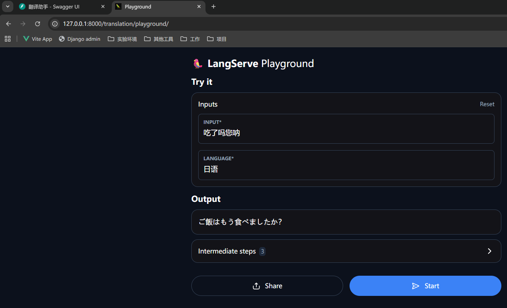

# LangServe网路服务

> 分类: AIOPS > LangChain
> 更新时间: 2026-01-10T23:34:39.148217+08:00

---

# LangServe介绍
**LangServe** 是 LangChain 官方提供的一个工具，用于 **把 LangChain 的 Chain/Agent 包装成 API 服务**，可以直接部署成 HTTP 接口。

## 组件功能
+ 让你在本地调试好一个 Chain/Agent 之后，快速对外提供 API
+ 避免手写 FastAPI/Flask 等接口代码
+ 自动生成 OpenAPI 文档（Swagger UI）和 Playground（交互式测试）

## 核心优势
+ 简单易用：通过少量代码即可完成模型服务的部署；
+ 高性能：支持并发请求和高效推理，满足生产环境需求；
+ 灵活扩展：可与其他工具（如 LangChain）无缝集成，构建复杂 AI 应用。

# 使用实践
## 安装 LangServe
langserve 支撑客户端和服务端分离部署使用，也可以将客户端和服务端放在一个环境运行。

```bash
pip install "langserve[all]"
```

或者使用 pip install "langserve[client]" 安装客户端代码，使用pip install "langserve[server]" 安装服务器端代码。

## 创建 Chain
接下来使用 langchain 框架构建一个比较简单的 chain 用来演示 langserve 的使用方法。在 chain.py 中添加代码如下：

```python
from langchain_core.output_parsers import StrOutputParser
from langchain_core.prompts import ChatPromptTemplate
from langchain_ollama import ChatOllama

# Prompt
prompt = ChatPromptTemplate.from_messages([
    ("system", "你是一个翻译助手。请将输入翻译成{language}。"),
    ("human", "{input}")
])

# LLM
llm = ChatOllama(base_url="http://localhost:11434", model="qwen3:14b", reasoning=False)
parser = StrOutputParser()

# 构建 chain 对象
translation_chain = prompt | llm | parser
```

## 构建 LangServe 服务端
langserve 中整合了一些列的工具和方法，使得将 chain 封装为服务端变得十分简单。main.py 文件内容如下：

```python
from fastapi import FastAPI
from langserve import add_routes
from chain import translation_chain

app = FastAPI(
    title="翻译助手",
    version="v1.0",
    description="基于LangChain框架构建的翻译服务"
)

# 直接传 Chain 对象，不要 invoke
add_routes(app, translation_chain, path="/trans")

if __name__ == "__main__":
    import uvicorn
    uvicorn.run(app, host="0.0.0.0", port=8000)
```

# 访问验证
## 启动服务
执行 main.py 文件即可启动服务，控制台打印如下内容：

```python
INFO:     Started server process [192489]
INFO:     Waiting for application startup.
INFO:     Application startup complete.
INFO:     Uvicorn running on http://0.0.0.0:8000 (Press CTRL+C to quit)

     __          ___      .__   __.   _______      _______. _______ .______     ____    ____  _______
    |  |        /   \     |  \ |  |  /  _____|    /       ||   ____||   _  \    \   \  /   / |   ____|
    |  |       /  ^  \    |   \|  | |  |  __     |   (----`|  |__   |  |_)  |    \   \/   /  |  |__
    |  |      /  /_\  \   |  . `  | |  | |_ |     \   \    |   __|  |      /      \      /   |   __|
    |  `----./  _____  \  |  |\   | |  |__| | .----)   |   |  |____ |  |\  \----.  \    /    |  |____
    |_______/__/     \__\ |__| \__|  \______| |_______/    |_______|| _| `._____|   \__/     |_______|
    
LANGSERVE: Playground for chain "/translation/" is live at:
LANGSERVE:  │
LANGSERVE:  └──> /translation/playground/
LANGSERVE:
LANGSERVE: See all available routes at /docs/
```

## 访问接口文档
访问[http://127.0.0.1:8000/docs](http://127.0.0.1:8000/docs)获取接口文档内容，如果提示pydantic.errors.PydanticUserError，可尝试降低 fastapi 版本。


## 访问程序 web 页面
直接访问[http://127.0.0.1:8000/translation/playground/](http://127.0.0.1:8000/translation/playground/)即可通过浏览器进行交互



## 访问 API 接口
除了支持 web 界面访问外，同样也支持 api 接口调用。

获取请求示例：


访问验证：

```python
curl -X 'POST' \                                                                                                                                 
  'http://127.0.0.1:8000/translation/invoke' \
  -H 'accept: application/json' \
  -H 'Content-Type: application/json' \
  -d '{
  "input": {
    "input": "你好",
    "language": "日语"
  },
  "config": {},
  "kwargs": {
    "additionalProp1": {}
  }
}'
{"output":"こんにちは","metadata":{"run_id":"fb6c033b-e597-4d11-82f8-a1721559cb60","feedback_tokens":[]}}
```

## 客户端访问
除了使用 web、api 工具外，也可以通过 langserve 的 client 端进行调用 client.py 文件内容如下：

```python
from langserve import RemoteRunnable

client = RemoteRunnable("http://127.0.0.1:8000/translation")
print(client.invoke({"input": "你好", "language": "法语"}))

```

执行结果如下：

```python
Bonjour
```

