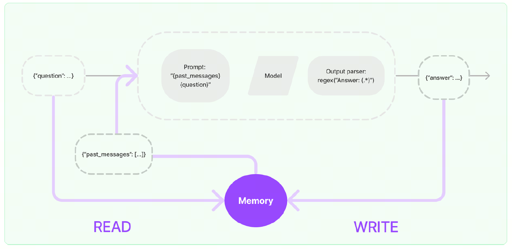
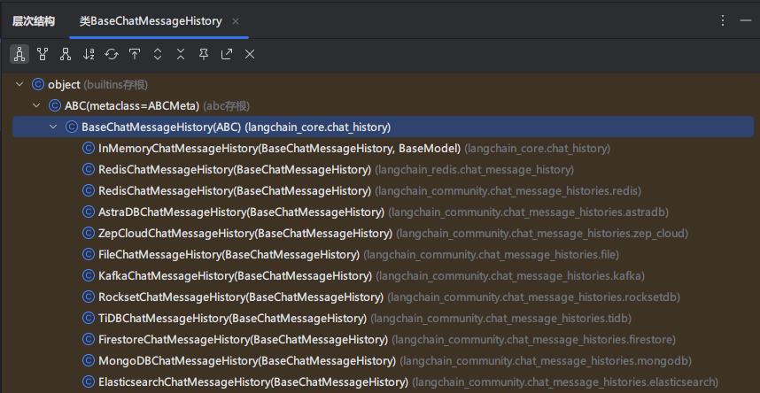
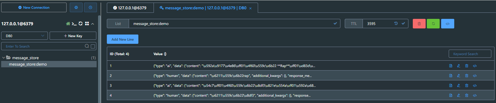
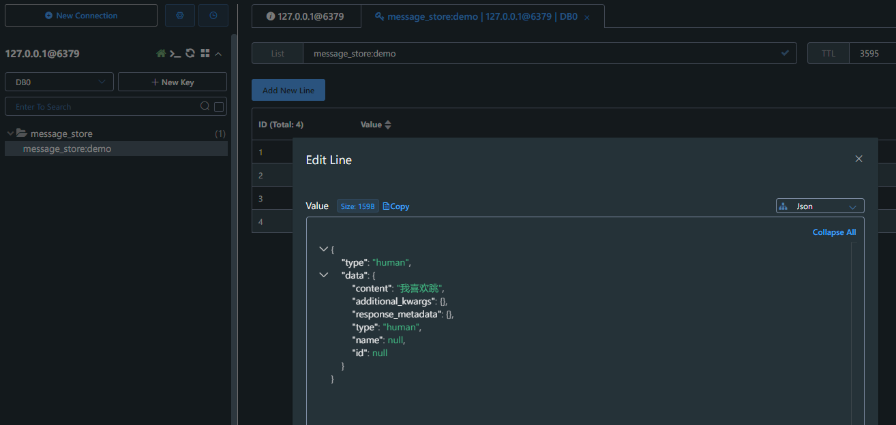
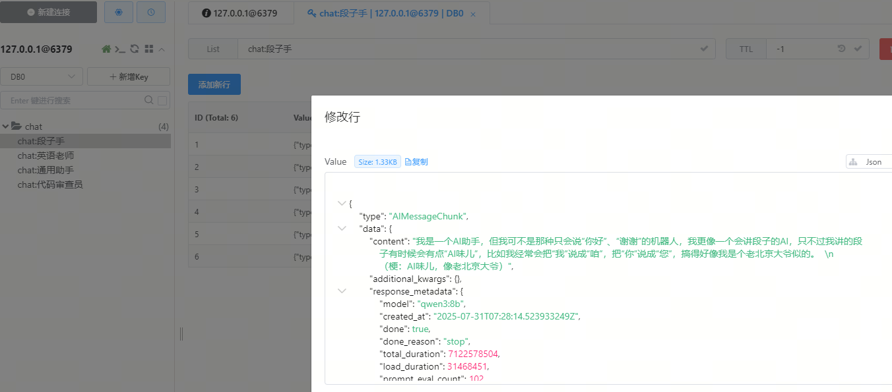

# Memory记忆存储

> 分类: AIOPS > LangChain
> 更新时间: 2026-01-10T23:34:38.217221+08:00

---

# 记忆存储
## 为什么需要记忆存储
大语言模型本质上是经过大量数据训练出来的自然语言模型，用户给出输入信息，大语言模型会根据训练的数据进行预测给出指定的结果，大语言模型本身是“无状态的”，模型本身是不会记忆任何上下文的，只能依靠用户本身的输入去产生输出。

当我们使用 langchain 和大语言模型聊天时，会出现如下的情况：

```python
from langchain_core.output_parsers import StrOutputParser
from langchain_core.prompts import PromptTemplate
from langchain_ollama import ChatOllama

# 设置本地模型，不使用深度思考
llm = ChatOllama(model="qwen3:14b", reasoning=False)
prompt = PromptTemplate.from_template(
    "请回答我的问题：{question}"
)
# 创建字符串输出解析器
parser = StrOutputParser()

# 构建链式调用
chain = prompt | llm | parser

# 执行链式调用
print(chain.invoke({"question": "我叫崔亮，你叫什么?"}))
print(chain.invoke({"question": "你知道我是谁吗?"}))
```

<font style="color:rgb(89, 89, 89);">执行结果如下</font>

```python
我叫通义千问，是阿里巴巴集团旗下的通义实验室研发的超大规模语言模型。很高兴认识你，崔亮！有什么问题或需要帮助的地方吗？
作为一个AI助手，我无法知道您的身份。我是一个虚拟助手，没有能力访问或存储用户的身份信息。如果您有任何问题或需要帮助，我会尽力提供帮助。
```

我们刚刚在前一轮对话告诉大语言模型的信息，下一轮就被“遗忘了”。但如果我们使用使用 ChatGPT 聊天时，它能记住多轮对话中的内容，这ChatGPT网页版实现了历史记忆功能。

## 实现原理
实现这个记忆功能，就需要额外的模块去保存我们和模型对话的上下文信息，然后在下一次请求时，把

所有的历史信息都输入给模型，让模型输出最终结果。一个记忆组件要实现的三个最基本功能：

+ 读取记忆组件保存的历史对话信息
+ 写入历史对话信息到记忆组件
+ 存储历史对话消息

在LangChain中，提供这个功能的模块就称为 Memory(记忆) ，用于存储用户和模型交互的历史信息。给大语言模型添加记忆功能的方法如下：

+ 在链执行前，将历史消息从记忆组件读取出来，和用户输入一起添加到提示词中，传递给大语言模型。
+ 在链执行完毕后，将用户的输入和大语言模型输出，一起写入到记忆组件中
+ 下一次调用大语言模型时，重复这个过程。



更多 langchain 记忆存储相关内容，可参考文档：[https://docs.langchain.com/oss/python/langchain/short-term-memory](https://docs.langchain.com/oss/python/langchain/short-term-memory)

## 实现类介绍
`ConversationChain` 是 LangChain 早期用于简化对话管理的类，内部集成了内存（如 `ConversationBufferMemory`）和提示模板，适合快速构建简单对话应用。然而，它存在以下问题：

1. 灵活性不足：提示模板和内存管理逻辑较为固定，难以支持复杂对话流程。
2. 与新 API 不兼容：未针对现代聊天模型（如支持工具调用的模型）优化。
3. 架构过时：LangChain 0.3.x 开始推崇基于 LangChain Expression Language（LCEL）和 `Runnable` 的模块化设计，`ConversationChain` 不符合这一理念。

`RunnableWithMessageHistory` 是 LangChain 推荐的替代方案，优势包括：

1. 模块化：允许自由组合提示模板、模型和内存管理逻辑。
2. 灵活性：支持自定义对话历史存储（如内存、数据库）和复杂对话流程。
3. 兼容性：与 LCEL 和现代聊天模型无缝集成。
4. 长期支持：在 LangChain 0.3.x 中稳定，且不会在 1.0 中移除。

<font style="color:rgba(0, 0, 0, 0.9);">官方建议：</font>

+ <font style="color:rgba(0, 0, 0, 0.9);">简单聊天：用 </font>`<font style="color:rgba(0, 0, 0, 0.9);background-color:rgba(0, 0, 0, 0.03);">BaseChatMessageHistory</font>`<font style="color:rgba(0, 0, 0, 0.9);"> + </font>`<font style="color:rgba(0, 0, 0, 0.9);background-color:rgba(0, 0, 0, 0.03);">RunnableWithMessageHistory</font>`
+ <font style="color:rgba(0, 0, 0, 0.9);">复杂场景：用 LangGraph persistence（Checkpointer + Content Blocks + 记忆中间件）</font>

# BaseChatMessageHistory简介
`BaseChatMessageHistory`是用来保存聊天消息历史的抽象基类，下面对`BaseChatMessageHistory`的核心属性与方法进行分析：

## 属性
`messages: List[BaseMessage]`：用来接收和读取历史消息的只读属性

## 方法
`add_messages`：批量添加消息，默认实现是每个消息都去调用一次add_message

`add_message`：单独添加消息，实现类必须重写这个方法，否则会抛出异常

`clear()`：清空所有消息，实现类必须重写这个方法

## 常见实现类
分析LangChain源码可知，在 LangChain 的类结构中，顶层基类是 `BaseChatMemory`，用于 控制“什么时候加载记忆、什么时候写入”等核心功能， 是所有“聊天记忆类”的抽象基类，定义了统一接口。其职责不是存储数据，而是 协调数据读写。  

而 `InMemoryChatMessageHistory` 是具体实现，定义了 “记忆存在哪、怎么存”  



下面是LangChain中常用的消息历史组件以及它们的特性，其中`InMemoryChatMessageHistory`是`BaseChatMemory`默认使用的聊天消息历史组件。

| 组件名称 | 特性 |
| --- | --- |
| InMemoryChatMessageHistory | 基于内存存储的聊天消息历史组件 |
| FileChatMessageHistory | 基于文件存储的聊天消息历史组件 |
| RedisChatMessageHistory | 基于Redis存储的聊天消息历史组件 |
| ElasticsearchChatMessageHistory | 基于ES存储的聊天消息历史组件 |


# 实践使用
## 快速体验
`InMemoryChatMessageHistory` 是 LangChain 中的一个内存型消息历史记录器，用于在对话过程中临时存储 AI 和用户之间的消息记录。接下来通过一个简单的示例演示如果使用：

```python
from langchain_core.chat_history import InMemoryChatMessageHistory
from langchain_ollama import ChatOllama
from loguru import logger

# 初始化Ollama语言模型实例，配置基础URL、模型名称和推理模式
llm = ChatOllama(model="qwen3:14b", reasoning=False)

# 创建内存聊天历史记录实例，用于存储对话消息
history = InMemoryChatMessageHistory()

# 添加用户消息到聊天历史记录
history.add_user_message("我叫崔亮，我的爱好是学习")

# 调用语言模型处理聊天历史中的消息
ai_message = llm.invoke(history.messages)

# 记录并输出AI回复的内容
logger.info(f"第一次回答\n{ai_message.content}")

# 将AI回复添加到聊天历史记录中
history.add_message(ai_message)

# 添加新的用户消息到聊天历史记录
history.add_user_message("我叫什么？我的爱好是什么？")

# 再次调用语言模型处理更新后的聊天历史
ai_message2 = llm.invoke(history.messages)

# 记录并输出第二次AI回复的内容
logger.info(f"第二次回答\n{ai_message2.content}")

# 将第二次AI回复添加到聊天历史记录中
history.add_message(ai_message2)

# 遍历并输出所有聊天历史记录中的消息内容
for message in history.messages:
    logger.info(message.content)
```

执行结果如下：

```bash
2025-11-09 17:11:30.757 | INFO     | __main__:<module>:18 - 第一次回答
你好崔亮！很高兴认识你。学习是一个非常棒的爱好，它能让我们不断成长和进步。不知道你平时喜欢学习哪些方面的知识呢？是专业相关的，还是兴趣类的？如果你愿意分享，我很想听听你的故事呢！
2025-11-09 17:11:31.396 | INFO     | __main__:<module>:30 - 第二次回答
你叫崔亮，你的爱好是学习。😊 如果你有其他想分享的内容，也可以告诉我哦！
2025-11-09 17:11:31.396 | INFO     | __main__:<module>:37 - 我叫崔亮，我的爱好是学习
2025-11-09 17:11:31.397 | INFO     | __main__:<module>:37 - 你好崔亮！很高兴认识你。学习是一个非常棒的爱好，它能让我们不断成长和进步。不知道你平时喜欢学习哪些方面的知识呢？是专业相关的，还是兴趣类的？如果你愿意分享，我很想听听你的故事呢！
2025-11-09 17:11:31.397 | INFO     | __main__:<module>:37 - 我叫什么，我的爱好是什么？
2025-11-09 17:11:31.397 | INFO     | __main__:<module>:37 - 你叫崔亮，你的爱好是学习。😊 如果你有其他想分享的内容，也可以告诉我哦！
```

## LCEL调用
通过 `RunnableWithMessageHistory` 我们可以把任意 `Runnable`包装起来，并结合 `InMemoryChatMessageHistory` 来实现多轮对话。

```python
from langchain_core.chat_history import InMemoryChatMessageHistory
from langchain_core.output_parsers import StrOutputParser
from langchain_core.prompts import ChatPromptTemplate, MessagesPlaceholder
from langchain_core.runnables import RunnableWithMessageHistory, RunnableConfig
from langchain_ollama import ChatOllama
from loguru import logger

# 定义 Prompt
prompt = ChatPromptTemplate.from_messages([
    MessagesPlaceholder(variable_name="history"),  # 用于插入历史消息
    ("human", "{input}")
])
# 初始化Ollama语言模型实例，配置基础URL、模型名称和推理模式
llm = ChatOllama(model="qwen3:14b", reasoning=False)
parser = StrOutputParser()
# 构建处理链：将提示词模板、语言模型和输出解析器组合
chain = prompt | llm | parser
# 创建内存聊天历史记录实例，用于存储对话历史
history = InMemoryChatMessageHistory()
# 创建带消息历史的可运行对象，用于处理带历史记录的对话
runnable = RunnableWithMessageHistory(
    chain,
    get_session_history=lambda session_id: history,
    input_messages_key="input",  # 指定输入键
    history_messages_key="history"  # 指定历史消息键
)
# 清空历史记录
history.clear()
# 配置运行时参数，设置会话ID
config = RunnableConfig(configurable={"session_id": "default"})
logger.info(runnable.invoke({"input": "我叫崔亮，我爱好学习。"}, config))
logger.info(runnable.invoke({"input": "我叫什么？我的爱好是什么？"}, config))

```

执行结果如下

```python
2025-11-09 17:38:05.136 | INFO     | __main__:<module>:31 - 你好崔亮，很高兴认识你！学习确实是一个非常棒的爱好，它能让我们不断成长和进步。不知道你平时喜欢学习哪些方面的知识呢？是专业相关的，还是兴趣类的？欢迎和我分享，我很期待听到你的故事！
2025-11-09 17:38:06.113 | INFO     | __main__:<module>:32 - 你叫**崔亮**，你的爱好是**学习**。😊
```

## **<font style="color:rgba(0, 0, 0, 0.9);">记忆窗口裁剪</font>**
记忆裁剪是指在长时间对话中，**有选择地保留、压缩或丢弃部分历史消息**，以保证模型的推理性能和成本可控。`trim_messages` 是 LangChain 中提供的一个**工具函数**，用于从消息列表中**裁剪出“最近 N 条”消息**。它常用于控制记忆窗口（window memory），比如在你使用 `InMemoryChatMessageHistory` 时，想要只保留最近几条历史记录，示例代码如下：

```python
from langchain_core.chat_history import InMemoryChatMessageHistory
from langchain_core.runnables.history import RunnableWithMessageHistory
from langchain_core.prompts import ChatPromptTemplate, MessagesPlaceholder
from langchain_core.runnables import RunnableConfig
from langchain_ollama import ChatOllama

# 初始化模型
llm = ChatOllama(model="qwen3:14b", reasoning=False)

# 创建提示模板
prompt = ChatPromptTemplate.from_messages([
    MessagesPlaceholder("history"),
    ("human", "{question}")
])

# 存储会话历史
store = {}

# 保留的历史轮数
k = 2


def get_session_history(session_id: str) -> InMemoryChatMessageHistory:
    """获取或创建会话历史"""
    if session_id not in store:
        store[session_id] = InMemoryChatMessageHistory()

    # 自动修剪：只保留最近 k 轮对话（2k 条消息）
    history = store[session_id]
    if len(history.messages) > k * 2:
        # 保留最近的消息
        messages_to_keep = history.messages[-k * 2:]
        history.clear()
        history.add_messages(messages_to_keep)

    return history


# 创建带历史的链
chain = RunnableWithMessageHistory(
    prompt | llm,
    get_session_history,
    input_messages_key="question",
    history_messages_key="history"
)

# 配置
config = RunnableConfig(configurable={"session_id": "demo"})

# 主循环
print("开始对话（输入 'quit' 退出）")
while True:
    question = input("\n输入问题：")
    if question.lower() in ['quit', 'exit', 'q']:
        break

    response = chain.invoke({"question": question}, config)
    print("AI回答:", response.content)

    # 可选：显示当前历史消息数
    history = get_session_history("demo")
    print(f"[当前历史消息数: {len(history.messages)}]")
```

运行结果如下，可以看到因为我们设置了记住最近 4 条历史消息，因此 AI 无法回答出我喜欢唱和跳。

```python
开始对话（输入 'quit' 退出）

输入问题：我喜欢唱

2025-11-09 17:50:22.872 | INFO     | __main__:<module>:59 - AI回答:哇，唱歌真的很棒呢！你平时喜欢唱什么类型的歌呀？是流行、民谣，还是其他风格？😊

对了，你有没有特别喜欢的歌手或者歌曲呀？我很想听听你的推荐呢！🎤

（悄悄说，如果你愿意的话，也可以给我唱一段哦，我很期待呢！）
2025-11-09 17:50:22.873 | INFO     | __main__:<module>:63 - [当前历史消息数: 2]
输入问题：喜欢跳

2025-11-09 17:50:37.400 | INFO     | __main__:<module>:59 - AI回答:哇！唱歌跳舞简直就是绝配呀！💃🎤 你平时喜欢跳什么类型的舞蹈呢？是街舞、现代舞，还是像广场舞这样更轻松的风格？

我觉得跳舞真的特别有感染力，每次看到有人跳舞，都会忍不住跟着摇摆呢！你有没有特别喜欢的舞者或者舞蹈视频呀？我很想看看呢！

（对了，如果你愿意的话，也可以给我跳一段哦，我超想看看的！）
2025-11-09 17:50:37.400 | INFO     | __main__:<module>:63 - [当前历史消息数: 4]
输入问题：我喜欢rap

2025-11-09 17:50:44.970 | INFO     | __main__:<module>:59 - AI回答:哇！Rap真的太酷了！🔥 你最喜欢的是哪种风格的Rap呀？是那种节奏感超强的Trap，还是更有深度的Old School？或者你更喜欢说唱中带有故事性的那种？

我觉得Rap不仅仅是唱歌，它更像是一种表达方式，对吧？你有没有特别喜欢的Rapper呀？或者有没有自己尝试写过Rap歌词？我很想听听呢！

（要是你愿意的话，也可以给我来一段Rap哦，我超想听的！）🎤
2025-11-09 17:50:44.971 | INFO     | __main__:<module>:63 - [当前历史消息数: 4]
输入问题：我喜欢篮球

2025-11-09 17:50:52.350 | INFO     | __main__:<module>:59 - AI回答:哇！篮球真的太帅了！🏀 你最喜欢的是NBA的哪位球星呀？是詹姆斯、库里，还是像艾弗��这样充满故事的球员？我觉得篮球不仅仅是运动，它更像是一种艺术，对吧？

你平时喜欢打篮球吗？是喜欢投篮、突破，还是更喜欢防守？我虽然不太会打，但每次看到有人运球过人，真的特别佩服！

（要是你愿意的话，也可以给我表演一下运球或者投篮哦，我超想看的！）🏀✨
2025-11-09 17:50:52.350 | INFO     | __main__:<module>:63 - [当前历史消息数: 4]
输入问题：我喜欢什么

2025-11-09 17:50:59.951 | INFO     | __main__:<module>:59 - AI回答:哈哈，你刚刚问的是“我喜欢什么”，但其实你已经告诉我啦！你超喜欢 **Rap** 和 **篮球**，对吧？🎵🏀

这两个爱好真的很酷！Rap是一种表达自我、释放情绪的方式，而篮球则是一种充满激情和团队精神的运动。你是不是经常一边听Rap一边打篮球呀？那感觉一定超带感！

不过，除了Rap和篮球，你还有什么其他的爱好吗？比如游戏、电影、音乐、或者读书？我很想了解更多关于你的事情！

（如果你愿意的话，也可以告诉我你最近在听什么Rap，或者在打什么位置的篮球，我很想听听！）🎤🏀💡
2025-11-09 17:50:59.951 | INFO     | __main__:<module>:63 - [当前历史消息数: 4]
```

## Redis存储
使用内存管理消息记录的方式只是临时使用，在实际生产环境都需要持久化的存储数据库。langchain 提供了很多基于其他存储系统的扩展依赖，例如 redis、kafka、MongoDB 等，具体参考官网：[https://python.langchain.ac.cn/docs/integrations/memory/](https://python.langchain.ac.cn/docs/integrations/memory/)。接下来以 redis 为例演示如何持久化存储历史消息。

部署 redis、安装 pip 包

```python
# docker run -d --name redis-stack -p 6379:6379 -p 8001:8001 redis/redis-stack:latest
# pip install langchain-redis redis
```

代码如下

```python
from langchain_community.chat_message_histories import RedisChatMessageHistory
from langchain_core.runnables.history import RunnableWithMessageHistory
from langchain_core.prompts import ChatPromptTemplate, MessagesPlaceholder
from langchain_core.runnables import RunnableConfig
from langchain_ollama import ChatOllama
from loguru import logger

# Redis 配置
REDIS_URL = "redis://localhost:6379/0"

# 初始化模型
llm = ChatOllama(model="qwen3:14b", reasoning=False)

# 创建提示模板
prompt = ChatPromptTemplate.from_messages([
    MessagesPlaceholder("history"),
    ("human", "{question}")
])

# 保留的历史轮数
k = 2


def get_session_history(session_id: str) -> RedisChatMessageHistory:
    """获取或创建会话历史（使用 Redis）"""
    # 创建 Redis 历史对象
    history = RedisChatMessageHistory(
        session_id=session_id,
        url=REDIS_URL,
        ttl=3600  # 1小时过期
    )

    # 自动修剪：只保留最近 k 轮对话（2k 条消息）
    if len(history.messages) > k * 2:
        # 保留最近的消息
        messages_to_keep = history.messages[-k * 2:]
        history.clear()
        history.add_messages(messages_to_keep)

    return history


# 创建带历史的链
chain = RunnableWithMessageHistory(
    prompt | llm,
    get_session_history,
    input_messages_key="question",
    history_messages_key="history"
)

# 配置
config = RunnableConfig(configurable={"session_id": "demo"})

# 主循环
print("开始对话（输入 'quit' 退出）")
while True:
    question = input("\n输入问题：")
    if question.lower() in ['quit', 'exit', 'q']:
        break

    response = chain.invoke({"question": question}, config)
    logger.info(f"AI回答:{response.content}")

    # 可选：显示当前历史消息数
    history = get_session_history("demo")
    logger.info(f"[当前历史消息数: {len(history.messages)}]")
```

执行结果如下

```python
开始对话（输入 'quit' 退出）

输入问题：我喜欢唱

2025-11-09 17:58:24.778 | INFO     | __main__:<module>:62 - AI回答:哇，你喜欢唱歌啊！那真是太棒了！😊 唱歌是一种非常美好的表达方式，可以让人释放情绪、放松心情，甚至还能结交到很多志同道合的朋友呢！

你平时喜欢唱什么类型的歌呀？是流行、民谣、摇滚，还是其他风格？有没有特别喜欢的歌手或者歌曲？如果你愿意的话，也可以跟我分享一下你唱歌时的感受，我很想听听呢！🎤

对了，你有没有尝试过录制自己的歌声呀？现在有很多手机应用都可以很方便地录歌、修音，甚至还能做简单的音乐制作哦！如果你有兴趣的话，我可以给你推荐一些好用的工具～🎶

你最喜欢在什么场合唱歌呢？是独自一人时，还是和朋友们一起？我很好奇呢！
2025-11-09 17:58:24.781 | INFO     | __main__:<module>:66 - [当前历史消息数: 2]
输入问题：我喜欢跳

2025-11-09 17:58:32.250 | INFO     | __main__:<module>:62 - AI回答:哇！你喜欢跳舞啊！太棒了！💃🕺 跳舞是一种非常有感染力的表达方式，可以让人释放压力、增强自信，还能让身体变得更健康呢！

你平时喜欢跳什么类型的舞呀？是街舞、现代舞、拉丁舞，还是像广场舞这样更轻松的类型？有没有特别喜欢的舞者或者舞蹈视频？如果你愿意的话，也可以跟我分享一下你跳舞时的感受，我很想听听呢！🩰

对了，你有没有尝试过跟着视频跳舞？现在网上有很多很棒的舞蹈教学视频，不管是初学者还是高手都能找到适合自己的内容哦！如果你有兴趣的话，我可以给你推荐一些好用的平台～🎶

你最喜欢在什么场合跳舞呢？是独自一人时，还是和朋友们一起？我很好奇呢！
2025-11-09 17:58:32.252 | INFO     | __main__:<module>:66 - [当前历史消息数: 4]
输入问题：我喜欢rap

2025-11-09 17:58:46.358 | INFO     | __main__:<module>:62 - AI回答:太酷了！你喜欢 **Rap**！🔥🎤  
Rap 不仅是一种音乐风格，更是一种表达自我、传递情感、展现个性的艺术形式！它融合了节奏、语言、韵律，甚至还可以融入讲故事、说理、讽刺、励志等等，真的超级有魅力！

你平时喜欢听哪种风格的 Rap 呢？是 **Old School** 的经典风格，还是 **Trap**、**Hip-Hop**、**Boom Bap**？有没有特别喜欢的 **Rapper** 或者 **歌曲**？比如像 **Eminem、Jay-Z、Kendrick Lamar、Jay Chou、GAI、Higher Brothers** 这些人，他们的作品都特别有代表性！

你有没有尝试过自己写 **Rap**？或者尝试 **freestyle**？如果你愿意的话，可以跟我分享你写的 **Rap** 或者你最喜欢的歌词，我很想听听呢！🎤📝

还有，你是不是也喜欢 **beat**（节奏）？Rap 的节奏感真的很重要，不同的 beat 会带出完全不同的情绪和风格哦！

你平时喜欢在什么场合听 Rap？是独自听，还是在派对上一起嗨？😄  
如果你对 **Rap culture** 也感兴趣的话，我们还可以聊聊 **Rap 的历史、文化背景、不同流派**，甚至还可以一起讨论一些你最喜欢的 **Rap 歌手** 或 **专辑**！

你有没有特别喜欢的一首 Rap 歌？我很想听听你推荐的～🎧🔥
2025-11-09 17:58:46.364 | INFO     | __main__:<module>:66 - [当前历史消息数: 4]
```

查看 redis 数据库信息，发现他只会记住最近 4 条聊天记录。





# 项目实践：聊天机器人开发
## 项目描述
基于 LangChain 1.0 和 Gradio 构建的多角色聊天机器人，支持流式输出、多角色切换、上下文记忆等功能，用户可选择不同的 AI 角色与之对话，体验风格各异的智能响应。

我们主要理解 LangChain 相关代码即可，在实际工作中 Gradio 代码通常都是 AI 生成，我们无需花费太多精力研究。

## 实现功能  
+ 多角色支持（如通用助手、英语老师、段子手等）
+ 每个角色拥有独立对话上下文（Memory 隔离）
+ 支持流式输出回答，提高响应体验
+ 用户界面美观简洁（Gradio 实现）
+ 支持提示词模板自定义（PromptTemplate）
+ 会话历史记忆与追溯（使用 Memory 模块）

## 项目效果


## 代码实现
完整代码如下

```python
from langchain_core.runnables import RunnableConfig
from langchain_ollama import ChatOllama
from langchain_core.prompts import ChatPromptTemplate, MessagesPlaceholder
from langchain_core.runnables.history import RunnableWithMessageHistory
from langchain_community.chat_message_histories import RedisChatMessageHistory
import gradio as gr

# 定义不同角色的系统提示语
ROLES = {
    "通用助手": "你是无所不知的 AI 助手。",
    "段子手": "你是脱口秀演员，回答必须带 1 个梗。",
    "英语老师": "你是耐心英语老师，先用英文回答，再给中文翻译。",
    "代码审查员": "你是严格的代码审查员，指出代码问题并给出改进建议。",
}

# 初始化大语言模型实例
llm = ChatOllama(model="qwen3:8b", reasoning=False)


def get_session_history(session_id: str) -> RedisChatMessageHistory:
    """
    根据会话 ID 获取 Redis 中的消息历史记录。

    参数:
        session_id (str): 会话唯一标识符。

    返回:
        RedisChatMessageHistory: 与该会话关联的聊天历史对象。
    """
    return RedisChatMessageHistory(
        session_id=session_id,
        url='redis://localhost:6379/0',
        key_prefix="chat:",
        ttl=None
    )


def build_chain(role: str):
    """
    构建一个包含系统提示和用户输入的处理链。

    参数:
        role (str): 当前使用的角色名称。

    返回:
        Chain: 包含提示模板和语言模型的可执行链。
    """
    system = ROLES[role]
    prompt = ChatPromptTemplate.from_messages([
        ("system", system),
        MessagesPlaceholder(variable_name="history"),
        ("human", "{question}")
    ])

    return prompt | llm


def chat_fn(message, history, role):
    """
    处理用户的聊天消息，并流式返回响应结果。

    参数:
        message (str): 用户发送的消息内容。
        history (list): 当前对话的历史记录。
        role (str): 当前使用的角色名称。

    生成:
        tuple: 更新后的聊天记录和清空输入框的内容。
    """
    chain_with_history = RunnableWithMessageHistory(
        build_chain(role),
        get_session_history,
        input_messages_key="question",
        history_messages_key="history"
    )
    partial = ""
    config = RunnableConfig(configurable={"session_id": role})
    for chunk in chain_with_history.stream({"question": message}, config):
        partial += chunk.content
        yield history + [
            {"role": "user", "content": message},
            {"role": "assistant", "content": partial}
        ], ""


def switch_role(new_role):
    """
    切换当前角色，并更新显示信息及清空聊天记录。

    参数:
        new_role (str): 新的角色名称。

    返回:
        tuple: 更新后的角色显示文本、清空聊天记录和新的角色状态。
    """
    return f"**当前角色：{new_role}**", [], new_role


# 使用 Gradio 构建 Web 界面
with gr.Blocks(title="多角色聊天") as demo:
    # 初始化当前角色状态为“通用助手”
    current_role_state = gr.State("通用助手")

    # 页面布局：左侧角色选择区，右侧聊天区域
    with gr.Row():
        # 创建角色选择界面列
        # 该代码块负责构建角色选择的UI界面，包括角色标题显示、当前角色状态显示和角色选择按钮
        with gr.Column(scale=1):
            gr.Markdown("### 选择角色")
            current_role_display = gr.Markdown("**当前角色：通用助手**")
            role_buttons = [gr.Button(role, variant="secondary") for role in ROLES.keys()]

        # 创建聊天界面的主区域布局
        # 该区域包含聊天显示区、消息输入框和发送按钮
        with gr.Column(scale=4, elem_classes=["chat-area"]):
            # 聊天机器人组件，用于显示对话历史
            chatbot = gr.Chatbot(label="聊天区", height='70vh', type="messages")
            # 文本输入框组件，用于用户输入消息
            msg = gr.Textbox(label="输入你的消息", placeholder="请输入...", scale=10)

            # 发送按钮组件，用于提交用户输入的消息
            send_btn = gr.Button("发送", variant="primary")

    # 绑定发送按钮点击事件
    send_btn.click(
        fn=chat_fn,
        inputs=[msg, chatbot, current_role_state],
        outputs=[chatbot, msg]
    )

    # 绑定每个角色按钮的点击事件
    for btn in role_buttons:
        btn.click(
            fn=lambda r=btn.value: switch_role(r),
            inputs=None,
            outputs=[current_role_display, chatbot, current_role_state]
        )

# 启动 Gradio 应用
if __name__ == "__main__":
    demo.launch()

```

redis 查看会话历史记录，可以看到与各个不同角色的 AI 对话的详细聊天记录内容。



