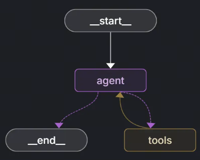
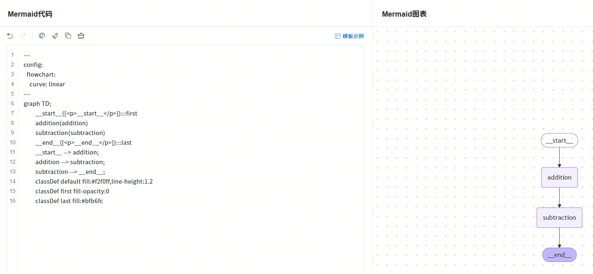
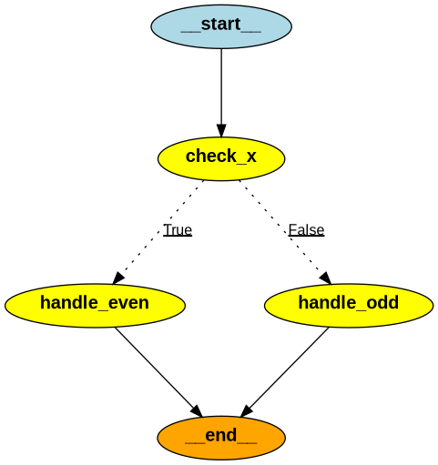
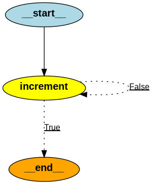

# 使用底层API构建图

> 分类: AIOPS > LangGraph
> 更新时间: 2026-01-10T23:34:39.594922+08:00

---

# 图结构对象创建与使用
## 图结构概念
LangGraph的宗旨是创建一个图结构，该图结构包含大模型、外部工具等，通过点线间的连接构成灵活的处理链路。基于该宗旨，LangGraph定义了一套由点、边、状态组成的有向有环的结构图语法。



### 节点（Nodes)
任何可执行的功能包括大语言模型API，工具，甚至Agent都可以作为LangGraph图的点。

### 边（Edges）
边通常负责传递数据，也有一些边负责进行逻辑控制，例如if-else的判断和选择，从而让整个图状结构更加丰富。

### State（状态）
LangGraph通过组合点和边去创建复杂的循环工作流程，节点产生的消息通过边传递给别的节点从而形成通路。为了维持节点和边之间的消息传递，LangGraph势必要对所有的消息进行统一管理，这就引出了概念“State（状态）”。

在LangGraph构建的流程中，每次执行都会启动一个状态，图中的节点在处理时会传递和修改该状态。这个状态不仅仅是一组静态数据，而是由每个节点的输出动态更新，然后影响循环内的后续操作，确保图通路顺畅。

## 手动创建图流程
我们先在不接入大模型的情况下构建一个加减法图工作流，我们这里自定义两个简单函数：一个是加法函数接收当前State并将其中的x值加1，另一个是减法函数接收当前State并将其中的x值减2，然后添加名为`addition`和`subtraction`的节点，并关联到两个函数上，最后构建出节点之间的边。

```python
from langgraph.constants import START, END
from langgraph.graph import StateGraph
builder = StateGraph(dict)

def addition(state):
    """
    执行加法运算的节点函数

    参数:
        state (dict): 包含输入数据的状态字典，必须包含键"x"

    返回:
        dict: 返回更新后的状态字典，其中"x"的值增加1
    """
    print(f'加法节点收到的初始值:{state}')
    return {"x": state["x"] + 1}

def subtraction(state):
    """
    执行减法运算的节点函数

    参数:
        state (dict): 包含输入数据的状态字典，必须包含键"x"

    返回:
        dict: 返回更新后的状态字典，其中"x"的值减少2
    """
    print(f'减法节点收到的初始值:{state}')
    return {"x": state["x"] - 2}

# 向图构建器中添加节点
# 添加加法运算节点和减法运算节点到构建器中
builder.add_node("addition", addition)
builder.add_node("subtraction", subtraction)

# 定义节点之间的执行顺序 edges
# 设置节点间的依赖关系，形成执行流程图
builder.add_edge(START, "addition")
builder.add_edge("addition", "subtraction")
builder.add_edge("subtraction", END)
# 编译图构建器生成计算图
graph = builder.compile()

# 打印图的边和节点信息
print(builder.edges)
print(builder.nodes)
# 打印图的可视化结构
print(graph.get_graph().print_ascii())
```

执行结果如下

```python
{('subtraction', '__end__'), ('__start__', 'addition'), ('addition', 'subtraction')}
{'addition': StateNodeSpec(runnable=addition(tags=None, recurse=True, explode_args=False, func_accepts={}), metadata=None, input_schema=<class 'dict'>, retry_policy=None, cache_policy=None, ends=(), defer=False), 'subtraction': StateNodeSpec(runnable=subtraction(tags=None, recurse=True, explode_args=False, func_accepts={}), metadata=None, input_schema=<class 'dict'>, retry_policy=None, cache_policy=None, ends=(), defer=False)}
 +-----------+   
 | __start__ |   
 +-----------+   
        *        
        *        
        *        
  +----------+   
  | addition |   
  +----------+   
        *        
        *        
        *        
+-------------+  
| subtraction |  
+-------------+  
        *        
        *        
        *        
  +---------+    
  | __end__ |    
  +---------+    
None
```

除了控制台打印流程图外，也可以生成更加美观的Mermaid 代码，通过processon 编辑器查看

```python
# 打印图的可视化结构
print(graph.get_graph().draw_mermaid())
# 执行结果如下
---
config:
  flowchart:
    curve: linear
---
graph TD;
	__start__([<p>__start__</p>]):::first
	addition(addition)
	subtraction(subtraction)
	__end__([<p>__end__</p>]):::last
	__start__ --> addition;
	addition --> subtraction;
	subtraction --> __end__;
	classDef default fill:#f2f0ff,line-height:1.2
	classDef first fill-opacity:0
	classDef last fill:#bfb6fc
```

使用processon 编辑器查看



## 图对象运行
当我们通过`builder.compile()`方法编译图后，编译后的`graph`对象提供了`invoke`方法，该方法用于启动图的执行。在图执行前我们需要通过`invoke`方法传递一个初始状态，这个状态作为图执行的起始输入：

```python
# 定义一个初始状态字典，包含键值对"x": 5
initial_state={"x": 5}
# 调用graph对象的invoke方法，传入初始状态，执行图计算流程
result= graph.invoke(initial_state)
print(f"最后的结果是:{result}")
```

执行结果如下

```python
加法节点收到的初始值:{'x': 5}
减法节点收到的初始值:{'x': 6}
最后的结果是:{'x': 4}
```

# 借助Pydantic构建稳定的State
以上的写法虽然灵活但有一个致命缺陷，我们的State状态缺乏预定义的模式，节点可以在没有严格类型约束的情况下自由地读取和写入状态，这样的灵活性虽然有利于动态数据处理，但这也要求开发者在整个图的执行过程中保持对键和值的一致性管理（例如我们在加减法函数中返回的都是只包含键值对x的字典对象）。因为在任何节点中尝试访问State中不存在的键，会直接中断整个图的运行状态。

## Pydantic基本使用
通过集成pydantic中的`BaseModel`抽象类来定义状态State, 定义后的状态可以对键值对属性进行自动校验，我们编写如下代码，对 a 和 b 键定义不同的类型，错误的类型会报错。

```python
from pydantic import BaseModel
class MyState(BaseModel):
    a: int
    b: str="default"
# 自动校验
state = MyState(a=1)
print(state.a)
print(state.b)
# 类型错误会报错
state = MyState(a="aaa")
print(state.a)
```

执行结果如下

```python
1
default
……
pydantic_core._pydantic_core.ValidationError: 1 validation error for MyState
a
  Input should be a valid integer, unable to parse string as an integer [type=int_parsing, input_value='aaa', input_type=str]
    For further information visit https://errors.pydantic.dev/2.11/v/int_parsing
```

## Pydantic应用于StateGraph
使用`Pydantic`对代码进行修改,采用如下方法编写的代码可以对状态键内容和属性进行约束，代码健壮性更强。

```python
from langgraph.constants import START, END
from langgraph.graph import StateGraph
from pydantic import BaseModel

class CalcState(BaseModel):
    """
    定义计算过程中使用的状态模型

    属性:
        x (int): 用于传递和更新的整型数值
    """
    x: int
    
builder = StateGraph(CalcState)

def addition(state):
    """
    执行加法运算的节点函数

    参数:
        state (CalcState): 包含输入数据的状态对象，必须包含属性"x"

    返回:
        CalcState: 返回更新后的状态对象，其中"x"的值增加1
    """
    print(f'加法节点收到的初始值:{state}')
    return CalcState(x=state.x + 1)


def subtraction(state):
    """
    执行减法运算的节点函数

    参数:
        state (CalcState): 包含输入数据的状态对象，必须包含属性"x"

    返回:
        CalcState: 返回更新后的状态对象，其中"x"的值减少2
    """
    print(f'减法节点收到的初始值:{state}')
    return CalcState(x=state.x - 2)


# 向图构建器中添加节点
# 添加加法运算节点和减法运算节点到构建器中
builder.add_node("addition", addition)
builder.add_node("subtraction", subtraction)

# 定义节点之间的执行顺序 edges
# 设置节点间的依赖关系，形成执行流程图
builder.add_edge(START, "addition")
builder.add_edge("addition", "subtraction")
builder.add_edge("subtraction", END)

# 编译图构建器生成计算图
graph = builder.compile()

# 打印图的边和节点信息
print(builder.edges)
print(builder.nodes)

# 打印图的可视化结构
print(graph.get_graph().print_ascii())

# 定义一个初始状态对象，包含属性"x"为5
initial_state = CalcState(x=5)

# 调用graph对象的invoke方法，传入初始状态，执行图计算流程
result = graph.invoke(initial_state)

print(f"最后的结果是:{result}")

```

执行结果如下

```python
{('subtraction', '__end__'), ('addition', 'subtraction'), ('__start__', 'addition')}
{'addition': StateNodeSpec(runnable=addition(tags=None, recurse=True, explode_args=False, func_accepts={}), metadata=None, input_schema=<class 'dict'>, retry_policy=None, cache_policy=None, ends=(), defer=False), 'subtraction': StateNodeSpec(runnable=subtraction(tags=None, recurse=True, explode_args=False, func_accepts={}), metadata=None, input_schema=<class 'dict'>, retry_policy=None, cache_policy=None, ends=(), defer=False)}
 +-----------+   
 | __start__ |   
 +-----------+   
        *        
        *        
        *        
  +----------+   
  | addition |   
  +----------+   
        *        
        *        
        *        
+-------------+  
| subtraction |  
+-------------+  
        *        
        *        
        *        
  +---------+    
  | __end__ |    
  +---------+    
None
加法节点收到的初始值:x=5
减法节点收到的初始值:x=6
最后的结果是:x=4
```

需要注意的是在调用大模型过程中， LangGraph 的内部机制是直接操作字典，不调用模型的构造函数。  如果继续用 `BaseModel`，LangGraph 不会知道如何合并、序列化这些字段，因此在调用大模型过程中，要设置为 TypedDict  

| 对比项 | `TypedDict` | `BaseModel`(Pydantic) |
| --- | --- | --- |
| 来源 | Python 标准库 (`typing`) | Pydantic 库 |
| 定位 | 类型提示（轻量字典类型） | 强类型数据模型（含验证逻辑） |
| 运行时检查 | ❌ 无运行时校验 | ✅ 自动校验字段类型、默认值等 |
| 继承自 | `dict` | `BaseModel` |
| 性能 | ✅ 快（仅静态类型提示） | ⚠️ 稍慢（需要解析和验证） |
| 序列化 / 反序列化 | ❌ 手动处理 | ✅ 自动 `.dict()`, `.json()` |
| 用途场景 | 简单数据结构定义 | 需要验证、解析、约束的模型 |
| LangGraph 支持 | ✅ 官方推荐（State 类型） | ⚠️ 不推荐（除非你自己控制模型转换） |


# 流程控制语句
## 条件判断
使用langgraph构建了一个状态图，根据输入数值的奇偶性执行不同节点。check_x接收并传递状态，is_even判断奇偶，handle_even和handle_odd分别处理偶数和奇数情况，最终输出结果。



代码如下：

```python
from typing import Optional
from langgraph.constants import START, END
from langgraph.graph import StateGraph
from loguru import logger
from pydantic import BaseModel


class MyState(BaseModel):
    """
    定义状态模型，用于在图节点之间传递数据
    
    Attributes:
        x (int): 输入的整数
        result (Optional[str]): 处理结果，可为"even"或"odd"
    """
    x: int
    result: Optional[str] = None


builder = StateGraph(MyState)


def check_x(state: MyState) -> MyState:
    """
    检查输入状态的节点函数
    
    Args:
        state (MyState): 包含输入数据的状态对象
        
    Returns:
        MyState: 返回原始状态对象，未做修改
    """
    logger.info(f"[check_x] Received state: {state}")
    return state


def is_even(state: MyState) -> bool:
    """
    判断状态中x值是否为偶数的条件函数
    
    Args:
        state (MyState): 包含待判断数值的状态对象
        
    Returns:
        bool: 如果x是偶数返回True，否则返回False
    """
    return state.x % 2 == 0


def handle_even(state: MyState) -> MyState:
    """
    处理偶数情况的节点函数
    
    Args:
        state (MyState): 包含偶数输入的状态对象
        
    Returns:
        MyState: 返回更新后的状态对象，result设置为"even"
    """
    logger.info("[handle_even] x 是偶数")
    return MyState(x=state.x, result="even")


def handle_odd(state: MyState) -> MyState:
    """
    处理奇数情况的节点函数
    
    Args:
        state (MyState): 包含奇数输入的状态对象
        
    Returns:
        MyState: 返回更新后的状态对象，result设置为"odd"
    """
    logger.info("[handle_odd] x 是奇数")
    return MyState(x=state.x, result="odd")


builder.add_node("check_x", check_x)
builder.add_node("handle_even", handle_even)
builder.add_node("handle_odd", handle_odd)


def is_even(state: MyState) -> bool:
    """
    判断状态中x值是否为偶数的条件函数
    
    Args:
        state (MyState): 包含待判断数值的状态对象
        
    Returns:
        bool: 如果x是偶数返回True，否则返回False
    """
    return state.x % 2 == 0


# 添加条件边，根据is_even函数的返回值决定流向哪个节点
builder.add_conditional_edges("check_x", is_even, {
    True: "handle_even",
    False: "handle_odd"
})

# 添加起始边，从START节点流向check_x节点
builder.add_edge(START, "check_x")

# 添加结束边，从处理节点流向END节点
builder.add_edge("handle_even", END)
builder.add_edge("handle_odd", END)

# 编译图结构
graph = builder.compile()

# 打印图结构
graph.get_graph().draw_png('./graph.png')

# 测试用例：输入偶数4
logger.info("输入 x=4（偶数）")
graph.invoke(MyState(x=4))

# 测试用例：输入奇数3
logger.info("输入 x=3（奇数）")
graph.invoke(MyState(x=3))
```

执行结果如下

```python
2025-09-23 09:39:35.510 | INFO     | __main__:<module>:57 - 输入 x=4（偶数）
2025-09-23 09:39:35.515 | INFO     | __main__:check_x:18 - [check_x] Received state: x=4 result=None
2025-09-23 09:39:35.515 | INFO     | __main__:handle_even:27 - [handle_even] x 是偶数
2025-09-23 09:39:35.516 | INFO     | __main__:<module>:59 - 输入 x=3（奇数）
2025-09-23 09:39:35.516 | INFO     | __main__:check_x:18 - [check_x] Received state: x=3 result=None
2025-09-23 09:39:35.517 | INFO     | __main__:handle_odd:32 - [handle_odd] x 是奇数
```

## 循环语句
定义了一个基于循环流程，通过increment节点不断将状态中的x值加1，直到is_done条件判断x > 10成立时停止。初始x=6，每次执行increment节点更新状态，最终输出x=11。



代码如下

```python
from langgraph.constants import START, END
from langgraph.graph import StateGraph
from loguru import logger
from pydantic import BaseModel


class LoopState(BaseModel):
    """
    循环状态模型类
    
    Attributes:
        x (int): 状态变量，用于循环计数
    """
    x: int


builder = StateGraph(LoopState)


def increment(state: LoopState) -> LoopState:
    """
    增量函数，将状态中的x值加1
    
    Args:
        state (LoopState): 包含当前x值的循环状态对象
        
    Returns:
        LoopState: 返回更新后的循环状态对象，其中x值增加1
    """
    logger.info(f"[increment] 当前 x = {state.x}")
    return LoopState(x=state.x + 1)


builder.add_node("increment", increment)


def is_done(state: LoopState) -> bool:
    """
    判断循环是否结束的条件函数
    
    Args:
        state (LoopState): 包含当前x值的循环状态对象
        
    Returns:
        bool: 当x值大于10时返回True，否则返回False
    """
    return state.x > 10


builder.add_conditional_edges("increment", is_done, {
    True: END,
    False: "increment"
})

builder.add_edge(START, "increment")


# 编译图结构
graph = builder.compile()

# 打印图结构
graph.get_graph().draw_png('./graph.png')

# 初始化循环并执行，直到满足结束条件
logger.info("执行循环直到 x > 10，初始x = 6")
final_state = graph.invoke(LoopState(x=6))
logger.info(f"[最终结果] -> x = {final_state['x']}")

```

执行结果如下

```python
2025-09-23 11:00:43.423 | INFO     | __main__:<module>:65 - 执行循环直到 x > 10，初始x = 6
2025-09-23 11:00:43.427 | INFO     | __main__:increment:30 - [increment] 当前 x = 6
2025-09-23 11:00:43.427 | INFO     | __main__:increment:30 - [increment] 当前 x = 7
2025-09-23 11:00:43.428 | INFO     | __main__:increment:30 - [increment] 当前 x = 8
2025-09-23 11:00:43.428 | INFO     | __main__:increment:30 - [increment] 当前 x = 9
2025-09-23 11:00:43.428 | INFO     | __main__:increment:30 - [increment] 当前 x = 10
2025-09-23 11:00:43.429 | INFO     | __main__:<module>:67 - [最终结果] -> x = 11
```

## 判断循环复合图
定义了一个基于状态图的流程控制系统。通过判断数值 x 的奇偶性，决定执行递增或结束流程。使用 langgraph 构建状态机，check_x 节点检查 x 值，is_even 判断分支，偶数时递增后循环回检查节点，奇数时结束流程。


代码如下

```python
from loguru import logger
from pydantic import BaseModel
from typing import Optional
from langgraph.graph import StateGraph, START, END


class BranchLoopState(BaseModel):
    """
    状态模型，用于保存当前流程中的变量状态。

    属性:
        x (int): 当前数值。
        done (Optional[bool]): 标记流程是否已完成，默认为 False。
    """
    x: int
    done: Optional[bool] = False


def check_x(state: BranchLoopState) -> BranchLoopState:
    """
    打印当前状态中 x 的值，用于调试和跟踪流程执行。

    参数:
        state (BranchLoopState): 包含当前 x 值的状态对象。

    返回:
        BranchLoopState: 返回未修改的原始状态对象。
    """
    logger.info(f"[check_x] 当前 x = {state.x}")
    return state


def is_even(state: BranchLoopState) -> bool:
    """
    判断当前状态中的 x 是否为偶数。

    参数:
        state (BranchLoopState): 包含当前 x 值的状态对象。

    返回:
        bool: 如果 x 是偶数则返回 True，否则返回 False。
    """
    return state.x % 2 == 0


def increment(state: BranchLoopState) -> BranchLoopState:
    """
    将当前状态中的 x 加一，并记录日志。

    参数:
        state (BranchLoopState): 包含当前 x 值的状态对象。

    返回:
        BranchLoopState: 返回更新后的状态对象（x+1）。
    """
    logger.info(f"[increment] x 是偶数，执行 +1 → {state.x + 1}")
    return BranchLoopState(x=state.x + 1)


def done(state: BranchLoopState) -> BranchLoopState:
    """
    标记流程完成，并记录日志。

    参数:
        state (BranchLoopState): 包含当前 x 值的状态对象。

    返回:
        BranchLoopState: 返回标记为完成的状态对象。
    """
    logger.info(f"[done] x 是奇数，流程结束")
    return BranchLoopState(x=state.x, done=True)


# 创建状态图并定义节点与边的关系
builder = StateGraph(BranchLoopState)
builder.add_node("check_x", check_x)
builder.add_node("increment", increment)
builder.add_node("done_node", done)

# 添加条件边：根据 is_even 函数的结果决定走向 increment 或 done_node
builder.add_conditional_edges("check_x", is_even, {
    True: "increment", False: "done_node"
})

# 定义流程路径：increment 节点之后回到 check_x 形成循环
builder.add_edge("increment", "check_x")

# 设置起始和结束节点连接
builder.add_edge(START, "check_x")
builder.add_edge("done_node", END)

# 编译状态图
graph = builder.compile()

# 绘制流程图为 PNG 图片
graph.get_graph().draw_png('./graph.png')

# 测试用例1：从偶数开始，进入循环直到变为奇数
logger.info("初始 x=6（偶数，进入循环）")
final_state1 = graph.invoke(BranchLoopState(x=6))
logger.info("[最终结果1] ->", final_state1)

# 测试用例2：从奇数开始，直接结束流程
logger.info("初始 x=3（奇数，直接 done）")
final_state2 = graph.invoke(BranchLoopState(x=3))
logger.info("[最终结果2] ->", final_state2)

```

执行结果如下

```python
2025-09-23 11:09:11.364 | INFO     | __main__:<module>:38 - 初始 x=6（偶数，进入循环）
2025-09-23 11:09:11.369 | INFO     | __main__:check_x:11 - [check_x] 当前 x = 6
2025-09-23 11:09:11.369 | INFO     | __main__:increment:16 - [increment] x 是偶数，执行 +1 → 7
2025-09-23 11:09:11.370 | INFO     | __main__:check_x:11 - [check_x] 当前 x = 7
2025-09-23 11:09:11.370 | INFO     | __main__:done:19 - [done] x 是奇数，流程结束
2025-09-23 11:09:11.370 | INFO     | __main__:<module>:40 - [最终结果1] ->
2025-09-23 11:09:11.370 | INFO     | __main__:<module>:41 - 初始 x=3（奇数，直接 done）
2025-09-23 11:09:11.371 | INFO     | __main__:check_x:11 - [check_x] 当前 x = 3
2025-09-23 11:09:11.371 | INFO     | __main__:done:19 - [done] x 是奇数，流程结束
2025-09-23 11:09:11.371 | INFO     | __main__:<module>:43 - [最终结果2] ->
```

LangGraph 会把所有节点名、状态字段、通道名放在一个命名空间中处理，为了避免歧义，它会严格检查有没有冲突，最保险的做法是:节点名不要与字段名重复，既如果使用 state.result ="done"，也不要有“result”这个节点。

# 子图
在LangGraph中，一个Graph除了可以单独使用，还可以作为一个Node，嵌入到一个Graph中。这种用法就称为子图。通过子图，我们可以更好的重用Graph，构建更复杂的工作流。尤其在构建多Agent系统时非常有用。在大型项目中，通常都是由一个团队专门开发Agent，再通过其他团队来完成Agent整合。

使用子图时，基本和使用Node没有太多的区别。唯一需要注意的是，当触发了SubGraph代表的Node后，实际上是相当于重新调用了一次subgraph.invoke(state)方法。

接下来我们定义一个子图节点处理函数 sub_node，它接收一个状态对象并返回包含子图响应消息的新状态。该函数被集成到一个使用 langgraph 构建的图结构中，最终执行图并输出结果。

代码如下：

```python
from operator import add
from typing import TypedDict, Annotated
from langgraph.constants import END
from langgraph.graph import StateGraph, MessagesState, START

class State(TypedDict):
    """
    定义状态类，用于存储图节点间传递的消息状态
    messages: 使用add函数合并的字符串列表消息
    """
    messages: Annotated[list[str], add]

def sub_node(state:State) -> MessagesState:
    # 子图节点处理函数，接收当前状态并返回响应消息
    # @param state 当前状态对象，包含消息列表
    # @return 包含子图响应消息的新状态
    return {"messages": ["response from subgraph"]}

# 创建子图构建器并配置节点和边
subgraph_builder = StateGraph(State)
subgraph_builder.add_node("sub_node", sub_node)
subgraph_builder.add_edge(START, "sub_node")
subgraph_builder.add_edge("sub_node", END)
subgraph = subgraph_builder.compile()

# 绘制子图结构图
subgraph.get_graph().draw_png('./subgraph.png')

# 创建主图构建器并添加子图节点
builder = StateGraph(State)
builder.add_node("subgraph_node", subgraph)
builder.add_edge(START, "subgraph_node")
builder.add_edge("subgraph_node", END)

# 编译主图并绘制结构图
graph = builder.compile()
graph.get_graph().draw_png('./graph.png')

# 执行图并打印结果
print(graph.invoke({"messages": ["hello subgraph"]}))

```

执行结果如下

```python
{'messages': ['hello subgraph', 'hello subgraph', 'response from subgraph']}
```

