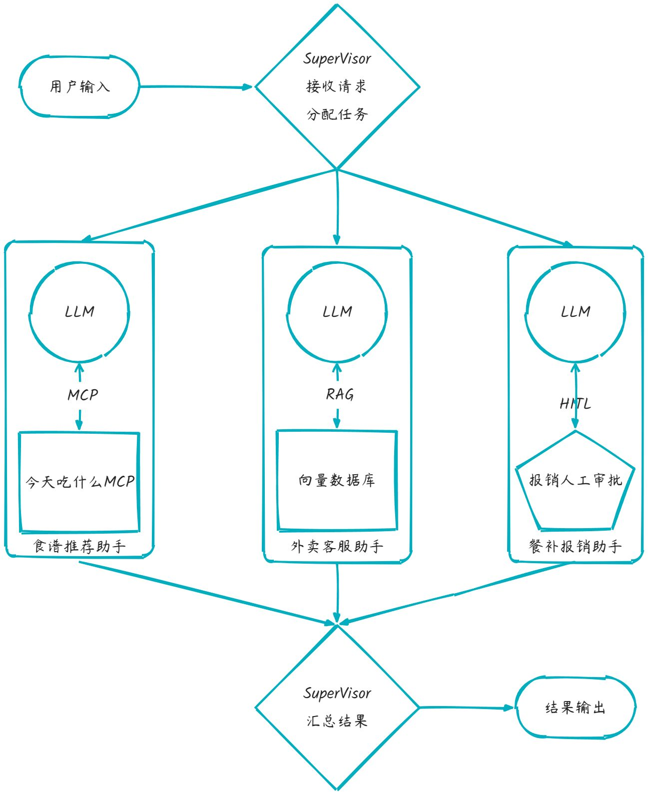

# 多智能体架构项目实践
在 LangChain 体系中，LangChain 主要集成了和大语言模型的交互能力，而 LangGraph 主要实现复杂的流程调度。将这两个能力结合起来，就可以实现一个多智能体架构 (Multi-Agent Architecture)，它不是让一个大模型“无所不能”，而是通过 多个专精的 Agent 协作 来完成更复杂的任务。

# 多智能体架构介绍
## 什么是多智能体架构
在 LangGraph 里，Agent 就是一个 可调用的节点，通常封装了一个 LLM + 工具调用逻辑。  
多智能体架构 = 多个 Agent 节点组成一个图 (Graph)，它们通过消息传递、条件跳转和记忆 (Memory) 协作。

对比：

+ 单智能体 → “一个大模型，负责所有决策”
+ 多智能体 → “多个小模型/角色，分工明确，互相调用”

好处：

1. 解耦复杂任务 → 每个 Agent 只解决自己领域的问题。
2. 可扩展 → 可以动态增加新 Agent。
3. 更可控 → 通过人类在闭环 (HITL)、时间回溯 (Time Travel) 管理执行流程。

## 常见多智能体组合方式
官方文档为我们总结了常用的多智能体组合方式和使用场景，具体可参考官方文档：[https://langchain-ai.github.io/langgraph/concepts/multi_agent/#multi-agent-architectures](https://langchain-ai.github.io/langgraph/concepts/multi_agent/#multi-agent-architectures)

### Single Agent（单智能体）
结构：

+ 一个 LLM + 工具集合
+ LLM 决定是否调用工具，自己完成所有逻辑

使用场景：

+ 简单对话助手
+ 单一领域（天气查询、SQL 问答、知识库 QA）

例子：

+ “查询北京天气” → LLM 调用 `get_weather()`
+ “翻译一句话” → LLM 调用 `translator()`

### Network（网络型）
结构：

+ 多个智能体平等存在，每个 Agent 可以和其他 Agent 通信
+ 类似“去中心化网络”

使用场景：

+ 多视角协作（头脑风暴）
+ 并行搜索/汇总信息
+ 研究讨论类场景

例子：

+ 用户问“新能源车市场前景”
    - Agent A 查政策
    - Agent B 查技术趋势
    - Agent C 查竞争对手
    - 互相交流 → 给出综合分析

### Supervisor（监督者型）
结构：

+ 一个主控 Agent（Supervisor），调度其他 Agent
+ 子 Agent 只负责各自领域

使用场景：

+ 企业助手（IT、HR、财务多领域）
+ 智能客服（分配给不同领域专家）

例子：

+ 用户问“帮我报销差旅费”
    - Supervisor → 路由给财务 Agent
+ 用户问“我的邮箱密码忘了”
    - Supervisor → 路由给 IT Agent

### Supervisor (as tools)（监督者作为工具）
结构：

+ 一个 LLM 可以直接调用不同的“子智能体”当作工具
+ 子智能体更像是 专业插件

使用场景：

+ 单一 LLM 核心，但可以调用领域专家
+ 类似插件系统（Copilot + 插件）

例子：

+ 主 LLM 回答问题 → 调用 `法律Agent()` 或 `翻译Agent()` 作为工具
+ 相当于把“Agent”抽象成工具调用

### Hierarchical（层级型）
结构：

+ 多层次的监督者
+ 顶层 Supervisor 分配任务给子 Supervisor，子 Supervisor 再调度子 Agent

使用场景：

+ 大型任务拆解（项目管理、复杂管道任务）
+ AI 公司/部门结构模拟

例子：

+ 任务：“写一份智能家居市场调研报告”
    - 顶层 Supervisor：任务拆成「市场」「技术」「用户调研」
    - 市场 Supervisor → 管理 3 个 Agent（查政策/竞争对手/数据）
    - 技术 Supervisor → 管理 2 个 Agent（硬件/软件趋势）
    - 最后顶层汇总

### Custom（自定义混合型）
结构：

+ 根据业务需要自由组合（路由 + 协作 + 监督 + HITL）
+ 图结构灵活，不一定规则

使用场景：

+ 高度定制的企业级 AI 应用
+ 多步骤、多部门、多数据源场景

例子：

+ 企业 Copilot：
    - 用户输入 → Supervisor 判断 → 财务/IT/HR Agent
    - 某些 Agent 互相协作（如 IT + 安全）
    - 最终结果交给人类审批 (HITL)

### 总结对比
| 架构类型 | 特点 | 使用场景 |
| --- | --- | --- |
| 路由型 | 一个 Dispatcher，分流给子 Agent | 智能客服，多领域问答 |
| 协作型 | 多 Agent 并行，结果合并 | 旅游规划、信息聚合 |
| 辩论型 | Proposer + Critic/Judge | 代码生成、法律/合同 |
| 分阶段型 | Pipeline，阶段串联 | ETL、报告生成 |
| 人机混合型 | HITL + 回溯 | 高风险决策场景 |


如果你要做 企业内部 AI 助手，可以这样组合：

+ 路由型：先判断用户问的是 IT 问题、HR 问题还是财务问题
+ 协作型：IT Agent 可能并行调用「知识库查询」「日志检索」
+ 辩论型：HR Agent 生成的回复再经过一个 Critic 检查语气是否合规
+ 人机混合：最终敏感回答由人类审核

# 员工外卖餐补助手
## 项目背景
随着公司员工餐补需求的增长，传统的人工处理方式效率低、错误率高，且无法满足实时响应需求。为了提升用户体验、提高运营效率，我们基于 **Supervisor（监督者型）多智能体架构**，构建一个多功能的员工外卖餐补助手平台。该平台可协同多个智能体（Agent），实现外卖订单查询、个性化食谱推荐、餐补报销等自动化处理，同时引入 HITL（Human-in-the-Loop）机制确保关键任务的准确性。  

## 项目架构


## 技术要点
+ **Supervisor 架构**：集中控制，任务调度高效
+ **RAG 技术**：支持语义搜索和上下文增强，提高查询准确性
+ **MCP 多上下文规划**：支持复杂推荐场景，结合多数据源
+ **HITL 审核**：保证关键任务安全性与准确性
+ **多智能体协同**：实现跨任务高效协作

# 代码实现
## main
```python
import asyncio
from langgraph.constants import START, END
from langgraph.graph import StateGraph
from customer_service import customer_service_node
from recommend import recommend_node
from reimburse import reimburse_node
from state import State
from supervisor import supervisor_node

builder = StateGraph(State)
builder.add_node("supervisor_node", supervisor_node)
builder.add_node("recommend_node", recommend_node)
builder.add_node("customer_service_node", customer_service_node)
builder.add_node("reimburse_node", reimburse_node)


# ===== 流程控制 =====
def estimate(state: State) -> str | None:
    if state.phase == "dispatch":  # 任务分发阶段
        if state.type == "recommend":
            return "recommend_node"
        elif state.type == "customer_service":
            return "customer_service_node"
        elif state.type == "reimburse":
            return "reimburse_node"
        return None
    else:  # 结果汇总阶段
        return "END"  # 汇总完成 → END


# START → supervisor(dispatch)
builder.add_edge(START, "supervisor_node")

# supervisor(dispatch) → Agent / supervisor(gather) → END
builder.add_conditional_edges("supervisor_node", estimate, {
    "recommend_node": "recommend_node",
    "customer_service_node": "customer_service_node",
    "reimburse_node": "reimburse_node",
    "END": END
})

# Agent → supervisor(gather)
builder.add_edge("recommend_node", "supervisor_node")
builder.add_edge("customer_service_node", "supervisor_node")
builder.add_edge("reimburse_node", "supervisor_node")

# ===== 编译 & 测试 =====
graph = builder.compile()
graph.get_graph().draw_png('./graph.png')


# 使用异步方式调用
async def main():
    # content1 = await graph.ainvoke({"messages": ["我今天中午该吃什么啊"]})
    # content1["messages"][-1].pretty_print()

    # content2 = await graph.ainvoke({"messages": ["我点的外卖不想要了，我要退钱"]})
    # content2["messages"][-1].pretty_print()
    content3 = await graph.ainvoke({"messages": ["我要报销这张餐补发票"]})
    content3["messages"][-1].pretty_print()

# 运行异步主函数
asyncio.run(main())

```

## recommend
```python
import asyncio
import dotenv
from loguru import logger
from langchain_mcp_adapters.client import MultiServerMCPClient
from langchain import hub
from langchain_core.prompts import ChatPromptTemplate
from langchain_core.messages import AIMessage
from langchain.agents import create_react_agent, create_openai_tools_agent, AgentExecutor
from llm import llm
from state import State
async def recommend_node(state: State) -> State:
    dotenv.load_dotenv()
    # 1️⃣ 加载服务器配置
    mcp_client = MultiServerMCPClient({
        "howtocook-mcp": {
            "transport": "sse",
            "url": "https://dashscope.aliyuncs.com/api/v1/mcps/how-to-cook/sse",
            "headers": {
                "Authorization": "Bearer " + dotenv.get_key(".env", "BAILIAN_API_KEY"),
            }
        }
    })
    # 2️⃣ 初始化 MCP 客户端并获取工具
    tools = await mcp_client.get_tools()
    logger.info(f"✅ 已加载 {len(tools)} 个 MCP 工具： {[t.name for t in tools]}")
    # 3️⃣ 初始化语言模型、提示模板和代理执行器
    prompt = hub.pull("hwchase17/openai-tools-agent")
    agent = create_openai_tools_agent(llm, tools, prompt)
    agent_executor = AgentExecutor(agent=agent, tools=tools, verbose=True)
    logger.info("执行美食推荐agent")
    result = await agent_executor.ainvoke({"input": state.messages})
    # logger.info(f"美食推荐结果: {result}")
    return State(messages=state.messages + [AIMessage(f"{result['output']}")],
                 type="recommend", phase="gather")

```

## supervisor
```python
from typing import TypedDict, Annotated, Optional
from langgraph.constants import START, END
from langgraph.graph import add_messages, StateGraph
from loguru import logger
from pydantic import BaseModel, Field
from langchain_ollama import ChatOllama
from langchain_core.prompts import ChatPromptTemplate
from langchain_core.output_parsers import StrOutputParser
from llm import chat_model
from state import State

def supervisor_node(state: State) -> State | None:
    logger.info(f"[supervisor_node] 当前阶段: {state.phase}, State: {state}")

    if state.phase == "dispatch":
        # 分发阶段 -> 分类问题
        chat_prompt = ChatPromptTemplate.from_messages([
            ("system", """你是一个专业的客服助手，专门负责对用户提出的问题进行分类，并将任务分发给其他Agent执行。
                            如果用户的问题和食谱推荐有关，那就返回recommend。
                            如果用户的问题和外卖问题有关，那就返回customer_service。
                            如果用户的问题和报销发票有关，那就返回reimburse_extract。
                            除了上述选项外，不要返回其他的内容。"""),
            ("human", "用户提出的问题是：{question}")
        ])
        parser = StrOutputParser()
        chain = chat_prompt | chat_model | parser
        task_type = chain.invoke({"question": state.messages})
        logger.info(f"问题分类结果: {task_type}")
        return State(messages=state.messages, type=task_type.strip(), phase="dispatch")
    elif state.phase == "gather":
        # 汇总阶段 -> 整理子Agent结果
        return State(messages=state.messages, type="summary", phase="done")
    else:
        return None

```

