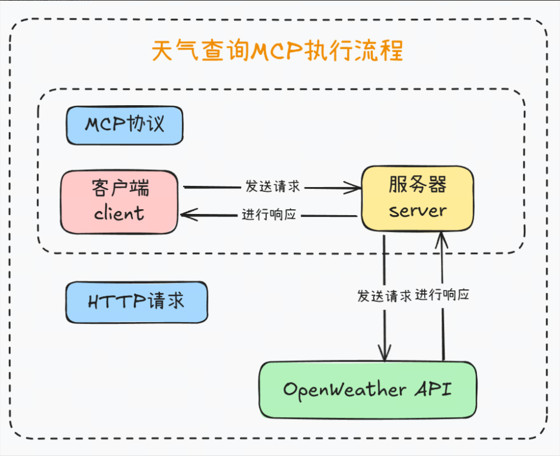
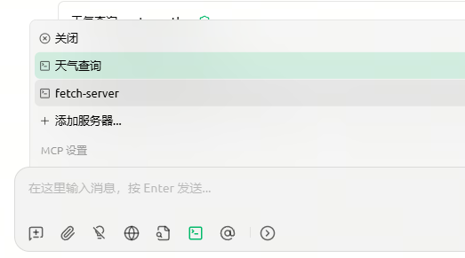

# MCP服务器
# MCP 服务器介绍
## <font style="color:rgba(0, 0, 0, 0.9);">MCP 服务端是什么</font>
+ <font style="color:rgba(0, 0, 0, 0.9);">角色定位：MCP Server 是跑在本地或远程的“轻量级能力插件”，向上为 LLM/Agent 暴露标准化的 资源（Resources）、工具（Tools）、提示（Prompts）三类能力，向下则安全地访问文件、数据库、API 等实际数据源</font><font style="color:rgba(0, 0, 0, 0.9);">。</font>
+ <font style="color:rgba(0, 0, 0, 0.9);">架构位置：整个 MCP 采用经典 C/S 架构——Host（Claude Desktop、IDE 等）→ MCP Client（1:1 连接）→ MCP Server → 本地/远程资源。</font>

## <font style="color:rgba(0, 0, 0, 0.9);">服务端种类</font>
当下主流的与大模型交互的三要素无非是：工具、资源、提示词，而mcp针对这三类均做了标准化处理。 以下是几个重要的功能：

+ <font style="color:rgb(25, 27, 31);">Resouces ：定制化地请求和访问本地的资源，可以是文件系统、数据库、当前代码编辑器中的文件等等原本网页端的app 无法访问到的</font><font style="color:rgb(25, 27, 31);"> </font>**<font style="color:rgb(25, 27, 31);">静态资源</font>**<font style="color:rgb(25, 27, 31);">。额外的 resources 会丰富发送给大模型的上下文，使得 AI 给我们更加精准的回答。</font>
+ <font style="color:rgb(25, 27, 31);">Prompts ：定制化一些场景下可供 AI 进行采纳的 prompt，比如如果需要 AI 定制化地返回某些格式化内容时，可以提供自定义的 prompts。</font>
+ <font style="color:rgb(25, 27, 31);">Tools ：可供 AI 使用的工具，它必须是一个函数，比如预定酒店、打开网页、关闭台灯这些封装好的函数就可以是一个 tool，大模型会通过 function calling 的方式来使用这些 tools。 Tools 将会允许 AI 直接操作我们的电脑，甚至和现实世界发生交互。</font>

# UV 工具介绍
MCP开发要求借助uv进行虚拟环境创建和依赖管理。`uv` 是一个Python 依赖管理工具，类似于 `pip` 和 `conda`，但它更快、更高效，并且可以更好地管理 Python 虚拟环境和依赖项。它的核心目标是替代 `pip`、`venv` 和 `pip-tools`，提供更好的性能和更低的管理开销。uv 具体使用可参考文档：[https://www.cuiliangblog.cn/detail/section/228701279](https://www.cuiliangblog.cn/detail/section/228701279)

# MCP 服务器开发
## 功能说明
以之前开发的天气查询助手为例演示如何进行开发，MCP 基本执行流程如下：



## 代码编写
```python
import json
import os
from typing import Any
import httpx
import dotenv
from mcp.server.fastmcp import FastMCP
from loguru import logger

# 加载环境变量配置
dotenv.load_dotenv()

# 初始化 MCP 服务器，命名为 WeatherServer
mcp = FastMCP("WeatherServer")


@mcp.tool()  # 将函数注册为MCP工具
async def get_weather(city: str) -> dict[str, Any] | None:
    """
    查询指定城市的即时天气信息。

    :param city: 必要参数，字符串类型，表示要查询天气的城市名称。
                 注意：中国城市需使用其英文名称，如 "Beijing" 表示北京。
    :return: 返回 OpenWeather API 的响应结果，URL 为
             https://api.openweathermap.org/data/2.5/weather。
             响应内容为 JSON 格式的字典，包含详细的天气数据；
             如果请求失败则返回 None。
    """
    # 构建请求 URL
    url = "https://api.openweathermap.org/data/2.5/weather"

    # 设置查询参数
    params = {
        "q": city,  # 城市名称
        "appid": os.getenv("OPENWEATHER_API_KEY"),  # 从环境变量中读取 API Key
        "units": "metric",  # 使用摄氏度作为温度单位
        "lang": "zh_cn"  # 返回简体中文的天气描述
    }

    # 发起异步 HTTP GET 请求并处理响应
    async with httpx.AsyncClient() as client:
        try:
            response = await client.get(url, params=params, timeout=30.0)
            response.raise_for_status()
            logger.info(f"查询天气结果：{json.dumps(response.json())}")
            return response.json()
        except Exception as e:
            logger.error(f"查询天气失败：{e}")
            return None


if __name__ == "__main__":
    # 启动 MCP 服务器，使用标准输入输出方式进行通信
    logger.info("启动 MCP 服务器...")
    mcp.run(transport='stdio')
```

## 运行服务
在本地启动一个 MCP 服务器，运行刚刚创建的 server.py 文件，并进入一个开发模式，方便：

1. 热加载代码（修改后不用重启整个客户端）
2. 在终端里查看服务器和 MCP 客户端之间的通信日志（方便调试）
3. 模拟 MCP 客户端连接到你的服务器，测试 API / 工具调用是否正常

运行Inspector

```python
# npx -y @modelcontextprotocol/inspector uv run server.py
Starting MCP inspector...
⚙️ Proxy server listening on localhost:6277
🔑 Session token: c74f080a0d770ea7ae26594304ad9cc160a1a131f54f7b9db3a89f98d25cb672
   Use this token to authenticate requests or set DANGEROUSLY_OMIT_AUTH=true to disable auth

🚀 MCP Inspector is up and running at:
   http://localhost:6274/?MCP_PROXY_AUTH_TOKEN=c74f080a0d770ea7ae26594304ad9cc160a1a131f54f7b9db3a89f98d25cb672

🌐 Opening browser...
```

也可以执行

```python
# mcp dev server.py
```

服务启动后会自动打开浏览器工具


# <font style="color:rgb(0, 0, 0);">使用mcp服务器</font>
为方便测试 mcp 服务器，我们暂时先不开发 mcp 客户端，而是通过第三方客户端工具调用。

## 安装<font style="color:rgb(0, 0, 0);">cherry studio</font>
具体可参考文档：[https://docs.cherry-ai.com/advanced-basic/mcp/config](https://docs.cherry-ai.com/advanced-basic/mcp/config)

## 配置 MCP 服务器
新增一个 MCP 服务器，启动参数如下

```python
--directory
D:\PycharmProjects\LangChainDemo # 替换为实际项目路径
run
server.py
```


## 运行测试
在 mcp 工具中启用天气查询工具



访问测试


# 原理分析
启用 MCP 后，Cherry Studio 不只是把用户的输入直接交给 Ollama，它会多一个 **“模型中转+工具编排”** 的流程：

## 步骤分析
1. 用户输入

你在 Cherry Studio 输入问题，比如：

2. Cherry Studio 请求模型（前置 MCP 拦截）
+ Cherry Studio 收到输入后，并不会立刻把它丢给 Ollama，而是先通过 **MCP Client** 传递给 **MCP Server**。
+ MCP Server 里定义了可用的 **Tools、Prompts、Resources**（比如“天气查询工具”）。
3. 模型生成调用计划（Tool Call）
+ MCP Server 会先把你的输入传给 **Ollama 模型**（作为推理引擎）。
+ 模型可能返回一个 **工具调用意图**（比如 `call weather_tool(city="北京")`）。
+ 这一部分符合 MCP 协议里的 **Tool Invocation 流程**。
4. MCP 调用外部工具
+ MCP Server 检查调用请求：
    - 如果是工具调用 → 执行对应的 Tool（可能是 HTTP API、本地脚本、数据库查询等）。
    - 如果是 Resource 读取 → 拉取外部文件/数据。
    - 如果是 Prompt 模板 → 组合成最终请求。
+ 工具执行完成后，把结果（比如天气 JSON）返回给 MCP Server。
5. 再次调用模型生成最终回答
+ MCP Server 把工具返回的结果再次传给 Ollama 模型，让它生成最终的自然语言回答：
6. Cherry Studio 显示对话结果
+ Cherry Studio 渲染模型返回的最终结果到聊天窗口。

## 流程图解


