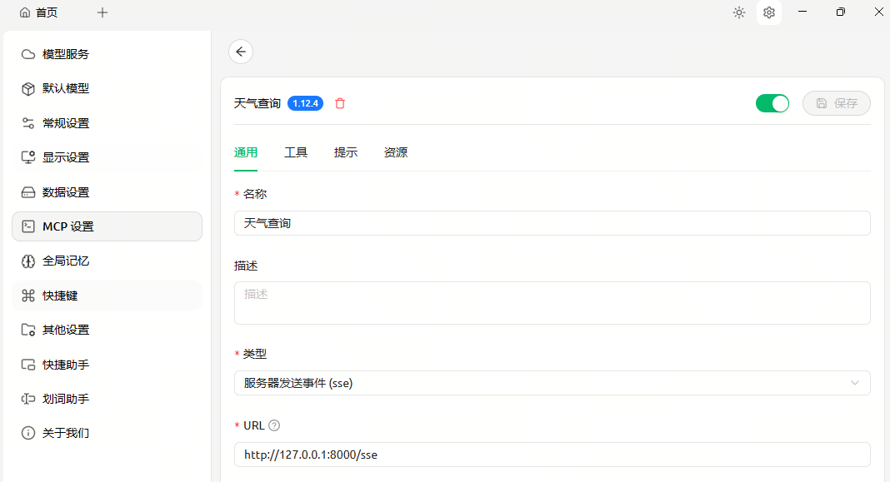
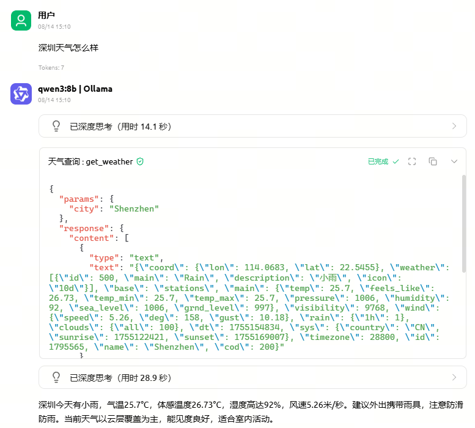
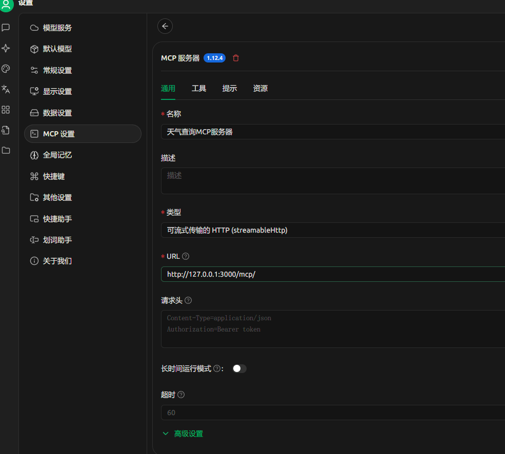
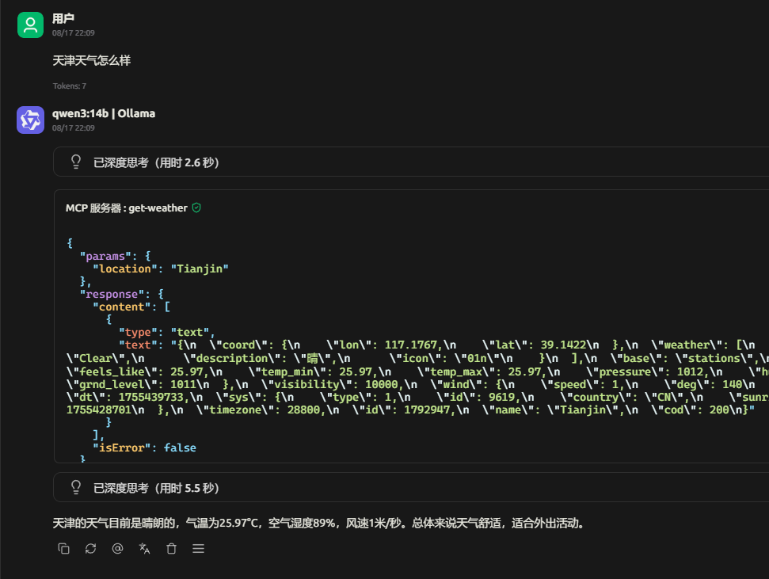

# MCP进阶使用

> 分类: AIOPS > MCP
> 更新时间: 2026-01-10T23:34:36.559980+08:00

---

# 基于SSE的MCP实现
除了stdio连接模式外，MCP还提供了可以服务器、客户端异地运行的SSE传输模式，以适用于更加通用的开发情况。若要实现SSE的MCP服务器通信，需要同时修改客户端和服务器代码。

## server 端代码
```python
import json
import os
import httpx
import dotenv
from mcp.server.fastmcp import FastMCP
from loguru import logger

dotenv.load_dotenv()

# 创建FastMCP实例，用于启动天气服务器SSE服务
mcp = FastMCP("WeatherServerSSE", host="0.0.0.0", port=8000)

@mcp.tool()
def get_weather(city: str) -> dict | None:
    """
    查询指定城市的即时天气信息。
    参数 city: 城市英文名，如 Beijing
    返回: OpenWeather API 的 JSON 字符串
    """
    # 构建请求 URL
    url = "https://api.openweathermap.org/data/2.5/weather"

    # 设置查询参数
    params = {
        "q": city,  # 城市名称
        "appid": os.getenv("OPENWEATHER_API_KEY"),  # 从环境变量中读取 API Key
        "units": "metric",  # 使用摄氏度作为温度单位
        "lang": "zh_cn"  # 返回简体中文的天气描述
    }

    # 发起异步 HTTP GET 请求并处理响应
    async with httpx.AsyncClient() as client:
        try:
            response = await client.get(url, params=params, timeout=30.0)
            response.raise_for_status()
            logger.info(f"查询天气结果：{json.dumps(response.json())}")
            return response.json()
        except Exception as e:
            logger.error(f"查询天气失败：{e}")
            return None


if __name__ == "__main__":
    logger.info("启动 MCP SSE 天气服务器，监听 http://0.0.0.0:8000/sse")
    # 运行MCP客户端，使用Server-Sent Events(SSE)作为传输协议
    mcp.run(transport="sse")

```

## server 端测试
<font style="color:rgba(0, 0, 0, 0.87);">使用 Cher</font><font style="color:rgba(0, 0, 0, 0.87);">ry studio来调用这个mcp server。打开 cherry studio 的mcp 添加配置界面，类型选择 SSE，url 填写 </font>`<font style="color:rgb(54, 70, 78);background-color:rgb(245, 245, 245);">http://localhost:8000/sse</font>`<font style="color:rgba(0, 0, 0, 0.87);">, SSE 类型的mcp server 配置起来要比stdio 类型要简单很多，只需要配个url 即可。</font>



<font style="color:rgba(0, 0, 0, 0.87);">之后回到聊天界面，依然问一个需要查询天气的问题</font>



## client 端代码
```python
import json
import os
import sys
from mcp.client.sse import sse_client
from openai import OpenAI
from loguru import logger
import asyncio
from typing import Optional
from contextlib import AsyncExitStack
from mcp import ClientSession
from dotenv import load_dotenv
from openai.types.chat import ChatCompletionSystemMessageParam, ChatCompletionUserMessageParam

load_dotenv()


class MCPClient:
    """
    MCP客户端类，用于管理与MCP服务器的连接和交互

    该类负责初始化客户端会话、处理聊天循环以及资源清理
    """

    def __init__(self):
        """
        初始化MCP客户端实例

        初始化客户端会话、异步退出栈和OpenAI客户端
        """
        self.session: Optional[ClientSession] = None
        self.exit_stack = AsyncExitStack()
        self.base_url = os.getenv("BASE_URL")  # 读取 BASE URL,符合OpenAI API Key格式平台均可
        self.openai_api_key = os.getenv("OPEN_API_KEY")  # 读取API Key
        self.model = os.getenv("MODEL")  # 指定模型
        self.client = OpenAI(api_key=self.openai_api_key, base_url=self.base_url)  # 初始化OpenAI客户端实例

    async def connect_to_server(self, sse_url):
        """
        连接到SSE服务器并初始化会话
        
        Args:
            sse_url (str): SSE服务器的URL地址
            
        Returns:
            None: 无返回值，连接信息存储在实例变量中
        """

        # 建立 SSE 连接
        sse_transport = await self.exit_stack.enter_async_context(sse_client(sse_url))
        self.session = await self.exit_stack.enter_async_context(ClientSession(*sse_transport))
        await self.session.initialize()
        tools = (await self.session.list_tools()).tools
        logger.info(f"已连接 SSE 服务器，支持工具: {[t.name for t in tools]}")

        # 初始化会话
        await self.session.initialize()

        # 列出 MCP 服务器上的工具
        response = await self.session.list_tools()
        tools = response.tools
        logger.info(f"已连接到服务器，支持以下工具:{[tool.name for tool in tools]}")


    async def process_query(self, query: str) -> str:
        """
        处理用户的查询请求，结合大模型和 MCP 工具完成回答。

        该方法首先将用户问题发送给大模型，并根据模型是否需要调用工具来决定下一步流程：
        - 如果模型要求调用工具，则解析工具调用信息并执行对应工具；
        - 执行完成后将结果反馈给模型生成最终回复。

        参数:
            query (str): 用户输入的查询字符串。

        返回:
            str: 模型生成的回答内容。
        """
        messages = [
            ChatCompletionSystemMessageParam(role="system", content="你是一个智能助手，帮助用户回答问题。"),
            ChatCompletionUserMessageParam(role="user", content=query)
        ]

        # 获取 MCP 服务器上可用的工具列表，并转换为模型可识别的格式
        response = await self.session.list_tools()
        available_tools = [{
            "type": "function",
            "function": {
                "name": tool.name,
                "description": tool.description,
                "input_schema": tool.inputSchema
            }
        } for tool in response.tools]
        # logger.info(f"支持的工具列表{available_tools}")

        # 第一次调用大模型，判断是否需要使用工具
        response = self.client.chat.completions.create(
            model=self.model,
            messages=messages,
            tools=available_tools
        )

        # 处理模型返回的内容
        content = response.choices[0]
        if content.finish_reason == "tool_calls":
            # 如果模型决定调用工具，则解析第一个工具调用的信息
            tool_call = content.message.tool_calls[0]
            tool_name = tool_call.function.name
            tool_args = json.loads(tool_call.function.arguments)

            # 调用指定工具并记录日志
            result = await self.session.call_tool(tool_name, tool_args)
            logger.info(f"[调用工具] {tool_name} 传入参数是: {tool_args}")

            # 将工具调用请求和执行结果添加到对话历史中
            messages.append(content.message.model_dump())
            messages.append({
                "role": "tool",
                "content": result.content[0].text,
                "tool_call_id": tool_call.id,
            })

            # 将工具执行结果再次传给模型，以生成最终回答
            response = self.client.chat.completions.create(
                model=self.model,
                messages=messages,
            )
            return response.choices[0].message.content

        # 如果不需要调用工具，直接返回模型的回复内容
        return content.message.content

    async def chat_loop(self):
        """
        运行聊天循环

        持续接收用户输入并显示回显，直到用户输入'quit'退出
        支持异常处理以确保程序稳定性
        """
        logger.info("MCP 客户端已启动！")
        print("输入你的问题或输入 'quit' 退出。")

        # 主聊天循环
        while True:
            try:
                query = input("\n🧑‍🦲 [用户输入]: ").strip()

                # 检查退出条件
                if query.lower() == 'quit':
                    break
                # 发送用户输入到 OpenAI API
                response = await self.process_query(query)  # 发送用户输入到 OpenAI API
                print(f"\n🤖 [AI回答] ：{response}")

            except Exception as e:
                print(f"\n⚠️ 发生错误: {str(e)}")

    async def cleanup(self):
        """
        清理资源

        关闭异步退出栈中管理的所有资源
        """
        await self.exit_stack.aclose()


async def main():
    client = MCPClient()
    sse_url = "http://localhost:8000/sse"
    try:
        await client.connect_to_server(sse_url)
        await client.chat_loop()
    finally:
        # 确保在任何情况下都能正确清理客户端资源
        await client.cleanup()


# 使用asyncio.run()来运行异步主函数main()，确保了异步程序能够正确启动和执行
if __name__ == "__main__":
    asyncio.run(main())

```

## client 验证
```python
2025-08-14 15:19:20.555 | INFO     | __main__:connect_to_server:44 - 已连接 SSE 服务器，支持工具: ['get_weather']
2025-08-14 15:19:20.561 | INFO     | __main__:connect_to_server:52 - 已连接到服务器，支持以下工具:['get_weather']
2025-08-14 15:19:20.561 | INFO     | __main__:chat_loop:129 - MCP 客户端已启动！
输入你的问题或输入 'quit' 退出。

🧑‍🦲 [用户输入]: 广州天气怎么样
2025-08-14 15:20:05.323 | INFO     | __main__:process_query:102 - [调用工具] get_weather 传入参数是: {'city': 'Guangzhou'}

🤖 [AI回答] ：<think>
好的，用户之前询问了广州的天气，现在我需要根据提供的天气数据来生成回答。首先，查看数据中的主要信息，比如温度、天气状况、风力等。温度方面，当前温度是25.91°C，体感温度26.93°C，湿度91%，降雨量1小时内4.09毫米，说明有大雨。风速是3.48m/s，方向164度，可能来自东南方向。云量是100%，表示完全被云覆盖，天气阴沉。此外，日出和日落时间可能对用户有帮助，特别是如果他们计划外出活动的话。需要将这些信息组织成自然的中文回答，确保用户能清楚了解当前的天气情况，并给出适当的建议，比如携带雨具或注意防雨。同时，保持回答简洁明了，避免使用过多技术术语，让用户容易理解。
</think>

广州当前天气为大雨，气温25.91°C，体感温度26.93°C，湿度高达91%。1小时内降雨量达4.09毫米，建议外出携带雨具。风力3.48m/s，东南风方向，天空被云层完全覆盖，日出时间19:52，日落时间18:41，昼夜温差较小，注意防雨防滑。
```

# 基于Streamable HTTP 的 MCP 实现
相比SSE传输，HTTP流式传输并发更高、通信更加稳定，同时也更容易集成和部署，这也是当代服务器与客户端异地通信的最佳解决方案。在5月9号的1.8.0版本更新中，正式在SDK中加入了HTTP流式MCP服务器的相关功能支持。自此开发者就可以通过MCP SDK，高效快速开发流式HTTP MCP服务器，并顺利进行多通道并发的企业级MCP工具部署。

## server 端代码
还是以天气查询服务器为例：

```python
import os, json, contextlib
import click, httpx, dotenv, uvicorn
from loguru import logger
from collections.abc import AsyncIterator
from starlette.applications import Starlette
from starlette.routing import Mount
from starlette.types import Receive, Scope, Send
import mcp.types as types
from mcp.server.lowlevel import Server
from mcp.server.streamable_http_manager import StreamableHTTPSessionManager

dotenv.load_dotenv()


async def fetch_weather(city: str) -> dict | None:
    """
    调用 OpenWeather API 获取指定城市的实时天气信息
    
    参数:
        city (str): 城市名称
        
    返回值:
        dict | None: 成功时返回包含天气信息的字典，失败时返回None
    """
    # 构造API请求参数
    url = "https://api.openweathermap.org/data/2.5/weather"
    params = {
        "q": city,
        "appid": os.getenv("OPENWEATHER_API_KEY"),
        "units": "metric",
        "lang": "zh_cn",
    }
    
    # 发送异步HTTP请求并处理响应
    try:
        async with httpx.AsyncClient(timeout=30.0) as client:
            res = await client.get(url, params=params)
            res.raise_for_status()
            logger.info(f"获取天气数据结果: {res.json()}")
            return res.json()
    except Exception as e:
        logger.error(f"天气查询失败: {e}")
        return None


@click.command()
@click.option("--port", default=3000, help="Port to listen on for HTTP")
def main(port: int):
    app = Server("mcp-weather")

    @app.call_tool()
    async def get_weather(name: str, arguments: dict) -> list[types.TextContent]:
        """
        获取指定城市的天气信息工具函数
        
        参数:
            name (str): 工具名称
            arguments (dict): 包含请求参数的字典，必须包含'location'键表示城市名称
            
        返回:
            list[types.TextContent]: 包含天气信息的文本内容列表
            
        异常:
            ValueError: 当arguments中缺少'location'参数时抛出
            RuntimeError: 当获取天气数据失败时抛出
        """
        city = arguments.get("location")
        if not city:
            raise ValueError("'location' is required")

        # 记录开始获取天气信息的日志
        ctx = app.request_context
        await ctx.session.send_log_message("info", f"Fetching weather for {city}…",
                                           logger="weather", related_request_id=ctx.request_id)

        # 调用天气API获取数据
        weather = await fetch_weather(city)
        if not weather:
            raise RuntimeError("获取天气数据失败")

        # 记录获取天气信息成功的日志
        await ctx.session.send_log_message("info", "Weather data fetched successfully!",
                                           logger="weather", related_request_id=ctx.request_id)

        # 将天气数据转换为文本内容并返回
        return [types.TextContent(type="text", text=json.dumps(weather, ensure_ascii=False, indent=2))]


    @app.list_tools()
    async def list_tools() -> list[types.Tool]:
        """
        列出所有可用的工具
        
        Returns:
            list[types.Tool]: 包含所有可用工具的列表，每个工具包含名称、描述和输入模式等信息
        """
        return [types.Tool(
            name="get-weather",
            description="查询指定城市的实时天气（OpenWeather 数据）",
            inputSchema={
                "type": "object",
                "required": ["location"],
                "properties": {
                    "location": {"type": "string", "description": "城市的英文名称，如 'Beijing'"},
                },
            },
        )]

    # 创建会话管理器实例，用于管理HTTP会话状态
    session_manager = StreamableHTTPSessionManager(app=app, event_store=None, stateless=True)


    async def handle(scope: Scope, receive: Receive, send: Send) -> None:
        """
        处理HTTP请求的异步函数
        
        :param scope: ASGI作用域对象，包含请求信息
        :param receive: 接收函数，用于获取请求数据
        :param send: 发送函数，用于发送响应数据
        :return: None
        """
        await session_manager.handle_request(scope, receive, send)

    @contextlib.asynccontextmanager
    async def lifespan(_: Starlette) -> AsyncIterator[None]:
        """
        应用生命周期管理函数，在应用启动和关闭时执行相关操作
        
        :param _: Starlette应用实例（未使用）
        :return: 异步迭代器
        """
        async with session_manager.run():
            logger.info("Weather MCP server started 🚀")
            yield
            logger.info("Weather MCP server shutting down…")

    # 创建Starlette应用实例，挂载MCP处理函数到/mcp路径，并设置生命周期管理器
    starlette_app = Starlette(debug=False, routes=[Mount("/mcp", app=handle)], lifespan=lifespan)
    # 启动UVicorn服务器运行应用
    uvicorn.run(starlette_app, host="0.0.0.0", port=port)


if __name__ == "__main__":
    main()
```

## server 端测试
<font style="color:rgba(0, 0, 0, 0.87);">使用 Cherry studio来调用这个mcp server。打开 cherry studio 的mcp 添加配置界面，类型选择流式传输 HTTP，url 填写 </font>`<font style="color:rgb(54, 70, 78);background-color:rgb(245, 245, 245);">http://localhost:3000/mcp/</font>`<font style="color:rgba(0, 0, 0, 0.87);"></font>



<font style="color:rgba(0, 0, 0, 0.87);">之后回到聊天界面，依然问一个需要查询天气的问题</font>



# Resources、Prompt类功能MCP服务器
除了Tools功能的服务器外，MCP还支持Resources类服务器和Prompt类服务器，其中Resources服务器主要负责提供更多的资源接口，如调用本地文件、数据等，而Prompt类服务器则是用于设置Agent开发过程中各环节的提示词模板。

# 公开&在线 MCP 调用
MCP标准通信协议带来的最大价值之一，就是让广大Agent开发者能够基于此进行协作。在MCP推出后的若干时间，已经诞生了数以千计的MCP服务器，允许用户直接下载并进行调用。几个有名的MCP服务器合集(导航站)地址：

+ MCP官方服务器合集：https://github.com/modelcontextprotocol/servers
+ MCP Github热门导航：https://github.com/punkpeye/awesome-mcp-servers
+ MCP工具注册平台：https://github.com/ahujasid/blender-mcp
+ MCP导航：https://mcp.so/
+ 魔搭 MCP：[https://www.modelscope.cn/mcp](https://www.modelscope.cn/mcp)
+ 阿里云百炼：https://bailian.console.aliyun.com/?tab=mcp

# Client进阶功能
除了能在命令行中创建MCP客户端外，还支持各类客户端的调用：https://modelcontextprotocol.io/clients

其中借助对话类客户端，如Claude Destop，我们能够轻易的将各类服务器进行集成，从而拓展Claude Destop的性能：

而在一些IDE客户端里，如cline或者Cursor，我们能够直接调用服务器进行开发：

此外，还有一些为MCP量身定制的Agent开发框架，通过集成MCP来提高Agent开发进度：

https://github.com/lastmile-ai/mcp-agent

