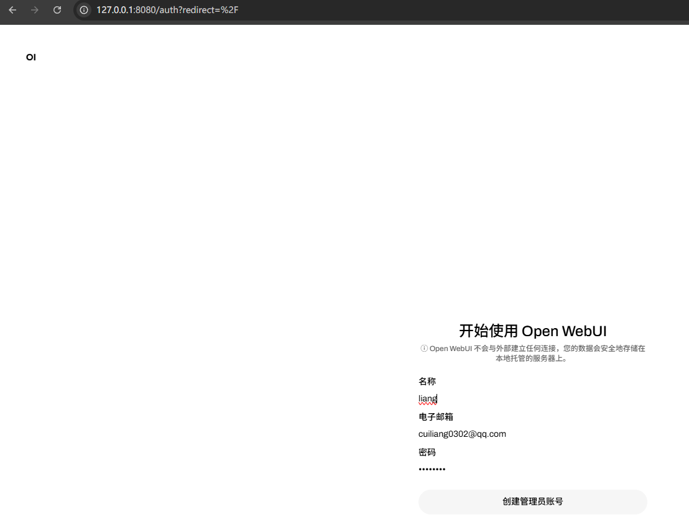
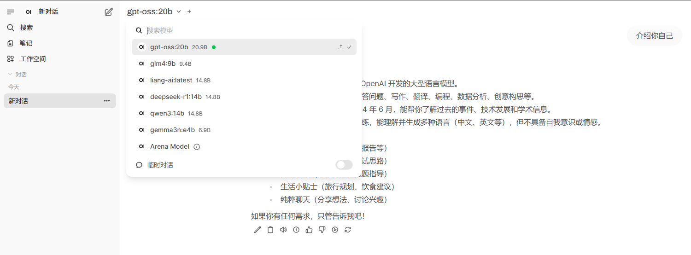
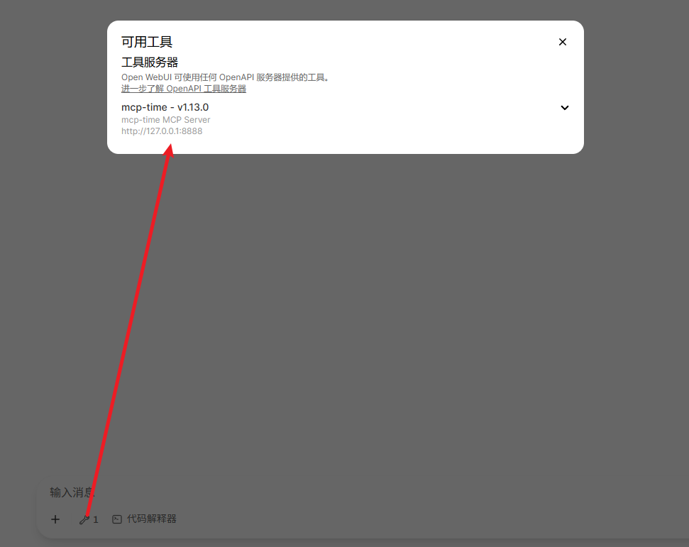

# Open-WebUI接入MCP
# Open-WebUI
## 介绍
Open WebUI 是一款可扩展、功能丰富且用户友好的自托管 AI 平台，旨在完全离线运行。它支持多种大型语言模型（LLM）运行环境，包括 Ollama 和兼容 OpenAI 的 API。

## 主要功能
+ 多模型支持：兼容多种 LLM 运行环境，用户可以根据需求选择适合的模型进行部署和交互。
+ 离线运行：设计上支持完全离线操作，确保数据隐私和安全，适合对数据敏感的应用场景。
+ 用户友好界面：提供类似 ChatGPT 的交互界面，方便用户与本地或远程部署的语言模型进行对话。
+ 自托管部署：支持通过 Docker 等方式进行自托管部署，方便用户在本地环境中运行和管理。

## 安装Open-WebUI
通过docker安装open-webui并启动

```plain
docker run -d -p 8080:8080 -e HF_HUB_OFFLINE=1 --add-host=host.docker.internal:host-gateway -v $PWD/open-webui:/app/backend/data --name open-webui ghcr.io/open-webui/open-webui:main
```

`HF_HUB_OFFLINE=1` 设置离线环境，避免Open-WebUI启动时自动进行模型下载：

浏览器中输⼊ http://localhost:8080 显⽰如下页⾯，输⼊邮箱后登录即可和⼤模型对话，并且能够⾃动扫描我们已安装的模型.

然后首次使用前，需要创建管理员账号：



然后点击登录即可。需要注意的是，此时Open-WebUI会自动检测后台是否启动了ollama服务，并列举当前可用的模型。即可进入到对话页面：



# Open-WebUI接入MCP流程
参考文档：https://docs.openwebui.com/openapi-servers/mcp

最新Open WebUI 提供的 MCP（Model Context Protocol）到 OpenAPI 的代理服务器（mcpo）MCP 到 OpenAPI 的代理服务器让你可以通过标准的 REST/OpenAPI API 来直接使用基于 MCP（模型上下文协议）实现的工具服务器——无需学习或处理任何复杂的自定义协议。

## 为什么使用 mcpo
尽管 MCP 工具服务器功能强大、灵活，但它们通常通过标准输入/输出（stdio）进行通信——这意味着它们通常运行在本地，可以方便地访问文件系统、环境变量及其他系统资源。这既是优势，也是一种限制。

因为 MCP 服务器通常依赖于原始的 stdio 通信方式，它：

+ 在跨环境使用时不安全
+ 与大多数现代工具、UI 或平台不兼容
+ 缺乏认证、文档和错误处理等关键特性

而 mcpo 代理 自动解决了这些问题：

+ 与现有的 OpenAPI 工具、SDK 和客户端即时兼容
+ 将你的工具包裹为安全、可扩展、基于标准的 HTTP 接口
+ 自动为每个工具生成交互式 OpenAPI 文档，无需任何配置
+ 使用纯 HTTP——无需配置 socket、不用管理后台服务或编写平台相关代码

因此，虽然引入 mcpo 表面上看像是“又多了一层”，但实际上它：

+ 简化了集成流程
+ 提升了安全性
+ 强化了可扩展性 

✨ 有了 mcpo，你本地运行的 AI 工具可以立刻支持云端部署、适配各种 UI，并实现无缝交互——无需修改工具服务器代码中的任何一行。

## 部署 mcpo
```plain
pip install uv
pip install mcpo
```

接下来我们可以通过以下命令运行推荐的 MCP 服务器（如 `mcp-server-time`）并同时通过 `mcpo` 代理进行开放：

```plain
uvx mcpo --port 8888 -- uvx mcp-server-time --local-timezone=Asia/Shanghai
```

## 添加 mcpo
登录 open-webui，添加 mcpo 服务器


查看可使用的 mcp



访问验证


# MCP 到 OpenAPI 代理的优势
为什么通过代理使用 MCP 工具服务器是更优选择？

+ 用户友好且熟悉的接口：不需要学习新的客户端，只需使用你熟悉的 HTTP 接口
+ 即时集成：与数千个现有的 REST/OpenAPI 工具、SDK 和服务无缝兼容
+ 强大自动文档支持：Swagger UI 自动生成、准确维护
+ 无需新协议开销：免去直接处理 MCP 协议复杂性和 socket 通信问题
+ 稳定安全：沿用成熟的 HTTPS、认证机制（如 JWT、API key）、FastAPI 的可靠架构
+ 面向未来：使用标准 REST/OpenAPI，长期获得社区支持与发展

