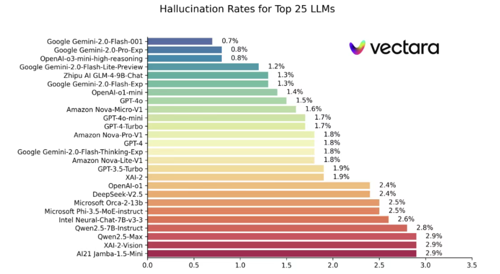
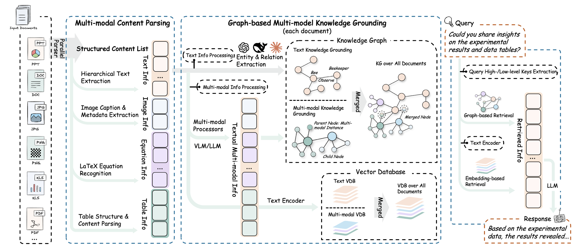
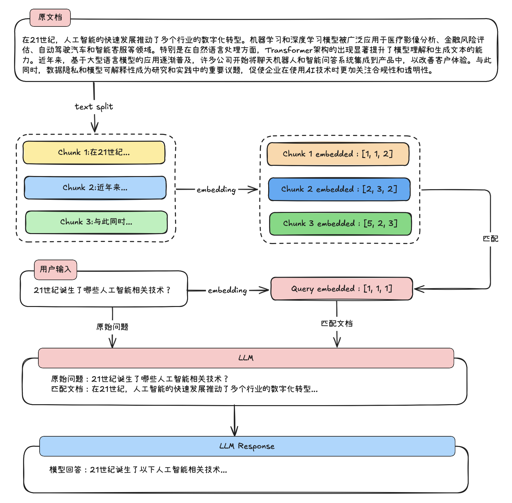
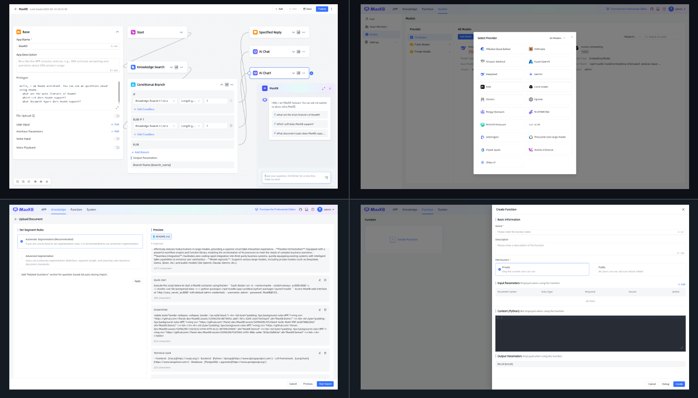
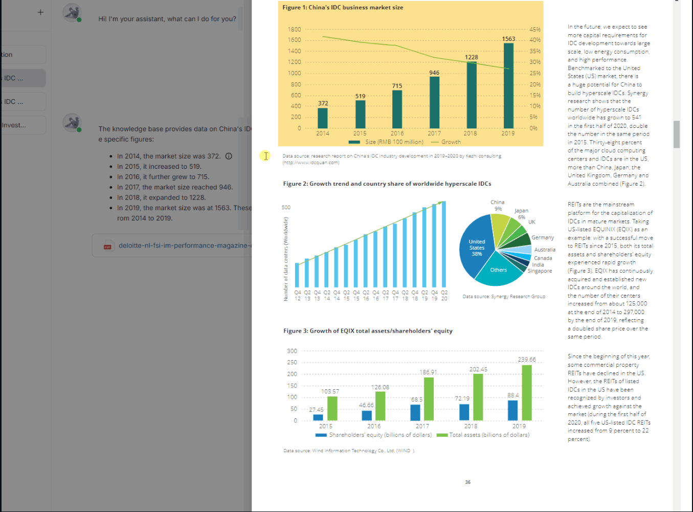
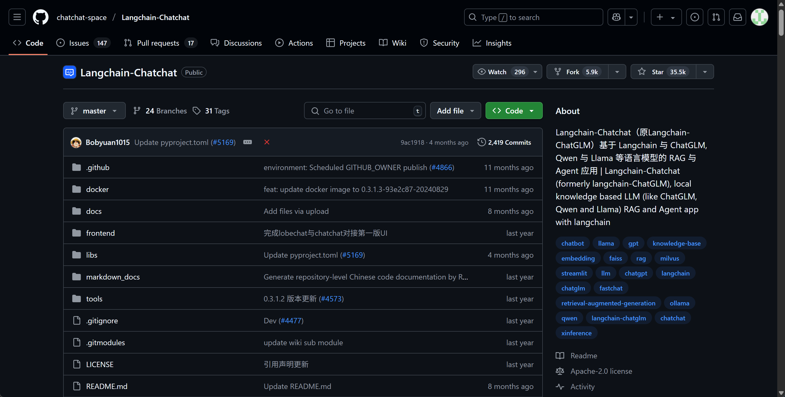
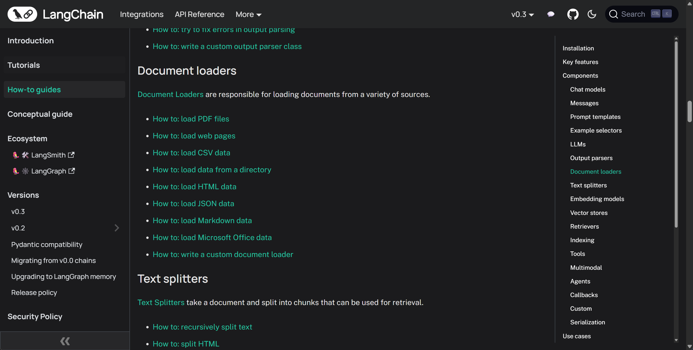

# RAG入门
# 什么是 RAG
RAG，Retrieval-Augmented Generation，也被称作检索增强生成技术，最早在 Facebook AI（Meta AI）在 2020 年发表的论文《Retrieval-Augmented Generation for Knowledge-Intensive NLP Tasks》（ https://arxiv.org/abs/2005.11401 ）中正式提出，这种方法的核心思想是借助一些文本检索策略，让大模型每次问答前都带入相关文本，以此来改善大模型回答时的准确性。

# 为什么需要RAG
## 缺陷一：大模型幻觉
大家在使用大模型的时候，都会遇到大模型无中生有胡编乱造答案的情况，例如胡乱生成一些概念、一些论文甚至是一些实时等，这就是所谓的大模型幻觉。

大型语言模型之所以会产生幻觉，主要是因为它们的训练方式和内在机制决定了它们并不具备真正理解和验证事实的能力。模型在训练过程中，通过分析大规模文本数据来学习不同词语和句子之间的概率关系，也就是在某种程度上掌握“在什么上下文中，什么样的回答听起来更合理”。然而，模型并没有接入实时的知识库或事实核查工具，当它遇到陌生的问题、模糊的描述或者上下文不完整的输入时，就会基于概率和语料库中似是而非的关联去“编造”一个看似正确的答案。由于这些输出往往语法流畅、逻辑连贯，人类读者很容易误以为它是真实可信的内容，这就是我们通常说的“模型幻觉”。

## 缺陷二：有限的最大上下文
由于大模型的本质其实是一个算法，不管是让大模型“知道”有哪些外部工具，还是要给大模型进行“背景设置”，或者是要给模型添加历史对话消息，以及本次对话的输出，都需要占用这个上下文窗口。这就使得我们在一次对话中能够给大模型灌输的知识（文本）其实是有限的。

大型语言模型还存在最大上下文限制，这是由它们的架构和计算方式决定的。每次生成回答时，模型需要把输入文本转换成固定长度的数字序列（称为token），并在内部一次性加载到模型的“上下文窗口”中进行处理。这个窗口的大小是有限的，不同模型一般在几千到几万token之间。如果输入内容超出这个长度，模型要么截断最前面的部分，要么丢弃部分信息，这就会造成对话历史、长文档或先前提到的重要细节的遗失。因为它无法跨越上下文窗口无限地保留信息，所以在面对长对话或者大量背景知识时，模型常常出现上下文断裂、回答不连贯或者忽略先前条件的情况。

早些时候的大模型普遍是8k最大上下文，相当于是8-10页中文PDF，伴随着大模型预训练技术的不断发展，顶尖的大模型，如Gemini 2.5 Pro和GPT-4.1等模型，已经达到了1M的最大上下文长度，相当于是一千页的PDF，相当于1.5本《红楼梦》，而普通的模型，也基本达到64K或128K最大上下文，相当于60-100也左右的PDF。

但是，模型上下文的增长也是有限度的，对于开发者来说，能够一次性输入的信息都会有限制。

## 缺陷三：模型专业知识与时效性知识不足
大型语言模型虽然在通用领域展现出令人瞩目的语言理解和生成能力，但其在特定领域的专业知识掌握往往存在明显局限。其根本原因在于，模型的训练依赖于预先收集的大规模语料，这些语料覆盖面虽广，却很难保证在所有专业领域中具有足够的深度和准确性。某些领域，如医学、法律或前沿科技，知识更新速度快且门槛较高，公开可获取的高质量数据本身就有限，模型难以在此基础上形成系统性和权威性的认知。此外，模型训练通常在固定的时间点结束，因此其所掌握的知识具有天然的时效性，无法实时反映新近出现的研究成果、政策变化或行业动态。这种静态的知识存储模式，决定了大模型在面对最新或高度专业化的问题时，往往难以提供全面、精确的解答。

# RAG技术实现流程
时至今日，RAG技术已经是非常庞大的技术体系了，从简答的文档切分、存储、匹配，再到复杂的入GraphRAG（基于知识图谱的检索增强），以及复杂文档解析+多模态识别技术等等等等。

而对于初学者来说，为了更好的上手学习RAG技术，我们首先需要对RAG技术最简单的实现形式有个基础的了解。

RAG技术的落地主要由以下几个步骤组成：

（1）文档的收集

（2）文档处理

（3）文档数据向量化

（4）文档数据相似性检索

（5）构建提示词

（6）大语言模型生成结果

一个最简单的RAG技术实现流程如下所示：

我们需要围绕给定的文档（往往是非常长的文档）先进行切分，然后将切分的文档转化为计算机能识别的形式，也就是将其转化为一个数值型向量（也被称为词向量），然后当用户询问问题的时候，我们再将用户的问题转化为词向量，并和段落文档的词向量进行相似度匹配，借此找出和当前用户问题最相关的原始文档片段，然后将用户的问题和匹配的到的原文片段都带入大模型，进行最终的问答。由此便可实现一次完整的文档检索增强执行流程。

具体执行过程如下所示：

# RAG系统使用场景
 正因为知识库检索的广泛的使用需求，RAG技术几乎成了现在各项聊天机器人的标配，无论是面向普通用户的聊天问答应用Cherry Studio：

还是面向企业应用场景的通用开源前端Open-WebUI:

都毫无例外都配置了RAG功能，而对于OpenAI-WebUI这种企业级前端，还为用户展示了RAG检索过程诸多技术细节：

尽管这些项目能让用户更加快速的使用RAG系统，但这种传统的RAG流程（也被称作Native RAG），在长期的应用过程中也逐渐展露出很多问题，例如对于非结构化的文本（例如包含图片、公式的文本）无法进行检索，而对于超大规模文本的检索又会存在精度不足、或者无法提炼总结跨文本概念等问题。为此，近两年的时间里，在无数技术人的共同努力下，RAG技术有了长足的成长和突破。

# RAG全栈技术体系介绍
但是，就像前文介绍的那样，RAG技术是一项应用面广、门槛很低、但同时上限也很高的一项技术。历经数年的技术发展，RAG技术的体系已经非常庞大，以下是RAG技术全栈技术框架概览：

## GraphRAG
GraphRAG（Graph-enhanced Retrieval-Augmented Generation） 是一种在经典 RAG 基础上引入知识图谱/图结构的新型检索生成方法 。其核心思想是通过将文档或数据转换成图的形式，从而捕捉实体与实体之间的语义关系，并在检索阶段利用图遍历、关系推理等机制来辅助上下文构建，这种结构化信息能够提升语义理解和多跳推理能力。

具体来说，GraphRAG 的流程包括：

1. 图谱构建：将文本拆分为多个单元（TextUnit），提取实体与关系，构造知识图，并进行图社区检测与摘要；
2. 混合检索：用户提问既可以进行向量检索定位实体，也可以通过图查询（如 Cypher/SPARQL）沿关系边扩展信息；
3. 图增强生成：将检索到的节点、路径、社区摘要等信息拼接进 Prompt，引导 LLM 生成更准确、结构清晰、并基于事实推理的回答。

| 对比维度 | 传统 RAG | GraphRAG |
| --- | --- | --- |
| 检索方式 | 基于向量语义相似度 | 向量+知识图遍历/查询 |
| 关系理解能力 | 弱：只能匹配语义相近片段 | 强：能理解实体之间的多跳关系与结构 |
| 多跳推理支持 | 弱：难以综合跨文档信息 | 强：图结构天然支持推理路径遍历 |
| 语义上下文覆盖 | 依赖检索片段 | 可检索完整实体子图、社区摘要 |
| 可解释性 | 中：返回片段但缺关键信息结构 | 高：能显示实体关系路径及社区结构 |
| 性能/复杂度 | 低：直接使用向量库 | 高：需要图构建、遍历、摘要等pipeline |

传统 RAG 主要是“先检索语义近似片段，再生成回答”，适合简单查询与短对话。但当问题需要“连接多个事实”“推理关系链”和“洞察上下文结构”时，传统 RAG 会显得力不从心，而 GraphRAG 正是为复杂推理场景设计的增强机制。

## Agentic RAG
Agentic RAG（Agentic Retrieval-Augmented Generation） 是一种在传统 RAG 基础上进一步扩展的增强范式，它将检索增强生成与Agent（智能体）能力有机结合，使大模型不仅能够基于外部知识库进行回答，还能够通过一系列自主决策和工具调用来完成复杂任务。与经典 RAG 的“检索+拼接+生成”线性流程不同，Agentic RAG 将 LLM 视为一个具备推理、规划和操作能力的智能体，它在对话过程中可以根据问题拆解子任务，先后执行多轮检索、知识整合、函数调用甚至外部API请求，再将结果动态组合成最终的答案。

 在这个模式下，大模型可以主动提出接下来的检索需求，或根据中间推理结果迭代获取更多信息，形成“循环式检索与生成”的闭环工作流。例如，当用户提出复杂查询时，Agentic RAG可以先调用检索工具定位候选内容，再使用工具对结果进行归纳或分类，必要时还会触发计算或外部查询操作，最后再汇总所有信息输出一个有依据的、分步骤的解答。

 相比传统RAG，Agentic RAG不仅提升了回答准确性和透明度，也为多轮推理和跨知识库整合提供了更强的灵活性，是近年来大模型产品中非常重要的能力演进方向。

# RAG热门开源项目&产品
 而如果不打算自主开发，目前也有非常多RAG成熟的开源项目，可以直接作为RAG产品进行使用。

## MaxKB
 MaxKB（Max Knowledge Brain） 是一款开源的、面向企业级应用的智能知识库助手，深度集成了 RAG（Retrieval‑Augmented Generation） 管道和流程编排能力。它支持用户通过上传文档或自动爬取网页内容，系统会自动完成 分段、向量化检索 等流程，从而显著减少大模型回答时的“幻觉”风险，提升问答的准确性和可信度。 此外，MaxKB 配备了一个灵活的 Agentic Workflow 引擎和丰富的工具函数集，能够满足复杂业务场景下的智能流程编排需求。它支持与各类 LLM（如 OpenAI/Claude/Gemini、本地模型 Llama、Qwen）及第三方系统进行零代码集成，方便快速在企业内部构建智能客服、内部知识问答、学术研究助手等应用。 总之，MaxKB 提供了一个“开箱即用”的智能知识服务框架，技术中立且功能全面，适用于多样化企业场景，诸如客服、知识管理、教育及科研等。GPT 架构下通过 RAG 技术减少幻觉，并通过流程引擎强化业务能力，是一款值得企业部署的高效开源平台。但MaxKB只支持在线使用，数据隐私安全性难以得到保障，同时若想要创建更多知识库，还需要单独支付费用。

MaxKB项目主页：https://github.com/1Panel-dev/MaxKB

## RAGFlow
RAGFlow 是一款功能全面且高可配置的开源 RAG 引擎，专注于“深度文档理解”（Deep Document Understanding），旨在帮助企业和开发者高效构建以文档为基础的智能问答系统。

 它支持多种文档格式（如 PDF、Word、PPT、Excel、扫描件等），并以复杂布局识别和OCR 分块模板为核心，对文档进行结构化拆分，以生成适合检索的知识单元。

 在检索阶段，RAGFlow 提供多路召回策略（包括向量检索和混合重排序），并生成可追溯的引用，能够显著减少模型幻觉，提高答案可信度。

 在生成环节，它具备内置的流程引擎（Agentic Workflow），结合 LLM 能够执行自动化推理任务（如代码执行、SQL 查询）。

 技术架构上，RAGFlow 提供 Docker + Helm 快速部署能力，支持 x86 & GPU 加速；并兼容主流 LLM 提供商与自部署选项，包括 OpenAI、Anthropic、Ollama、本地模型等。此外，它还配备交互式 Web UI 和低代码 Agent 搭建界面，用户可零代码创建知识库、上传文档、并生成可引用的对话助手或检索系统。

RAGFlow项目主页：https://github.com/infiniflow/ragflow/

## LangChain-ChatChat
LangChain‑Chatchat（原名 LangChain‑ChatGLM）是一款基于 LangChain 框架构建的开源、本地部署知识库问答与 Agent 应用平台，致力于在中文场景和开源大模型上提供流畅、可脱机运行的智能对话体验。它融合向量检索与生成式大模型，实现了完整的 RAG 问答流程，包括文档读取、内容分段、向量化检索、Top‑k 匹配，以及将检索出的内容与用户问题一起拼入 Prompt，驱动 LLM 生成答案。 该项目已支持主流开源 LLM（如 ChatGLM‑6B、GLM‑4-Chat、Qwen2‑Instruct、LLaMA 等）及 Embedding 模型，同时兼容多个本地推理框架（如 Xinference、Ollama、FastChat），也支持通过 OpenAI API 调用 GPT 模型。无论是在线还是离线环境，用户都能通过命令行或 Docker 快速部署，并自定义知识库路径和模型配置。

在功能方面，LangChain‑Chatchat 提供：

+ 一站式知识库问答接口，支持文件、数据库、图片等多源输入；
+ 可控的 Agent 能力，支持工具调用与流程执行；
+ 丰富的 WebUI 与低代码交互方式，便于管理会话、系统提示词、检索配置等。

LangChain-chatchat官网：https://github.com/chatchat-space/Langchain-Chatchat

# RAG系统开发框架
## LangChain&LangGraph
 在当前的大模型应用开发生态中，LangChain 已经成为构建RAG（Retrieval-Augmented Generation）系统最受欢迎的框架之一。LangChain 不仅提供了面向开发者的高层API，还整合了文档加载、文本分块、向量检索、上下文拼接、输出解析等全流程工具，极大降低了RAG应用的开发门槛。在检索阶段，LangChain 提供了多种Document Loaders（如PDF、Markdown、网页、数据库加载器），并内置了RecursiveCharacterTextSplitter、MarkdownHeaderTextSplitter等分块工具，方便将原始文本转化为高质量的检索单元。向量化方面，LangChain兼容主流Embedding模型（OpenAI Embedding、Hugging Face模型、Cohere等），并支持Chroma、FAISS、Weaviate、Pinecone等多种向量数据库无缝集成。

 在生成与问答环节，LangChain封装了RetrievalQA、ConversationalRetrievalChain、MultiQueryRetriever等常用组件，能够快速搭建基于单轮或多轮对话的检索增强问答系统。对于更高阶的能力，LangChain还支持LLM Chain与Agent模式，开发者可以通过工具调用和多步骤推理，构建具备复杂交互逻辑的Agentic RAG系统。总体来看，LangChain为RAG开发提供了丰富的工具集和模块化能力，使构建一个可扩展的知识检索与生成系统从“几周工程”缩短为“几天内可原型验证”。

## Agents SDK、ADK内置RAG服务
 在最新的大模型技术体系中，OpenAI Agent SDK和**谷歌 Agent Development Kit（ADK）*分别代表了两大云平台对*检索增强生成（RAG）能力的官方支持路径，两者虽然同属“Agent+RAG”范式，但在功能侧重点和生态整合方面各有特色。

 OpenAI Agent SDK通过原生File Search机制，为开发者提供了极简化的RAG接入方式。用户仅需在Assistant配置中启用文件检索工具，便可实现自动分块、向量化与高效召回，整个过程在OpenAI云端一体化托管，无需额外配置数据库或索引管理。该模式支持多轮对话的上下文跟踪和结果拼接，能够与Function Calling无缝结合，实现“先检索后调用工具”的闭环逻辑，尤其适合对系统稳定性和开发便捷性要求较高的场景。

 相比之下，谷歌ADK则在多模态检索与推理流水线方面提供了更强的灵活性。其核心能力之一“Grounding”不仅支持文本向量检索，还能原生处理PDF、表格、扫描件等多模态数据，并提供自动可追溯引用功能，使答案生成过程更加透明可信。ADK允许开发者通过流水线（Pipeline）将检索、摘要、分类等步骤串联组合，构建复杂的多步推理流程，并支持与谷歌云生态（Drive、Gmail、Cloud Storage）深度集成。

 总体而言，OpenAI Agent SDK更加专注于“一体化、低门槛的RAG体验”，而谷歌ADK则以“多模态、可编排、高可扩展性”为核心定位。两者均标志着RAG技术从最初的工程框架（如LangChain、LlamaIndex）走向平台原生支持，也体现了未来智能体开发将更加重视知识检索、自动推理和可追溯性等能力的趋势。

