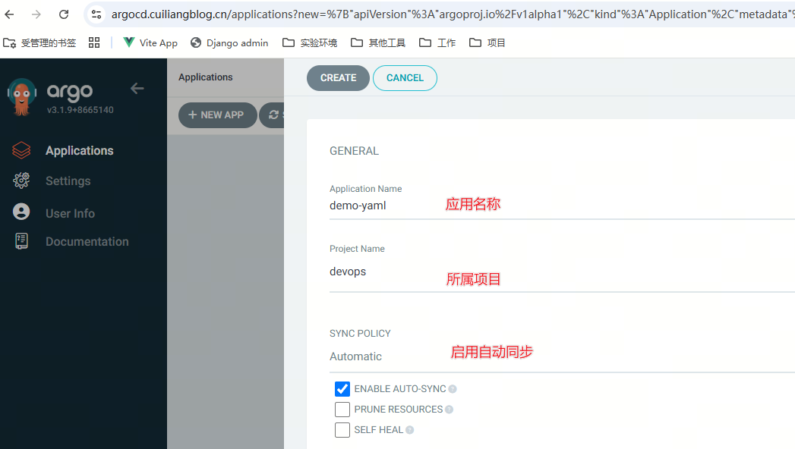
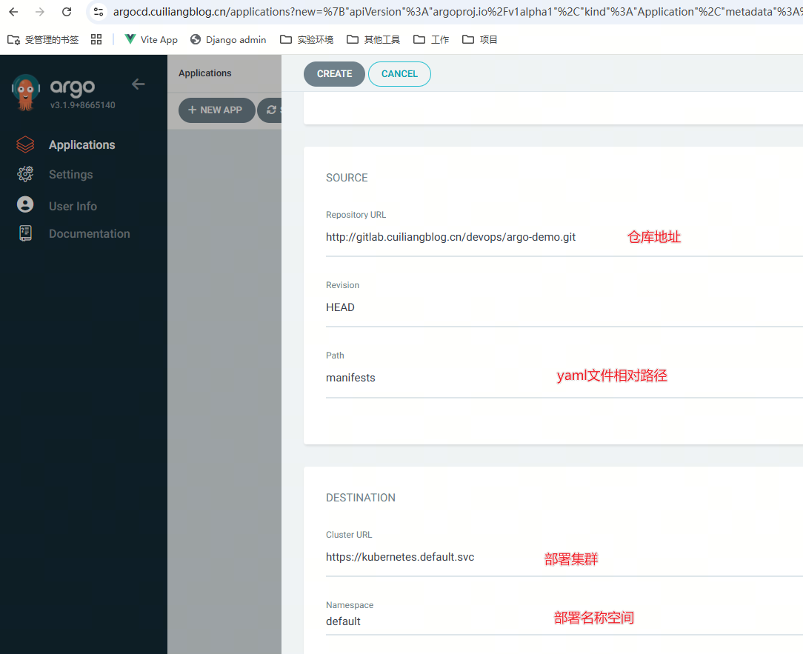
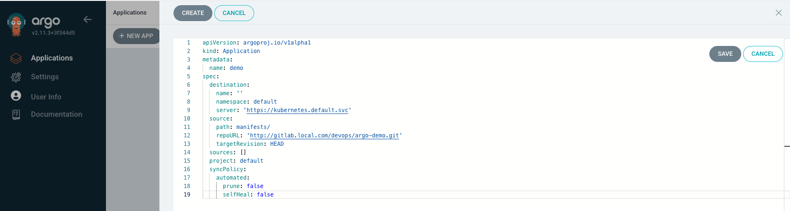
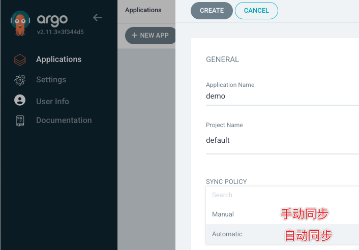

# Directory APP

> 分类: CI/CD > ArgoCD创建APP
> 更新时间: 2026-01-10T23:34:03.598233+08:00

---

# APP创建
## webUI创建




## CLI创建
除了使用webUI创建应用外，也可以使用Argo CLI命令行工具创建

```bash
# 登录Argo CD
[root@tiaoban ~]# argocd login argocd.local.com
WARNING: server certificate had error: tls: failed to verify certificate: x509: certificate is valid for ba3cdea2e0025c0ae0c4538c0bfe0e43.4611c2de05384ee8b14bfeabd906ba18.traefik.default, not argocd.local.com. Proceed insecurely (y/n)? y
WARN[0003] Failed to invoke grpc call. Use flag --grpc-web in grpc calls. To avoid this warning message, use flag --grpc-web. 
Username: admin
Password: 
'admin:login' logged in successfully
Context 'argocd.local.com' updated
# 创建应用
[root@tiaoban ~]# argocd app create demo1 \
--repo http://gitlab.local.com/devops/argo-demo.git \
--path manifests/ --sync-policy automatic --dest-namespace default \
--dest-server https://kubernetes.default.svc --directory-recurse
WARN[0000] Failed to invoke grpc call. Use flag --grpc-web in grpc calls. To avoid this warning message, use flag --grpc-web. 
application 'demo' created
# 查看应用列表
[root@tiaoban ~]# argocd app list
WARN[0000] Failed to invoke grpc call. Use flag --grpc-web in grpc calls. To avoid this warning message, use flag --grpc-web. 
NAME         CLUSTER                         NAMESPACE  PROJECT  STATUS     HEALTH   SYNCPOLICY  CONDITIONS  REPO                                          PATH       TARGET
argocd/demo  https://kubernetes.default.svc  default    default  OutOfSync  Missing  Manual      <none>      http://gitlab.local.com/devops/argo-demo.git  manifests
# 查看应用状态
[root@tiaoban ~]# kubectl get application -n argocd
NAME   SYNC STATUS   HEALTH STATUS
demo   Synced        Healthy
# 执行立即同步操作
[root@tiaoban ~]# argocd app sync argocd/demo
```

## yaml文件创建


```yaml
[root@tiaoban ~]# cat demo.yaml 
apiVersion: argoproj.io/v1alpha1
kind: Application
metadata:
  name: demo
  namespace: argocd
spec:
  destination: # 部署集群和namespace
    namespace: default
    server: 'https://kubernetes.default.svc'
    # name: 'in-cluster' # 也可以通过集群名称指定
  source:
    path: manifests # yaml资源清单路径
    repoURL: 'http://gitlab.local.com/devops/argo-demo.git' # 同步仓库地址
    targetRevision: 'master' # 分支名称
  sources: []
  project: default
  syncPolicy: # 同步策略
    automated:
      prune: false
      selfHeal: false
  # ignoreDifferences: # 知道某些资源忽略同步验证，用于hpa场景
  #   - group: apps
  #     kind: Deployment
  #     jsonPointers:
  #       - /spec/replicas
[root@tiaoban ~]# kubectl apply -f demo.yaml
application.argoproj.io/demo created
```

# 应用同步选项
## 同步策略配置
SYNC POLICY：同步策略

Argo CD能够在检测到 Git 中所需的清单与集群中的实时状态之间存在差异时自动同步应用程序。自动同步是GitOps Pull模式的核心，好处是 CI/CD Pipeline 不再需要直接访问Argo CD API服务器来执行部署，可以通过在WEB UI的Application-SYNC POLICY中启用AUTOMATED或CLIargocd app set <APPNAME> --sync-policy automated 进行配置。



PRUNE RESOURCES ：自动删除资源，开启选项后Git Repo中删除资源会自动在环境中删除对应的资源。


SELF HEAL：自动痊愈，强制以GitRepo状态为准，手动在环境修改不会生效。


## AutoSync自动同步
默认同步周期是180s, 可以修改argocd-cm配置文件，添加`timeout.reconciliation`参数。

同步流程：

1. 获取所有设置为auto-sync的apps
2. 从每个app的git存储库中获取最新状态
3. 将git状态与集群应用状态对比
4. 如果相同，不执行任何操作并标记为synced
5. 如果不同，标记为out-of-sync

## SyncOptions同步选项
+ Validate=false：禁用Kubectl验证
+ Replace=true：kubectl replace替换
+ PrunePropagationPolicy=background：级联删除策略(background, foreground and orphan.)ApplyOutOfSyncOnly=true：仅同步不同步状态的资源。避免大量对象时资源API消耗
+ CreateNamespace=true：创建namespace
+ PruneLast=true：同步后进行修剪
+ RespectlgnoreDifferences=true：支持忽略差异配置(ignoreDifferences:)
+ ServerSideApply=true：部署操作在服务端运行(避免文件过大)

# 应用状态


sync status

+ Synced：已同步
+ OutOfSync：未同步

health status

+ Progressing：正在执行
+ Suspended：资源挂载暂停
+ Healthy：资源健康
+ Degraded：资源故障
+ Missing：集群不存在资源


