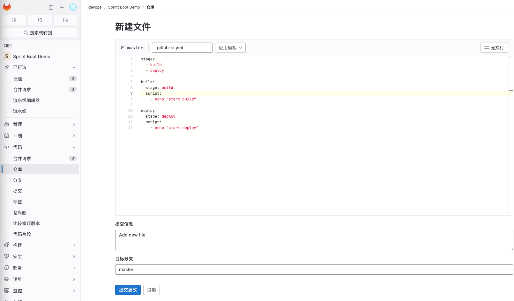
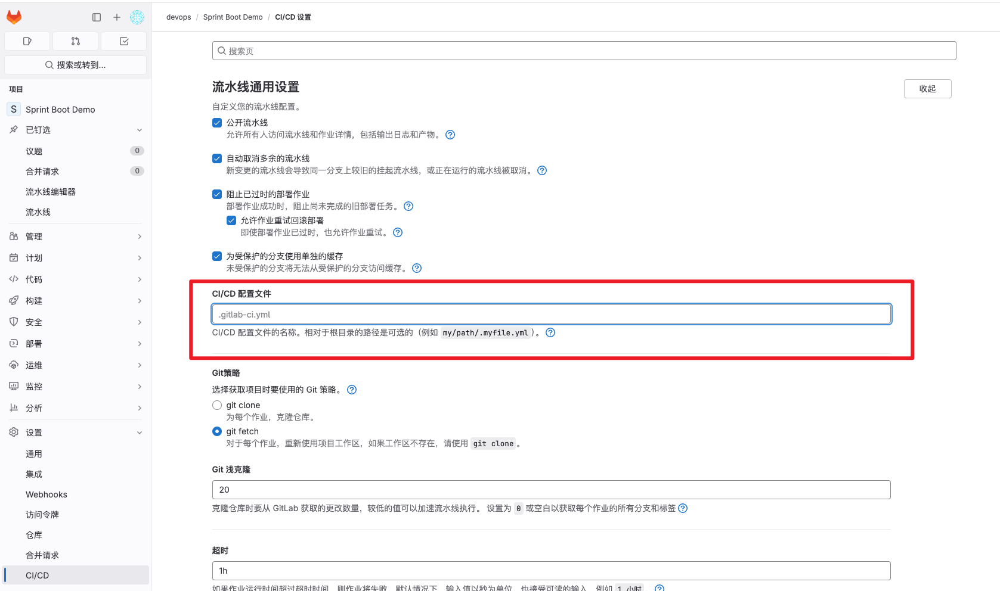

# 运行流水线任务
# 添加流水线文件
在gitlab仓库中项目根目录添加一个.gitlab-ci.yml文件，文件内容如下

```yaml
stages:
  - build
  - deploy

build:
  stage: build
  script:
    - echo "start build"

deploy:
  stage: deploy
  script:
    - echo "start deploy"
```

这个流水线共包含两个job，分别是build 和 deploy。

buildjob包含一个stage build，运行构建命令。

deployjob包含一个stage deploy，运行部署命令。



# 测试流水线
提交文件后，会自动触发cicd流程，查看流水线信息，已成功完成操作。


# 流水线语法检查工具


# 指定其他流水线
默认情况下使用项目根目录下的.gitlab-ci.yml文件，当然我们也可以本仓库其他路径下的文件或者远程仓库文件路径。



