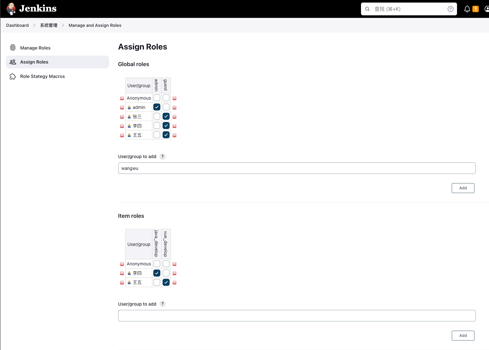
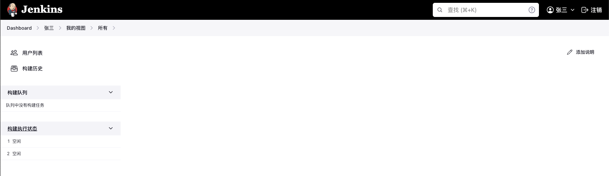

# jenkins用户权限
# 安装启用
## 安装插件
我们可以利用Role-based Authorization Strategy插件来管理Jenkins用户权限

## 开启权限全局安全配置
依次点击jenkins——>系统管理——>全局安全配置，将授权策略改为Role-Based Strategy，也就是基于角色的权限。

# 创建测试任务
分别创建vue_prod、Vue_test、java-test三个项目用于后续测试。

# 权限配置
## 创建角色
依次点击jenkins——>系统管理——>Manage and Assign Roles

## 配置角色权限
**Global roles**

创建全局角色，例如管理员，作业创建者，匿名角色等，从而可以在全局基础上设置总体，代理，作业，运行，查看和SCM权限。

我们这里添加一个只读权限角色名为guest。

**Item roles**

创建项目角色，仅允许基于项目设置Job和Run权限。

在这里我们有两个项目vue_develop与java_develop，我们分别用不同的项目权限对项目进行管理。

在添加Item roles的时候有如下规则：

+ 如果将字段设置为java-.*，则该角色将匹配名称以开头的所有作业java-.
+ 模式区分大小写。要执行不区分大小写的匹配，请使用(?i)表示法： (?i)vue_.*这样不区分大小写的。
+ 可以使用以下表达式匹配文件夹 ^foo/bar.*

在这里我们分别创建java_develop和vue_develop角色，并授予不同的权限。

创建完item roles后，我们可以点击蓝色pattern表达式查看是否匹配到任务。

# 用户配置
## 创建用户
创建完角色后，接下来创建三个用户分别是zhangsan、lisi、wangwu，分别对应上面添加的三个角色。

依次点击jenkins——>系统管理——>管理用户——>Create User

创建完的用户列表如下图所示

## 用户授权
有了用户和角色后，接下来的操作就是将用户与角色进行绑定。

依次点击jekins——>系统管理——>Manage and Assign Roles——>Assign Roles，

首先需要将所有用户授予guest权限，否则看不到不具备读权限，无法显示。然后将李四与java_develop角色绑定，王五与vue_develop角色绑定，张三不绑定item权限。

# 登录验证
## 张三
因为张三只具备guest角色权限，因此虽然可以登录jenkins，但是看不到任何任务信息。

## 李四
李四绑定了java_develop角色，因此只能看到java相关的任务信息。

## 王五
王五绑定了vue_develop角色，因此只能看到vue相关的任务信息。

