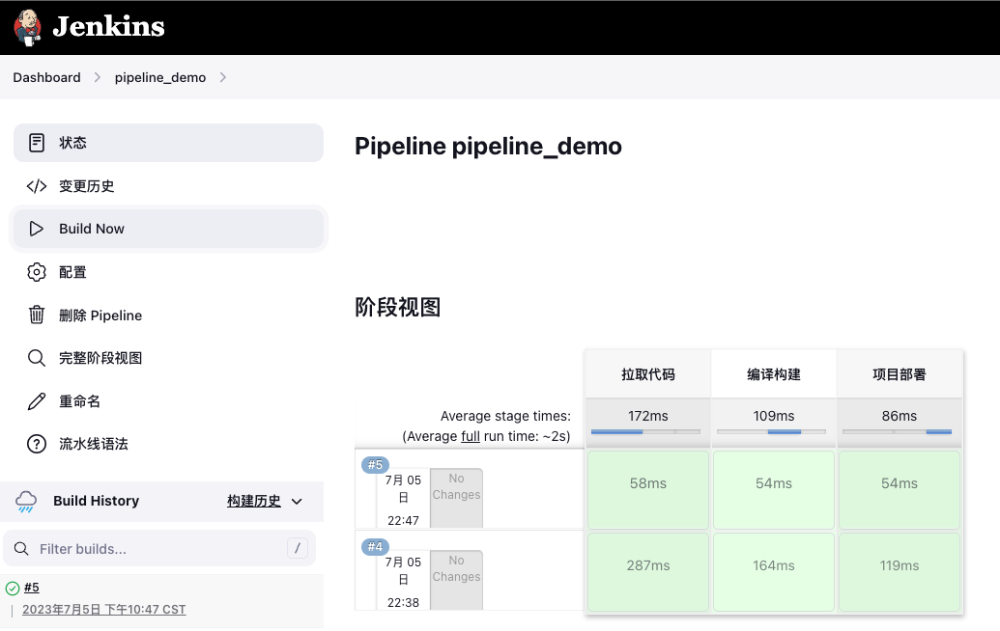

# Pipeline语法入门
# 创建流水线任务


# 配置声明式pipeline
## 使用hello world模板
创建完任务后，在流水线配置中，选择hello world模板，生成的内容如下：

```groovy
pipeline {
    agent any

    stages {
        stage('Hello') {
            steps {
                echo 'Hello World'
            }
        }
    }
}

```

stages：代表整个流水线的所有执行阶段。通常stages只有1个，里面包含多个stage

stage：代表流水线中的某个阶段，可能出现n个。一般分为拉取代码，编译构建，部署等阶段。

steps：代表一个阶段内需要执行的逻辑。steps里面是shell脚本，git拉取代码，ssh远程发布等任意内容。

## 自定义pipeline
根据hello world模板，编写一个简单的pipeline。

```bash
pipeline {
    agent any

    stages {
        stage('拉取代码') {
            steps {
                echo '拉取代码'
            }
        }
        stage('编译构建') {
            steps {
                echo '编译构建'
            }
        }
        stage('项目部署') {
            steps {
                echo '项目部署'
            }
        }
    }
}
```

## 运行任务测试
点击立即构建，可以在状态菜单中看到每个阶段信息。


# 配置脚本式pipeline
## 自定义pipeline
```bash
node {
    stage('拉取代码'){
        echo '拉取代码'
    }
    stage('编译构建'){
        echo '编译构建'
    }
    stage('项目部署'){
        echo '项目部署'
    }
}
```

Node：节点，一个 Node 就是一个 Jenkins 节点，Master 或者 Agent，是执行 Step 的具体运行环境，后续Jenkins的Master-Slave架构的时候用到。

Stage：阶段，一个 Pipeline 可以划分为若干个 Stage，每个 Stage 代表一组操作，比如：Build、Test、Deploy，Stage 是一个逻辑分组的概念。

Step：步骤，Step 是最基本的操作单元，可以是打印一句话，也可以是构建一个 Docker 镜像，由各类 Jenkins 插件提供，比如命令：sh ‘make’，就相当于我们平时 shell 终端中执行 make 命令一样。

## 运行任务测试
运行结果与声明式Pipeline完全一致。



