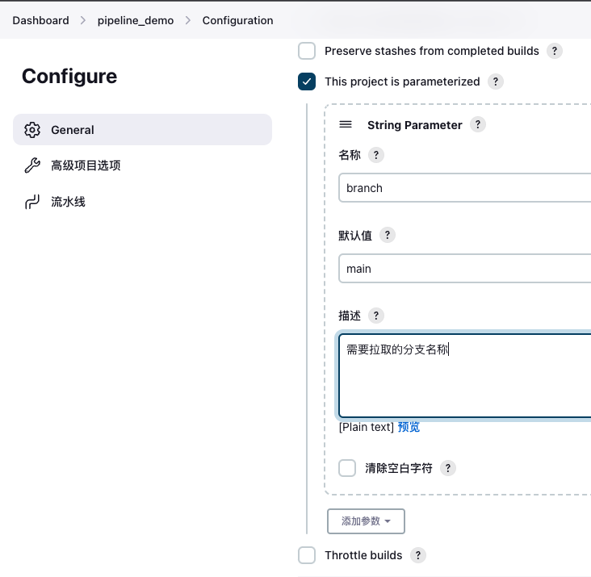
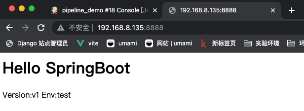

# jenkins参数化构建
项目构建的过程中，我们通常需要根据用户的输入的不同参数，触发不同的构建步骤，从而影响整个构建结果。这时我们可以使用参数化构建。

接下来以gitee项目不同的分支来部署不同的项目为例演示。

# 项目创建测试分支并推送至仓库
## main生产分支内容
## 
## test测试分支内容


# 修改jenkins配置
## 添加字符串类型参数


## 修改pipeline
在拉取代码环节，使用${branch}引用变量

```bash
pipeline {
    agent any

    stages {
        stage('拉取代码') {
            steps {
                checkout scmGit(branches: [[name: '*/${branch}']], extensions: [], userRemoteConfigs: [[credentialsId: 'gitee-cuiliang0302', url: 'https://gitee.com/cuiliang0302/sprint_boot_demo.git']])
            }
        }
        stage('编译构建') {
            steps {
                sh 'mvn clean package'
            }
        }
        stage('部署运行') {
            steps {
                sh 'nohup java -jar target/SpringBootDemo-0.0.1-SNAPSHOT.jar &'
                sh 'sleep 60'
            }
        }
    }
}
```

# 构建测试
## 设定参数
点击立即构建，输入变量参数test。


## 结果验证
访问springboot页面如下所示



