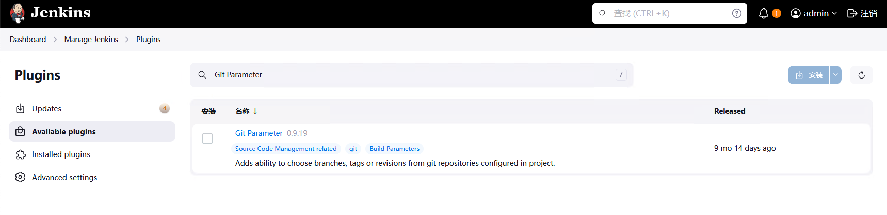
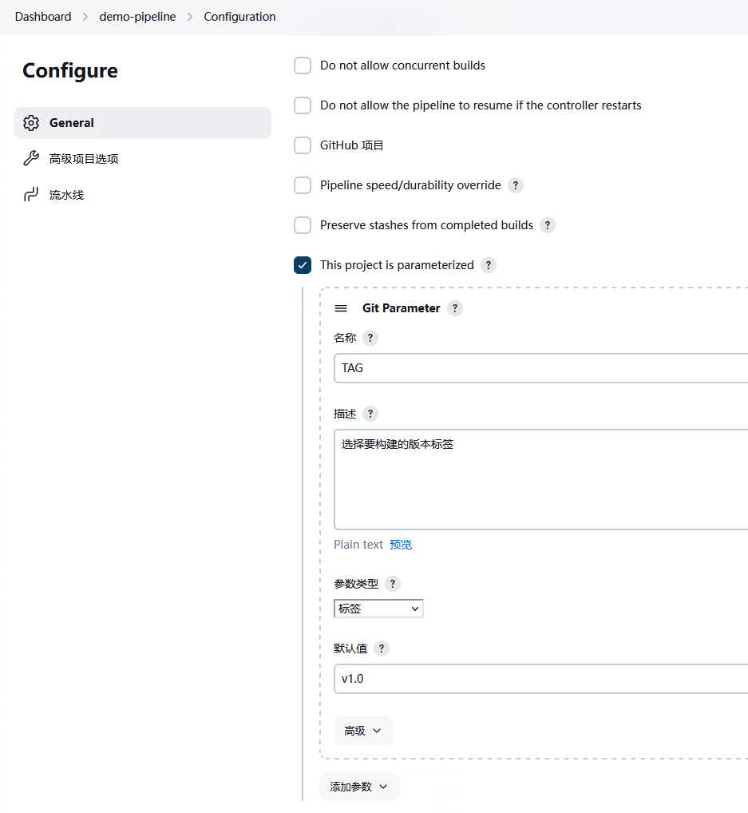
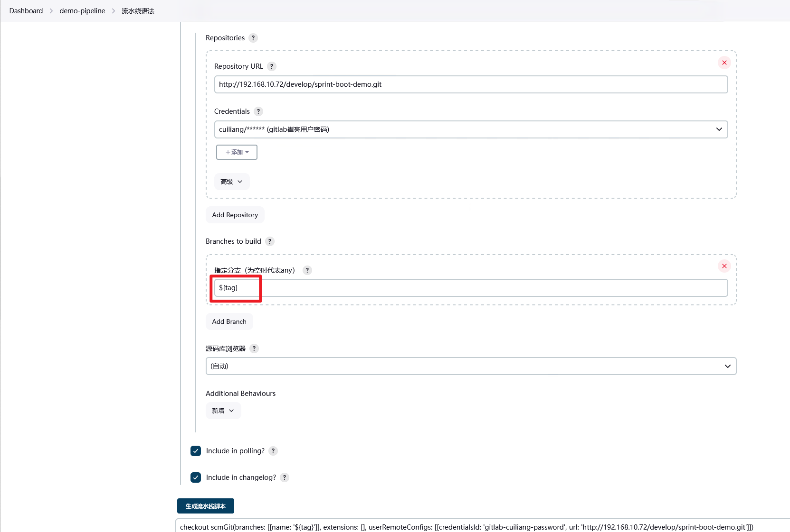
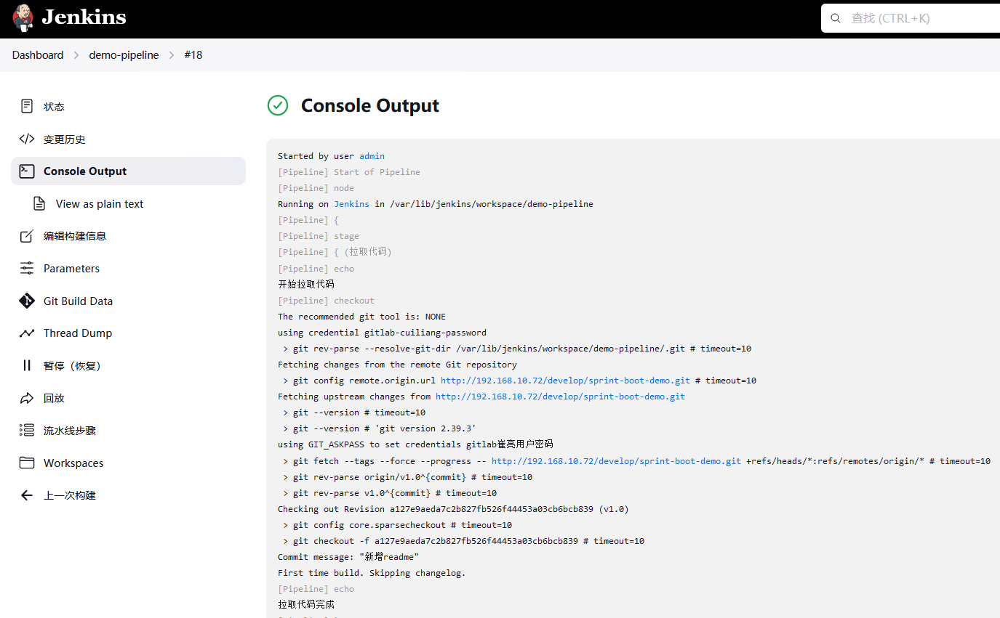
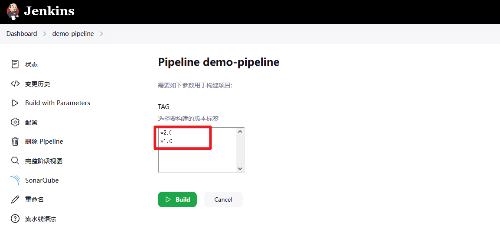

# jenkins根据tag构建
# 发布与回滚思路
正常功能发布时，是基于master分支发布的，所以我在成功发布后，会将当时的master分支自动打上tag，当需要回滚时，则基于tag分支进行发布即可。


# 安装配置Git Parameter
## 安装插件
要想出现tag模式的参数，需要[安装git](https://so.csdn.net/so/search?q=%E5%AE%89%E8%A3%85git&spm=1001.2101.3001.7020) Parameter 插件，在Jenkins的Manage Jenkins→Plugins→Available Plugins 中安装

## 验证
安装完成后在项目的配置页的This project is parameterized 中可以看到选项



## 仓库添加tag
初始化仓库，添加tag并提交

```bash
[root@tiaoban sprint_boot_demo]# git tag -a v1.0 -m "1.0版本"
[root@tiaoban sprint_boot_demo]# git tag -l
v1.0
[root@tiaoban sprint_boot_demo]# git push origin v1.0
Username for 'http://192.168.10.72': cuiliang
Password for 'http://cuiliang@192.168.10.72': 
枚举对象中: 1, 完成.
对象计数中: 100% (1/1), 完成.
写入对象中: 100% (1/1), 163 字节 | 163.00 KiB/s, 完成.
总共 1（差异 0），复用 0（差异 0），包复用 0
To http://192.168.10.72/develop/sprint-boot-demo.git
 * [new tag]         v1.0 -> v1.0

```

修改部分代码，并提交新版本。

```bash
[root@tiaoban sprint_boot_demo]# git commit -m "更新至v2" .
[main 0286318] 更新至v2
 1 file changed, 1 insertion(+), 1 deletion(-)
[root@tiaoban sprint_boot_demo]# git tag -a v2.0 -m "2.0版本"
[root@tiaoban sprint_boot_demo]# git tag -l
v1.0
v2.0
[root@tiaoban sprint_boot_demo]# git push origin v2.0 
Username for 'http://192.168.10.72': cuiliang
Password for 'http://cuiliang@192.168.10.72': 
枚举对象中: 18, 完成.
对象计数中: 100% (18/18), 完成.
使用 4 个线程进行压缩
压缩对象中: 100% (7/7), 完成.
写入对象中: 100% (10/10), 822 字节 | 822.00 KiB/s, 完成.
总共 10（差异 2），复用 0（差异 0），包复用 0
To http://192.168.10.72/develop/sprint-boot-demo.git
 * [new tag]         v2.0 -> v2.0
```

查看gitlab tag信息，发现已经有v1.0，2.0tag


# 使用tag变量发布
## 发布最新版本
生成pipeline，指定分支为${tag}



发布验证



## 手动发布指定版本
点击立即构建，在版本标签列表中可以查看到所有tag



