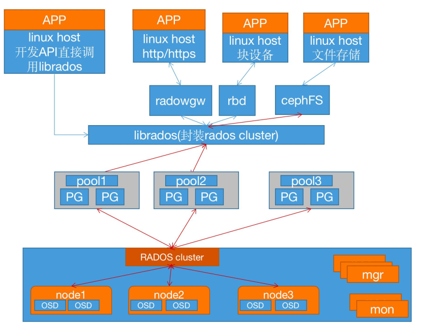

# RadosGW介绍

> 分类: Ceph > Ceph对象存储
> 更新时间: 2026-01-10T23:35:17.077234+08:00

---

参考文档：[https://docs.ceph.com/en/latest/radosgw/](https://docs.ceph.com/en/latest/radosgw/)

# RadosGW简介
RadosGW是对象存储（OSS,Object Storage Service）的一种访问实现方式，RADOS网关也称为Ceph对象网关、RadosGW、RGW，是一种服务，使客户端能够利用标准对象存储API来访问Ceph集群，它支持AWS S3和Swift API，在 ceph 0.8版本之后使用Civetweb（[https:/lgithub.com/civetweb/civetweb](https://github.com/civetweb/civetweb)）的 web服务器来响应api请求，客户端使用http/https协议通过RESTful API与RGW通信，而RGW则通过librados与ceph集群通信，RGW客户端通过s3或者swift api使用RGW用户进行身份验证，然后RGW网关代表用户利用cephx与ceph存储进行身份验证。  
说明：S3由Amazon于2006年推出，全称为Simple Storage Service,S3定义了对象存储，是对象存储事实上的标准，从某种意义上说，S3就是对象存储，对象存储就是S3，它是对象存储市场的霸主，后续的对象存储都是对S3的模仿。

# RadosGW存储特点
1. 通过对象存储网关将数据存储为对象，每个对象除了包含数据，还包含数据自身的元数据。
2. 对象通过Object ID来检索，不是通过普通文件系统的挂载方式，而是通过文件路径加文件名称操作来直接访问对象，只能通过API来访问，或者第三方客户端(实际上也是对API的封装)来访问。
3. 对象的存储不是垂直的目录树结构，而是存储在扁平的命名空间中，Amazon S3将这个扁平命名空间称为bucket，而swift则将其称为容器。无论是bucket还是容器，都不能再嵌套（bucket不能再包含 bucket）。
4. bucket需要被授权才能访问到，一个帐户可以对多个bucket 授权，而权限可以不同。
5. 方便横向扩展、快速检索数据。
6. 不支持客户端挂载,且需要客户端在访问的时候指定文件名称。
7. 不是很适用于文件过于频繁修改及删除的场景。

ceph 使用bucket作为存储桶(存储空间)，实现对象数据的存储和多用户隔离，数据存储在bucket 中，用户的权限也是针对bucket进行授权，可以设置用户对不同的bucket拥有不同的权限，以实现权限管理。

# bucket特性
1. 存储空间(bucket)是用于存储对象(Object)的容器，所有的对象都必须隶属于某个存储空间，可以设置和修改存储空间属性用来控制地域、访问权限、生命周期等，这些属性设置直接作用于该存储空间内所有对象，因此可以通过灵活创建不同的存储空间来完成不同的管理功能
2. 同一个存储空间的内部是扁平的，没有文件系统的目录等概念，所有的对象都直接隶属于其对应的存储空间
3. 每个用户可以拥有多个存储空间
4. 存储空间的名称在OSS范围内必须是全局唯一的，一旦创建之后无法修改名称
5. 存储空间内部的对象数目没有限制

# bucket命名规范
[https://docs.amazonaws.cn/AmazonS3/latest/userguide/bucketnamingrules.html](https://docs.amazonaws.cn/AmazonS3/latest/userguide/bucketnamingrules.html)

1. 只能包括小写字母、数字和短横线(-)
2. 必须以小写字母或者数字开头和结尾
3. 长度必须在3-63字节之间
4. 存储桶名称不能使用用IP地址格式
5. Bucket名称必须全局唯一

# radosgw架构图

# radosgw逻辑图

# 重要概念
区域（zone）: 一个ceph集群可以包含多个区域，一个区域只属于一个集群，一个区域可以有多个RGW

区域组（zonegroup）：由一个或多个区域组成，包含一个主区域（master zone），其他区域称为Secondary Zone，区域组内的所有区域之间同步数据

域（realm）: 同一个或多个区域组组成，包含一个主区域组，其他都次区域组。域中的所有rados网关都从位于主区域组和主区域中的rados网关拉取配置

注意：master zone group中的master zone处理所元数据更新，因此创建用户、bucket等操作都必须经由master zone

# 多区域网关配置架构
single-zone：一个realm中只有一个zonegroup和一个zone，可以有多个RGW

multi-zone：一个relam中只有一个zonegroup，但是有多个zone。一个realm中存储的数据复制到该zonegroup中的所有zone中

multi-zonegroup：一个realm中有多个zonegroup，每个zonegroup中又有一个或多个zone

multi-realms：多个realm

