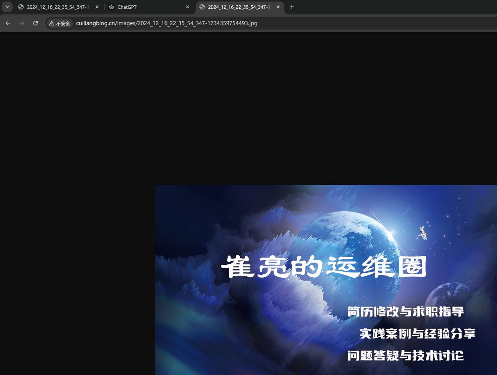

# 使用RGW(S3 API)
# 客户端安装与配置
## 创建RGW用户
用于s3cmd客户端连接RGW

```json
root@ceph-1:~# radosgw-admin user create --uid="user1" --display-name="user1"
{
  "user_id": "user1",
  "display_name": "user1",
  "email": "",
  "suspended": 0,
  "max_buckets": 1000,
  "subusers": [],
  "keys": [
    {
      "user": "user1",
      "access_key": "KKX8OPSFKL3RR3JQRO5D",
      "secret_key": "MDjM5KkaKEgWIdrvLr6fSsFmQsZlfuPNOFyBa3IB"
    }
  ],
  "swift_keys": [],
  "caps": [],
  "op_mask": "read, write, delete",
  "default_placement": "",
  "default_storage_class": "",
  "placement_tags": [],
  "bucket_quota": {
    "enabled": false,
    "check_on_raw": false,
    "max_size": -1,
    "max_size_kb": 0,
    "max_objects": -1
  },
  "user_quota": {
    "enabled": false,
    "check_on_raw": false,
    "max_size": -1,
    "max_size_kb": 0,
    "max_objects": -1
  },
  "temp_url_keys": [],
  "type": "rgw",
  "mfa_ids": []
}
```

保存好user1用户的access_key、secret_key信息。

## 安装s3cmd客户端
s3cmd是一个通过命令行访问ceph RGW实现创建存储桶、上传、下载以及管理数据到对象存储的命令行工具。

```bash
root@ceph-client:~# apt install -y s3cmd
```

## 配置s3cmd客户端执行环境
s3cmd客户端添加域名解析

```bash
root@ceph-client:~# cat /etc/hosts
192.168.10.90   ceph-rgw.local.com
```

配置命令执行环境

```bash
root@ceph-client:~# s3cmd --configure --no-check-certificate # 进入配置模式并禁用证书验证

Enter new values or accept defaults in brackets with Enter.
Refer to user manual for detailed description of all options.

Access key and Secret key are your identifiers for Amazon S3. Leave them empty for using the env variables.
Access Key: KKX8OPSFKL3RR3JQRO5D # 用户access key
Secret Key: MDjM5KkaKEgWIdrvLr6fSsFmQsZlfuPNOFyBa3IB # 用户Secret Key
Default Region [US]: CN # 地区，可选

Use "s3.amazonaws.com" for S3 Endpoint and not modify it to the target Amazon S3.
S3 Endpoint [s3.amazonaws.com]: ceph-rgw.local.com # RGW域名

Use "%(bucket)s.s3.amazonaws.com" to the target Amazon S3. "%(bucket)s" and "%(location)s" vars can be used
if the target S3 system supports dns based buckets.
DNS-style bucket+hostname:port template for accessing a bucket [%(bucket)s.s3.amazonaws.com]: ceph-rgw.local.com/%(bucket) # bucket域名格式

Encryption password is used to protect your files from reading
by unauthorized persons while in transfer to S3
Encryption password: 123.com # 密码
Path to GPG program [/usr/bin/gpg]: # gpg命令路径，用于认证管理，直接回车

When using secure HTTPS protocol all communication with Amazon S3
servers is protected from 3rd party eavesdropping. This method is
slower than plain HTTP, and can only be proxied with Python 2.7 or newer
Use HTTPS protocol [Yes]: Yes # 是否使用Https加密

On some networks all internet access must go through a HTTP proxy.
Try setting it here if you can t connect to S3 directly
HTTP Proxy server name: # 使用代理
# 生成配置内容
New settings:
  Access Key: KKX8OPSFKL3RR3JQRO5D
  Secret Key: MDjM5KkaKEgWIdrvLr6fSsFmQsZlfuPNOFyBa3IB
  Default Region: CN
  S3 Endpoint: ceph-rgw.local.com
  DNS-style bucket+hostname:port template for accessing a bucket: ceph-rgw.local.com/%(bucket)
  Encryption password: 123.com
  Path to GPG program: /usr/bin/gpg
  Use HTTPS protocol: True
  HTTP Proxy server name: 
  HTTP Proxy server port: 0
# 测试连接
Test access with supplied credentials? [Y/n] y
Please wait, attempting to list all buckets...
Success. Your access key and secret key worked fine :-)

Now verifying that encryption works...
Success. Encryption and decryption worked fine :-)
# 配置文件保存
Save settings? [y/N] y
Configuration saved to '/root/.s3cfg'
```

查看认证文件

```bash
root@ceph-client:~# cat /root/.s3cfg 
[default]
access_key = KKX8OPSFKL3RR3JQRO5D
access_token = 
add_encoding_exts = 
add_headers = 
bucket_location = CN
…………
```

# s3cmd常见使用命令
使用`s3cmd --help`查看帮助信息，详细使用方法见：[http://s3tools.org](http://s3tools.org/)

```bash
root@ceph-client:~# s3cmd --help
Usage: s3cmd [options] COMMAND [parameters]
```

# s3cmd 使用
## 创建bucket
存储空间Bucket是用于存储对象Object的容器，在上传任意类型的Object前，需要先创建Bucket，并指定区域

bucket/object授权参考：[https://docs.amazonaws.cn/AmazonS3/latest/userguide/access-policy-language-overview.html](https://docs.amazonaws.cn/AmazonS3/latest/userguide/access-policy-language-overview.html)

```bash
root@ceph-client:~# s3cmd mb s3://mybucket --region=default
Bucket 's3://mybucket/' created
root@ceph-client:~# s3cmd ls --region=default
2024-12-17 10:08  s3://mybucket
```

## 上传文件
```bash
root@ceph-client:~# s3cmd put /var/log/syslog s3://mybucket 
upload: '/var/log/syslog' -> 's3://mybucket/syslog'  [1 of 1]
 1252189 of 1252189   100% in    2s   532.45 kB/s  done
```

## 查看文件
```bash
root@ceph-client:~# s3cmd ls s3://mybucket
2024-12-17 10:11   1252189   s3://mybucket/syslog
```

## 下载文件
```bash
root@ceph-client:~# s3cmd get s3://mybucket/syslog /root/
download: 's3://mybucket/syslog' -> '/root/syslog'  [1 of 1]
 1252189 of 1252189   100% in    0s    74.33 MB/s  done
 
root@ceph-client:~# ls -lh
total 1.2M
drwx------ 3 root root 4.0K Oct 28 15:28 snap
-rw-r--r-- 1 root root 1.2M Dec 17 10:11 syslog
```

## 删除文件
```bash
root@ceph-client:~# s3cmd ls s3://mybucket/
2024-12-17 10:11   1252189   s3://mybucket/syslog
root@ceph-client:~# s3cmd rm s3://mybucket/syslog
delete: 's3://mybucket/syslog'
root@ceph-client:~# s3cmd ls s3://mybucket/
```

## 目录上传与下载
上传整个目录

```bash
root@ceph-client:~# s3cmd put --recursive /etc/apt s3://mybucket/
upload: '/etc/apt/apt.conf.d/01-vendor-ubuntu' -> 's3://mybucket/apt/apt.conf.d/01-vendor-ubuntu'  [1 of 24]
 92 of 92   100% in    0s     9.30 kB/s  done
upload: '/etc/apt/apt.conf.d/01autoremove' -> 's3://mybucket/apt/apt.conf.d/01autoremove'  [2 of 24]
 630 of 630   100% in    0s    85.25 kB/s  done
upload: '/etc/apt/apt.conf.d/10periodic' -> 's3://mybucket/apt/apt.conf.d/10periodic'  [3 of 24]
 129 of 129   100% in    0s    19.73 kB/s  done
……
```

‍查看验证

```bash
root@ceph-client:~# s3cmd ls s3://mybucket/apt/
                       DIR   s3://mybucket/apt/apt.conf.d/
                       DIR   s3://mybucket/apt/preferences.d/
                       DIR   s3://mybucket/apt/sources.list.d/
                       DIR   s3://mybucket/apt/trusted.gpg.d/
2024-12-17 10:17      2883   s3://mybucket/apt/sources.list
2024-12-17 10:17      2743   s3://mybucket/apt/sources.list.curtin.old
2024-12-17 10:17      2717   s3://mybucket/apt/sources.list.save
2024-12-17 10:17      3939   s3://mybucket/apt/trusted.gpg
2024-12-17 10:17      2760   s3://mybucket/apt/trusted.gpg~
```

下载整个目录

```bash
root@ceph-client:~# mkdir /tmp/apt
root@ceph-client:~# s3cmd get --recursive s3://mybucket/apt/  /tmp/apt
root@ceph-client:/var/tmp# s3cmd get --recursive s3://mybucket/apt/  /tmp/apt
download: 's3://mybucket/apt/apt.conf.d/01-vendor-ubuntu' -> '/tmp/apt/apt.conf.d/01-vendor-ubuntu'  [1 of 24]
 92 of 92   100% in    0s    47.39 kB/s  done
download: 's3://mybucket/apt/apt.conf.d/01autoremove' -> '/tmp/apt/apt.conf.d/01autoremove'  [2 of 24]
 630 of 630   100% in    0s   200.08 kB/s  done
download: 's3://mybucket/apt/apt.conf.d/10periodic' -> '/tmp/apt/apt.conf.d/10periodic'  [3 of 24]
 129 of 129   100% in    0s     2.91 kB/s  done
download: 's3://mybucket/apt/apt.conf.d/15update-stamp' -> '/tmp/apt/apt.conf.d/15update-stamp'  [4 of 24]
 108 of 108   100% in    0s    35.32 kB/s  done
download: 's3://mybucket/apt/apt.conf.d/20apt-esm-hook.conf' -> '/tmp/apt/apt.conf.d/20apt-esm-hook.conf'  [5 of 24]
……
```

查看验证

```bash
root@ceph-client:/tmp/apt# pwd
/tmp/apt
root@ceph-client:/tmp/apt# ls
apt.conf.d     sources.list             sources.list.d     trusted.gpg   trusted.gpg.d
preferences.d  sources.list.curtin.old  sources.list.save  trusted.gpg~
```

# 项目实践
## 创建bucket
```bash
root@ceph-client:~# s3cmd mb s3://images --region=default
Bucket 's3://images/' created
```

## 上传文件
```bash
root@ceph-client:~# s3cmd put 2024_12_16_22_35_54_347-1734359754493.jpg s3://images
upload: '2024_12_16_22_35_54_347-1734359754493.jpg' -> 's3://images/2024_12_16_22_35_54_347-1734359754493.jpg'  [1 of 1]
 502213 of 502213   100% in    0s    17.88 MB/s  done
```

## 授权
授权bucket匿名用户只读权限，用于浏览器访问

[https://docs.amazonaws.cn/AmazonS3/latest/userguide/example-bucket-policies.html](https://docs.amazonaws.cn/AmazonS3/latest/userguide/example-bucket-policies.html)

```json
# 编辑授权文件，对images bucket用户授予读权限
root@ceph-client:~# cat > images-bucket-single-policy.json << EOF
{
  "Version": "2012-10-17",
  "Statement": [{
    "Effect": "Allow" ,
    "Principal": "*",
    "Action": "s3:GetObject",
    "Resource": [
      "arn:aws:s3:::images/*"
    ]
  }]
}
EOF
# 执行授权
root@ceph-client:~# s3cmd setpolicy images-bucket-single-policy.json s3://images
s3://images/: Policy updated
```

## 访问测试
浏览器访问 vip:端口/bucket/name测试


## 配置nginx反向代理
nginx服务器为192.168.10.95，实现访问www.cuiliangblog.cn 的图片内容将请求转向访问ceph 对象存储中的 image 资源

```bash
root@ceph-client:~# cat /etc/nginx/conf.d/demo.conf 
server {
    listen       80;
    server_name  www.cuiliangblog.cn;
    location / {
         root html;
         index index.html index.htm;
    }
 
    location ~* \.(jpg|png)$ {
         # 以jpg或png结尾的请求转向192.168.10.90（VIP）
         proxy_pass https://192.168.10.90; 
    }
}
```

启动 nginx

```plain
systemctl start nginx
```

## 访问测试
配置本地hosts域名解析

```plain
192.168.10.95 www.cuiliangblog.cn
```

浏览器访问图片资源



