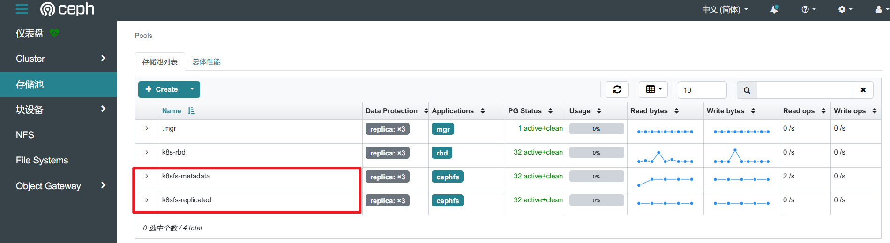

# CephFS共享文件存储
> 参考文档：[https://rook.github.io/docs/rook/latest-release/Storage-Configuration/Shared-Filesystem-CephFS/filesystem-storage/](https://rook.github.io/docs/rook/latest-release/Storage-Configuration/Shared-Filesystem-CephFS/filesystem-storage/)
>

# 创建资源
## 创建FS
创建fs资源清单

```yaml
# cat filesystem.yaml      
apiVersion: ceph.rook.io/v1
kind: CephFilesystem
metadata:
  name: k8sfs
  namespace: rook-ceph
spec:
  metadataPool:
    replicated: # 元数据3副本机制
      size: 3
  dataPools:
    - name: replicated
      replicated: # 数据池数据3副本机制
        size: 3 
  preserveFilesystemOnDelete: true # 当 CephFilesystem资源被删除时，会保留文件系统和其中的数据
  metadataServer:
    activeCount: 2 # 指定MDS实例为2，既双主模式
    activeStandby: true # 当MDS服务异常时，启用备用MDS                                                                                                                                                                                     
# kubectl apply -f filesystem.yaml 
cephfilesystem.ceph.rook.io/myfs created
```

确保mds已经启动

```bash
# kubectl get pod -n rook-ceph | grep mds    
rook-ceph-mds-k8sfs-a-55549bc8bc-tmcq8              2/2     Running     0          14s
rook-ceph-mds-k8sfs-b-9667f7645-j247j               2/2     Running     0          14s
rook-ceph-mds-k8sfs-c-769b8d5b59-h8qhz              2/2     Running     0          12s
rook-ceph-mds-k8sfs-d-56499d6469-tnxk5              2/2     Running     0          11s
```

查看ceph状态，确保有两个mds处于活动状态。

```bash
bash-5.1$ ceph -s
  cluster:
    id:     b9d61b9d-510d-4605-ba08-eb7774b21cb2
    health: HEALTH_OK
 
  services:
    mon: 3 daemons, quorum a,b,c (age 34m)
    mgr: a(active, since 34m), standbys: b
    mds: 2/2 daemons up, 2 hot standby
    osd: 3 osds: 3 up (since 34m), 3 in (since 34m)
 
  data:
    volumes: 1/1 healthy
    pools:   4 pools, 81 pgs
    objects: 50 objects, 458 KiB
    usage:   82 MiB used, 300 GiB / 300 GiB avail
    pgs:     81 active+clean
```

查看fs信息



## 创建storageclass
```yaml
# cat storageclass.yaml                                                 
apiVersion: storage.k8s.io/v1
kind: StorageClass
metadata:
  name: ceph-fs
provisioner: rook-ceph.cephfs.csi.ceph.com
parameters:
  clusterID: rook-ceph
  fsName: k8sfs # 上面创建的fs
  pool: k8sfs-replicated # 定义pool
  csi.storage.k8s.io/provisioner-secret-name: rook-csi-cephfs-provisioner
  csi.storage.k8s.io/provisioner-secret-namespace: rook-ceph
  csi.storage.k8s.io/controller-expand-secret-name: rook-csi-cephfs-provisioner
  csi.storage.k8s.io/controller-expand-secret-namespace: rook-ceph
  csi.storage.k8s.io/node-stage-secret-name: rook-csi-cephfs-node
  csi.storage.k8s.io/node-stage-secret-namespace: rook-ceph
reclaimPolicy: Delete # 删除策略
allowVolumeExpansion: true # 允许对存储卷进行扩容。                                                                                                                                                                                                     
# kubectl apply -f storageclass.yaml                                    
storageclass.storage.k8s.io/ceph-fs created
# kubectl get sc                         
NAME         PROVISIONER                                         RECLAIMPOLICY   VOLUMEBINDINGMODE   ALLOWVOLUMEEXPANSION   AGE
ceph-fs      rook-ceph.cephfs.csi.ceph.com                       Delete          Immediate           true                   20s
ceph-rbd     rook-ceph.rbd.csi.ceph.com                          Delete          Immediate           true                   10m
```

# k8s使用共享文件存储
## 创建pvc
```yaml
# cat pvc.yaml 
kind: PersistentVolumeClaim
apiVersion: v1
metadata:
  name: fs-pvc
spec:
  storageClassName: ceph-fs # StorageClass名称
  accessModes:
    - ReadWriteMany # 多个资源同时读写
  resources:
    requests:
      storage: 10Mi                                                                                                                                                                                                                        
# kubectl apply -f pvc.yaml 
persistentvolumeclaim/fs-pvc created
# kubectl get pvc -n default             
NAME     STATUS   VOLUME                                     CAPACITY   ACCESS MODES   STORAGECLASS   VOLUMEATTRIBUTESCLASS   AGE
fs-pvc   Bound    pvc-7c887627-7914-4742-b024-6cb98762d354   12Mi       RWX            ceph-fs        <unset>                 5s
# kubectl get pv            
NAME                                       CAPACITY   ACCESS MODES   RECLAIM POLICY   STATUS   CLAIM                 STORAGECLASS   VOLUMEATTRIBUTESCLASS   REASON   AGE
pvc-7c887627-7914-4742-b024-6cb98762d354   12Mi       RWX            Delete           Bound    default/fs-pvc        ceph-fs        <unset>                          10s
```

## 创建deployment
```yaml
# cat deployment.yaml 
apiVersion: apps/v1
kind: Deployment
metadata:
  name: redis
  labels:
    app: redis
spec:
  replicas: 3  # 创建3个副本，每个副本会挂载同一个PVC
  selector:
    matchLabels:
      app: redis
  template:
    metadata:
      labels:
        app: redis
    spec:
      containers:
        - name: redis
          image: harbor.local.com/library/redis:7
          resources:
            limits:
              memory: "128Mi"
              cpu: "500m"
          ports:
            - containerPort: 6379
          volumeMounts:
            - name: redis-data
              mountPath: "/data"
      volumes:
        - name: redis-data
          persistentVolumeClaim:
            claimName: fs-pvc
# kubectl apply -f deployment.yaml
deployment.apps/redis created
# kubectl get pod 
NAME                     READY   STATUS    RESTARTS   AGE
redis-6bf965f449-4t869   1/1     Running   0          12s
redis-6bf965f449-kp5xr   1/1     Running   0          12s
redis-6bf965f449-l5rh6   1/1     Running   0          12s
```

## 访问验证
在其中一个pod持久化目录下创建文件

```bash
# kubectl exec -it redis-6bf965f449-kp5xr -- bash
root@redis-6bf965f449-kp5xr:/data# cd /data/
root@redis-6bf965f449-kp5xr:/data# echo "hello" > /data/a.txt
root@redis-6bf965f449-kp5xr:/data# cat /data/a.txt 
hello
root@redis-6bf965f449-kp5xr:/data# exit
exit
```

另一个pod查看创建的文件

```yaml
# kubectl exec -it redis-6bf965f449-4t869 -- bash      
root@redis-6bf965f449-4t869:/data# cat /data/a.txt 
hello
```

# 集群外部使用 cephfs
如果 k8s 集群外部的机器也需要访问 cephfs，可以通过以下方法实现：

## 查看 ceph 集群和认证信息
1. 客户端连接 ceph 需要 mon 地址和 secret 信息。需要注意的是 mon 网络模式必须是 hots 模式

```bash
# kubectl exec -it -n rook-ceph rook-ceph-tools-699dcdd8bb-4ffhl -- bash
bash-5.1$ cd /etc/ceph
bash-5.1$ ls
ceph.conf  keyring
bash-5.1$ cat ceph.conf 
[global]
mon_host = 192.168.10.153:6789,192.168.10.152:6789,192.168.10.151:6789

[client.admin]
keyring = /etc/ceph/keyring
bash-5.1$ cat keyring 
[client.admin]
key = AQAEiGpnk3rBERAAPkDwSNN84BzhHKTvvPoG6g==
```

## 客户端挂载 cephfs
安装客户端

```bash
root@ceph-client:~# cat > /etc/apt/sources.list.d/ceph.list << EOF
deb https://mirrors.ustc.edu.cn/ceph/debian-reef/ focal main 
EOF
root@ceph-client:~# wget -q -O- 'https://mirrors.ustc.edu.cn/ceph/keys/release.asc' | apt-key add -
root@ceph-client:~# apt update && apt install ceph-common -y
root@ceph-client:~# ceph -v
ceph version 18.2.4 (e7ad5345525c7aa95470c26863873b581076945d) reef (stable)
```

创建认证文件

```bash
root@ceph-client:~# mkdir -p /etc/ceph
root@ceph-client:~# cat > /etc/ceph/ceph.client.admin.keyring << EOF
[client.admin]
key = AQAEiGpnk3rBERAAPkDwSNN84BzhHKTvvPoG6g==
EOF
```

创建集群配置文件

```bash
root@ceph-client:~# cat > /etc/ceph/ceph.conf << EOF
[global]
mon_host = 192.168.10.153:6789,192.168.10.152:6789,192.168.10.151:6789
[client.admin]
keyring = /etc/ceph/ceph.client.admin.keyring
EOF
```

挂载测试

```bash
root@ceph-client:/etc/ceph# mount -t ceph 192.168.10.153:6789,192.168.10.152:6789,192.168.10.151:6789:/ /data -o name=admin,secret=AQAEiGpnk3rBERAAPkDwSNN84BzhHKTvvPoG6g==
root@ceph-client:~# df -h
Filesystem                                                     Size  Used Avail Use% Mounted on
udev                                                           1.9G     0  1.9G   0% /dev
tmpfs                                                          389M  1.5M  388M   1% /run
/dev/mapper/ubuntu--vg-ubuntu--lv                               48G  8.2G   38G  18% /
tmpfs                                                          1.9G     0  1.9G   0% /dev/shm
tmpfs                                                          5.0M     0  5.0M   0% /run/lock
tmpfs                                                          1.9G     0  1.9G   0% /sys/fs/cgroup
/dev/sda2                                                      2.0G  211M  1.6G  12% /boot
/dev/loop0                                                      64M   64M     0 100% /snap/core20/1828
/dev/loop1                                                      50M   50M     0 100% /snap/snapd/18357
/dev/loop2                                                      92M   92M     0 100% /snap/lxd/29619
/dev/loop3                                                      45M   45M     0 100% /snap/snapd/23258
/dev/loop4                                                      92M   92M     0 100% /snap/lxd/24061
/dev/loop5                                                      64M   64M     0 100% /snap/core20/2434
tmpfs                                                          389M     0  389M   0% /run/user/0
192.168.10.153:6789,192.168.10.152:6789,192.168.10.151:6789:/   95G     0   95G   0% /data
```

