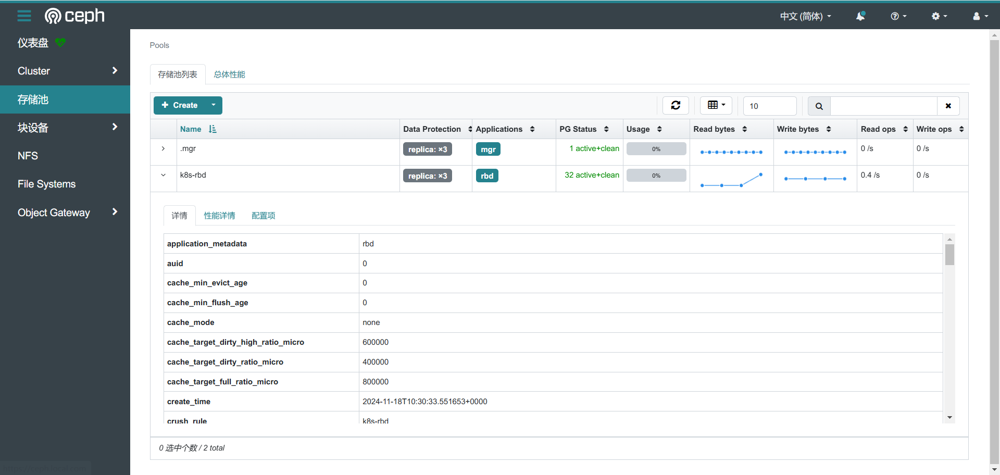

# RBD块存储服务

> 分类: Ceph > Rook
> 更新时间: 2026-01-10T23:35:19.259112+08:00

---

> 参考文档：[https://rook.github.io/docs/rook/latest-release/Storage-Configuration/Block-Storage-RBD/block-storage/#provision-storage](https://rook.github.io/docs/rook/latest-release/Storage-Configuration/Block-Storage-RBD/block-storage/#provision-storage)
>

# 创建存储池和StorageClass
## 创建资源
```yaml
# cat > pool.yaml << EOF
apiVersion: ceph.rook.io/v1
kind: CephBlockPool
metadata:
  name: k8s-rbd
  namespace: rook-ceph
spec:
  failureDomain: host # 设置数据复制时副本分布到不同节点
  replicated: # 数据3副本
    size: 3
EOF

# cat > storageclass.yaml << EOF
apiVersion: storage.k8s.io/v1
kind: StorageClass
metadata:
   name: ceph-rbd
provisioner: rook-ceph.rbd.csi.ceph.com
parameters:
    clusterID: rook-ceph
    pool: k8s-rbd # 使用的存储池
    imageFormat: "2" # Ceph RBD 镜像的格式
    imageFeatures: layering # 启用 Ceph RBD 的分层功能，使得存储卷可以基于层次结构进行克隆和快照管理
    csi.storage.k8s.io/provisioner-secret-name: rook-csi-rbd-provisioner
    csi.storage.k8s.io/provisioner-secret-namespace: rook-ceph
    csi.storage.k8s.io/controller-expand-secret-name: rook-csi-rbd-provisioner
    csi.storage.k8s.io/controller-expand-secret-namespace: rook-ceph
    csi.storage.k8s.io/node-stage-secret-name: rook-csi-rbd-node
    csi.storage.k8s.io/node-stage-secret-namespace: rook-ceph
    csi.storage.k8s.io/fstype: ext4 # 格式化磁盘类型
reclaimPolicy: Delete # 当 PVC 被删除时，动态创建的 PV 也会被删除，清理对应的存储空间。
allowVolumeExpansion: true # 允许对存储卷进行扩容。
EOF
# kubectl apply -f .                                                                                                         
cephblockpool.ceph.rook.io/replicapool created
storageclass.storage.k8s.io/rook-ceph-block create
```

## 查看验证
查看storageclass信息

```bash
kubectl get sc              
NAME         PROVISIONER                                         RECLAIMPOLICY   VOLUMEBINDINGMODE   ALLOWVOLUMEEXPANSION   AGE
ceph-rbd     rook-ceph.rbd.csi.ceph.com                          Delete          Immediate           true                   6s
nfs-client   cluster.local/nfs-nfs-subdir-external-provisioner   Delete          Immediate           true                   20d
```

查看pools信息



# k8s使用块存储
## <font style="color:rgb(48, 49, 51);">创建pvc</font>
```yaml
root@k8s-1:~# cat > pvc.yaml << EOF
kind: PersistentVolumeClaim
apiVersion: v1
metadata:
  name: test-rbd
spec:
  storageClassName: ceph-rbd # StorageClass名称
  accessModes:
    - ReadWriteOnce
  resources:
    requests:
      storage: 10Mi
EOF
# kubectl apply -f pvc.yaml         
persistentvolumeclaim/test-rbd created
# kubectl get pvc -n default 
NAME       STATUS   VOLUME                                     CAPACITY   ACCESS MODES   STORAGECLASS   VOLUMEATTRIBUTESCLASS   AGE
test-rbd   Bound    pvc-42733264-2090-421f-af95-91f7db25759e   10Mi       RWO            ceph-rbd       <unset>                 6s
# kubectl get pv            
NAME                                       CAPACITY   ACCESS MODES   RECLAIM POLICY   STATUS   CLAIM                 STORAGECLASS   VOLUMEATTRIBUTESCLASS   REASON   AGE
pvc-42733264-2090-421f-af95-91f7db25759e   10Mi       RWO            Delete           Bound    default/test-rbd      ceph-rbd       <unset>                          9s
```

## <font style="color:rgb(48, 49, 51);">创建pod使用pvc</font>
```yaml
root@k8s-1:~# cat > pod.yaml << EOF 
apiVersion: v1
kind: Pod
metadata:
  name: redis
  labels:
    name: redis
spec:
  containers:
  - name: redis
    image: harbor.local.com/library/redis:7
    resources:
      limits:
        memory: "128Mi"
        cpu: "500m"
    ports:
      - containerPort: 6379
    volumeMounts:
      - name: redis-data
        mountPath: "/data"
  volumes:
    - name: redis-data
      persistentVolumeClaim:
        claimName: test-rbd
EOF
root@k8s-1:~# kubectl apply -f pod.yaml 
pod/redis created
root@k8s-1:~# kubectl get pod
NAME                                               READY   STATUS    RESTARTS   AGE
redis                                              1/1     Running   0          2m37s
```

## <font style="color:rgb(48, 49, 51);">验证</font>
<font style="color:rgb(48, 49, 51);">进入pod添加数据</font>

```bash
root@k8s-1:~# kubectl exec -it redis -- redis-cli
127.0.0.1:6379> set key hello
OK
127.0.0.1:6379> get key
"hello"
127.0.0.1:6379> exit
```

<font style="color:rgb(48, 49, 51);">重启pod，测试数据</font>

```bash
root@k8s-1:~# kubectl delete pod redis 
pod "redis" deleted
root@k8s-1:~# kubectl apply -f pod.yaml 
pod/redis created
root@k8s-1:~# kubectl exec -it redis -- redis-cli
127.0.0.1:6379> get key
"hello"
```


	

	

	

	


