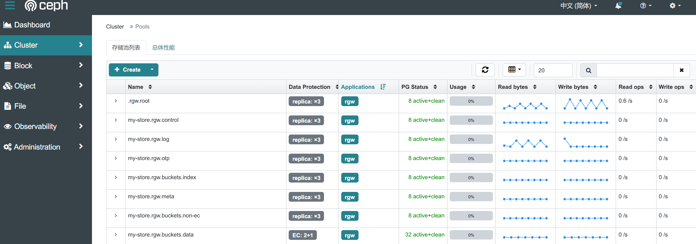
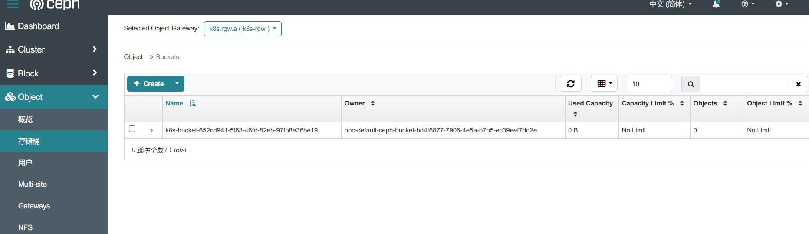

# RGW对象存储服务

> 分类: Ceph > Rook
> 更新时间: 2026-01-10T23:35:19.479458+08:00

---

> Ceph 对象存储可以简称为 RGW，Ceph RGW 是基于 librados，为应用提供 RESTful 类型的对象存储接口，其接口方式支持 S3（兼容 Amazon S3 RESTful API） 和 Swift（兼容 OpenStack Swift API） 两种类型。具体参考文档：[https://rook.github.io/docs/rook/latest-release/Storage-Configuration/Object-Storage-RGW/object-storage/](https://rook.github.io/docs/rook/latest-release/Storage-Configuration/Object-Storage-RGW/object-storage/)
>

# 创建资源
## 创建对象存储资源
```yaml
# cat object-store.yaml
apiVersion: ceph.rook.io/v1
kind: CephObjectStore
metadata:
  name: k8s-rgw
  namespace: rook-ceph
spec:
  metadataPool:
    failureDomain: host # 主副数据分布在不同机器
    replicated: # 副本数量
      size: 3
  dataPool:
    failureDomain: host
    erasureCoded:
      dataChunks: 2 # 数据块数量
      codingChunks: 1 # 编码快数量
  preservePoolsOnDelete: true # 当删除对象存储时，保留相关的池
  gateway:
    port: 8800 # 网关使用的端口
    instances: 3 # 网关实例的数量,创建三个rgw实现高可用
    placement:
      nodeAffinity: # 指定节点调度至ingress节点，配合vip实现高可用
        requiredDuringSchedulingIgnoredDuringExecution:
          nodeSelectorTerms:
          - matchExpressions:
            - key: ingress
              operator: In
              values:
              - "true"                                                                                                                                                                         
# kubectl apply -f object-store.yaml
cephobjectstore.ceph.rook.io/my-store created
# kubectl get pod -n rook-ceph -o wide | grep rgw
rook-ceph-rgw-k8s-rgw-a-754df49b65-h2x2l            2/2     Running           0           37s     192.168.10.153   master3   <none>           <none>
rook-ceph-rgw-k8s-rgw-a-754df49b65-krv4m            2/2     Running           0           37s     192.168.10.151   master1   <none>           <none>
rook-ceph-rgw-k8s-rgw-a-754df49b65-n2b8g            2/2     Running           0           37s     192.168.10.152   master2   <none>           <none>
```

创建完成后查看 pool 信息，会自动创建 rgw 相关的存储池。



## 创建存储桶
创建一个存储桶，客户端可以在其中读取和写入对象。可以通过定义存储类来创建存储桶，类似于块和文件存储使用的模式。首先，定义允许对象客户端创建存储桶的存储类。存储类定义对象存储系统、存储桶保留策略以及管理员所需的其他属性。

```yaml
# cat storageclass.yaml
apiVersion: storage.k8s.io/v1
kind: StorageClass
metadata:
   name: ceph-rgw
provisioner: rook-ceph.ceph.rook.io/bucket
reclaimPolicy: Delete # 回收策略
parameters:
  objectStoreName: k8s-rgw # 使用的CephObjectStore名称
  objectStoreNamespace: rook-ceph                                                                                                                                                                      
# kubectl apply -f storageclass.yaml   
storageclass.storage.k8s.io/rook-ceph-bucket created
# kubectl get sc                                 
NAME         PROVISIONER                                         RECLAIMPOLICY   VOLUMEBINDINGMODE   ALLOWVOLUMEEXPANSION   AGE
ceph-fs      rook-ceph.cephfs.csi.ceph.com                       Delete          Immediate           true                   51m
ceph-rbd     rook-ceph.rbd.csi.ceph.com                          Delete          Immediate           true                   22h
ceph-rgw     rook-ceph.ceph.rook.io/bucket                       Delete          Immediate           false                  7s
```

## 创建对象存储桶声明
基于刚够创建的存储类，对象客户端现在可以通过创建对象存储桶声明 （OBC） 来请求存储桶。创建 OBC 后，Rook 存储桶预置器将创建一个新存储桶。

```yaml
# cat object-bucket-claim.yaml 
apiVersion: objectbucket.io/v1alpha1
kind: ObjectBucketClaim
metadata:
  name: ceph-bucket
spec:
  generateBucketName: k8s-bucket # 创建的bucket名称
  storageClassName: ceph-rgw # 使用的StorageClass名称                                                                                                                                       
# kubectl apply -f object-bucket-claim.yaml 
objectbucketclaim.objectbucket.io/ceph-bucket created
```

查看存储桶信息



# k8s使用对象存储
## 获取客户端连接信息
```bash
# export AWS_HOST=$(kubectl -n default get cm ceph-bucket -o jsonpath='{.data.BUCKET_HOST}')
# export PORT=$(kubectl -n default get cm ceph-bucket -o jsonpath='{.data.BUCKET_PORT}')
# export BUCKET_NAME=$(kubectl -n default get cm ceph-bucket -o jsonpath='{.data.BUCKET_NAME}')
# export AWS_ACCESS_KEY_ID=$(kubectl -n default get secret ceph-bucket -o jsonpath='{.data.AWS_ACCESS_KEY_ID}' | base64 --decode)
# export AWS_SECRET_ACCESS_KEY=$(kubectl -n default get secret ceph-bucket -o jsonpath='{.data.AWS_SECRET_ACCESS_KEY}' | base64 --decode)

# echo $AWS_HOST                 
rook-ceph-rgw-k8s-rgw.rook-ceph.svc
# echo $PORT        
8800
# echo $BUCKET_NAME    
k8s-bucket-c3c72ce7-d025-4043-8766-6892492129ea
# echo $AWS_ACCESS_KEY_ID           
2UK7H1DBG2D2KG39N31S
# echo $AWS_SECRET_ACCESS_KEY                 
bL4LIpipYsZuMBuzBM6mfy9A6oo5dB7YwtTMhX9g
```

## 访问对象存储
使用mc客户端测试，mc用法参考文档：[https://www.cuiliangblog.cn/detail/section/121560332](https://www.cuiliangblog.cn/detail/section/121560332)

```bash
# cat pod.yaml                                                                                                                                                            
apiVersion: v1
kind: Pod
metadata:
  name: mc
spec:
  containers:
  - name: mc
    image: harbor.local.com/k8s/mc:latest
    command: ["sleep", "9999"]
# kubectl apply -f pod.yaml                                                                                                                                               
pod/mc created
# kubectl get pod                                                                                                                                                         
NAME   READY   STATUS    RESTARTS   AGE
mc     1/1     Running   0          4s
# kubectl exec -it mc -- /bin/sh  
# 添加对象存储服务                                                                                                                                      
sh-5.1# mc alias set rgw http://rook-ceph-rgw-k8s-rgw.rook-ceph.svc:8800 2UK7H1DBG2D2KG39N31S bL4LIpipYsZuMBuzBM6mfy9A6oo5dB7YwtTMhX9g
mc: Configuration written to `/root/.mc/config.json`. Please update your access credentials.
mc: Successfully created `/root/.mc/share`.
mc: Initialized share uploads `/root/.mc/share/uploads.json` file.
mc: Initialized share downloads `/root/.mc/share/downloads.json` file.
Added `rgw` successfully.
# 查看bucket
sh-5.1# mc ls rgw
[2024-12-26 06:40:05 UTC]     0B k8s-bucket-c3c72ce7-d025-4043-8766-6892492129ea/
# 上传文件测试
sh-5.1# echo "hello" > a.txt
sh-5.1# mc cp /a.txt rgw/k8s-bucket-c3c72ce7-d025-4043-8766-6892492129ea/
/a.txt:                               6 B / 6 B ┃▓▓▓▓▓▓▓▓▓▓▓▓▓▓▓▓▓▓▓▓▓▓▓▓▓▓▓▓▓▓▓▓▓▓▓▓▓▓▓▓▓▓▓▓▓▓▓▓▓▓▓▓▓▓▓▓▓▓▓▓▓▓▓▓▓▓▓▓▓▓▓▓▓▓▓▓▓▓▓▓▓▓▓▓▓▓▓▓▓▓▓▓▓▓▓▓▓▓▓▓▓▓▓▓▓▓▓▓▓▓▓▓▓▓▓▓▓▓▓▓▓▓▓▓▓▓▓▓▓▓▓▓▓▓▓▓▓▓▓▓▓▓▓▓▓▓▓▓▓┃ 155 B/s 0
# 查看bucket文件
sh-5.1# mc ls rgw/k8s-bucket-c3c72ce7-d025-4043-8766-6892492129ea/
[2024-10-31 14:50:35 UTC]     6B STANDARD a.txt
# 下载文件测试
sh-5.1# mc cp rgw/k8s-bucket-c3c72ce7-d025-4043-8766-6892492129ea/a.txt /tmp/
...7afc-40ac-971e-585cf8731b8f/a.txt: 6 B / 6 B ┃▓▓▓▓▓▓▓▓▓▓▓▓▓▓▓▓▓▓▓▓▓▓▓▓▓▓▓▓▓▓▓▓▓▓▓▓▓▓▓▓▓▓▓▓▓▓▓▓▓▓▓▓▓▓▓▓▓▓▓▓▓▓▓▓▓▓▓▓▓▓▓▓▓▓▓▓▓▓▓▓▓▓▓▓▓▓▓▓▓▓▓▓▓▓▓▓▓▓▓▓▓▓▓▓▓▓▓▓▓▓▓▓▓▓▓▓▓▓▓▓▓▓▓▓▓▓▓▓▓▓▓▓▓▓▓▓▓▓▓▓▓▓▓▓▓▓▓▓▓┃ 169 B/s 0ssh-5.1# cat /tmp/a.txt 
hello
```

# k8s集群外部访问
## 创建用户
创建一个用户，用于访问my-store资源

```yaml
# cat object-user.yaml     
apiVersion: ceph.rook.io/v1
kind: CephObjectStoreUser
metadata:
  name: my-user
  namespace: rook-ceph
spec:
  store: k8s-rgw # 访问的CephObjectStore资源
  displayName: "my display name" 
# kubectl apply -f object-user.yaml           
cephobjectstoreuser.ceph.rook.io/my-user created
```

获取ak sk

```yaml
# kubectl -n rook-ceph get secret rook-ceph-object-user-k8s-rgw-my-user -o jsonpath='{.data.AccessKey}' | base64 --decode
8I3KV9FP8X0Y21K2D9HN                                                                                                    
# kubectl -n rook-ceph get secret rook-ceph-object-user-k8s-rgw-my-user -o jsonpath='{.data.SecretKey}' | base64 --decode
ABEEaeDxrfDj8M8aba0bDdGRH4ynnIBwYTySNC11
```

## 访问验证
```bash
mc alias set ceph http://192.168.10.150:8800 8I3KV9FP8X0Y21K2D9HN ABEEaeDxrfDj8M8aba0bDdGRH4ynnIBwYTySNC11
mc: Configuration written to `/root/.mc/config.json`. Please update your access credentials.
mc: Successfully created `/root/.mc/share`.
mc: Initialized share uploads `/root/.mc/share/uploads.json` file.
mc: Initialized share downloads `/root/.mc/share/downloads.json` file.
Added `ceph` successfully.
# 查看bucket
sh-5.1# mc ls ceph
[2024-10-31 14:32:15 UTC]     0B k8s-bucket-c3c72ce7-d025-4043-8766-6892492129ea/
```

