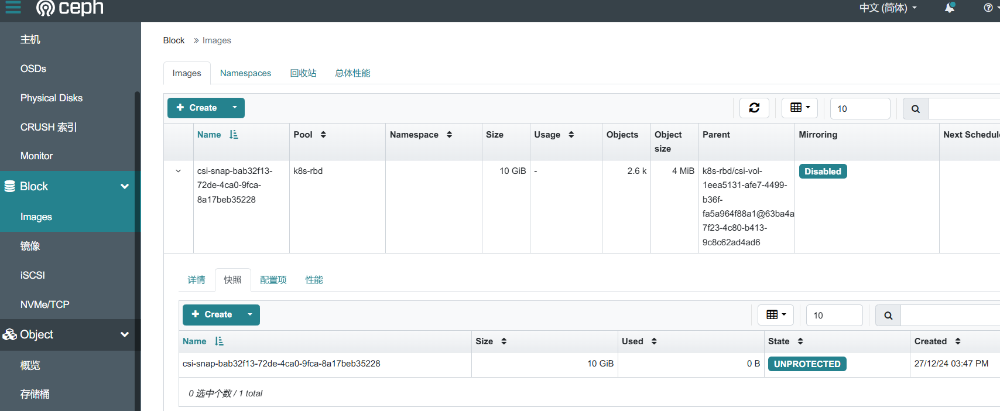

# 卷快照与克隆
# 安装控制器和CRD  
 ceph 容器中并没有直接使⽤RBD块集成⽽是通过PVC实现和底层块存储的调⽤，需要安装⼀个snapshot的控制器来实现这个功 能，snapshot控制器是⼀个第三⽅的CRD，其通过CRDs的⽅式和kubernetes集成，能够完成PVC快照到底层RBD块的控制逻辑。

## 安装 CRD
控制器仓库地址：[https://github.com/kubernetes-csi/external-snapshotter](https://github.com/kubernetes-csi/external-snapshotter)

```bash
# git clone https://github.com/kubernetes-csi/external-snapshotter.git
# cd external-snapshotter/client/config/crd 
# ls
groupsnapshot.storage.k8s.io_volumegroupsnapshotclasses.yaml   kustomization.yaml                                   snapshot.storage.k8s.io_volumesnapshots.yaml
groupsnapshot.storage.k8s.io_volumegroupsnapshotcontents.yaml  snapshot.storage.k8s.io_volumesnapshotclasses.yaml
groupsnapshot.storage.k8s.io_volumegroupsnapshots.yaml         snapshot.storage.k8s.io_volumesnapshotcontents.yaml
# kubectl apply -k .           
customresourcedefinition.apiextensions.k8s.io/volumegroupsnapshotclasses.groupsnapshot.storage.k8s.io created
customresourcedefinition.apiextensions.k8s.io/volumegroupsnapshotcontents.groupsnapshot.storage.k8s.io created
customresourcedefinition.apiextensions.k8s.io/volumegroupsnapshots.groupsnapshot.storage.k8s.io created
customresourcedefinition.apiextensions.k8s.io/volumesnapshotclasses.snapshot.storage.k8s.io created
customresourcedefinition.apiextensions.k8s.io/volumesnapshotcontents.snapshot.storage.k8s.io created
customresourcedefinition.apiextensions.k8s.io/volumesnapshots.snapshot.storage.k8s.io created
# kubectl get crd | grep snapshot         
volumegroupsnapshotclasses.groupsnapshot.storage.k8s.io    2024-12-27T07:05:52Z
volumegroupsnapshotcontents.groupsnapshot.storage.k8s.io   2024-12-27T07:05:52Z
volumegroupsnapshots.groupsnapshot.storage.k8s.io          2024-12-27T07:05:52Z
volumesnapshotclasses.snapshot.storage.k8s.io              2024-12-27T07:05:52Z
volumesnapshotcontents.snapshot.storage.k8s.io             2024-12-27T07:05:52Z
volumesnapshots.snapshot.storage.k8s.io                    2024-12-27T07:05:52Z
```

## 安装控制器
```bash
# cd /opt/external-snapshotter/deploy/kubernetes/snapshot-controller 
# ls
kustomization.yaml  rbac-snapshot-controller.yaml  setup-snapshot-controller.yaml
# kubectl apply -k .             
serviceaccount/snapshot-controller created
clusterrole.rbac.authorization.k8s.io/snapshot-controller-runner created
clusterrolebinding.rbac.authorization.k8s.io/snapshot-controller-role created
role.rbac.authorization.k8s.io/snapshot-controller-leaderelection created
rolebinding.rbac.authorization.k8s.io/snapshot-controller-leaderelection created
deployment.apps/snapshot-controller created
# kubectl get pod -n kube-system | grep snapshot                        
snapshot-controller-6c9fcdd545-fc79v   1/1     Running   0              4s
snapshot-controller-6c9fcdd545-vw59j   1/1     Running   0              3s
```

# RBD 快照
## 创建RBD快照类
为了能够使⽤快照的功能，⾸先需要定义⼀个VolumeSnapshotClass，类似于StorageClass，VolumeSnapshotClass是专⻔针对快照功能⽽提供的存储类，是kubernetes中定义 的⼀个特性，参考[https://kubernetes.io/docs/concepts/storage/volume-snapshot-classes/](https://kubernetes.io/docs/concepts/storage/volume-snapshot-classes/)

资源清单如下：

```yaml
apiVersion: snapshot.storage.k8s.io/v1
kind: VolumeSnapshotClass
metadata:
 name: csi-rbdplugin-snapclass
driver: rook-ceph.rbd.csi.ceph.com
parameters:
 clusterID: rook-ceph
 csi.storage.k8s.io/snapshotter-secret-name: rook-csi-rbd-provisioner
 csi.storage.k8s.io/snapshotter-secret-namespace: rook-ceph
deletionPolicy: Delete
```

创建资源清单

```bash
# kubectl apply -f snapclass-rbd.yaml               
volumesnapshotclass.snapshot.storage.k8s.io/csi-rbdplugin-snapclass created
# kubectl get volumesnapshotclasses.snapshot.storage.k8s.io 
NAME                      DRIVER                       DELETIONPOLICY   AGE
csi-rbdplugin-snapclass   rook-ceph.rbd.csi.ceph.com   Delete           13s
```

## 创建测试数据
```bash
# kubectl exec -it redis -- bash
root@redis:/data# df -h
Filesystem           Size  Used Avail Use% Mounted on
overlay               47G   12G   36G  25% /
tmpfs                 64M     0   64M   0% /dev
tmpfs                7.7G     0  7.7G   0% /sys/fs/cgroup
/dev/rbd0            9.8G   24K  9.8G   1% /data
/dev/mapper/rl-root   47G   12G   36G  25% /etc/hosts
shm                   64M     0   64M   0% /dev/shm
tmpfs                128M   12K  128M   1% /run/secrets/kubernetes.io/serviceaccount
tmpfs                7.7G     0  7.7G   0% /proc/acpi
tmpfs                7.7G     0  7.7G   0% /proc/scsi
tmpfs                7.7G     0  7.7G   0% /sys/firmware
root@redis:/data# echo "hello rbd" > test.txt
root@redis:/data# ls
lost+found  temp-1.rdb  test.txt
```

## 创建快照
```bash
# cat snapshot-rbd.yaml 
apiVersion: snapshot.storage.k8s.io/v1
kind: VolumeSnapshot
metadata:
  name: rbd-pvc-snapshot
spec:
  volumeSnapshotClassName: csi-rbdplugin-snapclass # 快照类名称
  source:
    persistentVolumeClaimName: test-rbd # pvc名称       
# kubectl apply -f snapshot-rbd.yaml   
volumesnapshot.snapshot.storage.k8s.io/rbd-pvc-snapshot created
```

## 查看快照
查看快照资源， volumesnapshot的READYTOUSE已经处于true状态，即当前快照已经完成创建  

```bash
# kubectl get volumesnapshot                               
NAME               READYTOUSE   SOURCEPVC   SOURCESNAPSHOTCONTENT   RESTORESIZE   SNAPSHOTCLASS             SNAPSHOTCONTENT                                    CREATIONTIME   AGE
rbd-pvc-snapshot   true         test-rbd                            10Gi          csi-rbdplugin-snapclass   snapcontent-91c0120d-a9bd-4f25-8905-0a85b2a04d11   15s            16s
```

登录 ceph 控制台查看快照信息。



## 快照恢复
当容器中RBD块的数据丢失或者误删除之后，快照的功能就⾮常重要了，我们可以基于快照做数据的恢复,通过PVC调⽤volumesnapshot

1. 模拟误删操作导致数据丢失。

```bash
# kubectl delete -f pod.yaml -f pvc.yaml
pod "redis" deleted
persistentvolumeclaim "test-rbd" deleted
# 查看pv数据，已经没有相关资源
# kubectl get pv
```

2. 使用快照数据创建资源。

```yaml
# cat snapshot-restore.yaml
apiVersion: v1
kind: PersistentVolumeClaim
metadata:
  name: rbd-pvc-restore
spec:
  storageClassName: ceph-rbd # sc名称
  dataSource:
    name: rbd-pvc-snapshot # 快照名称
    kind: VolumeSnapshot
    apiGroup: snapshot.storage.k8s.io
  accessModes:
    - ReadWriteOnce
  resources:
    requests:
      storage: 10Gi # 恢复的pvc容量要大于或者等于原快照空间
---
apiVersion: v1
kind: Pod
metadata:
  name: redis
  labels:
    name: redis
spec:
  containers:
  - name: redis
    image: harbor.local.com/library/redis:7
    resources:
      limits:
        memory: "128Mi"
        cpu: "500m"
    ports:
      - containerPort: 6379
    volumeMounts:
      - name: redis-data
        mountPath: "/data"
  volumes:
    - name: redis-data
      persistentVolumeClaim:
        claimName: rbd-pvc-restore # 使用恢复的pvc
# kubectl apply -f snapshot-restore.yaml 
persistentvolumeclaim/rbd-pvc-restore created
pod/redis created
```

3. 查看验证

```bash
# kubectl get pod 
NAME                     READY   STATUS    RESTARTS      AGE
redis                    1/1     Running   0             13s
# kubectl get pvc 
NAME              STATUS   VOLUME                                     CAPACITY   ACCESS MODES   STORAGECLASS   VOLUMEATTRIBUTESCLASS   AGE
rbd-pvc-restore   Bound    pvc-df010a8d-9e8c-415a-8604-23056d551825   10Gi       RWO            ceph-rbd       <unset>                 20s
# kubectl exec -it redis -- bash
root@redis:/data# ls 
lost+found  test.txt
root@redis:/data# cat test.txt 
hello rbd
```

# CephFS 快照
## 创建CephFS快照类
资源清单如下：

```yaml
apiVersion: snapshot.storage.k8s.io/v1
kind: VolumeSnapshotClass
metadata:
 name: csi-cephfsplugin-snapclass
driver: rook-ceph.cephfs.csi.ceph.com
parameters:
 clusterID: rook-ceph
 csi.storage.k8s.io/snapshotter-secret-name: rook-csi-cephfs-provisioner
 csi.storage.k8s.io/snapshotter-secret-namespace: rook-ceph
deletionPolicy: Delete
```

创建资源清单

```bash
# kubectl apply -f snapshotclass-cephfs.yaml 
volumesnapshotclass.snapshot.storage.k8s.io/csi-cephfsplugin-snapclass created
# kubectl get volumesnapshotclasses                        
NAME                         DRIVER                          DELETIONPOLICY   AGE
csi-cephfsplugin-snapclass   rook-ceph.cephfs.csi.ceph.com   Delete           18s
csi-rbdplugin-snapclass      rook-ceph.rbd.csi.ceph.com      Delete           9m36s
```

## 创建测试数据
```bash
# kubectl exec -it redis-79fcd4cc9d-8smw7 -- bash
root@redis-79fcd4cc9d-8smw7:/data# df -h
Filesystem                                                                                                                                               Size  Used Avail Use% Mounted on
overlay                                                                                                                                                   48G   17G   29G  38% /
tmpfs                                                                                                                                                     64M     0   64M   0% /dev
tmpfs                                                                                                                                                    7.8G     0  7.8G   0% /sys/fs/cgroup
192.168.10.13:6789,192.168.10.11:6789,192.168.10.12:6789:/volumes/csi/csi-vol-7608b50a-4248-4fdf-aa4b-b983746b9715/7dbf940c-69d6-4d18-b105-559067a351d4   12M     0   12M   0% /data
/dev/mapper/ubuntu--vg-ubuntu--lv                                                                                                                         48G   17G   29G  38% /etc/hosts
shm                                                                                                                                                       64M     0   64M   0% /dev/shm
tmpfs                                                                                                                                                    128M   12K  128M   1% /run/secrets/kubernetes.io/serviceaccount
tmpfs                                                                                                                                                    7.8G     0  7.8G   0% /proc/acpi
tmpfs                                                                                                                                                    7.8G     0  7.8G   0% /proc/scsi
tmpfs                                                                                                                                                    7.8G     0  7.8G   0% /sys/firmware
root@redis-79fcd4cc9d-8smw7:/data# echo "hello cephfs" > test.txt
root@redis-79fcd4cc9d-8smw7:/data# ls
test.txt
```

## 创建快照
```bash
# cat snapshot-cephfs.yaml 
apiVersion: snapshot.storage.k8s.io/v1
kind: VolumeSnapshot
metadata:
  name: cephfs-pvc-snapshot
spec:
  volumeSnapshotClassName: csi-cephfsplugin-snapclass
  source:
    persistentVolumeClaimName: fs-pvc # pvc名称
# kubectl apply -f snapshot-cephfs.yaml       
volumesnapshot.snapshot.storage.k8s.io/cephfs-pvc-snapshot created
```

## 查看快照
```bash
# kubectl get volumesnapshot
NAME                  READYTOUSE   SOURCEPVC   SOURCESNAPSHOTCONTENT   RESTORESIZE   SNAPSHOTCLASS                SNAPSHOTCONTENT                                    CREATIONTIME   AGE
cephfs-pvc-snapshot   true         fs-pvc                              12Mi          csi-cephfsplugin-snapclass   snapcontent-82eec1e1-a03a-4f6c-95fb-c13ade788ab5   46s            46s
```

登录 ceph 控制台查看快照信息。


## 快照恢复
当容器中RBD块的数据丢失或者误删除之后，快照的功能就⾮常重要了，我们可以基于快照做数据的恢复,通过PVC调⽤volumesnapshot

1. 模拟误删操作导致数据丢失。

```bash
# kubectl delete -f deployment.yaml -f pvc.yaml 
deployment.apps "redis" deleted
persistentvolumeclaim "fs-pvc" deleted
# 查看pv数据，已经没有相关资源
# kubectl get pv
```

2. 使用快照数据创建资源。

```yaml
# cat snapshot-restore.yaml 
apiVersion: v1
kind: PersistentVolumeClaim
metadata:
  name: cephfs-pvc-restore
  labels:
    app: redis
spec:
  storageClassName: ceph-fs # sc名称
  dataSource:
    name: cephfs-pvc-snapshot # 快照名称
    kind: VolumeSnapshot
    apiGroup: snapshot.storage.k8s.io
  accessModes:
    - ReadWriteMany
  resources:
    requests:
      storage: 20Mi
---
apiVersion: apps/v1
kind: Deployment
metadata:
  name: redis-restore
  labels:
    app: redis
spec:
  replicas: 3  # 创建3个副本，每个副本会挂载同一个PVC
  selector:
    matchLabels:
      app: redis
  template:
    metadata:
      labels:
        app: redis
    spec:
      containers:
        - name: redis
          image: harbor.local.com/library/redis:7
          resources:
            limits:
              memory: "128Mi"
              cpu: "500m"
          ports:
            - containerPort: 6379
          volumeMounts:
            - name: redis-data
              mountPath: "/data"
      volumes:
      - name: redis-data
        persistentVolumeClaim:
          claimName: cephfs-pvc-restore # 使用恢复的pvc
# kubectl apply -f snapshot-restore.yaml 
persistentvolumeclaim/cephfs-pvc-restore created
deployment.apps/redis-restore created
```

3. 查看验证

```bash
# kubectl get pod                                 
NAME                            READY   STATUS      RESTARTS   AGE
redis-restore-5fb9944d9-cprsj   1/1     Running     0          6s
redis-restore-5fb9944d9-qzqxb   1/1     Running     0          6s
redis-restore-5fb9944d9-zpnhs   1/1     Running     0          6s
# kubectl get pvc
NAME                 STATUS   VOLUME                                     CAPACITY   ACCESS MODES   STORAGECLASS   VOLUMEATTRIBUTESCLASS   AGE
cephfs-pvc-restore   Bound    pvc-409e52d2-1043-4e8a-916a-dcaf476db25f   20Mi       RWX            ceph-fs        <unset>                 33s
# kubectl exec -it redis-restore-5fb9944d9-cprsj -- bash
root@redis-restore-5fb9944d9-cprsj:/data# ls
test.txt
root@redis-restore-5fb9944d9-cprsj:/data# cat test.txt 
hello cephfs
```

# 卷克隆
容器⾥⾯也提供了卷快速克隆的功能，该功能是通过PVC另外⼀个PVC实现克隆，底层⾃动通过快照完成 对接，安装好snapshot controller默认即刻提供该功能，直接使⽤即可。 

## 创建资源(RBD)
```yaml
# cat snapshot-clone.yaml
apiVersion: v1
kind: PersistentVolumeClaim
metadata:
  name: rbd-pvc-clone
spec:
  storageClassName: ceph-rbd # sc名称
  dataSource:
    name: rbd-pvc-restore # 要克隆的pvc名称
    kind: PersistentVolumeClaim # 来自pvc
  accessModes:
    - ReadWriteOnce
  resources:
    requests:
      storage: 10Gi
---
apiVersion: v1
kind: Pod
metadata:
  name: redis-clone
  labels:
    name: redis-clone
spec:
  containers:
  - name: redis
    image: harbor.local.com/library/redis:7
    resources:
      limits:
        memory: "128Mi"
        cpu: "500m"
    ports:
      - containerPort: 6379
    volumeMounts:
      - name: redis-data
        mountPath: "/data"
  volumes:
    - name: redis-data
      persistentVolumeClaim:
        claimName: rbd-pvc-clone # 使用克隆的pvc
# kubectl apply -f snapshot-clone.yaml 
persistentvolumeclaim/rbd-pvc-clone created
pod/redis-clone created
```

## 查看验证
```bash
# kubectl get pvc                     
NAME              STATUS   VOLUME                                     CAPACITY   ACCESS MODES   STORAGECLASS   VOLUMEATTRIBUTESCLASS   AGE
rbd-pvc-clone     Bound    pvc-efe753b7-f9c1-4667-8e5d-a943d557f488   10Gi       RWO            ceph-rbd       <unset>                 3m6s
rbd-pvc-restore   Bound    pvc-b3c9c101-880d-4120-902b-2f3c4853e023   10Gi       RWO            ceph-rbd       <unset>                 8m29s
# kubectl exec -it redis-clone -- bash
root@redis-clone:/data# ls
lost+found test.txt
root@redis:/data# cat test.txt 
hello rbd
```

## 创建资源(CephFS)
同样的 cephfs 也支持克隆，yaml 文件如下

```yaml
apiVersion: v1
kind: PersistentVolumeClaim
metadata:
  name: fs-clone
spec:
  storageClassName: ceph-fs # sc名称
  dataSource:
    name: pvc-restore # 要克隆的pvc名称
    kind: PersistentVolumeClaim # 来自pvc
  accessModes:
    - ReadWriteMany
  resources:
    requests:
      storage: 10Gi
```

