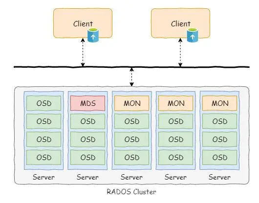
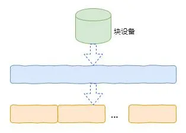
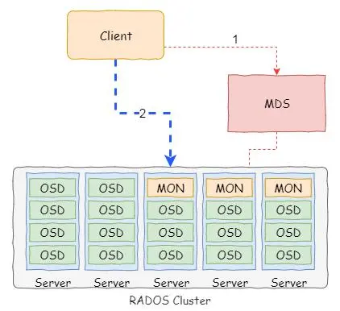
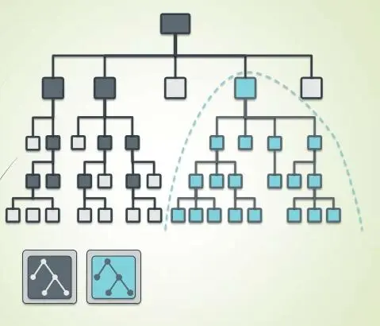
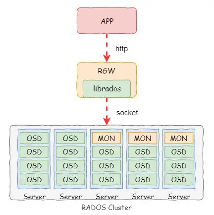
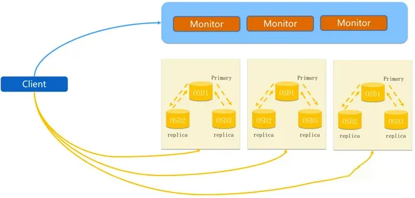
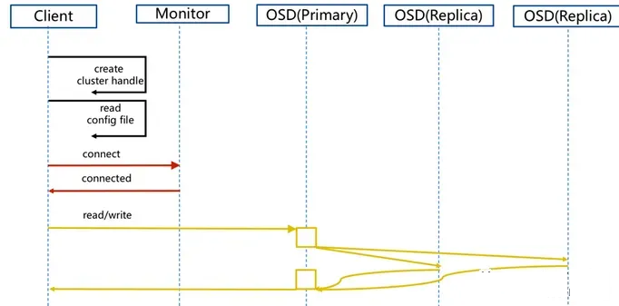
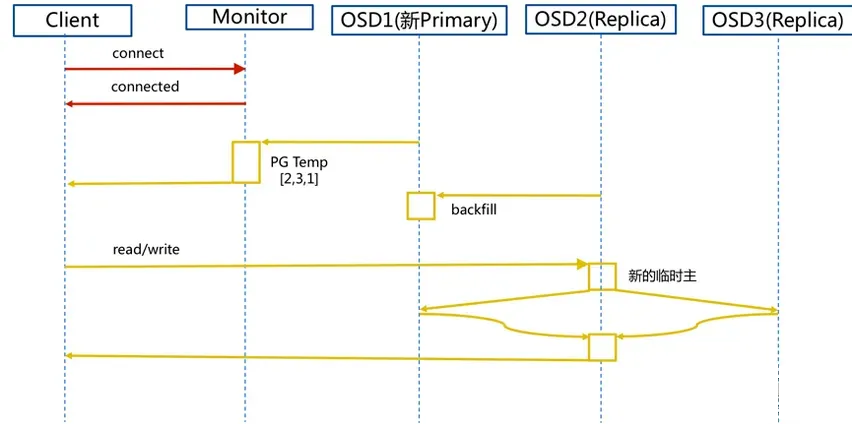
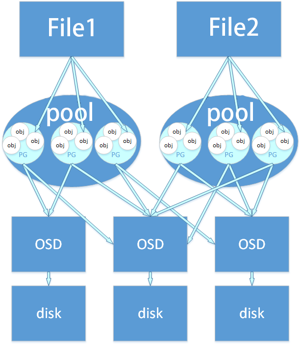

# 存储原理

> 分类: Ceph > 基础知识
> 更新时间: 2026-01-10T23:35:14.092858+08:00

---

# Ceph 存储类型
## 块存储
首先介绍一下底层的RADOS集群，集群从组建方面分为OSD、MON和客户端三类组件。其中OSD组件负责管理一个磁盘；MON组件形成一个集群，负责管理元数据；客户端则实现对集群的访问。对于RADOS来说，其客户端通常是一个动态库，也就是librados库。上层服务（块、对象和文件）通常依赖该动态库实现。

Ceph的块存储是基于对象存储来实现的，实现原理也非常简单。从我们普通用户的角度来看，块设备其实就是一个线性的存储空间，可以理解为一个大数组。由于是线性空间，其实这个块设备在集群层面完全可以以对象的方式存储。最简单的方式就是一个块设备对应一个对象。

但是如果一个块设备对应一个对象，那么会出现数据过于集中的情况。因此，在Ceph中将块设备切割为4MB大小的对象，并且将块数据分散在这些对象中。Ceph的处理方式也非常简单，对象名称通过块设备名称和LBA组合的方式生成，这样就可以保证对象名称的唯一性。而当用户访问块设备是，根据访问的偏移就可以定位到具体的对象。

当然，上述是简单介绍了一下基本原理。其实Ceph的块设备有很多参数，比如分割对象大小，条带化等等。可以根据业务模式调整这些参数，从而提升块存储的性能。

## 文件系统
文件系统整体架构并没有太大的差异，其底层依赖的还是RADOS集群的对象存储。文件系统最大的特点在于对维护文件系统的目录结构，因此在Ceph中通过一个元数据集群（MDS）实现对文件元数据的管理。

为了比较清楚的理解文件系统的架构，我们给出如图所示的架构图。这里重点强调MDS集群的作用。当客户端访问文件系统的时候，需要先与MDS交互。以写数据为例，首先需要与MDS交互确认文件存在，并且获得访问权。

当然，如果文件不存在，则需要在MDS创建文件。同时在MDS上还维护这文件的元数据，包括文件创建时间、大小和扩展属性等等内容。

Ceph设计的时候是支持MDS多活的，并且考虑到由于热点的问题，可以实现多个MDS管理的元数据的动态迁移，这个概念称为动态子树。

所谓动态子树就是将文件系统的目录分解为几个子目录，然后根据热点情况进行动态调整。动态调整就是在多个MDS之间进行迁移。

为了方便用户使用，Cephfs在客户端有多种实现形态。最常见的是在Linux内核中实现了一个客户端文件系统。该文件系统类似NFS的客户端文件系统，其位于VFS之下。普通用户可以通过挂载（mount）的方式实现对Ceph文件系统的挂载，然后就像访问本地文件系统一样访问Ceph文件系统。

除此之外，用户还可以通过动态库或者fuse实现的文件系统对Ceph文件系统进行访问。

## 对象存储
虽然RADOS本身提供的是对象存储服务，但是其提供的只是基础的对象访问能力，而且只能通过Ceph客户端访问。为了提供类似AWS的S3的特性和Swift对象存储的特性，Ceph实现了一个对象存储网关。

对象存储网关（Rados Gateway，简称RGW）实际上实现的是一个接口协议的转换。通过RGW我们在客户端可以通过通用的http协议访问对象存储，而且在存储网关中实现了很多特性。比如对象的属性、ACL和多租户等等。

# 数据流程
## Ceph存储流程

Ceph是一个分布式存储系统，它的存储流程如下：

1. 对象写入：客户端将数据写入一个对象，并将对象的元数据存储到RADOS集群中。客户端可以直接连接到集群，或者通过Ceph块设备、Ceph文件系统或者其他应用程序接口访问。
2. 数据分配：RADOS集群接收到写请求后，会将对象分配给适当的OSD（对象存储设备）。OSD是Ceph中的存储单元，每个OSD可以管理多个对象。如果对象已经存在，则OSD将更新现有对象的数据。
3. 数据复制：Ceph使用复制来确保数据的可靠性和可用性。每个对象都会被复制到多个OSD上，这些OSD分布在不同的物理服务器上。默认情况下，Ceph将每个对象复制三次，但是可以通过修改配置来更改复制级别。
4. 数据恢复：如果一个OSD宕机或发生故障，Ceph会自动将该OSD上的对象复制到其他OSD上，以确保数据的可靠性和可用性。
5. 数据读取：当客户端请求对象时，RADOS集群会将对象的元数据返回给客户端，并确定对象的位置。然后，RADOS集群会将对象的副本发送到客户端，客户端可以从中读取数据。
6. 数据删除：当对象被删除时，RADOS集群会将对象从所有OSD上删除，并清除对象的元数据。

总的来说，Ceph的存储流程包括对象写入、数据分配、数据复制、数据恢复、数据读取和数据删除。这些步骤确保了数据的可靠性和可用性，并为客户端提供了高性能的访问方式。

除了上述的Ceph存储流程，还有一些其他的细节需要注意：

1. 数据分布：Ceph使用CRUSH算法来决定对象应该存储在哪些OSD上。CRUSH算法考虑了不同服务器的负载和故障域，确保数据分布均衡和可靠性。
2. 网络通信：Ceph集群中的节点之间使用RADOS协议进行通信，这是一种基于TCP的协议。数据传输也可以通过RDMA（Remote Direct Memory Access）进行加速。
3. 数据压缩：Ceph支持数据压缩，可以通过配置来启用。当对象写入时，Ceph会对数据进行压缩，然后再将其存储到OSD上。当对象读取时，Ceph会自动解压缩数据。
4. 快照：Ceph支持快照功能，可以对对象或整个存储池进行快照。快照可以保留对象的历史版本，并且可以用于数据恢复或测试。

总之，Ceph的存储流程涉及多个步骤和算法，这些步骤和算法共同确保了数据的可靠性、可用性和高性能访问。Ceph的灵活性和可扩展性使得它成为了一个流行的分布式存储系统，并被广泛用于云计算、大数据等领域。

## Ceph IO流程及数据分布

io流程

io流程

步骤：

1. client 创建cluster handler。
2. client 读取配置文件。
3. client 连接上monitor，获取集群map信息。
4. client 读写io 根据crushmap 算法请求对应的主osd数据节点。
5. 主osd数据节点同时写入另外两个副本节点数据。
6. 等待主节点以及另外两个副本节点写完数据状态。
7. 主节点及副本节点写入状态都成功后，返回给client，io写入完成。

## Ceph 新主IO流程图
如果新加入的OSD1取代了原有的 OSD4成为 Primary OSD, 由于 OSD1 上未创建 PG , 不存在数据，那么 PG 上的 I/O 无法进行，怎样工作的呢？

io流程

步骤：

（1）client连接monitor获取集群map信息。

（2）同时新主osd1由于没有pg数据会主动上报monitor告知让osd2临时接替为主。

（3）临时主osd2会把数据全量同步给新主osd1。

（4）client IO读写直接连接临时主osd2进行读写。

（5）osd2收到读写io，同时写入另外两副本节点。

（6）等待osd2以及另外两副本写入成功。

（7）osd2三份数据都写入成功返回给client, 此时client io读写完毕。

（8）如果osd1数据同步完毕，临时主osd2会交出主角色。

（9）osd1成为主节点，osd2变成副本。

# Ceph 数据存储过程

+ File: 就是我们想要存储和访问的文件，这个是面向我们用户的，是我们直观操作的对象。
+ Object：object就是Ceph底层RADOS所看到的对象，也就是在Ceph中存储的基本单位。object的大小由RADOS限定（通常为2m或者4m）。
+ PG (Placement Group): PG是一个逻辑的概念，它的用途是对object的存储进行组织和位置的映射，通过它可以更好的分配数据和定位数据。
+ OSD (Object Storage Device): 它就是真正负责数据存取的服务。

## 文件到对象的映射
首先，将file切分成多个object，每个object的大小由RADOS限定（通常为2m或者4m）。每个object都有唯一的id即oid，oid由ino和ono产生的

+ ino：文件唯一id（比如filename+timestamp）
+ ono：切分后某个object的序号(比如0,1,2,3,4,5等)

## 对象到归置组的映射
对oid进行hash然后进行按位与计算得到某一个PG的id。mask为PG的数量减1。这样得到的pgid是随机的。

注：这与PG的数量和文件的数量有关系。在足够量级的程度上数据是均匀分布的。

## 归置组到OSD的映射
通过CRUSH算法可以通过pgid得到多个osd，简而言之就是根据集群的OSD状态和存储策略配置动态得到osdid，从而自动化的实现高可靠性和数据均匀分布。在Ceph中，数据到底是在哪个osd是通过CRUSH算法计算出来的

