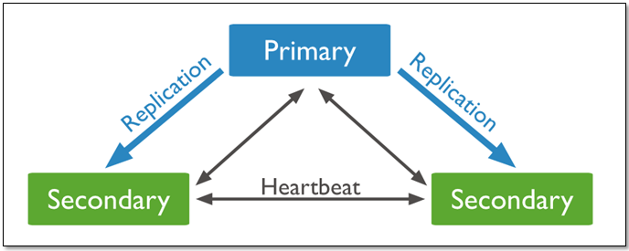
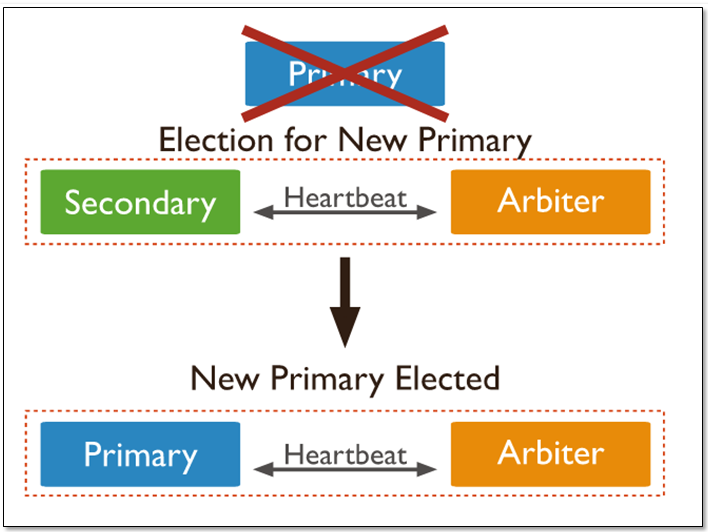
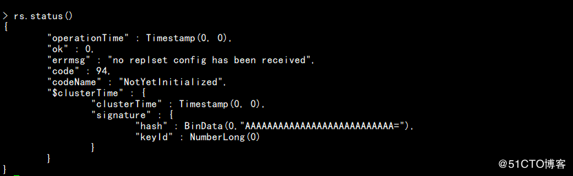
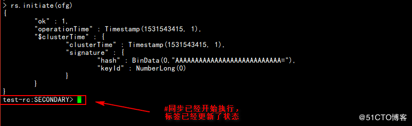
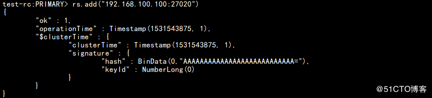
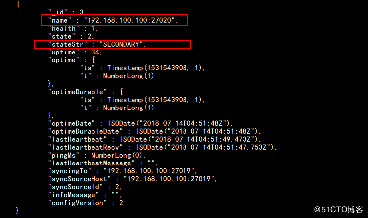
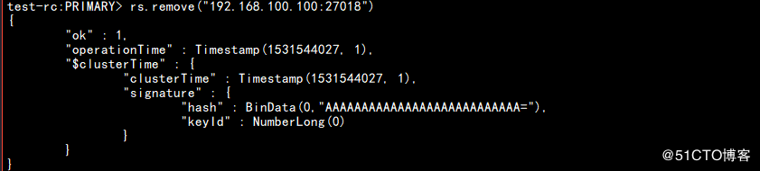
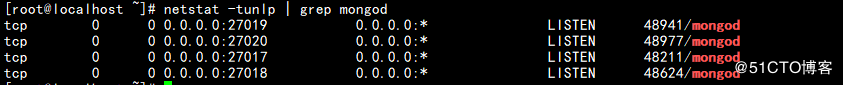

# MongoDB复制集

> 分类: Database > MongoDB
> 更新时间: 2026-01-10T23:34:24.102372+08:00

---

# 一、MongoDB 复制集
1. 概述

MongoDB复制是将数据同步到多个服务器的过程；

复制集提供了数据的冗余备份并提高了数据的可用性，通常可以保证数据的安全性；

复制集还允许您从硬件故障和服务中断中恢复数据。

1. 优点
+ 保障数据的安全性
+ 数据高可用性 (24*7)
+ 灾难恢复
+ 无需停机维护（如备份，重建索引，压缩）
+ 分布式读取数据
+ 副本集对应用层是透明的
2. 工作原理
+ mongodb的复制集至少需要两个节点。其中一个是主节点，负责处理客户端请求，其余的都是从节点，负责复制主节点上的数据。
+ mongodb各个节点常见的搭配方式为：一主一从、一主多从。
+ 主节点记录在其上的所有操作oplog，从节点定期轮询主节点获取这些操作，然后对自己的数据副本执行这些操作，从而保证从节点的数据与主节点一致。
3. 复制结构图
+ 具有三个存储数据的成员的复制集有：

一个主库，两个从库组成，主库宕机时，这两个从库都可以被选为主库。

当主库宕机后,两个从库都会进行竞选，其中一个变为主库，当原主库恢复后，作为从库加入当前的复制集群即可。

+ **当存在****arbiter****节点**

在三个成员的复制集中，有两个正常的主从，及一台arbiter节点：一个主库，一个从库，可以在选举中成为主库，一个aribiter节点，在选举中，只进行投票，不能成为主库

说明：由于arbiter节点没有复制数据，因此这个架构中仅提供一个完整的数据副本。arbiter节点只需要更少的资源，代价是更有限的冗余和容错。

当主库宕机时，将会选择从库成为主，主库修复后，将其加入到现有的复制集群中即可。

1. 特点：
+ N 个节点的集群
+ 任何节点可作为主节点
+ 所有写入操作都在主节点上
+ 自动故障转移
+ 自动恢复

# 二、部署MongoDB复制集
**在同一台服务器上创建MongoDB的多实例（4个实例）来做MongoDB主从的实验。**

**1.创建4个MongoDB的实例**

**#**创建各实例的数据目录  
mkdir -p /data/mongodb/mongodb{1,2,3,4}

**#**创建实例配置目录  
mkdir -p /data/conf/

**#**创建实例的日志目录  
mkdir -p /data/logs/

**#**创建各实例的日志文件  
touch  /data/logs/mongodb{1,2,3,4}.log

**#**赋予日志文件权限777  
chmod 777 /data/logs/*.log

**2.编辑mongodb1.conf配置文件，开启复制集功能并配置replSetName参数**

vim/data/mongodb/mongodb1.conf

**#**mongod.conf  
**#****for** documentation of all options, see:  
**#**[http://docs.mongodb.org/manual/reference/configuration-options/](http://docs.mongodb.org/manual/reference/configuration-options/)  
**#**where to write logging data.  
systemLog:  
  destination: file  
  logAppend: true  
  path: /data/logs/mongodb1.log         //mongodb1的日志文件路径  
**#**Where and how to store data.  
storage:  
  dbPath: /data/mongodb/mongodb1/          //mongodb1的数据文件路径  
  journal:  
    enabled: true  
**#**engine:  
**#**mmapv1:  
**#**wiredTiger:  
**#**how the process runs  
processManagement:  
  fork: true  # fork and run in background  
  pidFilePath: /data/mongodb/mongodb1/mongod.pid  # location of pidfile  
  timeZoneInfo: /usr/share/zoneinfo  
**#**network interfaces  
net:  
  port: 27017                   //mongodb1的进程号  
  bindIp: 0.0.0.0  # Listen to local interface only, comment to listen on all interfaces.  
**#**security:  
**#**operationProfiling:  
replication:                   //删除“#”，开启复制集功能  
    replSetName: test-rc       //名称为test-rc  
**#**sharding:  
**#**_#Enterprise-Only Options_  
**#**auditLog:  
**#**snmp:

**3.复制默认mongodb1.conf配置文件，生成另外三份实例的配置文件**

_#复制默认实例的配置文件_

cp -p /data/mongodb/mongodb1.conf /data/conf/mongodb2.conf  
cp -p /data/mongodb/mongodb1.conf /data/conf/mongodb3.conf  
cp -p /data/mongodb/mongodb1.conf /data/conf/mongodb4.conf

**4.分别修改mongodb2.conf、mongodb3.conf、mongodb4.conf配置文件，如下**

**MongoDB2配置文件**

cat/data/conf/mongodb2.conf

**#**mongod.conf  
**#****for** documentation of all options, see:  
**#**[http://docs.mongodb.org/manual/reference/configuration-options/](http://docs.mongodb.org/manual/reference/configuration-options/)  
**#**where to write logging data.  
systemLog:  
  destination: file  
  logAppend: true  
  path: /data/logs/mongodb2.log         //mongodb2的日志文件路径  
**#**Where and how to store data.  
storage:  
  dbPath: /data/mongodb/mongodb2/          //mongodb2的数据文件路径  
  journal:  
    enabled: true  
**#**engine:  
**#**mmapv1:  
**#**wiredTiger:  
**#**how the process runs  
processManagement:  
  fork: true  # fork and run in background  
  pidFilePath: /data/mongodb/mongodb1/mongod.pid  # location of pidfile  
  timeZoneInfo: /usr/share/zoneinfo  
**#**network interfaces  
net:  
  port: 27018                   //mongodb2的进程号  
  bindIp: 0.0.0.0  # Listen to local interface only, comment to listen on all interfaces.  
**#**security:  
**#**operationProfiling:  
replication:                    //删除“#”，开启复制集功能  
    replSetName: test-rc        #名称为test-rc  
**#**sharding:  
**#**_#Enterprise-Only Options_  
**#**auditLog:  
**#**snmp:

**MongoDB3配置文件**

cat/data/conf/mongodb3.conf

**#**mongod.conf  
**#****for** documentation of all options, see:  
**#**[http://docs.mongodb.org/manual/reference/configuration-options/](http://docs.mongodb.org/manual/reference/configuration-options/)  
**#**where to write logging data.  
systemLog:  
  destination: file  
  logAppend: true  
  path: /data/logs/mongodb3.log         //mongodb3的日志文件路径  
**#**Where and how to store data.  
storage:  
  dbPath: /data/mongodb/mongodb3/          //mongodb3的数据文件路径  
  journal:  
    enabled: true  
**#**engine:  
**#**mmapv1:  
**#**wiredTiger:  
**#**how the process runs  
processManagement:  
  fork: true  # fork and run in background  
  pidFilePath: /data/mongodb/mongodb1/mongod.pid  # location of pidfile  
  timeZoneInfo: /usr/share/zoneinfo  
**#**network interfaces  
net:  
  port: 27019                   //mongodb3的进程号  
  bindIp: 0.0.0.0  # Listen to local interface only, comment to listen on all interfaces.  
**#**security:  
**#**operationProfiling:  
replication:                    //删除“#”，开启复制集功能  
    replSetName: test-rc        #名称为test-rc  
**#**sharding:  
**#**_#Enterprise-Only Options_  
**#**auditLog:  
**#**snmp:

**MongoDB4配置文件**

cat/data/conf/mongodb4.conf

**#**mongod.conf  
**#****for** documentation of all options, see:  
**#**[http://docs.mongodb.org/manual/reference/configuration-options/](http://docs.mongodb.org/manual/reference/configuration-options/)  
**#**where to write logging data.  
systemLog:  
  destination: file  
  logAppend: true  
  path: /data/logs/mongodb4.log        //mongodb4的日志文件路径  
**#**Where and how to store data.  
storage:  
  dbPath: /data/mongodb/mongodb4/          //mongodb4的数据文件路径  
  journal:  
    enabled: true  
**#**engine:  
**#**mmapv1:  
**#**wiredTiger:  
**#**how the process runs  
processManagement:  
  fork: true  # fork and run in background  
  pidFilePath: /data/mongodb/mongodb1/mongod.pid  # location of pidfile  
  timeZoneInfo: /usr/share/zoneinfo  
**#**network interfaces  
net:  
  port: 27020                   //mongodb4的进程号  
  bindIp: 0.0.0.0  # Listen to local interface only, comment to listen on all interfaces.  
**#**security:  
**#**operationProfiling:  
replication:                    //删除“#”，开启复制集功能  
    replSetName: test-rc        //名称为test-rc  
**#**sharding:  
**#**_#Enterprise-Only Options_  
**#**auditLog:  
**#**snmp:

**5. 启动mongodb多实例**

**for** i **in** 1 2 3 4  
**do**  
        mongod -f/data/conf/mongodb$i.conf  
**done**

**检查mongod的进程信息**

[root@localhost conf]_# netstat -tunlp | grep mongod_

**6.开始配置三个节点的复制集**

**6.1 登录默认MongoDB（默认端口号为：27017）**

mongo

**6.2 查看复制集的状态信息**

**>** rs.status()

**6.3 定义cfg初始化参数(这里先加入三台，另一台后面实现添加节点功能)**

**>** cfg={"_id":"test-rc","members":[{"_id":0,"host":"192.168.100.100:27017"},{"_id":1,"host":"192.168.100.100:27018"},{"_id":2,"host":"192.168.100.100:27019"}]}

**6.4 启动复制集功能（初始化配置时保证从节点没有数据）**

**>** rs.initiate(cfg)

**6.5 查看复制集的状态信息**

**test-rc**:PRIMARY> **rs**.status()

{  
    "set" : "test-rc",  
    "date" : ISODate("2018-07-14T04:46:58.710Z"),  
    "myState" : 1,  
    "term" : NumberLong(1),  
    "syncingTo" : "",  
    "syncSourceHost" : "",  
    "syncSourceId" : -1,  
    "heartbeatIntervalMillis" : NumberLong(2000),  
    "optimes" : {  
        "lastCommittedOpTime" : {  
            "ts" : Timestamp(1531543618, 1),  
            "t" : NumberLong(1)  
        },  
        "readConcernMajorityOpTime" : {  
            "ts" : Timestamp(1531543618, 1),  
            "t" : NumberLong(1)  
        },  
        "appliedOpTime" : {  
            "ts" : Timestamp(1531543618, 1),  
            "t" : NumberLong(1)  
        },  
        "durableOpTime" : {  
            "ts" : Timestamp(1531543618, 1),  
            "t" : NumberLong(1)  
        }  
    },  
    "lastStableCheckpointTimestamp" : Timestamp(1531543608, 1),  
    "members" : [  
        {  
            "_id" : 0,  
            "name" : "192.168.100.100:27017",  
            "health" : 1,               _//健康状态_  
            "state" : 1,                _//1：为主节点   ； 2：为从节点_  
            "stateStr" : "PRIMARY",         _//主节点_  
            "uptime" : 2886,  
            "optime" : {  
                "ts" : Timestamp(1531543618, 1),  
                "t" : NumberLong(1)  
            },  
            "optimeDate" : ISODate("2018-07-14T04:46:58Z"),  
            "syncingTo" : "",  
            "syncSourceHost" : "",  
            "syncSourceId" : -1,  
            "infoMessage" : "",  
            "electionTime" : Timestamp(1531543426, 1),  
            "electionDate" : ISODate("2018-07-14T04:43:46Z"),  
            "configVersion" : 1,  
            "self" : true,  
            "lastHeartbeatMessage" : ""  
        },  
        {  
            "_id" : 1,  
            "name" : "192.168.100.100:27018",  
            "health" : 1,               _//健康状态_  
            "state" : 2,                _//1：为主节点   ； 2：为从节点_  
            "stateStr" : "SECONDARY",         _//从节点_  
            "uptime" : 202,  
            "optime" : {  
                "ts" : Timestamp(1531543608, 1),  
                "t" : NumberLong(1)  
            },  
            "optimeDurable" : {  
                "ts" : Timestamp(1531543608, 1),  
                "t" : NumberLong(1)  
            },  
            "optimeDate" : ISODate("2018-07-14T04:46:48Z"),  
            "optimeDurableDate" : ISODate("2018-07-14T04:46:48Z"),  
            "lastHeartbeat" : ISODate("2018-07-14T04:46:56.765Z"),  
            "lastHeartbeatRecv" : ISODate("2018-07-14T04:46:57.395Z"),  
            "pingMs" : NumberLong(0),  
            "lastHeartbeatMessage" : "",  
            "syncingTo" : "192.168.100.100:27017",  
            "syncSourceHost" : "192.168.100.100:27017",  
            "syncSourceId" : 0,  
            "infoMessage" : "",  
            "configVersion" : 1  
        },  
        {  
            "_id" : 2,  
            "name" : "192.168.100.100:27019",  
            "health" : 1,               _//健康状态_  
            "state" : 2,                _//1：为主节点   ； 2：为从节点_  
            "stateStr" : "SECONDARY",         _//从节点_  
            "uptime" : 202,  
            "optime" : {  
                "ts" : Timestamp(1531543608, 1),  
                "t" : NumberLong(1)  
            },  
            "optimeDurable" : {  
                "ts" : Timestamp(1531543608, 1),  
                "t" : NumberLong(1)  
            },  
            "optimeDate" : ISODate("2018-07-14T04:46:48Z"),  
            "optimeDurableDate" : ISODate("2018-07-14T04:46:48Z"),  
            "lastHeartbeat" : ISODate("2018-07-14T04:46:56.769Z"),  
            "lastHeartbeatRecv" : ISODate("2018-07-14T04:46:57.441Z"),  
            "pingMs" : NumberLong(0),  
            "lastHeartbeatMessage" : "",  
            "syncingTo" : "192.168.100.100:27017",  
            "syncSourceHost" : "192.168.100.100:27017",  
            "syncSourceId" : 0,  
            "infoMessage" : "",  
            "configVersion" : 1  
        }  
    ],  
    "ok" : 1,  
    "operationTime" : Timestamp(1531543618, 1),  
    "$clusterTime" : {  
        "clusterTime" : Timestamp(1531543618, 1),  
        "signature" : {  
            "hash" : BinData(0,"AAAAAAAAAAAAAAAAAAAAAAAAAAA="),  
            "keyId" : NumberLong(0)  
        }  
    }  
}

**特别提醒：如以上可知道主节点在192.168.100.100:27017节点上**

**注意：严禁在从库做任何修改操作**

**7. 添加节点**

**test-rc**:PRIMARY>  **rs**.add("192.168.100.100:27020")

**查看复制集的状态信息**

**test-rc**:PRIMARY>  **rs**.status()

**8. 删除节点**

**test-rc**:PRIMARY>  **rs**.remove("192.168.100.100:27018")

**查看复制集的状态信息**

**test-rc**:PRIMARY>  **rs**.status()

**发现192.168.100.100:27018节点已经没有相关信息了**

**9. 故障转移切换**

**9.1 退出MongoDB**

test-rc:PRIMARY> exit

**9.2 查看mongod进程信息**

netstat -tunlp | grep mongod

**可以查看到共有4个实例的进程信息**

**9.3 结束主节点：端口号为27017的进程，检查是否能够自动切换**

kill -9 48211        

**9.4 登录MongoDB端口号为27019的实例**

mongo --port 27019

**9.5 查看各节点状态信息**

**test-rc**:PRIMARY>  **rs**.status()

{  
            "_id" : 2,  
            "name" : "192.168.100.100:27019",  
            "health" : 1,  
            "state" : 1,  
            "stateStr" : "PRIMARY",  
            "uptime" : 1547,  
            "optime" : {  
                "ts" : Timestamp(1531544567, 1),  
                "t" : NumberLong(2)  
            },  
            "optimeDate" : ISODate("2018-07-14T05:02:47Z"),  
            "syncingTo" : "",  
            "syncSourceHost" : "",  
            "syncSourceId" : -1,  
            "infoMessage" : "",  
            "electionTime" : Timestamp(1531544345, 1),  
            "electionDate" : ISODate("2018-07-14T04:59:05Z"),  
            "configVersion" : 3,  
            "self" : true,  
            "lastHeartbeatMessage" : ""  
        },  
        {  
            "_id" : 3,  
            "name" : "192.168.100.100:27020",  
            "health" : 1,  
            "state" : 2,  
            "stateStr" : "SECONDARY",  
            "uptime" : 700,  
            "optime" : {  
                "ts" : Timestamp(1531544567, 1),  
                "t" : NumberLong(2)  
            },  
            "optimeDurable" : {  
                "ts" : Timestamp(1531544567, 1),  
                "t" : NumberLong(2)  
            },  
            "optimeDate" : ISODate("2018-07-14T05:02:47Z"),  
            "optimeDurableDate" : ISODate("2018-07-14T05:02:47Z"),  
            "lastHeartbeat" : ISODate("2018-07-14T05:02:56.150Z"),  
            "lastHeartbeatRecv" : ISODate("2018-07-14T05:02:56.289Z"),  
            "pingMs" : NumberLong(0),  
            "lastHeartbeatMessage" : "",  
            "syncingTo" : "192.168.100.100:27019",  
            "syncSourceHost" : "192.168.100.100:27019",  
            "syncSourceId" : 2,  
            "infoMessage" : "",  
            "configVersion" : 3  
        }

**特别提醒：主节点已经到192.168.100.100:27019节点上，说明主节点已经自动切换了**

**10. 手动切换主节点**

**10.1 暂停30s不参与选举**

**test-rc**:PRIMARY> **rs**.freeze(30)

{  
    "operationTime" : Timestamp(1531544867, 1),  
    "ok" : 0,  
    "errmsg" : "cannot freeze node when primary or running for election. state: Primary",  
    "code" : 95,  
    "codeName" : "NotSecondary",  
    "$clusterTime" : {  
        "clusterTime" : Timestamp(1531544867, 1),  
        "signature" : {  
            "hash" : B**in**Data(0,"AAAAAAAAAAAAAAAAAAAAAAAAAAA="),  
            "keyId" : NumberLong(0)  
        }  
    }  
}

**10.2 交出主节点位置，维持从节点状态不少于60秒，等待30秒使主节点和从节点日志同步**

test-rc:PRIMARY> rs.stepDown(60,30)

**> **test-rc:PRIMARY> rs.stepDown(60,30)

2018-07-14T01:08:07.326-0400 E QUERY    [js] Error: error doing query: failed: network error **while** attempting to run command 'replSetStepDown'on host '127.0.0.1:27019' :  
DB.prototype.runCommand@src/mongo/shell/db.js:168:1  
DB.prototype.adminCommand@src/mongo/shell/db.js:186:16  
rs.stepDown@src/mongo/shell/utils.js:1398:12  
@(shell):1:1  
2018-07-14T01:08:07.328-0400 I NETWORK  [js] trying reconnect to 127.0.0.1:27019 failed  
2018-07-14T01:08:07.329-0400 I NETWORK  [js] reconnect 127.0.0.1:27019 ok

**10.3 查看复制集的状态信息**

**> **test-rc:PRIMARY> rs.status()

{  
    "set" : "test-rc",  
    "date" : ISODate("2018-07-14T05:10:31.161Z"),  
    "myState" : 2,  
    "term" : NumberLong(3),  
    "syncingTo" : "192.168.100.100:27020",  
    "syncSourceHost" : "192.168.100.100:27020",  
    "syncSourceId" : 3,  
    "heartbeatIntervalMillis" : NumberLong(2000),  
    "optimes" : {  
        "lastCommittedOpTime" : {  
            "ts" : Timestamp(1531545028, 1),  
            "t" : NumberLong(3)  
        },  
        "readConcernMajorityOpTime" : {  
            "ts" : Timestamp(1531545028, 1),  
            "t" : NumberLong(3)  
        },  
        "appliedOpTime" : {  
            "ts" : Timestamp(1531545028, 1),  
            "t" : NumberLong(3)  
        },  
        "durableOpTime" : {  
            "ts" : Timestamp(1531545028, 1),  
            "t" : NumberLong(3)  
        }  
    },  
    "lastStableCheckpointTimestamp" : Timestamp(1531545018, 1),  
    "members" : [  
        {  
            "_id" : 0,  
            "name" : "192.168.100.100:27017",  
            "health" : 1,  
            "state" : 2,  
            "stateStr" : "SECONDARY",  
            "uptime" : 70,  
            "optime" : {  
                "ts" : Timestamp(1531545028, 1),  
                "t" : NumberLong(3)  
            },  
            "optimeDate" : ISODate("2018-07-14T05:10:28Z"),  
            "syncingTo" : "192.168.100.100:27020",  
            "syncSourceHost" : "192.168.100.100:27020",  
            "syncSourceId" : 3,  
            "infoMessage" : "",  
            "configVersion" : 3,  
            "self" : true,  
            "lastHeartbeatMessage" : ""  
        },  
        {  
            "_id" : 2,  
            "name" : "192.168.100.100:27019",  
            "health" : 1,  
            "state" : 2,  
            "stateStr" : "SECONDARY",  
            "uptime" : 68,  
            "optime" : {  
                "ts" : Timestamp(1531545028, 1),  
                "t" : NumberLong(3)  
            },  
            "optimeDurable" : {  
                "ts" : Timestamp(1531545028, 1),  
                "t" : NumberLong(3)  
            },  
            "optimeDate" : ISODate("2018-07-14T05:10:28Z"),  
            "optimeDurableDate" : ISODate("2018-07-14T05:10:28Z"),  
            "lastHeartbeat" : ISODate("2018-07-14T05:10:30.079Z"),  
            "lastHeartbeatRecv" : ISODate("2018-07-14T05:10:31.094Z"),  
            "pingMs" : NumberLong(0),  
            "lastHeartbeatMessage" : "",  
            "syncingTo" : "192.168.100.100:27020",  
            "syncSourceHost" : "192.168.100.100:27020",  
            "syncSourceId" : 3,  
            "infoMessage" : "",  
            "configVersion" : 3  
        },  
        {  
            "_id" : 3,  
            "name" : "192.168.100.100:27020",  
            "health" : 1,  
            "state" : 1,  
            "stateStr" : "PRIMARY",  
            "uptime" : 68,  
            "optime" : {  
                "ts" : Timestamp(1531545028, 1),  
                "t" : NumberLong(3)  
            },  
            "optimeDurable" : {  
                "ts" : Timestamp(1531545028, 1),  
                "t" : NumberLong(3)  
            },  
            "optimeDate" : ISODate("2018-07-14T05:10:28Z"),  
            "optimeDurableDate" : ISODate("2018-07-14T05:10:28Z"),  
            "lastHeartbeat" : ISODate("2018-07-14T05:10:30.079Z"),  
            "lastHeartbeatRecv" : ISODate("2018-07-14T05:10:29.561Z"),  
            "pingMs" : NumberLong(0),  
            "lastHeartbeatMessage" : "",  
            "syncingTo" : "",  
            "syncSourceHost" : "",  
            "syncSourceId" : -1,  
            "infoMessage" : "",  
            "electionTime" : Timestamp(1531544897, 1),  
            "electionDate" : ISODate("2018-07-14T05:08:17Z"),  
            "configVersion" : 3  
        }  
    ],  
    "ok" : 1,  
    "operationTime" : Timestamp(1531545028, 1),  
    "$clusterTime" : {  
        "clusterTime" : Timestamp(1531545028, 1),  
        "signature" : {  
            "hash" : B**in**Data(0,"AAAAAAAAAAAAAAAAAAAAAAAAAAA="),  
            "keyId" : NumberLong(0)  
        }  
    }  
}

**特别提醒：此刻主节点已经在192.168.100.100:27020节点上**

 

 

 

