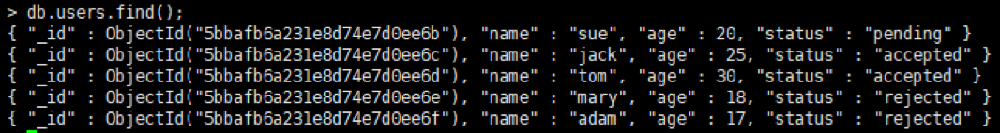
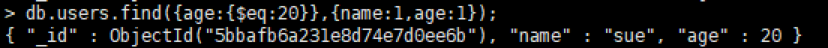
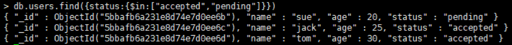
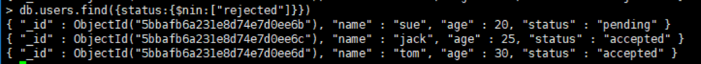
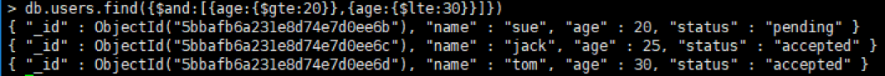
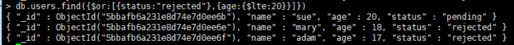

# 运算符

> 分类: Database > MongoDB
> 更新时间: 2026-01-10T23:34:23.653266+08:00

---

# 一、比较运算符
1. 总结

| **操作** | **格式** | **范例** | **RDBMS中的类似语句** |
| --- | --- | --- | --- |
| 等于 | {<key>:<value>} | db.col.find({"by":"菜鸟教程"}).pretty() | where   by = '菜鸟教程' |
| 小于 | {<key>:{$lt:<value>}} | db.col.find({"likes":{$lt:50}}).pretty() | where   likes < 50 |
| 小于或等于 | {<key>:{$lte:<value>}} | db.col.find({"likes":{$lte:50}}).pretty() | where   likes <= 50 |
| 大于 | {<key>:{$gt:<value>}} | db.col.find({"likes":{$gt:50}}).pretty() | where   likes > 50 |
| 大于或等于 | {<key>:{$gte:<value>}} | db.col.find({"likes":{$gte:50}}).pretty() | where   likes >= 50 |
| 不等于 | {<key>:{$ne:<value>}} | db.col.find({"likes":{$ne:50}}).pretty() | where   likes != 50 |

1. 示例

> db.users.insertMany([

{

name:"sue",

age:20,

status:"pending"

},

{

name:"jack",

age:25,

status:"accepted"

},

{

name:"tom",

age:30,

status:"accepted"

},

{

name:"mary",

age:18,

status:"rejected"

},

{

name:"adam",

age:17,

status:"rejected"

}

])

+ 年龄等于20岁，显示姓名和年龄：

> db.users.find({age:{$eq:20}},{name:1,age:1});

+ 年龄小于等于25岁，显示姓名和年龄：

> db.users.find({age:{$lte:25}},{name:1,age:1});

+ 状态为”pending”或”accepted”：

>db.users.find({status:{$in:["accepted","pending"]}})

+ 状态不为”rejected”：

> db.users.find({status:{$nin:["rejected"]}})

# 二、逻辑运算符
1. 总结

| ** 运算符** | **说明** |
| --- | --- |
| [$and](https://docs.mongodb.com/manual/reference/operator/query/and/#op._S_and) | 与运算符； { $and: [ {   <expression1> }, { <expression2> } , ... , { <expressionN>   } ] } |
| [$not](https://docs.mongodb.com/manual/reference/operator/query/not/#op._S_not) | 非运算符；{ field: { $not: {   <operator-expression> } } } |
| [$or](https://docs.mongodb.com/manual/reference/operator/query/or/#op._S_or) | 或运算符；{ $or: [ {   <expression1> }, { <expression2> }, ... , { <expressionN> }   ] } |

1. 示例
+ 年龄在25和30岁之间的文档：

> db.users.find({$and:[{age:{$gte:20}},{age:{$lte:30}}]})

+ 状态为“rejected”或者年龄小于等于20岁的文档：

> db.users.find({$or:[{status:"rejected"},{age:{$lte:20}}]})

+ 状态不是“rejected”的文档：

> db.users.find({status:{$not:{$eq:"rejected"}}})

 

