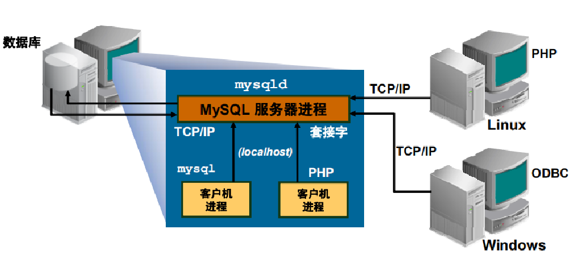

# MySQL 体系结构

> 分类: Database > MySQL体系结构与配置
> 更新时间: 2026-01-10T23:34:21.197614+08:00

---

+ MySQL属于Client/Server结构，Server端程序为mysqld，该服务启动后，Client端程序从本地或者远程连接Server
+ 常见的Client程序，例如：mysql、mysqldump、mysqlshow、mysqlbinlog等，也包括通过MySQL API和连接器连接到MySQLD的各类编程语言程序

