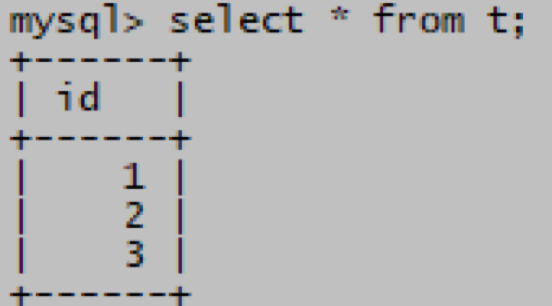
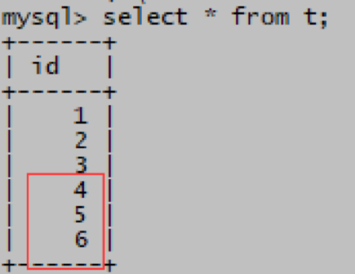

# 还原mysqldump备份

> 分类: Database > MySQL备份与恢复
> 更新时间: 2026-01-10T23:34:22.185882+08:00

---

    1. 使用 mysql 命令重新装入       mysqldump 备份
    - db_test.sql       是包括了test数据库的备份，其中表t备份时包括了1,2,3三条记录
    - mysql>use test;
    - mysql> insert into t       values(4),(5),(6); 再插入3条记录
    - mysql> select * from t;
    - root# mysql -uroot -p test <       /root/db_test.sql
    - mysql> use test;
    - mysql>select * from t;
    - test数据库回到了原来备份时的状态
+ 
+ 
    2. 使用 mysql       的source命令执行备份(里面都是SQL语句)
    3. db_test.sql       是包括了test数据库的备份，其中表t备份时包括了1,2,3三条记录
    - mysql>use test;
    - mysql> insert into t       values(4),(5),(6); 再插入3条记录
    - mysql> select * from t;
    - mysql> source       /root/db_test.sql;
    - mysql> use test;
    - mysql>select * from t;
    - test数据库回到了原来备份时的状态
+ 
+ 
+  
+  

