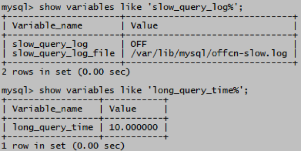
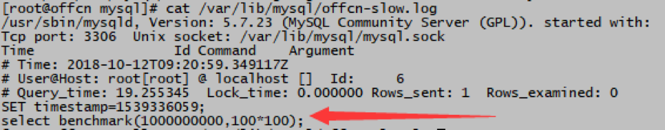

# MySQL 日志文件

> 分类: Database > MySQL日志
> 更新时间: 2026-01-10T23:34:21.521740+08:00

---

# 一、日志文件
1. MySQL      使用多种日志文件来记录服务器的运行活动，常见的日志包括：
+ 错误日志 (error log)

记录mysqld启动、运行和停止过程中遇到的问题

+ 常规日志 (general query log)

记录客户端连接以及服务器从客户端收到的各类SQL语句

+ 慢查询日志 (slow query log)

记录运行时间超过选项long_query_time设定阈值的查询语句

+ 二进制日志 (binary log)

记录使数据库数据产生变化的各类语句

2. 日志文件的特点：
+ 有可能会占用大量磁盘空间
+ 通常存储在文件中
+ 可以选择存储在mysql的表中，便于查询和分析
+ 仅限于常规查询和慢查询日志
+ 除了二进制日志，通常以文本格式记录数据

# 二、MySQL 错误日志
+ 默认开启
+ 日志位置

mysql> show variables like 'log_error';

# 三、MySQL 常规日志
+ 默认关闭
+ 日志位置

mysql> show variables like 'general_log%';

默认名称：hostname.log

+ 开启常规日志

mysql> set global general_log=on; （可同时修改/etc/my.cnf以保存服务重启后状态）

+ 测试

mysql> select count(*) from mysql.user;

root# cat /var/lib/mysql/hostname.log

mysql> set global general_log=off; 关闭 

# 四、MySQL 慢查询日志
+ 默认关闭
+ 日志位置

mysql> show variables like 'slow_query_log%';

mysql> show variables like 'long_query_time%';

+ 默认名称：hostname-slow.log

long_query_time默认时长10秒，执行超过10秒的查询语句会记录到慢查询日志中

+ 慢查询日志

mysql> set global slow_query_log=on;（可同时修改/etc/my.cnf以保存服务重启后状态）

+ 测试

mysql> select count(*) from mysql.user;

root# cat /var/lib/mysql/hostname-slow.log

mysql> set global slow_query_log=off; 关闭 

 

 

 

 

