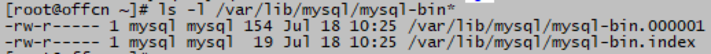
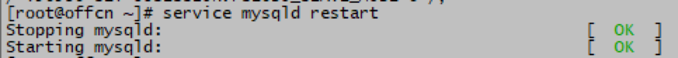
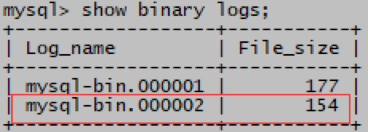
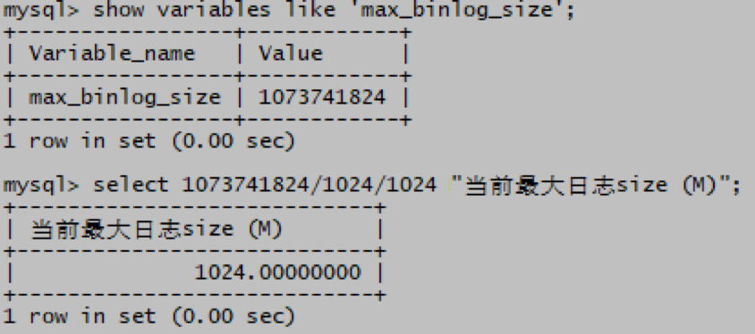
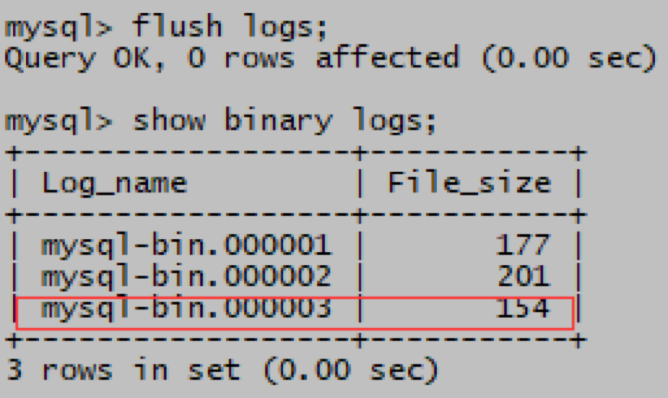
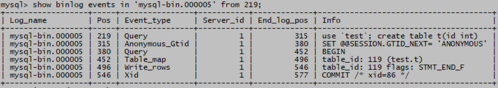

# 二进制日志BINLOG
# 一、简介
## 内容
+ BINLOG记录数据库的变更过程。例如创建数据库、建表、修改表等DDL操作、以及数据表的相关DML操作，这些操作会导致数据库产生变化，开启binlog以后导致数据库产生变化的操作会按照时间顺序以“事件”的形式记录到binlog二进制文件中，默认关闭

## 用途
1. 用户对主数据库SQL语句操作中的DML、DDL、DCL、TCL等语句会对数据库的状态产生变化操作，变化以事件的形式按照时间顺序记录到主数据库的BINLOG二进制日志中
2. 在建立从属数据库时，为了复制主库的数据使从库和主库一模一样，主库需要开启BINLOG日志，然后配置从属数据库，将主库产生的BINLOG日志定期通过网络传递到从数据库
3. 从数据库库接受到主库传递过来的BINLOG后，按照日志中记录的变更事件重新应用日志
4. 利用BINLOG日志最终起到从库和主库数据保持一致的状态，即复制了和主数据库一模一样的从数据库
+ 数据库复制

+ 数据库恢复

# 三、MySQL 开启BINLOG
1. MySQL默认没有开启BINLOG
2. 查看BINLOG是否开启
+ mysql>  show variables like '%log_bin%';
+ 
+ 如果log_bin的值为OFF说明没有开启binlog
3. 开启BINLOG
+ root# vi /etc/my.cnf
+ 在[mysqld]下面添加下面2行内容
+ server-id=1     #mysql5.7以上需要添加
+ log-bin=mysql-bin
+ 
    - root# systemctl       restart mysqld
    - mysql> show       variables like '%log_bin%';
+ 
+ 如果log_bin的值为ON说明binlog已开启
+ root#  ls -l /var/lib/mysql/mysql-bin*
+ 

# 四、MySQL  BINLOG记录格式
1. binlog记录格式分为：
+ 语句级（statement）
+ 行级 （row）   (5.5, 5.6, 5.7版本默认)
+ 混合级 （mixed）
2. mysql> show variables like       '%binlog_format%';
+ 
2. 基于语句（STATEMENT）的二进制日志记录：
+ 包含实际 SQL 语句
+ 包括 DDL（CREATE、 DROP 等）和       DML（UPDATE、 DELETE 等）语句
+ 日志占用相对较小的磁盘空间和网络带宽
+ 并非所有主库的的语句都能在远程从库上正确应用，例如一些包括now(),sleep(),uuid()等函数的语句在从库上无法做到和主库一致，数据和主库产生偏差
+ 要求主库和从库上复制的表和列完全相同
3. 基于行（ROW）的二进制日志记录：
+ 日志占用相对较大的磁盘空间和网络带宽
+ 所有主库的的语句都能在远程从库上正确应用       (复制数据库时最安全)
+ 要求从库上MySQL版本和行结构与主库必须完全相同
+ DDL、DML、DCL、TCL等语句对应的事件部分采用二进制格式
+ 从日志中查找特定语句对应的事件难度相对较高
4. 混合级（mixed）的二进制日志记录：
+ 由 MySQL       选取最适合单个事件的格式，基于语句还是基于行来记录事件
+ MySQL       通常会使用基于语句的二进制日志，但在需要时可恢复到基于行的复制

# 五、列出BINLOG文件
1. 列出所有binlog日志
+ mysql>  show binary logs;
+ 
2. 列出当前binlog日志
+ mysql>  show master status;
+ 

# 六、BINLOG日志切换
+ 下列3种情况会导致BINLOG日志切换：
1. MySQL启动或重启
+ 
+ 
2. 日志量到达了max_binlog_size的设定值
+ 
3. 执行flush logs;命令手动切换日志
+ mysql>  flush logs;
+ 

# 七、查看BINLOG内容
1. binlog以紧凑的二进制方式存储
+ 日志中包含数据和表结构更改事件及其时间戳 
+ 无法使用普通的文本查看软件查看其内容
+ MySQL提供mysqlbinlog 工具
+ 可将二进制数据转成SQL文本格式
3. 在标准输出中查看binlog内容
+ root# mysqlbinlog       /var/lib/mysql/mysql-bin.000001
+ 
4. 结合more命令查看binlog内容
+ root# mysqlbinlog       /var/lib/mysql/mysql-bin.000001 | more
5. 将binlog内容的SQL语句重定向到文件
+ root# mysqlbinlog       /var/lib/mysql/mysql-bin.000003 > /root/3.sql
6. mysqlbinlog       输出中，事件前面会提供相关信息的头注释： 
+ cat /root/3.sql
+ 
7. 查看binlog中部分内容，自定义起始和结束头标注
+ mysqlbinlog  --start-position=219 --stop-position=546   /var/lib/mysql/mysql-bin.000005
+ 

# 八、查看BINLOG中的事件
1. 查看第一个binlog日志中的事件
+ mysql> show binlog events;
2. 查看指定binlog日志中的事件
+ mysql> show binlog events in       'mysql-bin.000005';
+ 
3. 查看指定binlog日志中的事件，指定事件起始头注释
+ mysql> show binlog       events in 'mysql-bin.000005' from 219;
+ 

