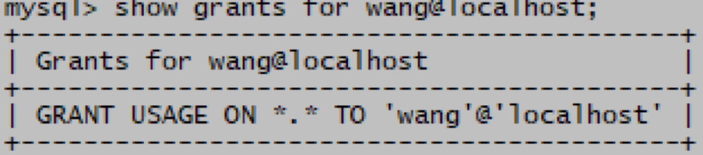

# MySQL REVOKE撤销授权语句

> 分类: Database > MySQL用户权限管理
> 更新时间: 2026-01-10T23:34:20.312526+08:00

---

revoke语句可以用来创建用户也可以修改用户的权限

1. grant语法：

revoke 权限(colname) on <dbname>.<tabname> from username@host;

1. 示例(root)，收回用户wang的select      test库的stu表的sno列权限：

mysql> revoke select(sno) on test.stu from wang@localhost;

mysql> show grants for wang@localhost;

 

 

