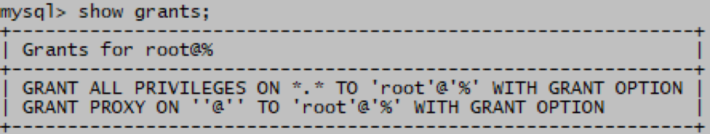
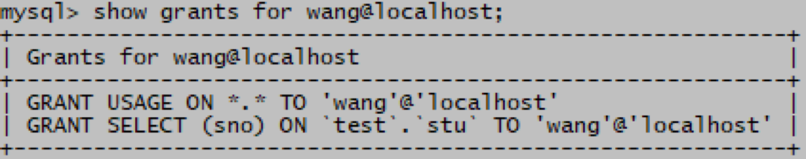

# MySQL显示用户权限

> 分类: Database > MySQL用户权限管理
> 更新时间: 2026-01-10T23:34:20.208226+08:00

---

使用show grants语句查看用户拥有的权限

1. 测试（root）

mysql> show grants;                                  --查看自己所拥有的权限

mysql> show grants for wang@localhost; --查看用户wang的权限

 

 

