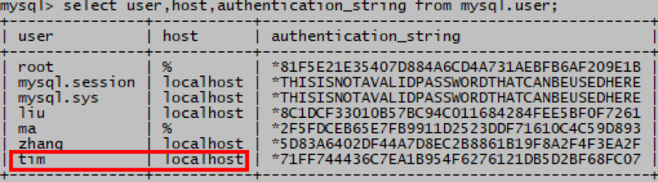

# MySQL重命名用户

> 分类: Database > MySQL用户权限管理
> 更新时间: 2026-01-10T23:34:19.769132+08:00

---

    1. 使用rename       user命令可以给用户名和客户端主机改名
+ 示例：把tom@192.168.2.1  改名为 tim@localhost
+ mysql> rename user tom@192.168.2.1 to tim@localhost;
+ 
+ 
+  

