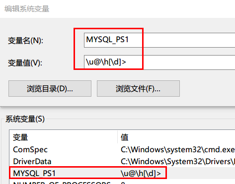

# windows安装

> 分类: Database > MySQL部署
> 更新时间: 2026-01-10T23:34:17.501469+08:00

---

# 一、mysql安装
1. 参考如下链接：

[https://blog.csdn.net/qq_34952973/article/details/79094074](https://blog.csdn.net/qq_34952973/article/details/79094074)

[https://www.jb51.net/article/134200.htm](https://www.jb51.net/article/134200.htm)

# 二、环境变量配置
1. 参考如下链接：

[https://jingyan.baidu.com/article/c1a3101e72fc9bde656debf7.html](https://jingyan.baidu.com/article/c1a3101e72fc9bde656debf7.html)

# 三、提示符显示用户名，主机名，库名
1. 添加环境变量

1. 重新打开cmd窗口，登录验证

 

