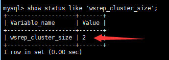
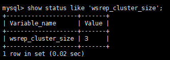

# mysql-galera-cluster

> 分类: Database > MySQL高级操作
> 更新时间: 2026-01-10T23:34:22.768081+08:00

---

## MySQL Galera Cluster介绍
Galera Cluster不同于常规的MySQL Server软件，安装了额外的插件，也需要额外的配置

Galera Cluster要求最少3个节点，即3台MySQL服务器主机

Galera Cluster复制仅仅支持支持事务的InnoDB存储引擎

任何写入其他引擎的表，包括mysql.*表将不会复制,但是DDL语句会被复制的,因此创建用户将会被复制,但是insert into mysql.user…将不会被复制的

DELETE操作不支持没有主键的表

整个集群的写入吞吐量是由最弱的节点限制，如果有一个节点变得缓慢，那么整个集群将是缓慢的。为了稳定的高性能要求，所有的节点应使用统一的硬件。

## Galera Cluster优势和适用场景
## 安装配置Galera Cluster
### 规划
| IP | 主机名 | 角色 | 操作系统（最小安装） | MySQL |
| --- | --- | --- | --- | --- |
| 192.168.2.31 | host21 | 主库 | Centos 7.5 | Galera Cluster for MySQL 5.7.23 rpm包安装版 |
| 192.168.2.32 | host22 | 主库 | Centos 7.5 | Galera Cluster for MySQL 5.7.23 rpm包安装版 |
| 192.168.2.33 | host23 | 主库 | Centos 7.5 | Galera Cluster for MySQL 5.7.23 rpm包安装版 |

 

### 安装前准备
关闭selinux

 

关闭防火墙

systemctl disable firewalld

systemctl stop firewalld

 

### 每个节点上传Galera Cluster for MySQL rpm包
galera-3-25.3.24-2.el7.x86_64.rpm

mysql-wsrep-5.7-5.7.23-25.15.el7.x86_64.rpm

mysql-wsrep-common-5.7-5.7.23-25.15.el7.x86_64.rpm

mysql-wsrep-client-5.7-5.7.23-25.15.el7.x86_64.rpm

mysql-wsrep-libs-5.7-5.7.23-25.15.el7.x86_64.rpm

mysql-wsrep-libs-compat-5.7-5.7.23-25.15.el7.x86_64.rpm

mysql-wsrep-server-5.7-5.7.23-25.15.el7.x86_64.rpm

 

### 每个节点安装rpm软件包
 

yum install rsync

yum install galera-3-25.3.24-2.el7.x86_64.rpm

yum install mysql-wsrep-5.7-5.7.23-25.15.el7.x86_64.rpm mysql-wsrep-client-5.7-5.7.23-25.15.el7.x86_64.rpm mysql-wsrep-common-5.7-5.7.23-25.15.el7.x86_64.rpm mysql-wsrep-libs-5.7-5.7.23-25.15.el7.x86_64.rpm mysql-wsrep-libs-compat-5.7-5.7.23-25.15.el7.x86_64.rpm mysql-wsrep-server-5.7-5.7.23-25.15.el7.x86_64.rpm

 

不要启动mysqld

 

### 配置第一个节点NODE1
**修改****my.cnf**

**vim /etc/my.cnf**

[mysqld]

 

#添加以下内容

user=mysql

binlog_format=ROW

bind-address=0.0.0.0

default_storage_engine=innodb

innodb_autoinc_lock_mode=2

innodb_flush_log_at_trx_commit=0

innodb_buffer_pool_size=122M

wsrep_provider=/usr/lib64/galera-3/libgalera_smm.so

wsrep_provider_options="gcache.size=300M; gcache.page_size=300M"

wsrep_cluster_name="test-cluster"

wsrep_cluster_address="gcomm://192.168.2.31,192.168.2.32,192.168.2.33"

wsrep_sst_method=rsync

wsrep_node_name=node1

wsrep_node_address="192.168.2.31"

 

 

**初始化****mysql**

/usr/bin/mysqld_bootstrap

 

**获取临时密码**

cat /var/log/mysqld.log | grep temporary

 

**登录****mysql**

mysql -uroot -p

 

**修改密码**

alter user root@localhost identified by 'Abc123!!!';

 

**查看集群状态变量**

show status like 'wsrep_cluster_size';

select user,host,authentication_string from mysql.user;

 

### 配置第二个节点NODE2
**修改****my.cnf**

[mysqld]

 

#添加以下内容

user=mysql

binlog_format=ROW

bind-address=0.0.0.0

default_storage_engine=innodb

innodb_autoinc_lock_mode=2

innodb_flush_log_at_trx_commit=0

innodb_buffer_pool_size=122M

wsrep_provider=/usr/lib64/galera-3/libgalera_smm.so

wsrep_provider_options="gcache.size=300M; gcache.page_size=300M"

wsrep_cluster_name="test-cluster"

wsrep_cluster_address="gcomm://192.168.2.31,192.168.2.32,192.168.2.33"

wsrep_sst_method=rsync

wsrep_node_name=node2

wsrep_node_address="192.168.2.32"

 

**初始化****mysql**

systemctl start mysqld

 

**登录****mysql**

密码为节点1密码Abc123!!!

mysql -uroot -p

 

 

**查看集群状态变量**

show status like 'wsrep_cluster_size';

select user,host,authentication_string from mysql.user;

 

### 配置第三个节点NODE3
**修改****my.cnf**

[mysqld]

 

#添加以下内容

user=mysql

binlog_format=ROW

bind-address=0.0.0.0

default_storage_engine=innodb

innodb_autoinc_lock_mode=2

innodb_flush_log_at_trx_commit=0

innodb_buffer_pool_size=122M

wsrep_provider=/usr/lib64/galera-3/libgalera_smm.so

wsrep_provider_options="gcache.size=300M; gcache.page_size=300M"

wsrep_cluster_name="test-cluster"

wsrep_cluster_address="gcomm://192.168.2.31,192.168.2.32,192.168.2.33"

wsrep_sst_method=rsync

wsrep_node_name=node3

wsrep_node_address="192.168.2.33"

 

**初始化****mysql**

systemctl start mysqld

 

**测试登录****mysql**

密码为节点1密码Abc123!!!

mysql -uroot -p

 

**查看集群状态变量**

show status like 'wsrep_cluster_size';

select user,host,authentication_string from mysql.user;

 

### 测试多主复制
任意节点操作：

上传world.sql到/root

mysql> source /root/world.sql

 

其他节点查看：

mysql> show databases;

mysql> use world;

mysql> show tables;

mysql> select * from country;

 

### 关闭集群
每个节点：

systemctl stop mysqld

 

### 开启集群
第一个节点(31或32或33)：

/usr/bin/mysqld_bootstrap

 

其余节点：

systemctl start mysqld

 

 

### 启动报错处理
1. 先关闭实例：

systemctl stop mysqld

rm /var/lib/mysql/grastate.dat

 

2. 删除故障节点/var/lib/mysql/grastate.dat

rm /var/lib/mysql/grastate.dat

 

注意：如果启动第一个节点使用/usr/bin/mysqld_bootstrap (官方文档说明：针对Centos7 和 galera mysql5.7)

 

 

 

 

