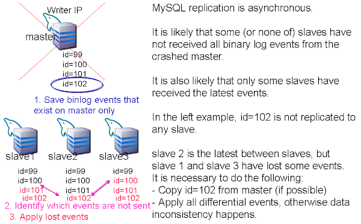
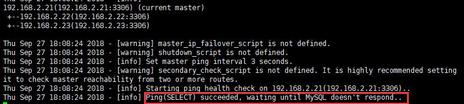
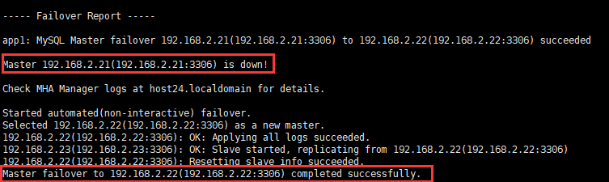

# mysql-mha
**MySQL高可用解决方案MHA**

## MySQL MHA介绍
### 简介
MHA是由日本人Yoshinorim用Perl语言开发的一套比较成熟的MySQL高可用（High Availability）方案，Yoshinorim原就职于DeNA(一家网游、电子商务公司)现就职于FaceBook；

能在0-30s之内实现MySQL Master主库故障转移(fail-over)

解决Slave从库数据的一致性问题

### 网址
[https://github.com/yoshinorim/mha4mysql-manager/wiki](https://github.com/yoshinorim/mha4mysql-manager/wiki)

 

### MHA组件
MHA Manager：

+ 一般安装运行在额外监控服务器主机
+ 监控master主库状态
+ 控制故障转移(fail-over)

MHA Node

+ 每个节点都安装
+ 装有故障转移助手脚本程序
+ 分析master主库binlog和slave从库中继日志
+ 识别需要复制到其他节点的中继日志位置坐标
+ 应用日志中的变更事件到其他slave从库

## 主库故障切换的困境
手工主从切换不是一件容易的事，往往需要花费很长时间，这意味着伴随着较长的宕机时间

一主多从是常见的MySQL部署场景

如果master主库宕机需要挑选出最新的slave从库作为主库，然后每个其他slave从库把主库配置变更为新的主库

很有可能在原主库宕机时，有些从库还没有接收到所有的binlog文件，如果马上切换新主库启动复制会导致部分事务数据的丢失，造成复制数据的不一致性

此时需要轮流识别每个slave从库binlog日志的缺失情况，并应用到新主库的日志位置，手工实现这个过程非常繁琐和困难，也容易出错

 

 

## MHA优势和适用场景
master主库宕机时，slave从库切换为master主库的时间非常短，10到30秒左右(也就是宕机时间)

MHA适用于常见的单独master主库和多个slave从库的2层数据库复制拓扑结构

要求mysql5.0以上版本

可以直接升级MHA软件，主从mysql数据库实例和数据复制不受影响

master主库宕机不会导致主库和从库的数据不一致

master主库宕机时，MHA自动识别slave从库之间中继日志的差异，并在从库之间应用日志中继日志，最终数据会在所有slave从库中实现同步（只要slave从库没有宕机）；

如果使用了主从半同步复制，不丢数据基本可以保证

无需修改主从MySQL的配置文件

不会增加数据库管理员的额外负担

无需添加很多额外服务器主机来运行MHA

MHA由MHA Manager和MHA Node两部分组成

MHA Node安装运行在每个主从节点上，不需要添加额外服务器

MHA Manager通常安装运行在一个额外的单独服务器上

一个MHA Manager可以监控多个主从复制拓扑结构，因此增加1台额外服务器不算多

MHA Manager也可以安装运行在一个slave从库主机上，这样就不需要添加额外服务器了

无性能开销

MHA采用ping的方式测试master主库的连通性

默认3秒钟ping一次

不使用有性能开销的SQL查询语句

MHA支持任何存储引擎

只有支持MySQL复制的存储引擎，MHA都可以工作

基于MyISAM传统引擎的数据库复制，MHA也可以工作

## 安装配置MHA
### 规划
| IP | 主机名 | 角色 | BINLOG | MHA组件 | 操作系统（最小安装） | MySQL |
| --- | --- | --- | --- | --- | --- | --- |
| 192.168.2.21 | host21 | 主库 | 开启 | MHA Node | Centos 7.5 | MySQL 5.7.23 rpm包安装版 |
| 192.168.2.22 | host22 | 从库 | 开启 | MHA Node | Centos 7.5 | MySQL 5.7.23 rpm包安装版 |
| 192.168.2.23 | host23 | 从库 | 开启 | MHA Node | Centos 7.5 | MySQL 5.7.23 rpm包安装版 |
| 192.168.2.24 | host24 | 监控 |   | MHA Manager | Centos 7.5 | MySQL 5.7.23 rpm包安装版 |

 

### 确保已经配置好数据库复制
主库： 21

从库1:  22

从库2:  23

 

### 主库21修改MySQL root用户名
主机21上操作：

 

mysql> rename user root@localhost to ‘root’@’%’;

mysql> select user,host,authentication_string from mysql.user;

 

主机22,23上操作：

mysql> select user,host,authentication_string from mysql.user;

 

### 上传MHA NODE到主机21,22,23,24
mha4mysql-node-0.58-0.el7.centos.noarch.rpm

### 上传MHA MANAGER到主机24
mha4mysql-manager-0.58-0.el7.centos.noarch.rpm

### 安装MHA NODE于主机21,22,23
yum install perl-DBD-MySQL

rpm -ivh mha4mysql-node-0.58-0.el7.centos.noarch.rpm

### 安装MHA MANAGER于主机24
yum install epel-release

yum install mha4mysql-manager-0.58-0.el7.centos.noarch.rpm mha4mysql-node-0.58-0.el7.centos.noarch.rpm

 

### 建立主机21,22,23,24间信任关系
每台服务器：

ssh-keygen -t rsa

一路回车

 

主机24上操作：

cat ~/.ssh/id_rsa.pub>> ~/.ssh/authorized_keys

 

ssh 192.168.2.21 cat  ~/.ssh/id_rsa.pub>> ~/.ssh/authorized_keys

 

ssh 192.168.2.22 cat  ~/.ssh/id_rsa.pub>> ~/.ssh/authorized_keys

 

ssh 192.168.2.23 cat  ~/.ssh/id_rsa.pub>> ~/.ssh/authorized_keys

 

scp ~/.ssh/authorized_keys 192.168.2.21:~/.ssh

 

scp ~/.ssh/authorized_keys 192.168.2.22:~/.ssh

 

scp ~/.ssh/authorized_keys 192.168.2.23:~/.ssh

 

 

### 测试主机间信任关系
每台服务器：

date;ssh 192.168.2.21 date;ssh 192.168.2.22 date;ssh 192.168.2.23 date;ssh 192.168.2.24 date;

 

### 管理节点主机24创建MHA配置文件
主机24上操作：

vi /etc/app1.cnf

 

[server default]

# mysql user and password

user=root

password=beijing

ssh_user='repl'@'192.168.%'

# working directory on the manager

manager_workdir=/var/log/mha/app1

# working directory on MySQL servers

remote_workdir=/var/log/mha/app1

 

[server1]

hostname=192.168.2.21

 

[server2]

hostname=192.168.2.22

 

[server3]

hostname=192.168.2.23

 

### 检查主从复制配置情况
主机24上操作：

masterha_check_repl --conf=/etc/app1.cnf

 

[root@host24 ~]# masterha_check_repl --conf=/etc/app1.cnf

Thu Sep 27 17:56:12 2018 - [warning] Global configuration file /etc/masterha_default.cnf not found. Skipping.

Thu Sep 27 17:56:12 2018 - [info] Reading application default configuration from /etc/app1.cnf..

Thu Sep 27 17:56:12 2018 - [info] Reading server configuration from /etc/app1.cnf..

Thu Sep 27 17:56:12 2018 - [info] MHA::MasterMonitor version 0.58.

Thu Sep 27 17:56:13 2018 - [info] GTID failover mode = 1

Thu Sep 27 17:56:13 2018 - [info] Dead Servers:

Thu Sep 27 17:56:13 2018 - [info] Alive Servers:

Thu Sep 27 17:56:13 2018 - [info]   192.168.2.21(192.168.2.21:3306)

Thu Sep 27 17:56:13 2018 - [info]   192.168.2.22(192.168.2.22:3306)

Thu Sep 27 17:56:13 2018 - [info]   192.168.2.23(192.168.2.23:3306)

Thu Sep 27 17:56:13 2018 - [info] Alive Slaves:

Thu Sep 27 17:56:13 2018 - [info]   192.168.2.22(192.168.2.22:3306)  Version=5.7.23-log (oldest major version between slaves) log-bin:enabled

Thu Sep 27 17:56:13 2018 - [info]     GTID ON

Thu Sep 27 17:56:13 2018 - [info]     Replicating from 192.168.2.21(192.168.2.21:3306)

Thu Sep 27 17:56:13 2018 - [info]   192.168.2.23(192.168.2.23:3306)  Version=5.7.23-log (oldest major version between slaves) log-bin:enabled

Thu Sep 27 17:56:14 2018 - [info]     GTID ON

Thu Sep 27 17:56:14 2018 - [info]     Replicating from 192.168.2.21(192.168.2.21:3306)

Thu Sep 27 17:56:14 2018 - [info] Current Alive Master: 192.168.2.21(192.168.2.21:3306)

Thu Sep 27 17:56:14 2018 - [info] Checking slave configurations..

Thu Sep 27 17:56:14 2018 - [info]  read_only=1 is not set on slave 192.168.2.22(192.168.2.22:3306).

Thu Sep 27 17:56:14 2018 - [info]  read_only=1 is not set on slave 192.168.2.23(192.168.2.23:3306).

Thu Sep 27 17:56:14 2018 - [info] Checking replication filtering settings..

Thu Sep 27 17:56:14 2018 - [info]  binlog_do_db= , binlog_ignore_db=

Thu Sep 27 17:56:14 2018 - [info]  Replication filtering check ok.

Thu Sep 27 17:56:14 2018 - [info] GTID (with auto-pos) is supported. Skipping all SSH and Node package checking.

Thu Sep 27 17:56:14 2018 - [info] Checking SSH publickey authentication settings on the current master..

Permission denied (publickey,gssapi-keyex,gssapi-with-mic,password).

Thu Sep 27 17:56:14 2018 - [warning] HealthCheck: SSH to 192.168.2.21 is NOT reachable.

Thu Sep 27 17:56:14 2018 - [info]

192.168.2.21(192.168.2.21:3306) (current master)

 +--192.168.2.22(192.168.2.22:3306)

 +--192.168.2.23(192.168.2.23:3306)

 

Thu Sep 27 17:56:14 2018 - [info] Checking replication health on 192.168.2.22..

Thu Sep 27 17:56:14 2018 - [info]  ok.

Thu Sep 27 17:56:14 2018 - [info] Checking replication health on 192.168.2.23..

Thu Sep 27 17:56:14 2018 - [info]  ok.

Thu Sep 27 17:56:14 2018 - [warning] master_ip_failover_script is not defined.

Thu Sep 27 17:56:14 2018 - [warning] shutdown_script is not defined.

Thu Sep 27 17:56:14 2018 - [info] Got exit code 0 (Not master dead).

 

MySQL Replication Health is OK.

 

### 启动管理监控
主机24上操作：

masterha_manager --conf=/etc/app1.cnf

 

 

### 测试master主库故障转移
主机21主库上操作：

#systemctl stop network

systemctl stop mysqld

 

主机24监控节点查看：

 

### 还原原主从结构
主机22操作：

mysql> change master to master_host='192.168.2.21',master_user='repl',master_password='repl',master_port=3306,master_auto_position=1;

mysql> start slave;

mysql>show slave status\G

主机23操作：

mysql>stop slave;

mysql> change master to master_host='192.168.2.21',master_user='repl',master_password='repl',master_port=3306,master_auto_position=1;

mysql>start slave;

mysql> show slave status\G

 

主机21操作：

mysql> show slave hosts;

 

 

 

