# mysql数据库备份和恢复实验

> 分类: Database > MySQL高级操作
> 更新时间: 2026-01-10T23:34:22.405206+08:00

---

### 一、物理完全冷备完全恢复
#### 1. 业务场景描述
管理员做了数据库的全备（冷备全备），启动数据库以后，用户继续使用数据库，正常的DDL、DML等操作。数据库突然不能正常使用了，硬盘损坏，导致数据文件全备丢失，值得庆幸的是数据库全备和二进制日志存放在其他硬盘对应的目录上，完好无损，现在需要管理员把数据从全备还原，然后恢复数据到损毁前的状态

 

#### 2. 开启二进制日志BINLOG
root# mkdir /binlogs

root# systemctl stop mysqld

root# vim /etc/my.cnf

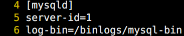

root# chown mysql:mysql /binlogs/

root# chmod 750 /binlogs

root# ll -d /binlogs/

root# systemctl start mysqld

root# mysql -u root -p

mysql> show variables like '%log_bin%';

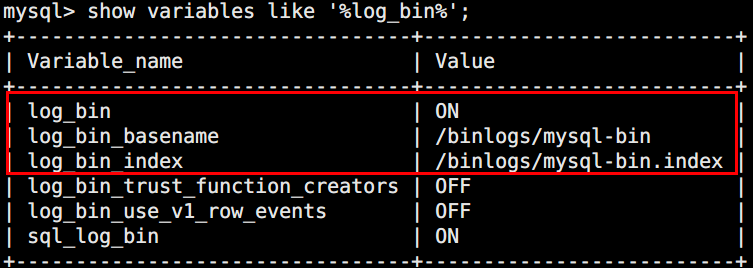

#### 3. 建立数据库备份（物理备份，冷备）
root# mkdir /backup

root# systemctl stop mysqld

root# cp -a /var/lib/mysql /backup

root# cd /backup/mysql

root# ls

root# ls /binlogs

注：此时知道备份时日志走到了mysql-bin.000001

#### 4. 记录备份时日志序号
root# touch /backup/mysql/000001

 

注：记录日志序号是为了记录冷备时日志走到了哪个日志，这样恢复时就知道从这个日志起的下一个日志号开始恢复，省得恢复时选择起始日志需要对照日志和备份文件的修改时间才能知道需要重做的起始日志号（本例中冷备并没有备份二进制日志）

root# ls /backup/mysql

#### 5. 插入测试数据
root# systemctl start mysqld

root# mysql -uroot -p

mysql> use test;

mysql> insert into t values(4),(5),(6);

mysql> select * from t;

 

#### 6. 切换日志模拟时间在往前走
mysql> flush logs;

mysql> show binary logs; #启动数据库会切换1次日志

mysql> show master status;

 

注：当前日志走到了3号

#### 7. 添加一个用户用于测试
mysql> create user ujiuye@localhost identified by '123';

mysql> use mysql;

mysql> select user,host,authentication_string from user;

注：做备份的时候没有ujiuye这个用户，用户存放在mysql库的user表中

#### 8. 切换日志模拟时间往前走
mysql> flush logs;

mysql> show binary logs;

mysql> show master status;

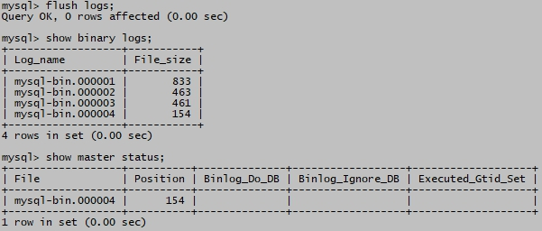  注：当前日志走到了4号

 

#### 9. 模拟数据库损坏
root# rm -rf /var/lib/mysql  #小心操作别删错了目录

mysql> quit

 

root# mysql -uroot -p  #重新连接失败

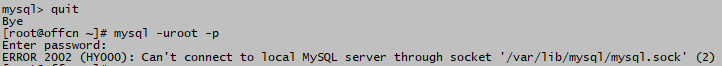 

注：此时数据文件已损毁，但mysqld进程还存活，查看mysqld进程并杀掉

ps -ef | grep -v grep | grep mysqld #查看mysqld进程

 

root# yum install psmisc

root# killall -9 mysqld  #多用几次这个命令，杀掉mysqld进程，

root# ps -ef | grep -v grep | grep mysqld   #确保无输出，即mysqld已杀掉

#### 10. 还原之前冷备份
注：刚才杀mysqld进程时，该进程会尝试重启，会在/var/lib/mysql下创建默认系统表空间及其innodb引擎的重做日志，可以先将/var/lib/mysql目录删除

root# rm -rf /var/lib/mysql

root# cp -a /backup/mysql  /var/lib

#### 11. 找出需要恢复的起止日志
root# ls /var/lib/mysql  #备份时的日志是几号？

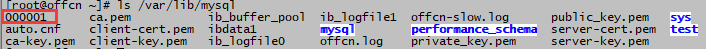

注：此时备份已经还原，备份时日志是1号，应该从2号日志开始恢复

root# ls /binlogs    #查看出故障时日志走到了几号？

注：查看二进制日志存放目录，找编号最大的日志，即，出故障时日志走到了4号日志，得出需要恢复的日志是从2号到4号

#### 12. 重启数据库（数据回到冷备时刻状态）
root# ls /binlogs

 

重启后会多出一个5号日志（mysqld重启会切换日志）

root# systemctl start mysqld

root# ls /binlogs

 

注：恢复时只恢复从2号到4号，这部分是需要重做的，如果到5号没有必要

#### 13. 查看还原时数据状态
root# mysql -uroot -p

mysql> use test;

mysql> select * from t;

mysql> select user,host,authentication_string from mysql.user;

 

注：备份时test库t表有3条记录，mysql库user表中无ujiuye用户

#### 14. 恢复数据到故障之前状态
注：前述步骤已经知道需要按照顺序恢复从2号到4号日志中记录的SQL语句，可以使用mysqlbinlog命令把二进制中的SQL显示出来，以下两种方式均可：

方式1：

root# mysqlbinlog mysql-bin.00000{2..4} | mysql -uroot -p

或者

root#mysqlbinlog mysql-bin.000002 mysql-bin.000003 mysql-bin.000004 |mysql –uroot -p

注：使用管道符将2到4号的日志内容交给mysql 执行应用（重做）

方式2：

root# mysqlbinlog mysql-bin.00000{2..4}>/backup/recover.sql

mysql> source /backup/recover.sql

注：先转存到恢复文件recover.sql，再到mysql环境中执行

 

本例采用方式1的方式

mysql> quit

root# cd /binlogs

root# mysqlbinlog mysql-bin.00000{2..4} | mysql -uroot –p

 

 

root# mysql –uroot –p 

注：恢复完成，再次进入mysql环境

#### 15. 登录验证恢复结果
mysql> use test;

mysql> select * from t;

mysql> select user,host,authentication_string from mysql.user;

 

 

#### 16. 实验总结
    以上实验的过程展示了数据库故障时利用物理备份进行数据恢复的过程，最重要是满足**有备份且完整，二进制日志没有缺失**这两个条件，就能把数据找回来。实验步骤是按照以下图示中描述的内容完成的。

** **

数据恢复可总结为两点，首先判断都否恢复，然后再做具体恢复，相关要点如下所示：

判断能否恢复

1）遇到故障时先查看是否有备份；无备份即数据丢失

2）检查日志是否完好无损且连续

3）有备份且日志齐全可做恢复

4）有备份但日志缺失，数据可以还原到备份时的状态，丢失部分数据

主要恢复步骤:

1）修复硬件

2）还原备份

3）查看还原时数据状态

4）计算出需要恢复的起止日志

5）生成数据恢复SQL语句

6）重做恢复SQL语句执行恢复

7）检查恢复后数据

### 二、逻辑全备不完全恢复
#### 1. 业务场景描述
管理员做了数据库全库的逻辑备份，备份以SQL语句形式存入到文件all_db.sql中，程序员小李使用图形界面客户端同时连接生产库和测试库在做开发，本应删除测试库中的t表，却由于疏忽，删除了生产库的test库中的t表及其全部数据（人都会犯错），导致用户访问业务系统出错。为了挽回丢失的数据，需要管理员将数据恢复到删除t表误删数据之前的状态，将t表的数据找回来。找数据的过程生产库不能关库，因为还有用户在使用数据库对应的业务系统。

#### 2. 查看当前test库的状态
root# mysql -uroot -p

mysql> show databases;

mysql> use test;

mysql> show tables;

mysql> select * from t;

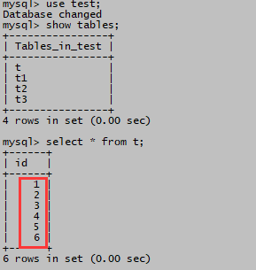

注：t表当前6条记录

#### 3. 对数据库做全库逻辑备份
root# mysqldump -uroot -p --all-databases --master-data=2 --single-transaction --routines --triggers --flush-logs> /root/all_db.sql

#### 4. 查看备份时的日志位置
root# more /root/all_db.sql

注：备份时使用了--master-data=2选项，记录了日志位置，即走到了6号日志，头标注位置154号时，做了备份

#### 5. 切换日志模拟时间在往前走
mysql> flush logs;

mysql> show binary logs;

注：此时日志走到了7号154的位置

#### 6. 插入测试数据
mysql> use test;

mysql> insert into t values(100),(200),(300);

mysql> select * from test.t;

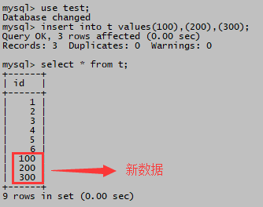 

#### 7. 切换日志模拟时间在往前走
mysql> flush logs;

mysql> show binary logs;

注：此时日志走到了8号154的位置

#### 8. 模拟人为误删除数据
mysql> use test;

mysql> insert into t values(1000);

mysql> select * from t;

 

注：还有业务用户在往t表录入数据

mysql> delete from t;

mysql> drop table t;

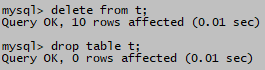

注：程序员小李删错了位置，生产库t表没有了

#### 9. 切换日志模拟时间在往前走
mysql> flush logs;

mysql> show binary logs;

 

注：此时日志走到了8号154的位置

#### 10. 有用户报告业务系统部分页面不能正常显示
经管理员追查，出现异常的页面关联到test库t表，数据库后台查看发现t表已被删除。

mysql> select database(); #当前在使用什么库

mysql> show tables;

注：t表不见了；但是当前还有用户在往t1、t2、t3表中录入数据；此时不能在生产库中做不完全恢复，即：让test库所有表的数据回到删t表之前的状态，这样会丢失t1、t2、t3表刚刚录入的数据，因此数据恢复需要管理员搭建一个和主库版本一样的测试库上来做。本实验数据恢复将使用windows系统上的数据库来完成。

#### 11. 确定误删除操作的日志和位置
mysql> show binary logs;

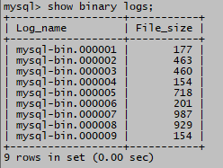

注：当前数据库走到第9号日志

mysql> show binlog events in 'mysql-bin.000009';

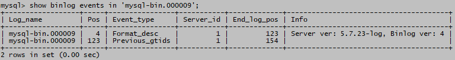

注：当前日志没有查到和t表相关的操作，然后按照日志序号倒着一个一个找。关键看误删除发现是否及时，如果几天前做的误删除，需要多查找一段日志。也可以使用：

mysqlbinlog log1 log2 … logN > file.sql的方式

然后用编辑器的关键字查找功能在file.sql中查找误删除的位置

 

mysql> show binlog events in 'mysql-bin.000008';

注：在8号日志的位置587找到了delete语句删除的位置，删除过程产生事务，需要再往前找到事务开始时（有BEGIN标记）的坐标，即8号日志位置471。

注：也可以使用以下形式的命令找：

root# cd /binlogs

root# mysqlbinlog mysql-bin.000007 mysql-bin.000008 mysql-bin.000009 | grep -i "delete"

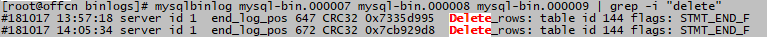

注：然后，去掉某个日志，缩小范围

#### 12. 确定需要恢复的起止位置
root# more /root/all_db.sql

注：恢复开始位置为上次逻辑全备的6号日志位置154

注：恢复终止位置为上一步找到的8号日志位置471

#### 13. 生成起止位置之间的重做SQL语句
root# cd /binlos

root# mysqlbinlog --start-position=154 mysql-bin.000006>/root/recover.sql

root# mysqlbinlog mysql-bin.000007>>/root/recover.sql

root# mysqlbinlog --stop-position=471 mysql-bin.000008>>/root/recover.sql

root# more /root/recover.sql

注：把重做SQL语句写到/root/recover.sql中，使用了“>”，和“>>”输出重定向符号，对于起始日志要用“>”（创建文件并写入输出内容），后面的日志用“>>”（文件尾部追加内容）；次步骤容易出错，小心操作。

#### 14. 还原逻辑全备到Windows测试库
注：把/root/all_db.sql和/root/recover.sql传到windows

root# sz /root/all_db.sql /root/recover.sql  #linux没有安装sz可以使用其他FTP等工具

注：复制all_db.sql和recover.sql到D盘，方便访问

开启windows mysqld；客户端连接

mysql> source d:/all_db.sql

注：windows库执行数据还原

mysql> use test;

mysql> show tables;

mysql> select * from t;

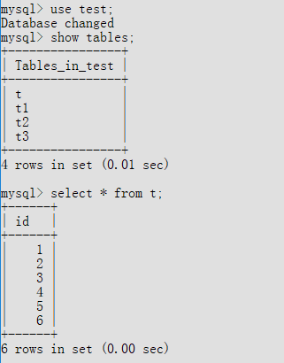

注：查看还原后数据状态

#### 15. Windows测试数据库执行数据恢复
 mysql> source d:/recover.sql

#### 16. 检查恢复后数据表状态
mysql> select * from t;

注：windows的测试库仅临时用于数据恢复，不需要开启binlog；也可以使用其他linux系统的测试库做恢复；此时之前误删除的数据在测试机上已经暴露出来，需要将t���导出，然后再导入回生产库。

 

#### 17. 误删数据导出测试库并导入生产库
D:\mysqldump -uroot -p test t>t.sql

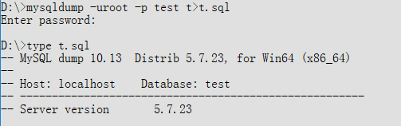

#root cd /root

#root rz   #上传t.sql到生产库/root，如linux没有安装rz使用ftp等工具

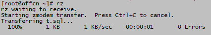

mysql> source /root/t.sql

mysql> show tables;

mysql> select * from t;

注：至此t表已在生产库中恢复回来了

#### 18. 实验总结
以上实验的过程展示了人为错误误删除表数据时，利用数据库逻辑全备份进行数据恢复的过程，实验步骤是按照以下图示中描述的内容完成的。恢复过程属于不完全恢复，即没有恢复到最后一个二进制日志的最后一个SQL语句，而是恢复过程中途停止在误删除数据之前的位置，此时被删除的数据表已经显露出来。

恢复过程生成从备份起到误删除日志位置止的SQL重做语句，在测试机数据库上进行数据备份的还原和恢复，捞回的数据表再导回到生产库，从而实现误删除数据表的恢复。

至于为什么要在测试机上完成恢复，其原因之一是此时业务需要生产库不能停库，其二，如果生产机可以停库，其恢复过程十分繁琐，容易出错，稍有不慎会造成更大的损失。

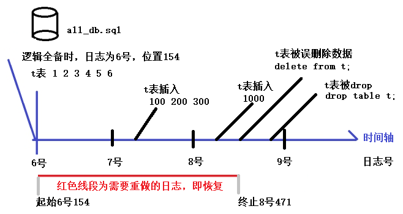

如果在生产库上做恢复，其主要步骤如下：

1）定位误删除表的日志位置（8号日志位置471）

2）生产起止位置之间的重做SQL语句（6号154到8号471）

3）生产库停库（假定停库时是9号日志位置1000）

4）冷备份生产库全库（包括二进制日志）

       这步最好要做，因为恢复误删除数据表属于不完全恢复，需要将整个数据库回溯到实验中8号日志471位置的时间点；如果不做这一步，误删除数据恢复时数据库中的数据不是停库时（9号日志位置1000）的状态，缺失了从8号日志471到9号日志1000的数据，当然可以再从8号日志471继续恢复到9号日志1000，但是怕会遇到意想不到的其他问题，对于生产库来说数据重要性不言而喻，谁都不想生产库是恢复出来的库，如果出现问题恢复误删除数据表的代价太大了。因此保险起见，需要做冷备份生产库全库这一步。

5）还原数据库到备份时的状态（6号日志位置154）

6）执行重做SQL语句进行恢复

7）生产库起库（会生成10号日志）

8）导出被误删除的数据表到t.sql

9）生产库停库

10）删除所有的数据库文件和二进制日志

11）还原步骤4）的冷备份（包括二进制日志）

12）生产库起库（会生成10号日志）

13）执行t.sql恢复误删除数据表

以上步骤相比在测试库中恢复数据更加繁琐且容易出错。因此对于不完全恢复在测试库中恢复数据会更加安全，且不用停库。不完全恢复往往针对用户误删除有用数据这种场合，也可以用来测试备份和日志的有效性。

 

 

 

 

      

 

