# Centos6.10安装oracle11gR2_64安装过程截图
**Centos6.10安装 Oracle11gR2 (11.2.0.4.0) 单实例数据库**

# 一、安装前准备工作
## 当前Centos 6.10操作系统状况：
l  Centos6.10最小化安装

l  已经配置yum

 

## 关闭selinux
l  selinux默认开启，enforcing

l  安装oracle数据库要求selinux设置为permissive，permissive其含义是对于不合规的操作会记日志，不会阻止操作

l  通常安装oracle之前将selinux设置为disabled状态，即关闭

l  selinux默认嵌入到内核中，关闭selinux需要重启系统

l  关闭步骤：

root# vi /etc/selinux/config   

默认enforcing修改为disabled

root# reboot

重启后

root# getenforce

Disabled

## 在/etc/hosts文件中加入本机网卡IP地址
单实例数据库尽量使用静态IP，否则会经常面临监听器失效的情况，安装过程也会报错。ip变更需要调整hosts文件；如果是oracle集群环境，IP一定要固定下来，否则会导致集群软件不可用后果严重

 

l  查看网卡IP

l  查看主机名

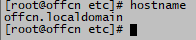

l  修改/etc/hosts文件，添加一条记录

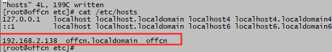

## 建用户，用户组，目录，设置权限
l  创建用户组

有三个组，oinstall是主组，dba和oper是附加组

root# groupadd oinstall

root# groupadd dba

root# groupadd oper

l  创建用户

root# useradd -g oinstall -G dba,oper oracle

 

l  给用户设置密码

root# passwd oracle

Changing password for user oracle.

New UNIX password:oracle

BAD PASSWORD: it is based on a dictionary word

Retype new UNIX password:oracle

passwd: all authentication tokens updated successfully.

 

l  创建oracle安装目录

root# mkdir -p /u01/app/

root# mkdir /u01/app/oracle

root# mkdir /u01/app/oraInventory

 

l  安装目录设置属主和属组

root# chown -R oracle:oinstall /u01/app/

 

l  安装目录设置权限

root# chmod -R 775 /u01/app/

 

## 设置操作系统参数
根据Oracle11gR2文档，设置核心参数值；oracle软件运行中需要调整系统参数，以符合oracle运行要求

 

l  root用户在/etc/sysctl.conf文件中加入下列行：

fs.aio-max-nr = 1048576

fs.file-max = 6815744

kernel.shmall = 2097152

kernel.shmmax = 975441920

kernel.shmmni = 4096

kernel.sem = 250 32000 100 128

net.ipv4.ip_local_port_range = 9000 65500

net.core.rmem_default = 262144

net.core.rmem_max = 4194304

net.core.wmem_default = 262144

net.core.wmem_max = 1048576

l  使修改的核心参数立即生效

root# sysctl -p

l  设置Shell Limits (系统资源限制)

root用户在/etc/security/limits.conf文件末尾中加入下列行：

oracle soft nofile 65536

oracle hard nofile 65536

oracle soft nproc 16384

oracle hard nproc 16384

 

l  设置oracle用户环境变量

oracle用户在/home/oracle/.bash_profile中删掉原来的最下面三行，然后加添下面的oracle环境变量

需要从root用户切换到oracle, su - oracle，然后修改 /home/oracle/.bash_profile

root# su - oracle

 

oracle$ vi .bash_profile

 

# add for oracle11gR2

ORACLE_BASE=/u01/app/oracle

ORACLE_HOME=$ORACLE_BASE/product/11.2.0/dbhome_1

ORACLE_SID=prod

PATH=$ORACLE_HOME/bin:$PATH

export ORACLE_BASE ORACLE_HOME ORACLE_SID PATH

 

alias sqlplus='rlwrap sqlplus'

alias rman='rlwrap rman'

 

export NLS_LANG="SIMPLIFIED CHINESE"_CHINA.AL32UTF8

export NLS_DATE_FORMAT='YYYY-MM-DD HH24:MI:SS'

export NLS_TIMESTAMP_FORMAT='yyyy-mm-dd HH24:MI:SSXFF'

export NLS_TIMESTAMP_TZ_FORMAT='yyyy-mm-dd HH24:MI:SSXFF TZR'

 

修改完.bash_profile后，要想使环境变量生效，以oracle用户用source命令（当前shell生效）执行.bash_profile

oracle$ source /home/oracle/.bash_profile

 

## 挂载oracle11gR2安装盘
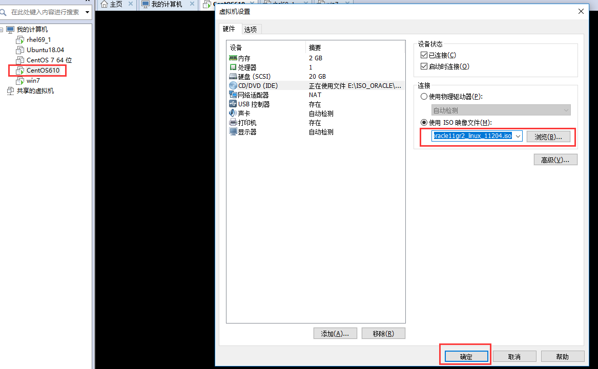

 

root# mount /dev/cdrom /mnt

 

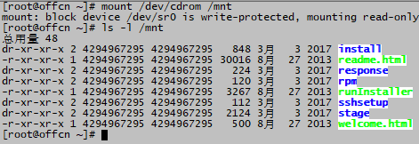

 

 

## 启动XManager，passive
oracle默认安装过程需要图形界面支持，最小安装无图形界面，可以利用第三方xwindows解析软件如：xmanager, xming解决图形界面

 

 

windows右下角图标tray中出现：

 

## 安装缺失的显示器检测包
oracle安装程序使用命令xdpyinfo来检查显示器，linux最小安装时没有安装需要后续安装；当然不安装也可以，但是oracle的runInstaller程序会报错

 

root# yum install xdpyinfo 

 

## 设置Oracle用户LANG环境变量
切换oracle用户

root# su - oracle

 

注：windows版oracle 11.2.0.4.0支持中文安装界面，但是linux版的oracle 11.2.0.4.0 java安装程序忘记添加一个中文字体字库(bug)，中文环境汉字都是方块，所以linux需要采用英文环境，对系统环境变量LANG要重新设置成英文（本机安装时，LANG=zh_CN.UTF-8，需要修改国家和地区值为en和US）

 

oracle$ export LANG=en_US.UTF-8

 

## 设置Oracle用户DISPLAY环境变量
选用知道Centos虚机对应windows这边网卡的ip; cmd> ipconfig

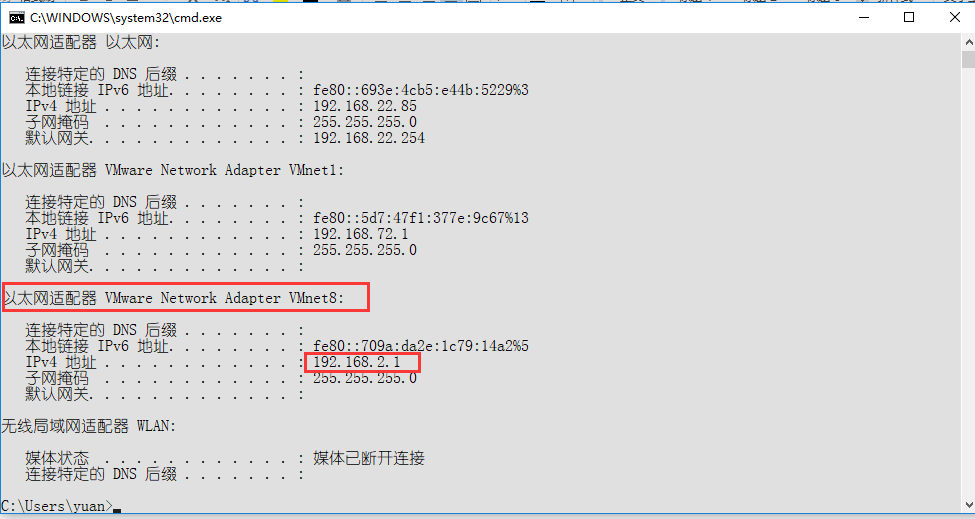

 

注：192.168.2.1windows这边已经打开了xwindows解析软件xmanager passive，linux的oracle安装图形界面将使用xmanager解析，使用windows的显卡画在windows这边

oracle$ export DISPLAY=192.168.2.1:0.0

 

 

# 二、安装oracle软件
## 进入安装目录
oracle$ cd /mnt

oracle$ ./runInstaller

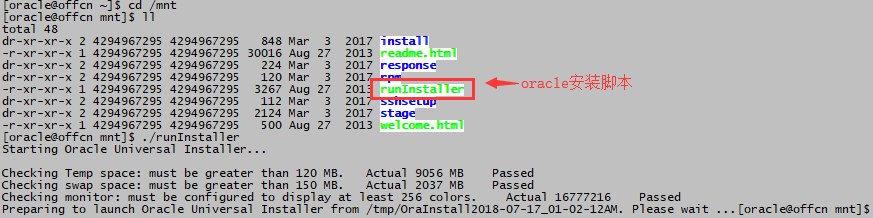

 

## 开始安装oracle软件

 

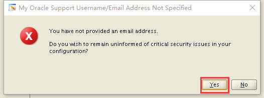

 

 

 

 

 

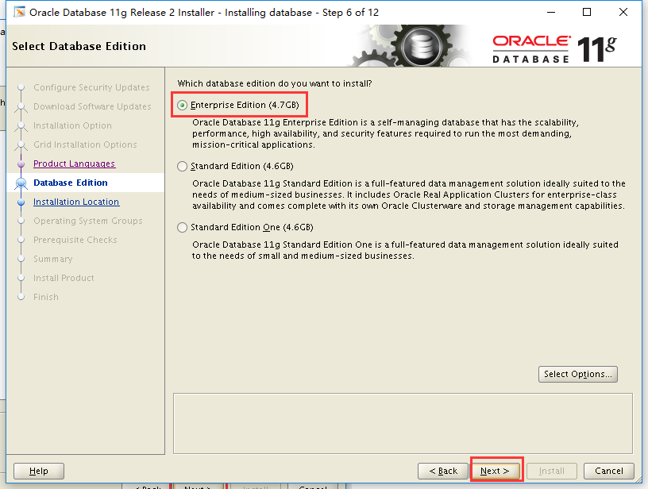

 

 

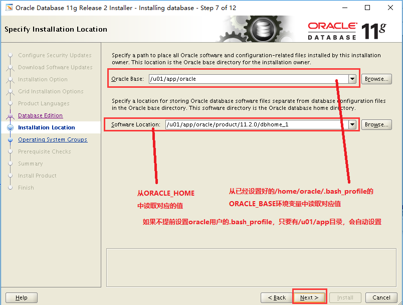

/u01/app/oraInventory 目录下存放已安装的oracle各类软件（oracle不光有数据库还有其他软件，如：应用服务器，集群件，ERP等）的组件清单，一般是安装时需要这个目录

 

 

## 开启额外的会话，以root用户安装缺失软件包
root# yum install gcc-4*

root# yum install libaio-devel-*

 

root# yum install compat-libstdc++-*

 

root# yum install elfutils-libelf-devel-*

 

root# yum install gcc-c++-*

 

root# yum install sysstat-*

 

上传pdksh-5.2.14-37.el5_8.1.x86_64.rpm到root家目录，oracle部分组件使用了ksh功能，需要额外安装pdksh包，该包centos6没有提供，centos5中有

yum install /root/pdksh-5.2.14-37.el5_8.1.x86_64.rpm

 

 

 

 

 

 

 

## 以root用户执行2个脚本
以root身份（多开个会话）执行，不要忘记了，否则后续DBCA建库有可能会报错

root# /u01/app/oraInventory/orainstRoot.sh

root# /u01/app/oracle/product/11.2.0/dbhome_1/root.sh

 

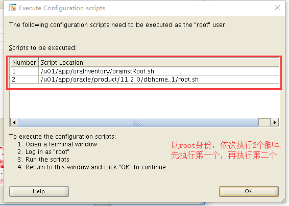

执行完了，点击OK按钮

 

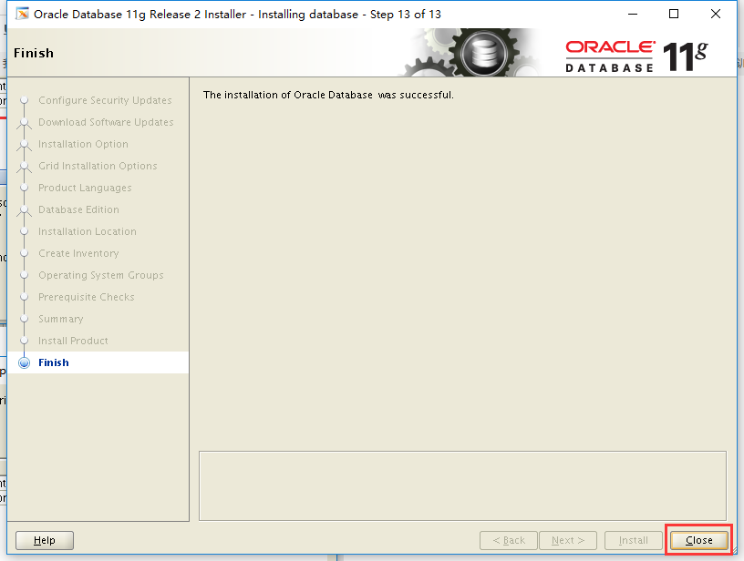

 

## 安装rlwrap及其unixODBC软件包
 

上传rlwrap-0.42-1.el6.x86_64.rpm到root家目录；该程序提供sqlplus历史记录，使用起来方便一些

root# yum install /root/rlwrap-0.42-1.el6.x86_64.rpm     #该包需要perl相关的软件包

 

 

 

如果有微软的应用程序需要连接oracle，需要安装unixODBC包，可以提前安装好，也可以需要时再安装

root# yum install unixODBC

root# yum install unixODBC-devel-*

 

# 三、配置监听器
**系统的****oracle****用户执行，安装过程用到图形界面，需要指定****DISPLAY****变量**

**oracle$ export DISPLAY=192.168.2.1:0.0     #****安装****oracle****软件时，安装的会话已经设置，如果变更其他会话需要设置**

**oracle$ netca**

 

 

 

 

 

 

 

 

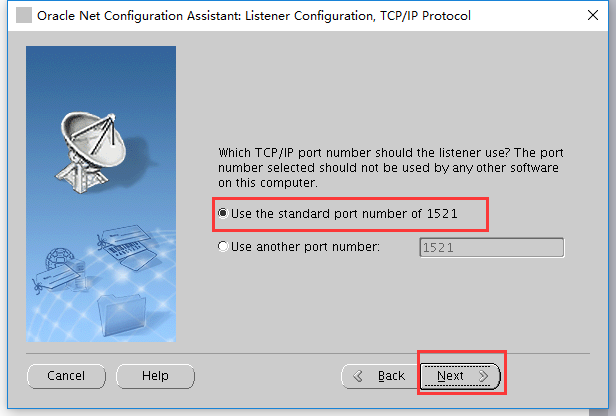

 

 

 

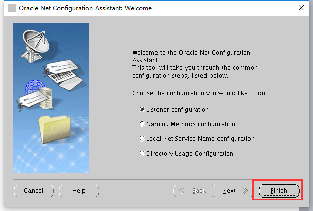

 

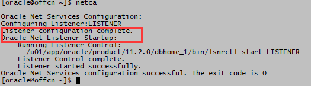

 

# 四、创建数据库
**oracle$ export DISPLAY=192.168.2.1:0.0     #****安装****oracle****软件时，安装的会话已经设置，如果变更其他会话需要设置**

**oracle$ dbca**

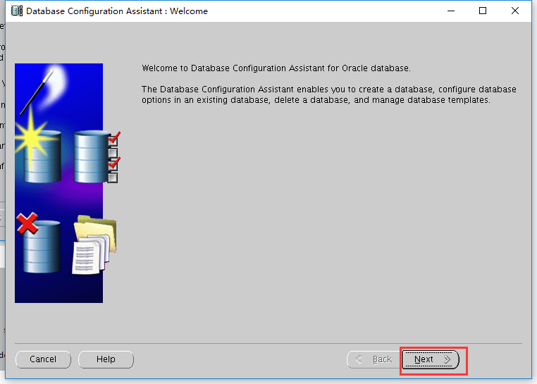

 

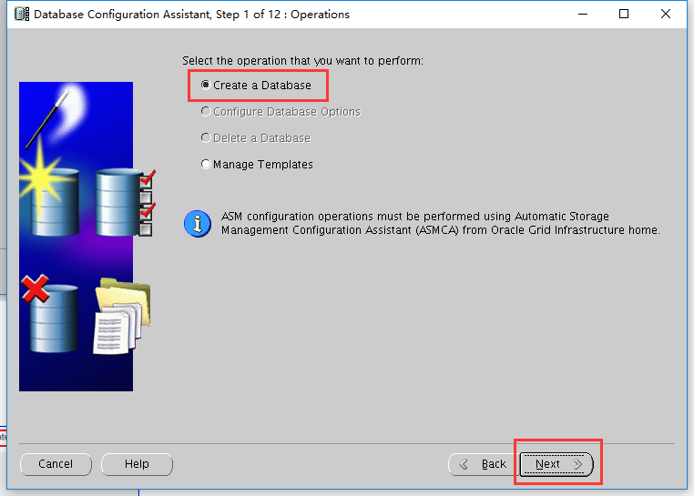

选择“一般用途和事务处理”这个选项，其他选项是定制和数据仓库(主要是select语句，只读操作多，dml少)，主要区别是启动参数的设置不太一样

和系统oracle用户下的.bash_profile中的ORACLE_SID环境变量的值一致，如果更改需要调整ORACLE_SID的值，否则连接不了数据库

Oracle Enterprise Manager简称OEM，是oracle浏览器版客户端，功能强大但是耗费资源，bug也多

给oracle内部用户设置密码

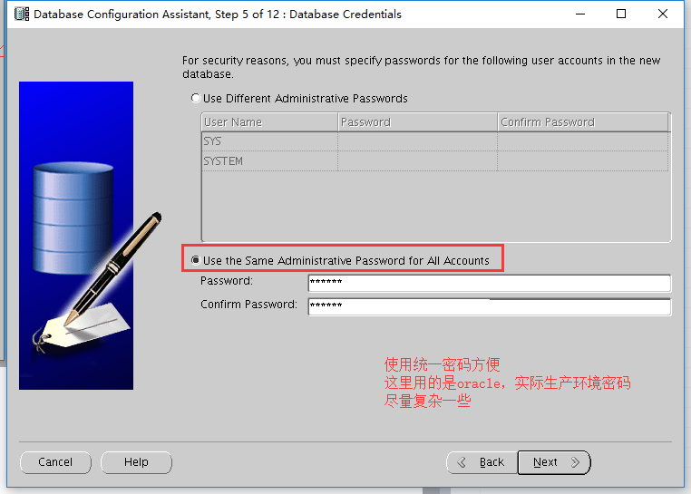

 

 

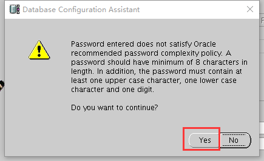

 

Oracle可以安装到文件系统、ASM(oracle的lvm)、裸设备上，当前场景只能选择文件系统

fast recovery area称为闪回恢复区，备份归档日志等如果没有指定路径会自动放到这个目录中，方便管理，oracle可以自动识别

 

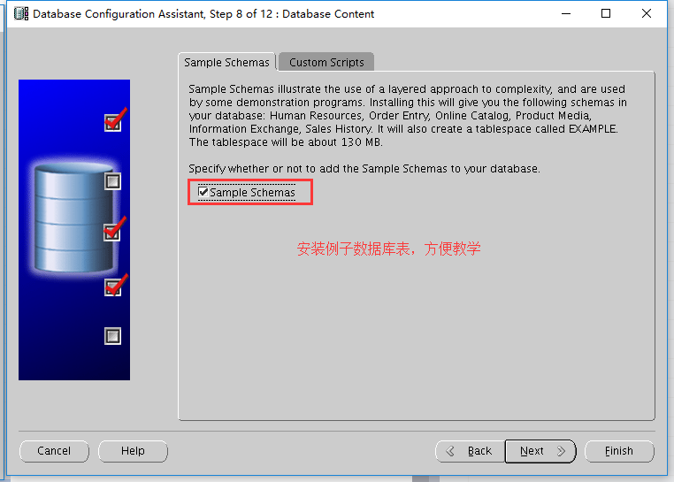

当前虚拟机内存2048M，如果不指定会分配2048*0.9的内存给oracle数据库用，教学用500M足够，最小大约400M

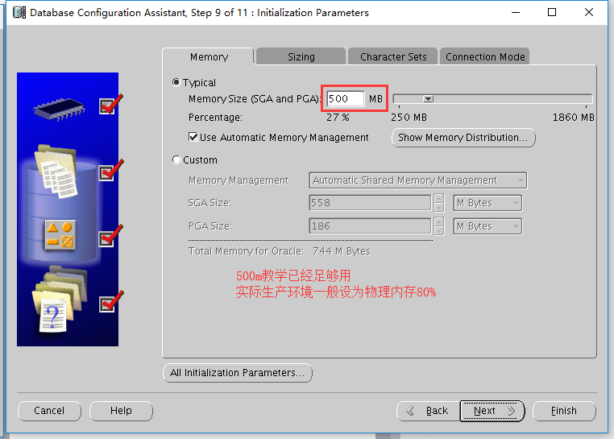

 

 

 

 

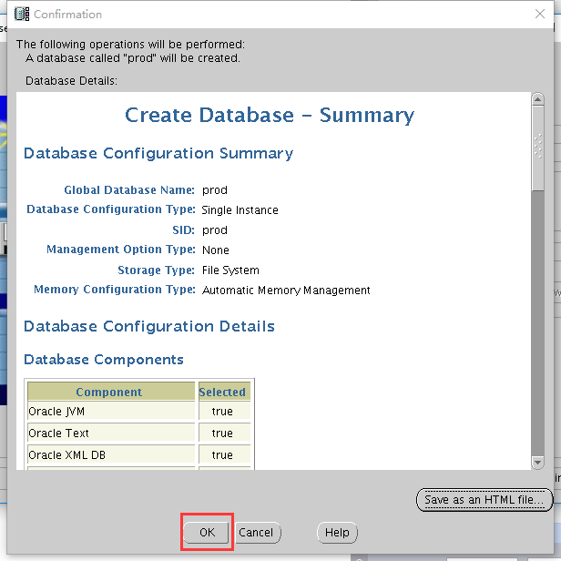

 

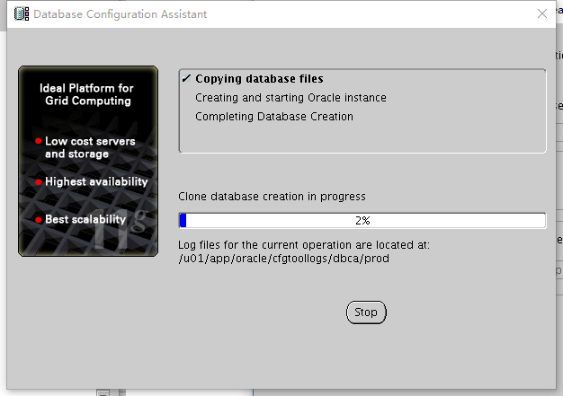

点击“exit”按钮完成创建数据库

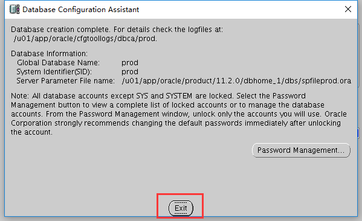

 

# 五、测试安装
安装oracle数据库以后，对于oracle数据库的相关操作都要以操作系统的oracle用户来做，如果以root身份登录系统，需要切换到oracle用户来操作，su - oracle

 

## 测试监听器状态
oracle$ lsnrctl status

 

如果出现Service.......等文字说明oracle实例prod已经注册到了监听器(listener)，可以通过网络访问数据库prod

 

 

## 测试sqlplus本地连接
oracle$ sqlplus / as sysdba

** **

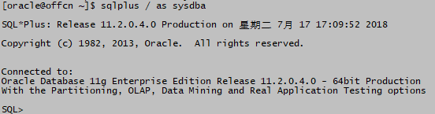

查看实例状态

SQL> select instance_name,status from v$instance;

 

查看用户状态

SQL> select username,account_status from dba_users;

 

## 解锁示例用户
SQL> alter user scott identified by tiger account unlock;

用户名为scott已经存在，密码为tiger

SQL> select username,account_status from dba_users where username='SCOTT';

 

## 修改sqlplus全局配置文件glogin.sql
SQL> quit

oracle$ vi $ORACLE_HOME/sqlplus/admin/glogin.sql

末尾添加

set linesize 220

set pagesize 50

set sqlprompt "_user'@'_connect_identifier>"

define _editor=vi

 

保存退出vi

 

可以设置sqlplus显示效果，显示用户名实例名，指定行的宽度（默认一行显示80个字，多了会折行看起来不方便）和页中行的数量

 

 

## 以普通用户SCOTT登录
oracle$ sqlplus scott/tiger

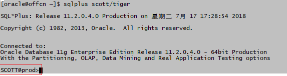

 

## 查看用户SCOTT有哪些表、视图等数据对象
SCOTT@prod>select * from tab;

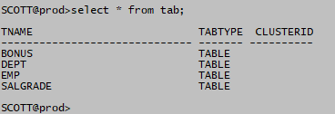

 

## 查看表中有哪些列
SCOTT@prod>desc emp

## 查看表中有哪些行
SCOTT@prod>select * from emp;

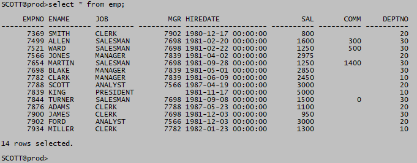

 

## SQLPLUS中切换用户
**从****scott****切换到****sys**

SCOTT@prod>conn / as sysdba

SYS@prod>show user;

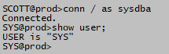

**从****sys****切换到****system**

SYS@prod>conn system/oracle

SYSTEM@prod>show user;

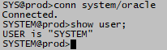

**从****system****切换到****scott**

SYSTEM@prod>conn scott/tiger

SCOTT@prod>show user;

 

sys是oracle数据库prod中的超级用户可以启动关闭删除数据库，拥有最高的权限，相当于linux操作系统中的root用户

system是oracle数据库prod中的数据库管理员，除了不能启动关闭和删除数据库之外，其他的事情都能做，包括：删除其他用户的表，查看其他用户的表内容等等

scott是普通用户，对于自己的数据表有完全控制权限，但是其他用户的表做不了任何操作，除非其他用户授权给scott

 

## 测试通过监听器连接数据库
SCOTT@prod>quit

oracle$ sqlplus scott/tiger@localhost:1521/prod

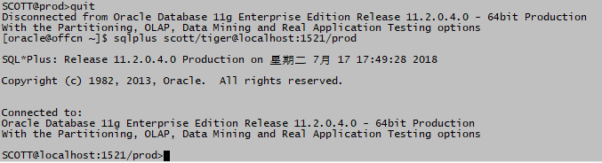

 

## 切换用户中使用监听器
**从****scott****切换到****sys**

SCOTT@localhost:1521/prod>conn sys/oracle@192.168.2.138:1521/prod as sysdba

**从****sys****切换到****system**

SYS@192.168.2.138:1521/prod>conn system/oracle@localhost:1521/prod

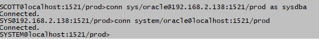

如果是用户sys要加 as sysdba，其他用户不用加

 

## 关闭数据库(只能sys用户做)
SYSTEM@localhost:1521/prod>shutdown immediate;

ORA-01031: 权限不足

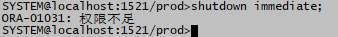

本地切换到sys

SYSTEM@localhost:1521/prod>conn / as sysdba

SYS@prod>shutdown immediate

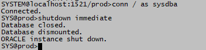

关闭了数据库后，用户的数据表就访问不到了

## 开启数据库(只能sys用户做)
SYS@prod>startup

 

## 关闭数据库后关闭监听器
SYS@prod>shutdown immediate

SYS@prod>quit

oracle$ lsnrctl stop

oracle$ lsnrctl status

 

 

## 启动linux系统后，启动oracle数据库
root# su - oracle

oracle$ lsnrctl start

oracle$  sqlplus / as sysdba

SYS@prod>startup

SYS@prod>!lsnrctl status   # sqlplus调用系统命令可以用 ！或 host 后跟命令字

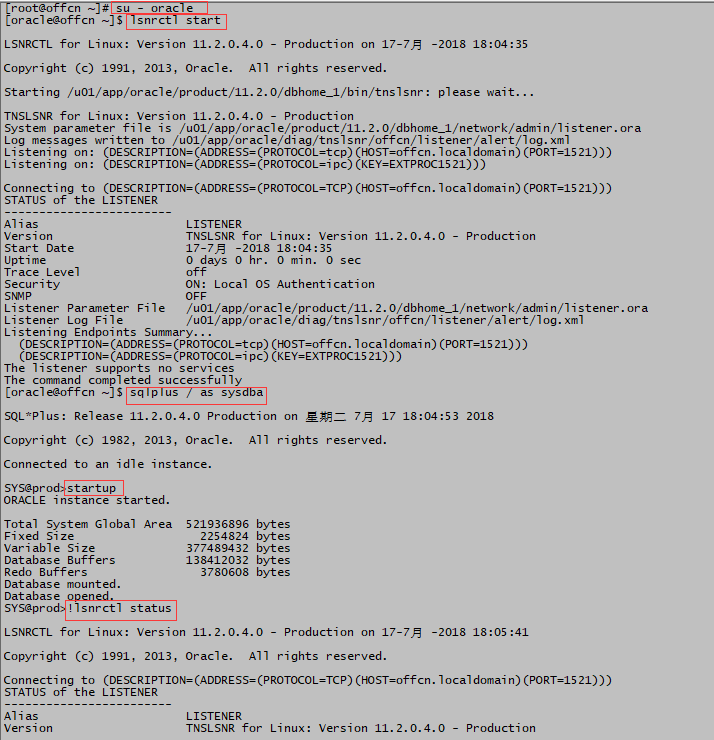

 

 

# 六、根据需要给虚拟机做快照和备份
利用虚拟机软件的功能生成快照

关闭虚拟机后，可以导出虚机，生成.ova或.ovf文件，后续可以根据需要导入到其他虚拟机软件中，因为安装一遍oracle步骤较多，费时间

 

