# oracle-12c-linux安装
### 安装前准备阶段
#### * 修改linux内核参数以适应oracle12c
vi /etc/sysctl.conf

 

fs.aio-max-nr = 1048576

fs.file-max = 6815744

kernel.shmmni = 4096

kernel.sem = 250 32000 100 128

net.ipv4.ip_local_port_range = 9000 65500

net.core.rmem_default = 262144

net.core.rmem_max = 4194304

net.core.wmem_default = 262144

net.core.wmem_max = 1048576

 

 

sysctl -p

 

#### * 修改资源限制
vi /etc/security/limits.conf

 

oracle              soft    nproc   2047

oracle              hard    nproc   16384

oracle              soft    nofile  1024

oracle              hard    nofile  65536

oracle              soft    stack   10240

 

#### * 添加linux用户组
 

groupadd oinstall

groupadd dba

groupadd oper

groupadd backupdba

groupadd dgdba

groupadd kmdba

groupadd asmdba

groupadd racdba

 

#### * 添加用户oracle
useradd -g oinstall -G dba,oper,backupdba,dgdba,kmdba,asmdba,racdba oracle

 

* 给用户oracle设定密码

passwd oracle

 

 

#### * 创建oracle安装目录并授权
mkdir -p /u01/app/oracle

chown oracle:oinstall /u01/app /u01/app/oracle

chmod -R 775 /u01/

 

#### * 切换用户到oracle
su - oracle

 

#### * 修改 vi /home/oracle/.bash_profile
 

# add for oracle12cR2

ORACLE_BASE=/u01/app/oracle

ORACLE_HOME=$ORACLE_BASE/product/12.2.0/dbhome_1

ORACLE_SID=prodsid

ORACLE_UNQNAME=prod

PATH=$ORACLE_HOME/bin:$PATH

export ORACLE_BASE ORACLE_HOME ORACLE_SID ORACLE_UNQNAME PATH

 

NLS_LANG=AMERICAN_AMERICA.AL32UTF8

#NLS_LANG="SIMPLIFIED CHINESE"_CHINA.AL32UTF8

 

export NLS_LANG

export NLS_DATE_FORMAT='YYYY-MM-DD HH24:MI:SS'

export NLS_TIMESTAMP_FORMAT='YYYY-MM-DD HH24:MI:SSXFF'

export NLS_TIMESTAMP_TZ_FORMAT='YYYY-MM-DD HH24:MI:SSXFF TZR'

 

alias sqlplus='rlwrap sqlplus'

alias rman='rlwrap rman'

alias asmcmd='rlwrap asmcmd'

 

#### * 安装缺失软件包
yum install compat-libcap1-*

yum install compat-libstdc++-*

yum install libstdc++-devel-*

yum install gcc-c++-*

yum install libaio-devel-*

yum install ksh*

 

上传rlwrap-0.42-1.el6.i686.rpm到linux服务器/root

yum install /root/rlwrap-0.42-1.el6.i686.rpm 

#### * /etc/hosts文件添加本机静态IP
vi /etc/hosts

192.168.3.88 [hostname]  [hostname].localdomain

 

### 安装ORACLE软件阶段
#### * 安装oracle软件
上传oracle安装介质到oracle用户家目录

解压

export DISPLAY=192.168.3.100:0.0

 

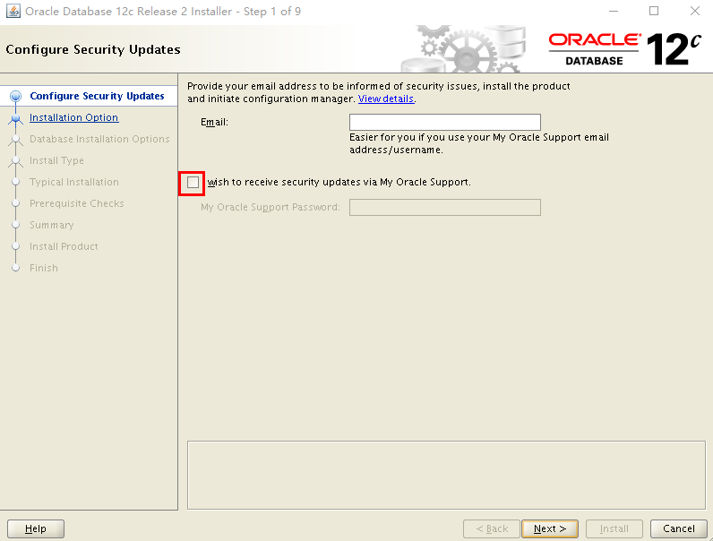

 

 

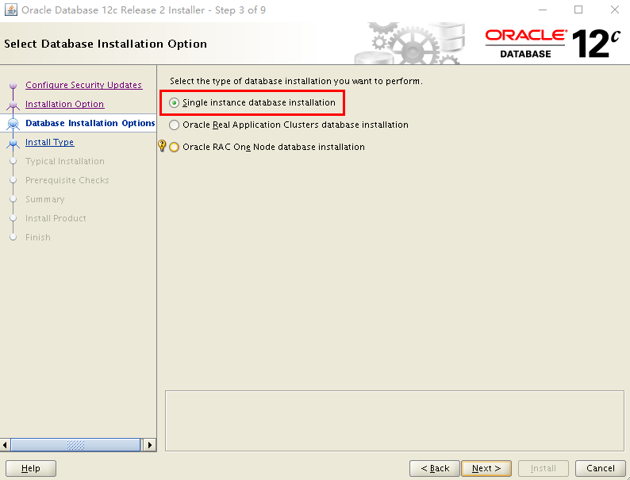

 

 

 

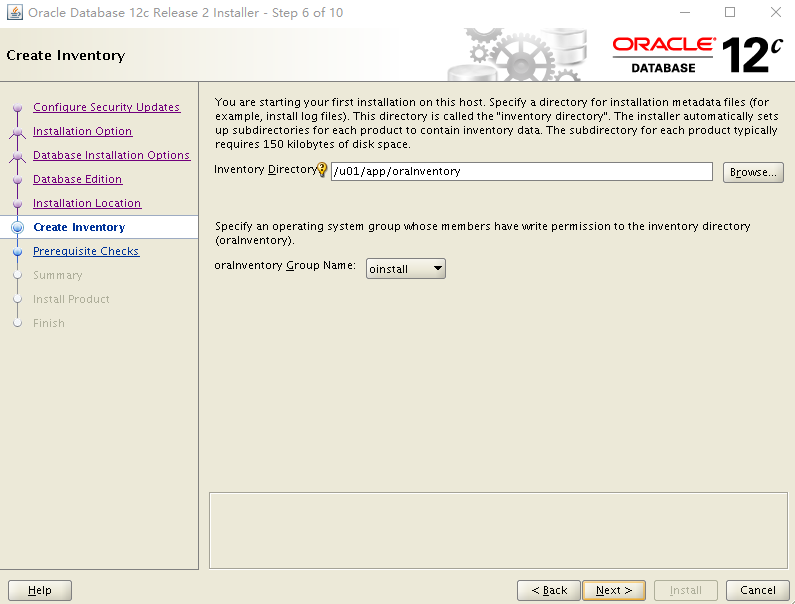

 

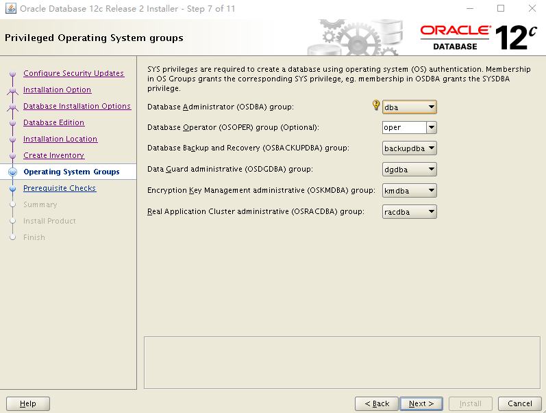

 

 

 

 

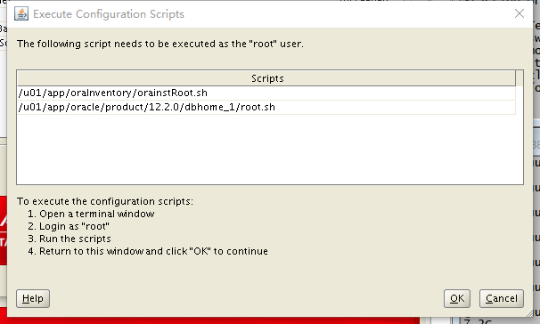

 

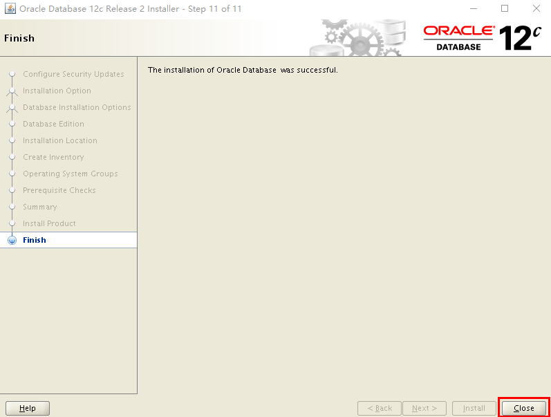

 

 

### 配置监听器阶段
#### * 配置监听
netca

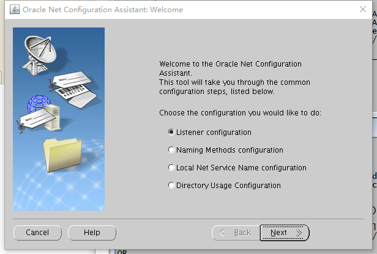

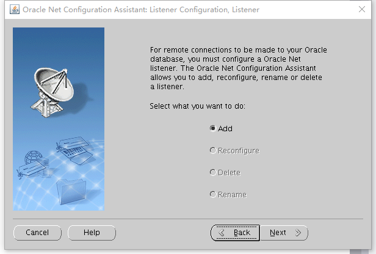

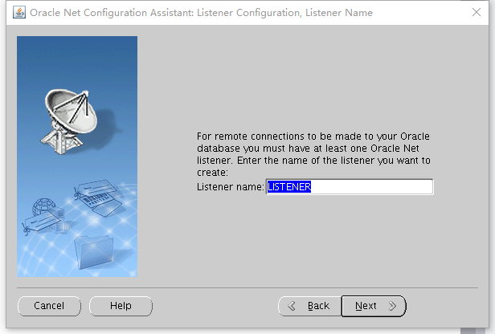

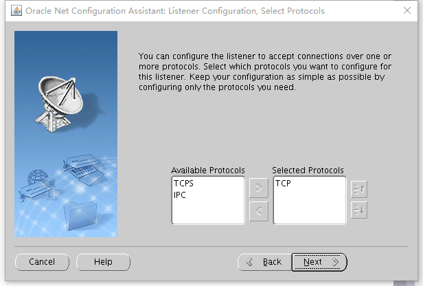

 

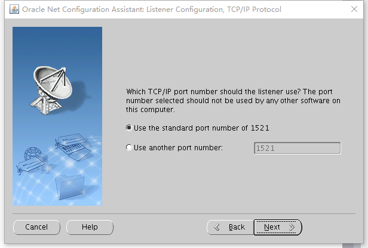

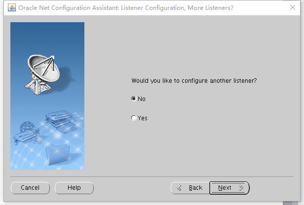

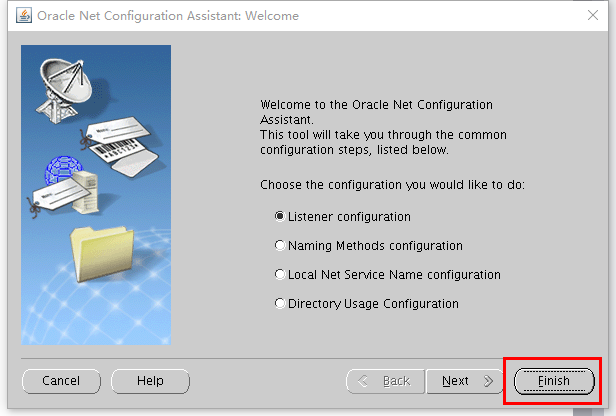

 

 

### 创建数据库阶段
#### * 创建oracle数据库
dbca

 

 

 

 

 

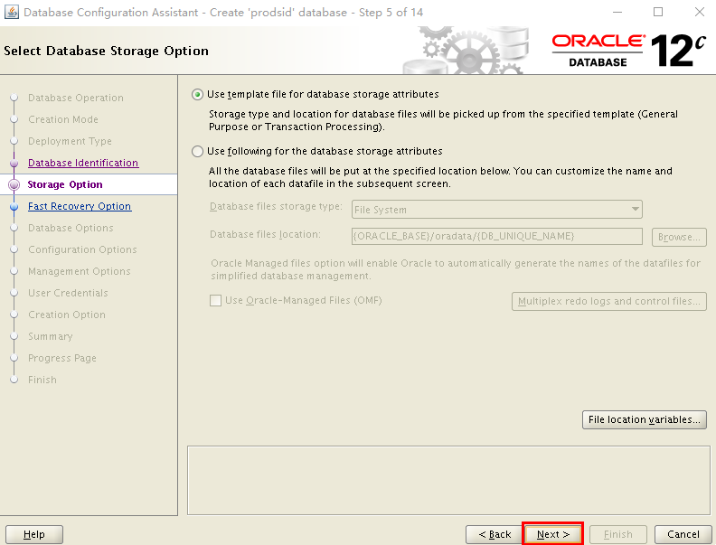

 

 

 

 

 

 

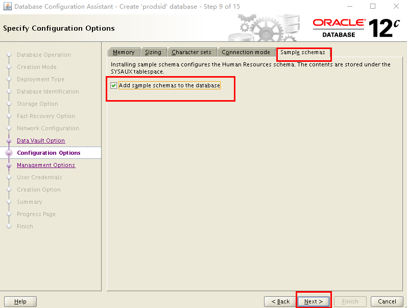

 

 

 

 

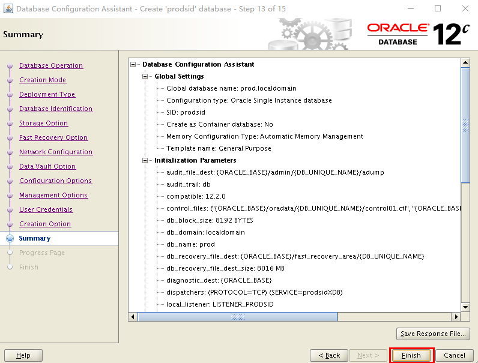

 

 

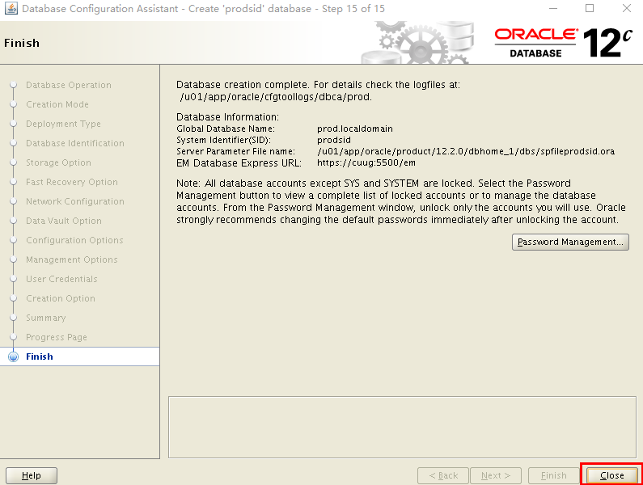

 

### 安装后检验阶段
#### * 修改$ORACLE_HOME/sqlplus/admin/glogin.sql，方便sqlplus使用
define _editor=vi

set linesize 220

set pagesize 50

set sqlprompt "_user'@'_connect_identifier>"

 

#### * 用sqlplus连接数据库实例
[oracle@offcn ~]$ sqlplus / as sysdba

 

#### * 查看监听器状态
[oracle@offcn ~]$ lsnrctl status

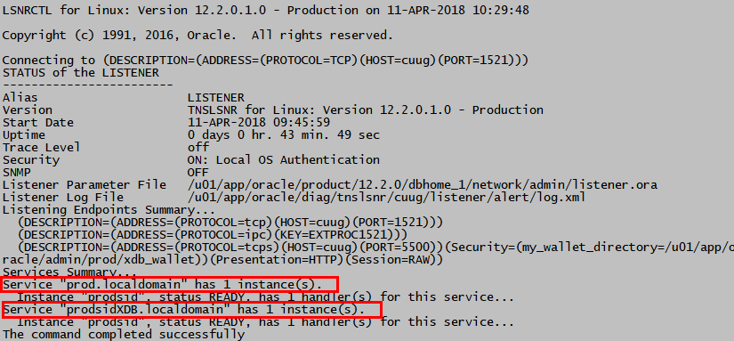

#### * 查看用户状态

 

#### * 测试使用监听器连接数据库实例
[oracle@offcn ~]$ sqlplus sys/oracle@192.168.3.88:1521/prod.localdomain as sysdba

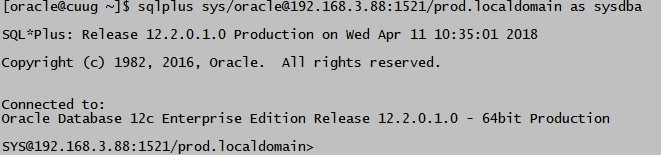

 

#### * 添加SCOTT用户
sqlplus / as sysdba @$ORACLE_HOME/rdbms/admin/utlsampl.sql

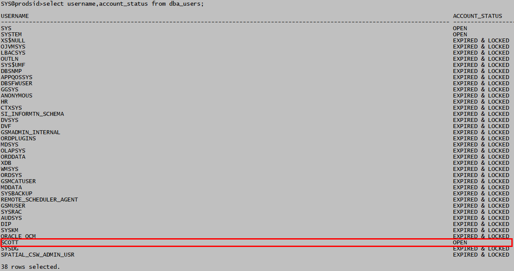

scott用户密码：tiger

 

### Oracle管理的常用命令
启动关闭数据库：

sqlplus / as sysdba

启动

sys@prod>startup

 

关闭

sys@prod>shutdown immediate

 

 

远程通过网络连接：

* 开库

* 启动监听器，同时服务注册到监听器

 

sqlplus sys/oracle@192.168.3.88:1521/prod.localdomain as sysdba

sqlplus scott/tiger@192.168.3.88:1521/prod.localdomain

本地连接：

sqlplus / as sysdba

sqlplus scott/tiger

 

解锁用户，修改密码：

sqlplus / as sysdba

select username,account_status from dba_users;

sys@prod>alter user scott identified by scott account unlock;解锁同时修改密码

sys@prod>alter user scott identified by scott; 修改密码

sys@prod>alter user scott account unlock;解锁用户

sys@prod>alter user hr identified by hr account unlock;解锁用户

 

sys用户查看用户的表：

sys@prod>select * from scott.emp;

普通用户查看属于自己的表：

sqlplus scott/scott

scott@prod>select * from tab;

scott@prod>select * from dept;

 

切换用户：

sys@prod>conn scott/tiger;          从sys切换到scott用户     

scott@prod>conn sys/system as sysdba 切换回sys

scott@prod>conn / as sysdba           切换回sys

 

