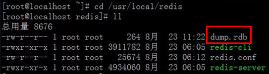
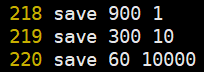
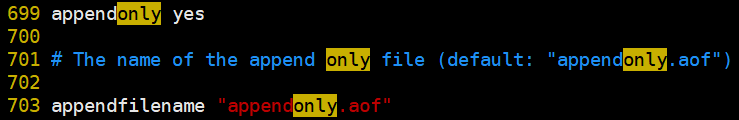

# Redis持久化

> 分类: Database > Redis
> 更新时间: 2026-01-10T23:34:25.640438+08:00

---

redis为了内部数据的安全，会把本身的数据以文件的形式保存到硬盘一份，在服务器重启之后会自动把硬盘的数据恢复到内存redis的里边，数据保存到硬盘的过程就称为持久化

# 一、snap shotting快照持久化
1. 简介

该持久化默认开启，一次性把redis中全部的数据保存一份到硬盘中，如果数据非常多，就不适合频繁该持久化操作

1. 文件位置

1. Redis快照持久化频率，配置文件修改

满足在X秒内，超过Ykb大小的数据改变，则保存

1. 快照文件配置

1. 手动建立快照
+ 本地备份

# redis-cli bgsave

+ 异机备份

# redis-cli -p 192.168.10.23 6379 bgsave

# 二、append only file（AOF持久化）
1. 本质

把用户执行的每个“写”指令（添加、修改、删除）都备份到文件中，还原数据的时候就是执行具体的指令而已

1. 开启AOF持久化（会清空数据库）

+ 修改配置后重启服务
1. AOF追加持久化备份频率

| 选项 | 说明 | 性能损耗 | 安全性 |
| --- | --- | --- | --- |
| appendfsync always | 每次收到写命令就进行快照 | 大 | 高 |
| appendfsync   everysec | 每秒进行一次写快照 | 中 | 中 |
| appendfsync   no | 依赖操作系统进行写快照 | 小 | 低 |

1. AOF备份文件压缩优化
+ 本地备份

# redis-cli bgrewriteaof

+ 异机备份

# redis-cli -p 192.168.10.23 6379 bgrewriteaof

