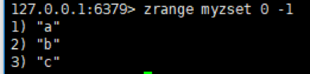
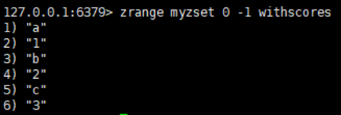
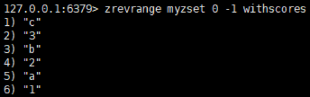
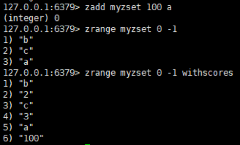

# Redis有序集合(sorted set)

> 分类: Database > Redis
> 更新时间: 2026-01-10T23:34:25.533022+08:00

---

# 一、简介
1. Redis      有序集合和集合一样也是string类型元素的集合,且不允许重复的成员。
2. 不同的是每个元素都会关联一个double类型的权。redis正是通过权值来为集合中的成员进行从小到大的排序。
3. 有序集合的成员是唯一的,但分数(score)却可以重复。
4. 集合是通过哈希表实现的，所以添加，删除，查找的复杂度都是O(1)。      集合中最大的成员数为 232 - 1 (4294967295, 每个集合可存储40多亿个成员)。

# 二、命令
1. 添加元素到集合

| 命令 | 描述 |
| --- | --- |
| ZADD key   score1 member1 [score2 member2] | 添加一个或多个成员，或者更新已存在成员的分数 |

1. 删除集合元素

| 命令 | 描述 |
| --- | --- |
| ZREM key   member [member ...] | 移除有序集合中的一个或多个成员 |

1. 修改集合元素

| 命令 | 描述 |
| --- | --- |
| ZINCRBY   key increment member | 有序集合中对指定成员的分数加上增量   increment |

1. 查询集合元素

| 命令 | 描述 |
| --- | --- |
| ZCARD key | 获取有序集合的成员数 |
| ZRANK key   member | 返回有序集合中指定成员的索引 |
| ZREVRANK   key member | 返回有序集合中指定成员的排名，有序集成员按分数值递减(从大到小)排序 |
| ZRANGE key   start stop [WITHSCORES] | 通过索引区间返回有序集合指定区间内的成员 |
| ZREVRANGE   key start stop [WITHSCORES] | 返回有序集中指定区间内的成员，通过索引，分数从高到低 |
| ZSCORE key   member | 返回有序集中，成员的分数值 |
| ZREMRANGEBYRANK key   start stop | 移除有序集合中给定的排名区间的所有成员 |

# 三、示例
1. 每个集合元素有一个SCORE分值，可以按照分值的大小排序，可以正序或倒序，例如：a.score>b.score，那么a>b，如果分值一样a.score=b.score，按照字母顺序排还是a>b
2. zadd设置key对应的value有序集合
+ 例如：zadd myzset 1 a 2 b 3 c
3. zrange显示有序集合的元素(score从小到大)
+ zrange myzset 0 -1  从第一个到最后一个元素 （-1代表最后一个元素，-2倒数第二个元素）

+ 默认score小的排在前面
+ zrange myzset 0 -1      withscores 显示分值

1. zrevrange显示有序集合的元素(score从大到小)

1. 修改score值，再次使用zadd
+ 例如：zadd myzset 100 a （a原值为1）

