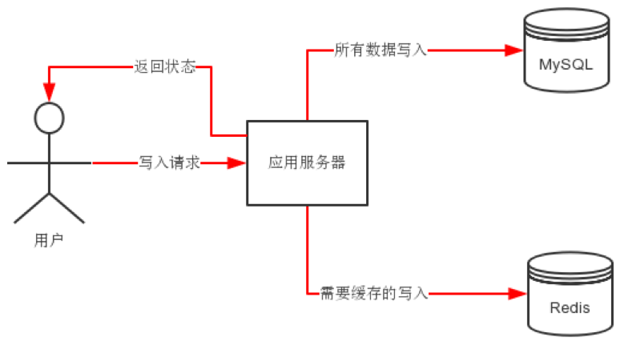
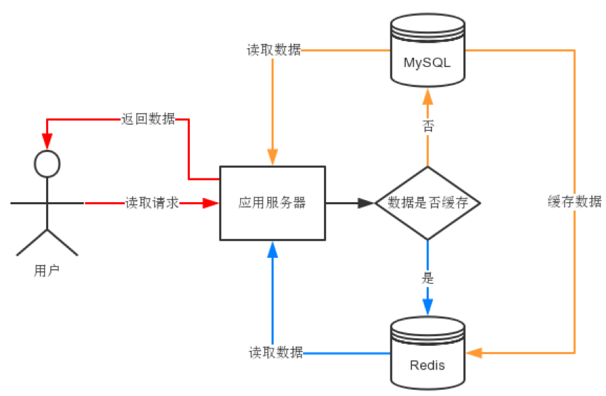

# mysql与redis结合使用
# 一、将mysql表装载到redis
例如：将mysql的demo库中的stu表装载到redis中

步骤

1. 使用mysql的sql语句生成准备导入的数据，将要导入的数据生成带有redis命令的结果集
2. 将产生结果集的sql语句保存到文本文件中
3. 利用mysql客户端运行sql语句脚本，将产生的结果集交给redis客户端，然后装载数据到redis中
+ SQL语句测试结果集

mysql> select concat('hmset stu:',sno,' sno ',sno,' sname ',sname,' sex ',sex,' birth ',birth,' height ',height,' weight ',weight,' score ',score,' cno ',ifnull(cno,'null')) from stu;

+ 生成SQL语句脚本mysql2redis.sql

# 将mysql数据表stu装载到redis执行方式

# mysql -uroot -p demo --skip-column-names --raw < mysql2redis.sql | redis-cli --pipe

# mysql客户端选项

# -N, --skip-column-names  Don't write column names in results.

# -r, --raw                Write fields without conversion.

# redis-cli客户端选项

# --pipe             Transfer raw Redis protocol from stdin to server.

#mysql2redis.sql文件内容

select concat('hmset stu:',sno,' sno ',sno,' sname ',sname,' sex ',sex,' birth ',birth,' height ',height,' weight ',weight,' score ',score,' cno ',ifnull(cno,'null')) from stu;

select concat('hmset class:',cno,' cno ',cno,' cname ',cname,' teacher ',teacher) from class;

select concat('hmset bmi:',id,' id ',id,' bname ',bname,' lval ',lval,' hval ',hval,' sex ',sex) from bmi;

+ 导入数据到redis

mysql -uroot -p demo --skip-column-names --raw < mysql2redis.sql | redis-cli --pipe

# 二、Redis缓存MySQL的常用方案
写入数据时，分别写到redis和mysql中

读取数据时，先查看redis中是否已缓存，如果有之间从redis中读取，因为其高性能；如果没有应用程序从mysql中读取，返回给用户的同时把该数据缓存一份到redis中以备后用

 

