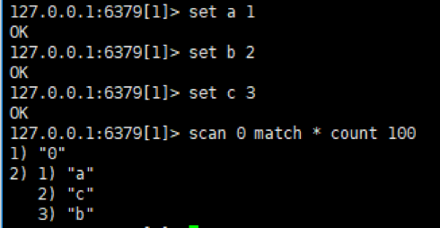
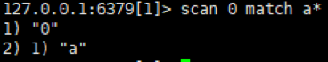

# redis命令

> 分类: Database > Redis
> 更新时间: 2026-01-10T23:34:24.891885+08:00

---

# 一、连接radis命令
1. 语法

redis-cli -h host -p port -a password

1. 实例

演示了如何连接到主机为 127.0.0.1，端口为 6379 ，密码为 mypass 的 redis 服务上。

redis-cli -h 127.0.0.1 -p 6379 -a "mypass"

1. 有时候会有中文乱码。要在 redis-cli 后面加上      --raw

redis-cli --raw

# 二、其他常用命令
1. flushdb清空当前数据库的所有值（慎用）
2. select切换数据库

select 15切换到第16个数据库

select 1 切换到第1个数据库

1. scan查看当前数据库的所有key

例如：scan 0 match * count 100 

其中0为产生一个新的游标，match后为匹配模式 *为所有，count 为显示数量

