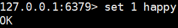
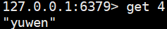
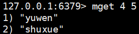
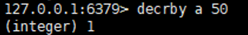

# redis字符串（Strings）

> 分类: Database > Redis
> 更新时间: 2026-01-10T23:34:25.105558+08:00

---

# 一、简介
    1. string 是 redis       最基本的类型，你可以理解成与 Memcached 一模一样的类型，一个 key 对应一个 value。
    2. string 类型是二进制安全的。意思是       redis 的 string 可以包含任何数据。比如jpg图片或者序列化的对象。
    3. string 类型是 Redis       最基本的数据类型，string 类型的值最大能存储 512MB。

# 二、命令
    1. 设定key值

| 命令 | 描述 |
| --- | --- |
| set key    value | 设置key对应的string类型的值 |
| mset key1    value1 keyN valueN | 一次设置多个key值 |
| setnx key    value | 只有在 key 不存在时设置 key 的值 |

    1. 查询key值

| 命令 | 描述 |
| --- | --- |
| get key  | 设置key对应的string类型的值 |
| mget key1    keyN | 一次获取多个key值 |

    1. 修改key值

| 命令 | 描述 |
| --- | --- |
| incr key | 对key的值做加1操作 |
| decr key | 对key的值做减1操作 |
| incrby    key integer | 同incr，加指定值 |
| decrby    key integer | 同decr，减指定值 |
| append    key value | 给指定key的字符串追加value |

    1. 其他操作key值（操作后不保存）

| 命令 | 描述 |
| --- | --- |
| substr    key start end | 返回截取过的key的字符串 |
| getrange    key start end | 返回截取过的key的字符串 |
| strlen    key | 返回key所储存的字符串值的长度 |

# 三、常用操作举例
    1. set语句设置key对应的value值
+ 
    1. mset语句获取key对应的value值
+ 
    1. get语句获取key对应value值
+ 
    1. mget语句获取多个key对应value值
+ 
    1. incr递增步长
+ 
    1.  incrby指定步长
+ 
    1. decr递减步长
+ 
    1. decrby指定步长
+ 
    1. append追加字符串
+ 
    1. substr截取字符串
+ 
+  

