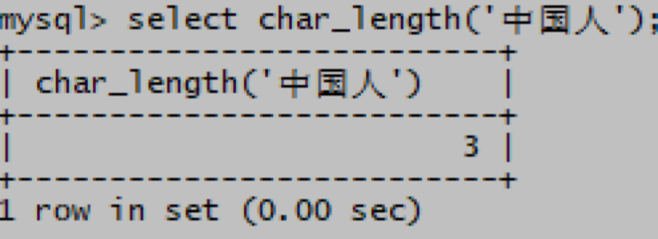
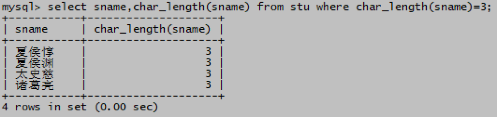
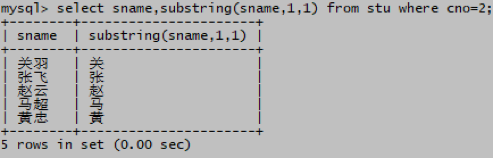

# 字符串函数
# 一、char_length(str)
计算参数str中有多少个字符，str可以是具体的一个字符串，也可以是表中的列

1. 查看字符串“中国人”有几个字

mysql> select char_length('中国人');

1. 学生表中姓名为三个字的学生有哪些？

mysql> select sname,char_length(sname) from stu where char_length(sname)=3;

# 二、concat(str1,str2,……)
把参数str1和str2拼接成一个字符串

1. 把‘我是’和‘中国人’拼接成一句话

mysql> select concat('我是','中国人');

1. 学生表打印已分班的学生姓名和班级，以xxx是x班 的形式打印结果

mysql> select concat(sname,'是',cno,'班') from stu where cno is not null;

# 三、substring(str,pos,len)
把参数str字符串从第pos位起，截取len位

1. 把‘我是中国人’字符串从第3位起截取3位字符

mysql> select substring('我是中国人',3,3);

1. 二班的同学都有什么姓氏？

mysql> select sname,substring(sname,1,1) from stu where cno=2;

 

