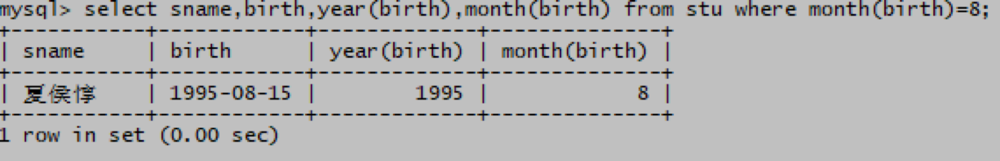
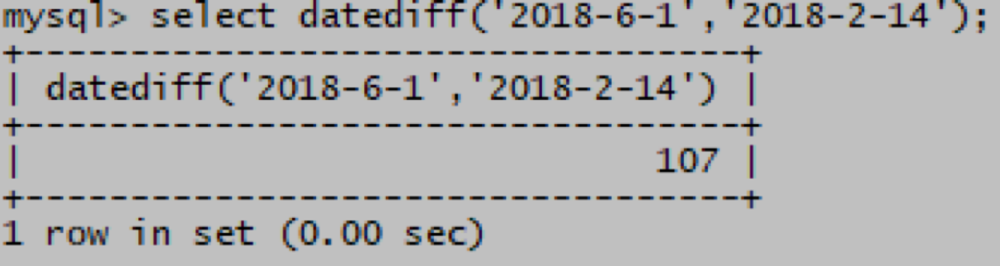

# 日期函数
# 一、year(date1)、month(date1)
year(date1)

获取日期date1的年份

month(date1)

获取日期date1的月份

1. 学生表中哪些同学是1990年出生的？

mysql> select sname,birth,year(birth) from stu where year(birth)=1990;

1. 学生表中哪些同学是8月出生的？

mysql> select sname,birth,year(birth),month(birth) from stu where month(birth)=8;

# 二、其他日期函数
1. curdate()

获取当前日期

1. curtime()

获取当前时间

1. now()

获取当前的日期和时间

1. datediff(date1,date2)

返回date1和date2两个日期间隔的天数

1. 计算2018年6月1日和2018年情人节之间间隔的天数

mysql> select datediff('2018-6-1','2018-2-14');

1. 计算学生表中学生的年龄，显示姓名，生日，年龄（保留2位小数）,只显示小于20岁的同学

mysql> select sname,birth,round(datediff(curdate(),birth)/365,2) 年龄 from stu where round(datediff(curdate(),birth)/365,2)<20;

 

 

