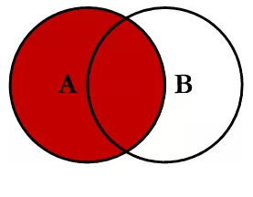
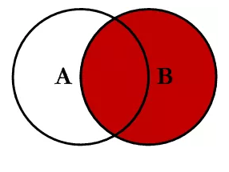
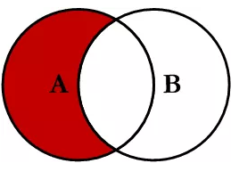
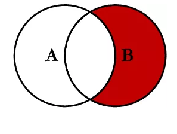
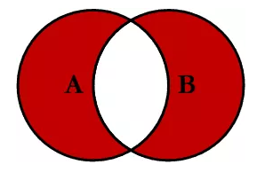
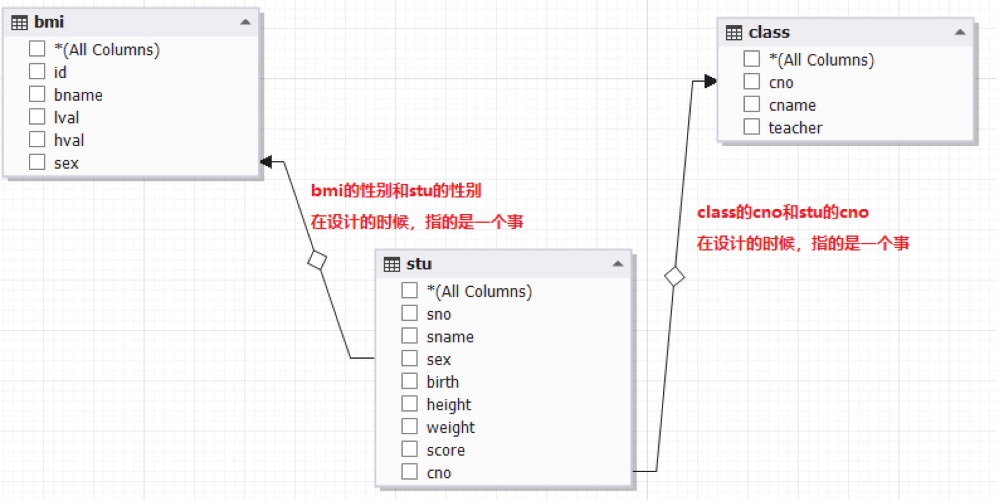
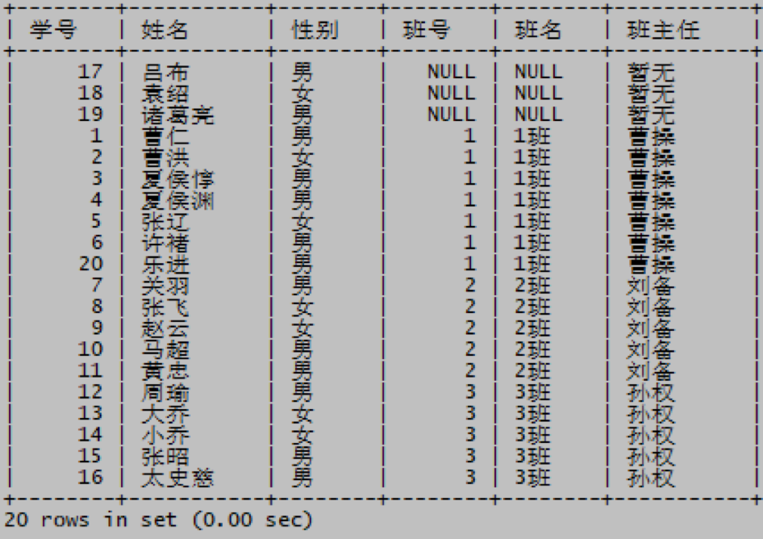
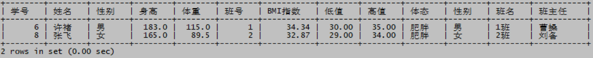

# 多表连接查询总结

> 分类: Database > SQL查询-复杂查询
> 更新时间: 2026-01-10T23:34:13.412249+08:00

---

# 一、连接查询总结
1. INNER JOIN（内连接）

SELECT <select_list>

FROM Table_A A

INNER JOIN Table_B B

ON A.Key = B.Key

1. LEFT JOIN（左连接）

SELECT <select_list>

FROM Table_A A

LEFT JOIN Table_B B

ON A.Key = B.Key

1. RIGHT JOIN（右连接）

SELECT <select_list>

FROM Table_A A

RIGHT JOIN Table_B B

ON A.Key = B.Key

1. OUTER JOIN（外连接）

SELECT <select_list>

FROM Table_A A

FULL OUTER JOIN Table_B B

ON A.Key = B.Key

1. LEFT JOIN EXCLUDING      INNER JOIN（左连接-内连接）

SELECT <select_list>

FROM Table_A A

LEFT JOIN Table_B B

ON A.Key = B.Key

WHERE B.Key IS NULL

1. RIGHT JOIN EXCLUDING      INNER JOIN（右连接-内连接）

SELECT <select_list>

FROM Table_A A

RIGHT JOIN Table_B B

ON A.Key = B.Key

WHERE A.Key IS NULL

1. OUTER JOIN EXCLUDING INNER      JOIN（外连接-内连接）

SELECT <select_list>

FROM Table_A A

FULL OUTER JOIN Table_B B

ON A.Key = B.Key

WHERE A.Key IS NULL OR B.Key IS NULL

# 二、多表连接示例1

1. 显示学生的学号，姓名，性别，班号，班级名称以及他们的班主任姓名，按照班号和学号排序

mysql> select s.sno 学号,s.sname 姓名,s.sex 性别,s.cno 班号,c.cname 班名,c.teacher 班主任 from stu s inner join class c on s.cno=c.cno order by s.cno,s.sno;

1. 显示全部学生的学号，姓名，性别，班号，班级名称以及他们的班主任姓名，无班主任的显示‘暂无’，按照班号和学号排序

mysql> select s.sno 学号,s.sname 姓名,s.sex 性别,s.cno 班号,c.cname 班名,ifnull(c.teacher,'暂无') 班主任 from stu s left join class c on s.cno=c.cno order by s.cno,s.sno;

# 三、多表连接查询示例2

1. 显示所有学生的学号，姓名，性别，身高，体重，班号，BMI指数（体重/身高^2）,BMI表中对应的体态，低值，高值和性别

mysql> select s.sno 学号,s.sname 姓名,s.sex 性别,s.height 身高,s.weight 体重,s.cno 班号,round(weight/(height/100*height/100),2) BMI指数,b.lval 低值,b.hval 高值,bname 体态,b.sex 性别 from stu s left join bmi b on s.sex=b.sex and round(weight/(height/100*height/100),2) between b.lval and b.hval;

1. 基于例3的结果，把肥胖的同学和他们的班主任找出来

mysql> select s.sno 学号,s.sname 姓名,s.sex 性别,s.height 身高,s.weight 体重,s.cno 班号,round(weight/(height/100*height/100),2) BMI指数,b.lval 低值,b.hval 高值,bname 体态,b.sex 性别,c.cname 班名,c.teacher 班主任 from stu s left join bmi b on s.sex=b.sex and round(weight/(height/100*height/100),2) between b.lval and b.hval left join class c on s.cno=c.cno where b.bname='肥胖';

 

