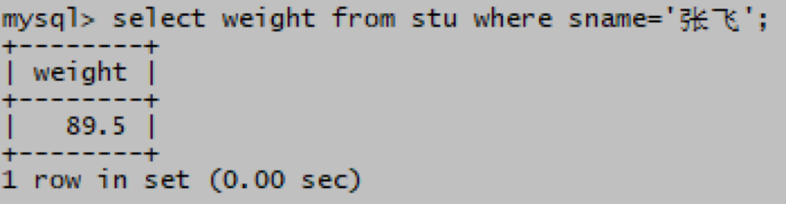
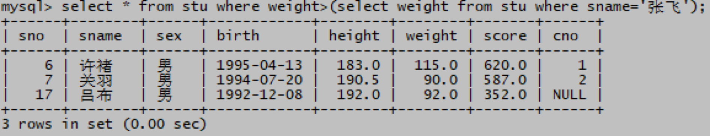
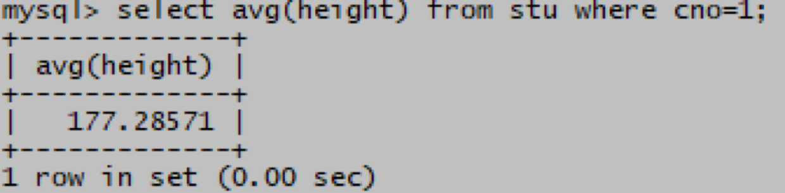
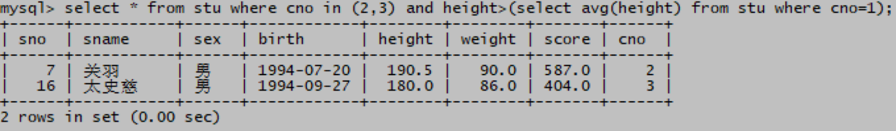
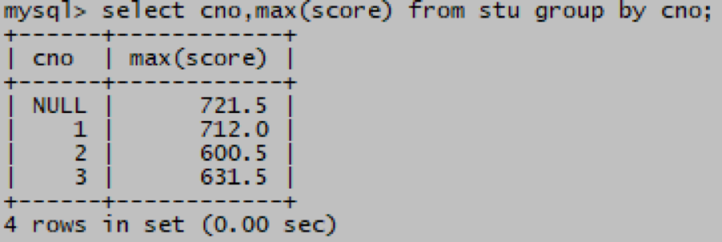
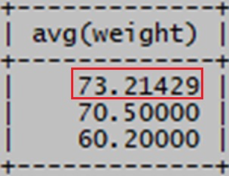
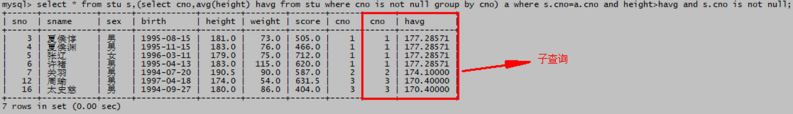
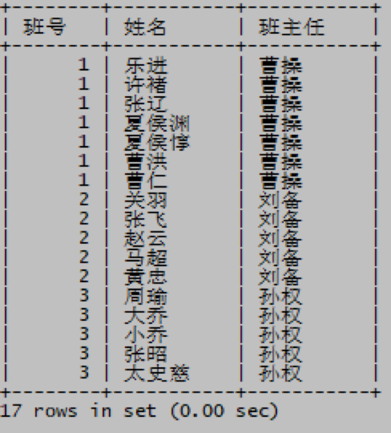
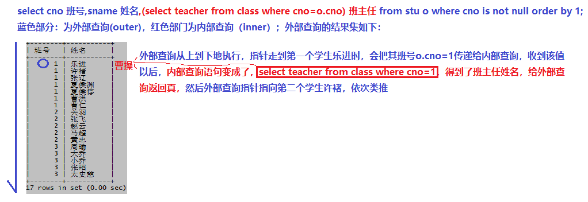
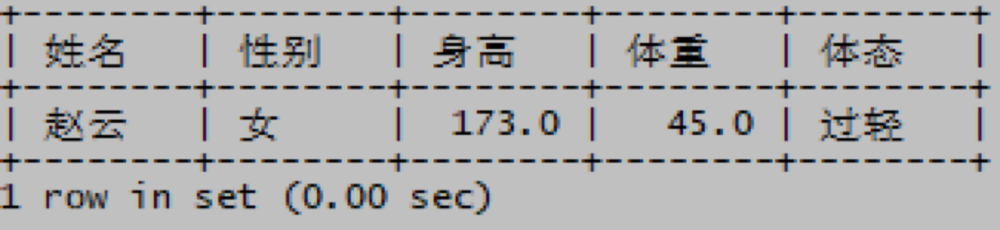

# 子查询

> 分类: Database > SQL查询-复杂查询
> 更新时间: 2026-01-10T23:34:13.637813+08:00

---

# 一、概述
1. SELECT 语句结构

SELECT  列1，列2 ... fromTABLE_NAME WHERE 列 = 值GROUP BY 分组列 HAVING 分组列 = 值 ORDER BY 列

上面标红的位置还可以嵌套额外的SELECT语句（子查询），与外部SELECT语句（主查询）结合起来使用，用一个查询语句实现更为复杂的任务。那些嵌套的SELECT语句往往被称为子查询；子查询需要用括号( )括起来。

1. 分类

非关联子查询：子查询可以单独于主查询执行，仅执行1次，效率较高

关联子查询：子查询不能单独于主查询执行，如果主查询有N行，子查询将执行N次，效率相对较低，但灵活度高

# 二、非关联子查询
1. 查询学生中哪些人比张飞的体重重？

mysql> select * from stu where weight>(select weight from stu where sname='张飞');

 

1. 2班3班中哪些同学的身高比1班的平均身高高？

mysql> select * from stu where cno in (2,3) and height>(select avg(height) from stu where cno=1);

 

1. 每个班的高考状元都是谁？

mysql> select * from stu where (cno,score) in (select cno,max(score) from stu group by cno) and cno is not null;

 

1. 哪些同学的体重比所有班的平均体重都重？

mysql> select * from stu where weight>all(select avg(weight) from stu where cno is not null group by cno) and cno is not null;

>ALL运算符：比所有的值都大; <ALL运算符：比所有的值都小

>ANY运算符：比最小的那个大就行；<ANY运算符：比最大的那个小就行

 

1. 哪些同学的身高高于本班的平均身高？

mysql> select * from stu s,(select cno,avg(height) havg from stu where cno is not null group by cno) a where s.cno=a.cno and height>havg and s.cno is not null;

FROM后面的子查询也叫内联视图，MySQL中这个内联视图子查询必须起个表别名，否则报错

 

1. 不用多表连接方式，列出3班学生姓名和3班的班主任

mysql> select sname 学生姓名,(select teacher from class where cno=3) 班主任 from stu o where cno=3;

 

# 三、关联子查询
1. 不用多表连接方式，列出每个学生的班号，姓名和其所在班的班主任

mysql> select o.cno 班号,o.sname 姓名,(select teacher from class i where i.cno=o.cno) 班主任 from stu o where o.cno is not null order by 1;

特点：子查询不能单独执行，主查询必须起个别名

单独执行：select teacher from class i where i.cno=o.cno; 报错，不知道o.cno的o表是什么，o是外部主查询的别名，脱离了外部查询，子查询执行不了

1. 不用多表连接方式，根据学生赵云的性别、身高和体重，查看他的bmi指标是否合适？

mysql> select sname 姓名,sex 性别,height 身高,weight 体重,(select bname from bmi i where o.weight/(o.height/100*o.height/100) between i.lval and i.hval and i.sex=o.sex) 体态 from stu o where o.sname='赵云';

1. 使用关联子查询，在已分班学生中列出身高高于本班平均身高的学生。

mysql> select * from stu o where o.cno is not null and o.height>(select avg(height) from stu i where i.cno=o.cno);

 

