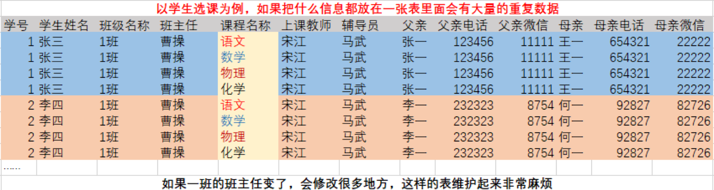

# 范式理论

> 分类: Database > 数据库范式与设计原则
> 更新时间: 2026-01-10T23:34:17.048157+08:00

---

# 一、关系型数据库的特点
1. 基本组成单位为二维表
2. 各二维表之间存在一定的关系
+ 数据为什么不能都放在一张表里面？

**一、第一范式**

1. 如果关系模式R的每个关系r的属性都是不可分的数据项，那么就称R是第一范式的模式
2. 主要特点是实体的属性不能再分，即列不能再分
3. 错误设计

| 学号 | 姓名 | 联系方式 |
| --- | --- | --- |
| 001 | 张三 |   |

1. 正确设计

| 学号 | 姓名 | 电话 | 邮箱 |
| --- | --- | --- | --- |
| 001 | 张三 | 13209374635 | 36472832671@qq.com |

**二、第二范式**

1. 符合第一范式且每个非主属性完全函数依赖于任何一个候选键
2. 错误设计（姓名——选修课程、选修课程——教材、姓名与教材没有对应关系）

| 姓名 | 课程 | 教材 |
| --- | --- | --- |
| 张三 | 语文 | 作文 |
| 李四 | 数学 | 算法 |
| 李四 | 语文 | 作文 |

1. 正确设计

| 姓名 | 课程 |
| --- | --- |
| 张三 | 语文 |
| 李四 | 数学 |
| 李四 | 英语 |

 

| 课程 | 教材 |
| --- | --- |
| 语文 | 作文 |
| 数学 | 算法 |

**三、第三范式**

1. 符合第二范式且所有非主属性对任何候选键都不存在传递依赖
2. 错误设计（根据班级可知系别）

| 学号 | 姓名 | 班级 | 系别 |
| --- | --- | --- | --- |
| 101 | 张三 | Java | 计算机系 |
| 102 | 李四 | 英语 | 外语系 |

1. 正确设计

| 学号 | 姓名 | 班级 |
| --- | --- | --- |
| 101 | 张三 | Java |
| 102 | 李四 | 英语 |

 

| 班级 | 系别 |
| --- | --- |
| Java | 计算机系 |
| 英语 | 外语系 |

 

