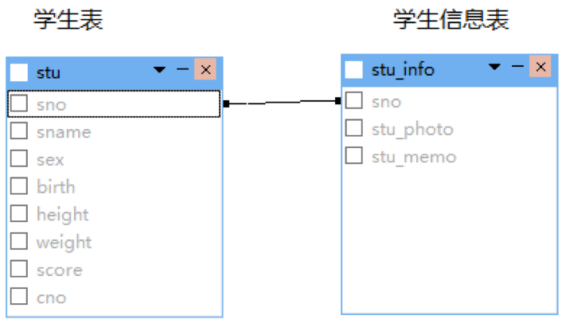
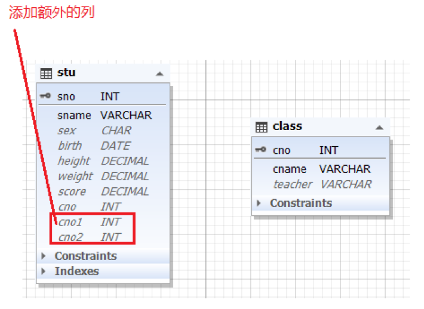

# 表间关系

> 分类: Database > 数据库范式与设计原则
> 更新时间: 2026-01-10T23:34:17.163019+08:00

---

# 一、一对一 
1. 例如：设计人员先建立学生表，存储学号、姓名、性别、生日、身高、体重、高考分、班号的信息，后来学校要求还要存储学生的照片和备注说明等信息。设计人员可以在原来学生表中添加照片和备注说明2列内容，也可以为每个学生单独建立一张学生信息表用来存储学生照片和，备注信息；如果这样设计，学生表的学号列和后建的学生信息表的学号列之间就是一对一的关系，即学生表的一条行记录对应学生信息表的一条行记录。
2. 有时一张列比较多的表，可以根据列拆分成几张小表，每个小表都有一样的主键，每个小表之间就是一对一的关系

# 二、一对多 
例如：当前学生表的班号和班级表的班号就是一对多的关系，一个班级可以包括多名学生、一个学生只能属于一个班级。一对多的例子有很多，例如：一个城市只能属于一个国家，国家和城市就是一对多的关系；教室只能属于一个教学楼，教学楼和教室就是一对多的关系，等等

# 三、多对多 
1. 例如：学生和课程之间就是多对多的关系，一个学生可以选择多门课程，一个课程也可以有多名学生来学。
2. 演员和电影可是多对多的关系，一名演员可以参演多部电影，一部电影可以有多名演员来参演。
3. 设计时，已学生和课程为例，分别建立学生表和课程表，确保学生表无重复，课程表无重复，然后建立关系表，分别包含学生编号和课程编号，这样可以将多对多的关系利用中间表，变成两个一对多的关系。如下图：

# 四、一对多 变成 多对多
主要根据业务需求来定，业务需求决定表间关系。举例说明：一般来说班级和学生是一对多的关系，但是如果实际情况是一个学生可以自由选择加入多个班听课，也可以把班级表和学生表设计成多对多的关系。这样可以满足需求，不会出现表中没有位置存储数据的问题。

假如业务需求变更，一个学生可以属于多个班，需要将一个学生对应的多个班号存入数据库表，数据库表需要进行调整，通常会引起程序的级联调整。通常有2种办法：

+ 方法1：在学生表添加额外的班号列，cno1,cno2.......

这种办法可以临时解决问题，比如规定一个学生最多可属于3个班，加3列就可以了。但是如果没有限制，如极端情况，一个学生可以有100个班，加列的方式就有局限性了。需要采用中间表的形式。

+ 方法2：给学生表和课程表建立一个中间表（比如：rel_class_stu），该表分别包括学号(sno)和班号(cno)，这样的设计是正规的多对多的设计方式，灵活度比方法一要大，方法一的加列的方式往往用于因需求调整而采取的一种临时补救措施。原来一个学生只能属于一个班，现在学校规定调整为一个学生最多可以属于5个班，就在学生表中再增加4列班号。此时，如果要采用方法2建立中间表的方式，可能需要对现有数据进行迁移会有更多额外的工作要做。

 

