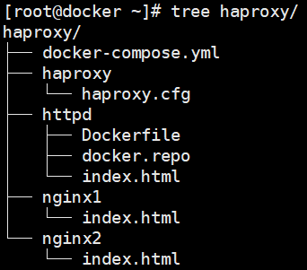
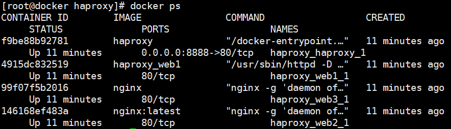
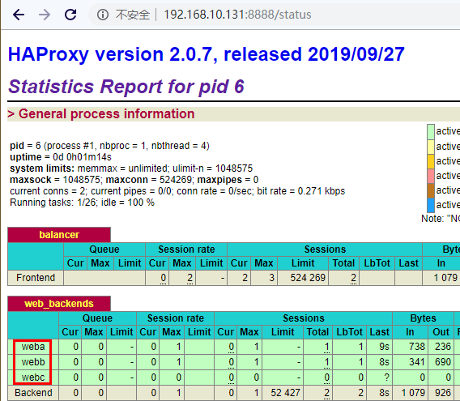

# compose案例
# 一、wordpress安装
```bash
[root@docker ~]# mkdir wordpress
[root@docker ~]# cd wordpress
[root@docker ~]# vim docker-compose.yml
```

+ docker-compose.yml文件内容如下

```yaml
version: "3"
services:
  db:
    image: 10.30.12.55/docker/mysql:5.6
    volumes:
      - /var/lib/mysql:/var/lib/mysql
    #自动重启
    restart: always
    environment:
      #指定MySQL的root账号初始密码
      MYSQL_ROOT_PASSWORD: 123456
      #指定容器启动后要创建的数据库
      MYSQL_DATABASE: wordpress
      #指定容器在启动后要创建的普通用户账号，该账号有远程登录的权限
      MYSQL_USER: tom
      #为用户设置密码
      MYSQL_PASSWORD: 123456
  wordpress:
    depends_on:
      - db
    image: 10.30.12.55/docker/wordpress
    ports:
      - "8000:80"
    restart: always
    environment:
      #指定要使用的数据库名
      WORDPRESS_DB_NAME: wordpress
      #指定要MySQL容器的ip和端口
      WORDPRESS_DB_HOST: db:3306
      #指定登录MySQL的账号
      WORDPRESS_DB_USER: tom
      #指定登录MySQL的密码
      WORDPRESS_DB_PASSWORD: 123456
```

+ 构建并运行项目

`[root@docker ~]# docker-compose up -d` 

# 二、web负载均衡
1. 目录结构



2. 各个文件内容
+ docker-compose.yml

```yaml
web1:
    build: ./httpd
    expose: 
       - 80
web2:
    image: nginx:latest
    volumes:
        - ./nginx1:/usr/share/nginx/html
    expose:
        - 80
web3:
    image: nginx
    volumes:
        - ./nginx2:/usr/share/nginx/html
haproxy:
    image: haproxy
    volumes:
        - ./haproxy/haproxy.cfg:/usr/local/etc/haproxy/haproxy.cfg:ro
    links: 
        - web1
        - web2
        - web3
    ports:
       - "8888:80"
    expose:
        - 80
```

+ haproxy.cfg

```yaml
global
    log 127.0.0.1 local0
    log 127.0.0.1 local1 notice
defaults
    log global
    mode http
    option httplog
    option dontlognull
    timeout connect 5000ms
    timeout client 50000ms
    timeout server 50000ms
    stats uri /status
frontend balancer
    bind 0.0.0.0:80
    mode http
    default_backend web_backends
backend web_backends
    mode http
    option forwardfor
    balance roundrobin
    server weba web1:80 check
    server webb web2:80 check
    server webc web3:80 check
    option httpchk GET /
    http-check expect status 200
```

+ Dockerfile

```dockerfile
FROM centos
EXPOSE 80
RUN rm -rf /etc/yum.repos.d/*
COPY docker.repo /etc/yum.repos.d/
RUN yum install -y httpd
ADD index.html /var/www/html
CMD ["/usr/sbin/httpd","-D","FOREGROUND"]
```

+ index.html

test

3. 执行docker-compose up构建镜像

`[root@docker haproxy]# docker-compose up -d` 

4. 查看docker进程信息



5. 浏览器访问测试





