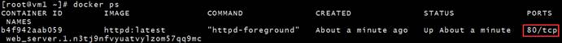
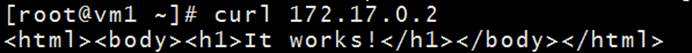
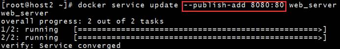
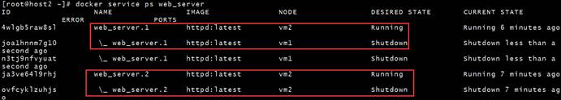
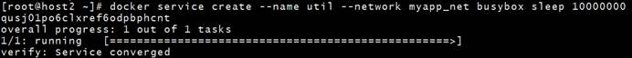
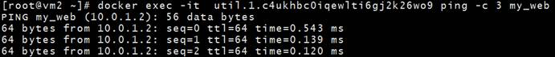

# service访问

> 分类: Docker > Docker Swarm
> 更新时间: 2026-01-10T23:35:11.991514+08:00

---

# 一、如何访问Service？
为了便于分析，我们重新部署web_server。

① docker service rm 删除 web_server，service 的所有副本（容器）都会被删除。

② 重新创建 service，这次直接用 --replicas=2 创建两个副本。

③ 每个 worker node 上运行了一个副本。

好了，现在 service 已经在那里了，我们如何访问呢？

要访问 http 服务，最起码网络得通，服务的 IP 我们得知道，但这些信息目前我们都不清楚。不过至少我们知道每个副本都是一个运行的容器，先看看容器的网络配置。

在 vm1 上运行了一个容器，是 web_server 的一个副本，容器监听了 80 端口，但并没有映射到 Docker Host，所以只能通过容器的 IP 访问。查看一下容器的 IP。

[root@vm1 ~]# docker inspect web_server.1.n3tj9nfvyuatvylzom57qq9mc

容器 IP 为 172.17.0.2，实际上连接的是Docker 默认 bridge 网络。

我们可以直接在 vm1 上访问容器的 http 服务。

但这样的访问也仅仅是容器层面的访问，服务并没有暴露给外部网络，只能在 Docker 主机上访问。换句话说，当前配置下，我们无法访问 service web_server。

# 二、从外部访问service
要将 service 暴露到外部，方法其实很简单，执行下面的命令：

docker service update --publish-add 8080:80 web_server

如果是新建 service，可以直接用使用 --publish 参数，比如：

docker service create --name web_server --publish 8080:80 --replicas=2 httpd

 

容器在 80 端口上监听 http 请求，--publish-add 8080:80 将容器的 80 映射到主机的 8080 端口，这样外部网络就能访问到 service 了。

大家可能会奇怪，为什么 curl 集群中任何一个节点的 8080 端口，都能够访问到 web_server？

这实际上就是使用 swarm 的好处了，这个功能叫做 routing mesh，我们下一节重点讨论。

**神奇的**** routing mesh**

当我们访问任何节点的 8080 端口时，swarm 内部的 load balancer 会将请求转发给 web_server 其中的一个副本。

这就是 routing mesh 的作用。

所以，无论访问哪个节点，即使该节点上没有运行service 的副本，最终都能访问到 service。

**ingress ****网络**

当我们应用 --publish-add 8080:80 时，swarm 会重新配置 service，我们看看容器都发生了哪些重要变化。

我们会发现，之前的所有副本都被Shutdown，然后启动了新的副本。我们查看一下新副本的容器网络配置。

[root@vm2 ~]# docker exec -it web_server.1.4wlgb5raw8slxjhswm34y7ngw /bin/sh

# apt-get update

# apt-get install net-tools

容器的网络与 --publish-add 之前已经大不一样了，现在有两块网卡，每块网卡连接不同的 Docker 网络。

实际上：

    1. eth0 连接的是一个 overlay 类型的网络，名字为 ingress，其作用是让运行在不同主机上的容器可以相互通信。
    2. eth1 连接的是一个 bridge 类型的网络，名字为 docker_gwbridge，其作用是让容器能够访问到外网。

ingress 网络是 swarm 创建时 Docker 为自动我们创建的，swarm 中的每个 node 都能使用 ingress。

通过 overlay 网络，主机与容器、容器与容器之间可以相互访问；同时，routing mesh 将外部请求路由到不同主机的容器，从而实现了外部网络对 service 的访问。

那么接下来，service 跟 service 如何通信呢？

# 三、Service 之间如何通信
微服务架构的应用由若干 service 组成。比如有运行 httpd 的 web 前端，有提供缓存的memcached，有存放数据的 mysql，每一层都是 swarm 的一个 service，每个 service 运行了若干容器。在这样的架构中，service 之间是必然要通信的。

**服务发现**

一种实现方法是将所有 service 都 publish 出去，然后通过 routing mesh 访问。但明显的缺点是把 memcached 和 mysql 也暴露到外网，增加了安全隐患。

如果不 publish，那么 swarm 就要提供一种机制，能够：

    1. 让 service 通过简单的方法访问到其他 service。
    2. 当 service 副本的 IP 发生变化时，不会影响访问该 service 的其他 service。
    3. 当 service 的副本数发生变化时，不会影响访问该 service 的其他 service。

这其实就是服务发现（service discovery）。Docker Swarm 原生就提供了这项功能，通过服务发现，service 的使用者不需要知道 service 运行在哪里，IP 是多少，有多少个副本，就能与service 通信。下面我们开始实践。

**创建**** overlay ****网络**

要使用服务发现，需要相互通信的 service必须属于同一个 overlay 网络，所以我们先得创建一个新的 overlay 网络。

[root@host2 ~]# docker network create --driver overlay myapp_net

直接使用 ingress 不行，因为目前 ingress 没有提供服务发现，必须创建自己的overlay 网络。

**部署 ****service ****到**** overlay**

部署一个 web 服务，并将其挂到新创建的 overlay 网络。

[root@host2 ~]# docker service create --name my_web --replicas=3 --network myapp_net httpd

部署一个 util 服务用于测试，挂载到同一个 overlay 网络。

[root@host2 ~]# docker service create --name util --network myapp_net busybox sleep 10000000

sleep 10000000 的作用是保持 busybox容器处于运行的状态，我们才能够进入到容器中访问service my_web。

**验证**

通过 docker service ps util 确认 util 所在的节点为 swarm-worker1。

登录到 vm2，在容器 util.1 中 ping 服务 my_web。

可以看到 my_web 的 IP 为 10.0.1.2，这是哪个副本的 IP 呢？

其实哪个副本的 IP 都不是。10.0.1.2 是 my_web service的 VIP（Virtual IP），swarm 会将对 VIP 的访问负载均衡到每一个副本。

我们可以执行下面的命令查看每个副本的 IP。

[root@vm2 ~]# docker network inspect myapp_net

10.0.1.5、10.0.1.4、10.0.1.9 才是各个副本自己的 IP。不过对于服务的使用者（这里是 util.1），根本不需要知道 my_web副本的 IP，也不需要知道 my_web 的 VIP，只需直接用 service 的名字 my_web 就能访问服务。

